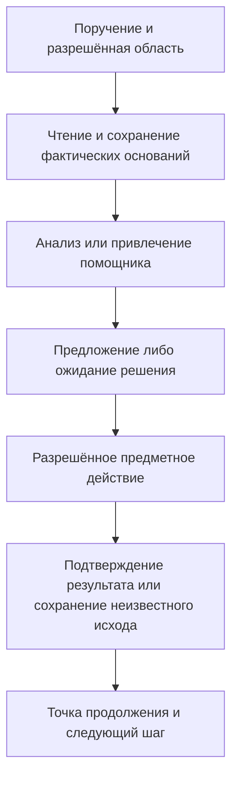
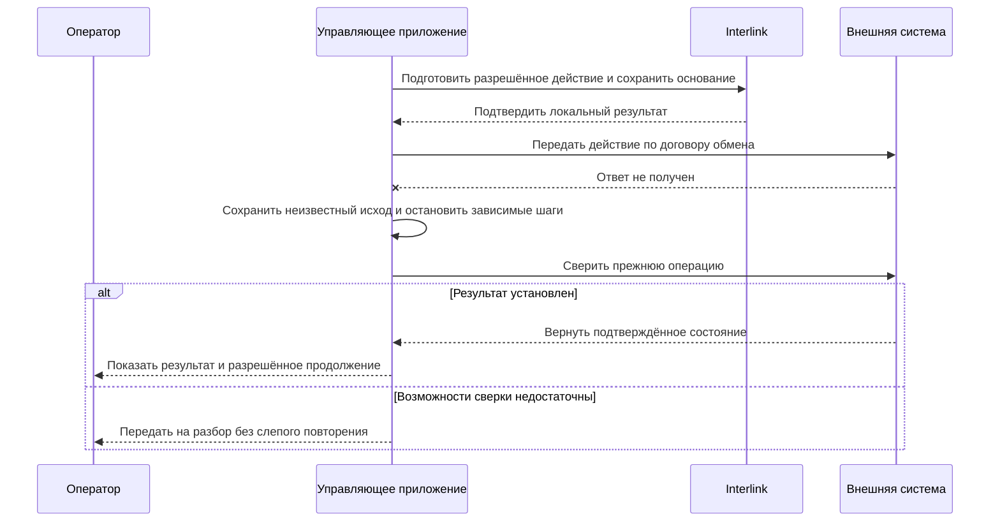

# Interlink и Alvatune: где живёт управляемый агентский цикл

Редакция: **6 сентября 2026 года**. Статус: объяснение принятой границы ответственности и развивающегося замысла Alvatune. Готовое приложение, окончательный состав экранов и промышленное исполнение здесь не заявляются.

Агентская работа часто длится дольше одного запроса. Исполнитель собирает сведения, ждёт ответ поставщика, просит уточнение у инженера, привлекает помощника и возвращается к задаче на следующий день. Interlink должен надёжно поддерживать данные и последствия этой работы, но не обязан сам становиться единственным диспетчером всех исполнителей.

Alvatune предполагается системой запуска и контроля таких циклов с элементами календарного планирования, управления требованиями и качеством. Основной PLM-сценарий — взаимодействие с внешними системами. Interlink также может стать основой экспериментальной собственной PLM. Важен этот замысел, а не неизменность раннего плана Alvatune: конкретное прикладное устройство допускает пересмотр.

## Четыре участника с разной ответственностью

| Участник | За что отвечает | Чего нельзя ожидать автоматически |
|---|---|---|
| Interlink | Проверяемые объектные данные, точные основания, разрешённые предметные действия и подтверждение локального результата | Выбор языковой модели, расписание всех запусков и знание правил каждого предприятия |
| Предметный модуль | Смысл состава, резерва, расчёта, требования или решения о применении | Право обходить доступ и менять данные вне объявленных команд |
| Управляющее приложение, например Alvatune | Циклы, ожидания, поручения, память, инструменты, взаимодействие с человеком и восстановление исполнения | Право считать свою заметку об успехе доказательством изменения во внешней PLM |
| Внешняя PLM или производственная система | Собственные авторитетные предметные данные и исполняемые действия | Одновременную фиксацию с Interlink без специально обеспеченного договора |

Граница не требует обязательно разнести всё по отдельным серверам. Важно, кто принимает решение и какой факт подтверждает. Приложение может хранить своё состояние в модели Interlink или в собственном хранилище. В любом варианте обязательное подтверждение локального предметного эффекта не заменяется удалённой записью «шаг успешно завершён», которую ещё только предстоит отправить.

## Запуск не равен рабочей области и пакету изменения

Устойчивая идентичность отвечает на вопрос «кто действует». Запуск — «ради какой задачи начата эта работа». Попытка — «какой исполнитель сейчас продолжает её». Шаг — «что уже сделано или ожидается». Повторная попытка после сбоя не должна создавать нового субъекта и не означает новую инженерную версию изделия.

Рабочая область хранит инженерные рабочие данные. Пакет изменения определяет согласуемую область правок. Один агентский запуск может читать несколько рабочих областей, подготовить несколько предложений или вообще не изменять инженерных данных. Одна рабочая область, в свою очередь, может пережить много запусков и вмешательств людей.

Служебная точка продолжения отвечает: «проверены эти объекты, получены такие ответы, здесь ждём решения, у этой операции исход неизвестен». Она не является командой откатить предметную историю. Если вчерашнее изменение уже опубликовано, возобновление агента сегодня не выполняет его заново и не восстанавливает вчерашнюю базу.

Это схема длительной работы, а не одна открытая операция записи. Между этапами система может ждать человека или сеть. Сохранённая точка продолжения должна позволить отличить завершённое действие от действия, результат которого ещё не установлен. Подробный договор фиксации и сверки находится в [безопасных действиях](02-safe-actions-and-recovery.md).

## Пример 1. Ночная проверка комплектности редукторов

Служба контроля получает поручение проверить открытые заказы на редукторы перед утренним планированием. Она действует от собственного служебного субъекта, а не от имени инженера, который когда-то настроил расписание. Для каждого заказа собираются разрешённый состав, нужные документы и ограничения выдачи; основание чтения и фактически подготовленный пакет долговечно сохраняются до передачи исполнителю, а не только до получения результата анализа.

На середине работы начинается утренняя смена. Управляющее приложение уменьшает параллельность фоновых проверок и сохраняет точку продолжения: какие заказы завершены, по каким ожидаются файлы, какие результаты неполны. Конструкторы должны продолжать работать с согласованным качеством обслуживания. Interlink участвует ограничениями запросов и операций; приложение управляет общей очередью и бюджетом.

После перезапуска служба не начинает создавать заново все уже подготовленные поручения. Она восстанавливает ссылки на результаты и разбирает неизвестные исходы. Оператор видит действительный прогресс в разрешённой области, а не число скрытых объектов или общий зелёный статус при оборванном чтении. Критерий успеха — и полезная полнота ночной проверки, и сохранение возможности обычной работы людей.

## Пример 2. Инженер и помощник по чертежам

Инженер просит агента оценить изменение стенки корпуса насоса. Агент получает конкретное поручение: анализ и подготовка предложения без самостоятельной публикации. Для извлечения таблицы нагрузок он привлекает помощника, которому разрешены только нужные страницы документа.

В истории различимы инженер-инициатор, основной исполнитель и помощник, а также родительская причинная связь. Но связь не передаёт права автоматически. Помощник не может запросить весь архив, а найденный на странице текст не может расширить его поручение. Если требуется сохранить исходник целиком, но разрешена лишь отдельная страница, обязательный режим отклоняется; менее полный вариант обсуждается как иная разрешённая задача.

Основной агент формирует предложение по точным данным. Инженер видит различие между исходным материалом и действительно переданными фрагментами. Если поручение отозвано во время ожидания, результат не получает право примениться только потому, что вычисление уже завершилось. Сохранение полезного неприменённого свидетельства тоже проверяется отдельно. Остановка цикла не стирает ранее разрешённо сохранённую историю и не отзывает уже переданные внешнему получателю байты.

## Пример 3. Передача изменения во внешнюю PLM

Предприятие сохраняет конструкцию шкафа управления во внешней PLM, а агентскую работу организует через Alvatune. Агент обнаруживает неполную ссылку на протокол испытания, подготавливает предложение и получает разрешение на конкретное изменение. Interlink связывает точное основание, план и локальное подтверждение принятого действия.

Затем соединитель отправляет распоряжение внешней PLM. Та может принять сообщение, создать рабочую правку, направить её на согласование или отклонить предметную операцию. Эти результаты различаются. Запись «сообщение доставлено» не означает, что чертёж опубликован, и не разрешает следующую операцию, которой нужен именно опубликованный результат.

Если ответ потерян, управляющее приложение сохраняет неизвестный исход и использует возможности сверки внешнего продукта. При отсутствии надёжной сверки задачу передают ответственному специалисту. Исправляющее действие создаётся отдельно после получения достаточного основания; оно не является тайным откатом удалённой системы. Например, ранее созданное извещение может потребовать аннулирования по её собственным правилам, а не повторной отправки исходного запроса с другим номером.

## Ожидания, повтор и человеческое вмешательство

Схема не обещает одинаковую поддержку у всех внешних систем. Возможность сверки и её достоверность входят в договор соединителя. Если результат уже известен, повтор возвращает его или безопасно продолжает установленную операцию. Если неизвестен, зависимые действия не должны строиться на предположении об успехе или отмене.

Ручное вмешательство также сохраняется как решение с автором и основанием. Кнопка «продолжить» не должна означать «считать всё успешным». Оператор может подтвердить обнаруженный внешний результат, запросить новое согласование или разрешённо сформировать другое действие. Для всех вариантов нужна понятная история того, почему продолжение допустимо.

## Память и знания не становятся предметной истиной сами по себе

Агент может сохранять заметки, структурированные выводы и резюме. У каждого такого материала есть происхождение, редакция, назначение, доступ и срок хранения. Новое резюме полезно для следующей работы, но не должно переписывать прежний пакет, по которому было принято решение. Подробный журнал может содержать чувствительные сведения, поэтому его нельзя безусловно отправлять в общий диагностический поток.

После обновления модели данных должна сохраняться возможность прочитать исторические основания в прежнем смысле. Это касается единиц, правил преобразования, обозначений и определения инструментального действия. Сохранённые числа без пригодного способа их интерпретации не образуют полноценную историю. При разрешённом выбытии обязательных данных система честно сообщает предел доступности.

Просмотр памяти и истории проверяет сегодняшние права. Отдельно проверяется передача внешнему поставщику модели или инструменту. Наличие данных в локальном архиве не является разрешением их раскрыть. Эта граница одинаково важна для чтения чертежей, лабораторных результатов и контекстной таблицы цен.

## Что необходимо проверить до полного Alvatune

Ранний этап S1 должен доказать компактный путь от точного чтения до безопасного эффекта и восстановления. Для этого используются тестовый исполнитель и имитация внешней системы, а не промышленный интерфейс и настоящая языковая модель. Проверяются реальные сохраняемые результаты, конкурирующие действия и сбои. Если договор не выдерживает такой опыт, решение пересматривается до закрепления зависимой модели.

Следующие этапы расширяют каталог действий, способы чтения, соединители, наблюдаемость и нагрузку. Полные календарные процессы, поиск памяти, изоляция запускаемых инструментов и рабочие места оператора относятся к принимающему приложению. Наличие перспективы Alvatune не требует включать эти приложения в обязательный состав каждого Interlink и не позволяет отложить все общие гарантии на неопределённое будущее.

Критерии продуктовой приёмки понятны без знания внутреннего устройства: служебный запуск не приписан человеку; помощник не получил лишних прав; после перезапуска не повторена завершённая операция; отозванное поручение не применило поздний результат; внешний неизвестный исход не превращён в успех; старое основание читается в прежнем смысле при текущих разрешениях.

## Вопросы внедрения и основания

Для первого прикладного сценария нужно выбрать владельца очереди работ, допустимые автономные действия, получателей данных, срок ожидания, правила вмешательства и способ сверки каждой внешней системы. Отдельно определяется, что предприятие считает пригодным предложением и какое решение не вправе делегировать. Эти вопросы не переоткрывают общую границу полномочий и не заменяют обязательное воспроизведение сценариев IPS.

Начало пакета — [агенты и управляемая работа](README.md). Подробные механизмы — [прослеживаемость](01-agents-and-traceability.md) и [безопасные действия](02-safe-actions-and-recovery.md). Общая модель — [объектный фундамент](../object-foundation/README.md), прикладная перспектива — [цифровые двойники](../object-foundation/03-digital-twins-and-domain-extension.md).

Основания: IL-AI, IL-NEUTRAL, IL-FOUNDATION, IL-KERNEL, IL-DATA-MODEL и IL-PLAN-V2 в [реестре источников](../knowledge/15-source-register.md). Это источники принятых договоров и планов. Старый прикладной план Alvatune не рассматривается как ограничение будущей архитектуры Interlink.
