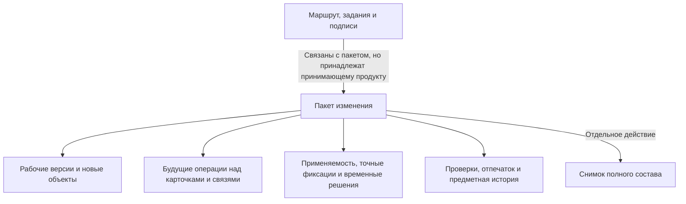

# Что такое пакет изменения и где его границы

## Пользовательская потребность

Инженерное изменение редко ограничивается одним полем одной карточки. Замена подшипника может потребовать новой версии вала, крышки, сборочного чертежа и спецификации; изменения количества и точных версий нескольких позиций; нового диапазона применяемости; повторной проверки технологии и заказов.

Пользователь должен подготовить такой результат, не разрушая выпущенное состояние и не раскрывая незавершённую работу всем потребителям. После согласования весь связанный набор должен стать официальным одновременно.

## Как эта потребность узнаётся в IPS

В IPS используются рабочие копии и итерации, контекст редактирования, связанные контексты, извещения и журнальные изменения, операции актуализации, уровни продвижения и конкретизации. Эти механизмы дают богатое поведение, но их границы могут пересекаться: состояние окна влияет на чтение, промежуточное сохранение смешивается с версией, а полный смысл групповой фиксации распределяется между несколькими понятиями.

Interlink сохраняет результат, но собирает его иначе:

| Потребность IPS | Механизм Interlink |
|---|---|
| Рабочая копия | Рабочая версия внутри одного пакета |
| Контекст редактирования | Явно выбранный пакет в условиях каждого чтения |
| Итерация | Именованная точка возврата рабочего состояния |
| Связанные контексты | Один многообъектный пакет либо упорядоченный комплект пакетов |
| Мягкая конкретизация | Временное предпочтение версии внутри пакета |
| Жёсткая конкретизация | Точная фиксация версии в конкретной позиции |
| Извещение | Формальный вид пакета плюс процесс принимающего продукта |
| Журнальное изменение | Облегчённый вид пакета, если политика это разрешает |
| Актуализация | Фиксация всего пакета целиком, без частичного результата |

Точная фиксация версии принадлежит позиции в конкретной версии родительского состава. Чтобы закрепить, например, подшипник версии 03 в позиции выходного вала, конструктор берёт в работу родительский узел, создаёт его рабочую версию и меняет позицию именно в ней. После проверки и проведения появляется следующая официальная версия родителя с этой фиксацией. Interlink не допускает независимую правку фиксации вне версии родительского состава, потому что тогда история состава перестала бы быть воспроизводимой.

## Что пакет хранит по предметному смыслу

Пользовательская карточка пакета должна показывать:

- понятный номер, вид, цель и основание;
- автора и происхождение действия — человек, агент или система;
- ответственного и участников со стороны принимающего продукта;
- рабочие версии существующих объектов;
- предварительные новые объекты, ещё ни разу не ставшие официальными;
- будущие изменения карточек, связей, списков и состава;
- временные предпочтения версий;
- плановую применяемость;
- будущую степень инженерной готовности новых версий;
- управляемые действия над уже зафиксированными версиями;
- затронутые объекты и удерживаемую занятость;
- точки возврата;
- результаты предпросмотра, проверки и согласования;
- итог: зафиксирован или отменён; вытеснение является одной из явно записанных причин полной отмены, а не третьим самостоятельным конечным состоянием.

Смысловой набор затронутых объектов важнее простого перечня рабочих версий. Пакет может изменить постоянный признак объекта, самостоятельную связь, не являющуюся позицией версионируемого состава, или состояние уже выпущенной версии без создания нового поколения. Такая операция всё равно должна участвовать в общей проверке, истории и фиксации. Изменение количества, номера позиции или точной фиксации в составе является другим случаем: оно требует рабочей версии родительского состава.

## Что не является частью пакета

### Маршрут и задания

Кто согласует, в каком порядке идут задания, когда отправляется уведомление и кто может вернуть работу — ответственность Alvatune или другого принимающего продукта. Interlink предоставляет проверяемое содержание и границу фиксации, но не встраивает одну корпоративную схему процесса в ядро.

### Определения предметной модели

Добавление нового типа изделия или поля не является обычной правкой пакета. Модель меняется отдельным управляемым выпуском и миграцией. Иначе один пользователь мог бы одновременно изменить правила и данные, которые этими правилами проверяются.

### Файловое хранилище и САПР

Файл чертежа, модель САПР, подпись и архивный комплект управляются принимающим продуктом и специализированными службами. Пакет должен ссылаться на точное содержание. Принимающий продукт включает внешние файлы и подписи в свой комплект процессных доказательств; на последующем этапе отпечаток Interlink будет расширен отпечатками файлов точных версий. Interlink при этом не превращается в файловое хранилище.

### Неизменяемый снимок полного состава

Проведение пакета создаёт официальные версии и применяет операции. Полный точный многоуровневый состав для выпуска или заказа публикуется отдельным действием. Принимающий продукт может включить оба отдельно разрешённых действия в одну общую операцию окончательной фиксации, но они остаются двумя осознанными предметными решениями. При подтверждённом успехе пакет проводится, а отдельно разрешённый снимок публикуется; при подтверждённом откате новые официальные версии не появляются и снимок не публикуется. Если исход неизвестен, пользователь не запускает проведение или публикацию повторно: сначала принимающий продукт сверяет фактическое состояние.

## Виды пакетов

### Обычное изменение

Используется для большинства многообъектных работ: модернизации узла, корректировки технологии, изменения набора документов.

### Формальное извещение

Добавляет обязательные этапы согласования, проверки полномочий, подписания и уведомления. Политика предприятия может требовать его для любого изменения выпущенного содержания, применения новой литеры или изменения применяемости.

### Импортное и системное изменение

Перенос предметных данных, установка начальных справочников и автоматизированная работа над обслуживающими данными используют тот же предметный путь. Это сохраняет происхождение и не создаёт «служебный обход» проверок. Определения типов и связей изменяются не таким пакетом, а отдельным выпуском модели и управляемой миграцией.

### Быстрое одиночное действие

В целевом рабочем месте пользователь сможет видеть одну команду — например, назначить основную версию. Принимающий продукт проверит полномочия и матрицу допустимых способов изменения, после чего вызовет разрешённое действие. Будущий механизм Interlink сам создаст служебный пакет для одной правки, проверит его и зафиксирует результат. Если матрица требует формального извещения, быстрый путь должен отказать и предложить правильный процесс. Выпущенное состояние объекта или изменение позиции состава само по себе не является безусловным запретом: запрет либо разрешение задаётся политикой предприятия. При этом изменение позиции всё равно создаёт рабочую версию родительского состава; быстрый экран не отменяет этого предметного правила. Автоматический путь быстрого действия пока не реализован.

### Комплект изменений

Если совместный выпуск нужно разделить между дисциплинами, координатор создаёт упорядоченный комплект и его дочерние части. Каждая часть имеет понятное основание и собственного ответственного, поэтому команда может готовить её относительно независимо. Однако это не заранее существовавший самостоятельный пакет: дочернюю часть нельзя отдельно провести, отменить, перенести в другой комплект или повторно использовать. Все части имеют одну окончательную судьбу и проверяются как одна будущая модель данных. Полезное содержание отменённой части может стать основанием новой работы, но переносится в новый комплект только как отдельное осознанное изменение с повторными проверками.

## Пример 1. Локальная правка материала

Технолог уточняет материал прокладки гидроцилиндра. Если корпоративная матрица разрешает облегчённое действие для этого типа объекта, его состояния, данного поля и роли технолога, рабочее место предлагает «Исправить материал». После подтверждения принимающий продукт вызывает действие, Interlink создаёт небольшой пакет, формирует рабочую версию, выполняет проверку и фиксирует результат.

Пользователь не обязан вручную вести карточку извещения, но история остаётся такой же доказуемой, как у большого изменения. Если матрица предприятия требует для такой прокладки формальное извещение, быстрое действие не проводится. Это может зависеть не только от выпуска, но и от критичности поля, назначения изделия, влияния на состав и полномочий автора.

## Пример 2. Модернизация редуктора

Пакет «Повышение ресурса РЦ-250» объединяет рабочие версии корпуса, вала и спецификации; замену двух подшипников; новую применяемость с серии 145; изменение связанного чертежа. Согласование относится ко всему набору.

Попытка провести только вал, потому что проверка корпуса ещё не завершена, запрещена. Если требуется поэтапный выпуск, работу заранее делят на несколько самостоятельных пакетов с явной последовательностью либо создают комплект, чья структура согласована продуктово.

## Пример 3. Массовый перенос справочника

При миграции материалов из IPS создаются систематизированные изменения с происхождением «импорт». Ошибка в одной обязательной связи не должна оставлять половину справочника в состоянии, которое выглядит завершённым. Размер порций, повтор и эксплуатационная очередь принадлежат миграционному процессу, но каждая порция проверяется и проводится целиком по тем же правилам, что и другие изменения, и оставляет проверяемое основание.

## Что увидит пользователь

Минимально понятное рабочее место должно иметь пять областей:

1. **Паспорт изменения:** цель, вид, основание, состояние, ответственные.
2. **Затронутые данные:** объекты, версии, состав, документы и плановая применяемость.
3. **Будущий результат:** сравнение до и после и влияние на верхние изделия.
4. **Проверки и решения:** ошибки, предупреждения, согласованный отпечаток.
5. **История:** кто и когда создал, изменил, согласовал, провёл, отменил или вытеснил пакет.

## Состояние реализации

Основные правила полного пакета закреплены в нормативных документах. Исполняемая рабочая область, построение будущего состояния из всех подготовленных правок, комплекты изменений и проведение по разрешению принимающего продукта появятся на последующих этапах после базового опытного подтверждения. Текущая разработка создаёт предметные действия записи и проверки, которые позднее будут объединены в этот единый пользовательский путь.

Связанные документы: [жизненный цикл пользователя](02-user-journey-and-lifecycle.md), [видимость и параллельность](03-working-state-visibility-and-concurrency.md), [виды и комплекты](06-quick-formal-and-bundled-changes.md).

Основания: [IL-VERS-SPEC §3], [IL-PLM §7], [IPS-A04], [IPS-A05], [IPS-K04]. Расшифровка — в [реестре источников](../knowledge/15-source-register.md).
