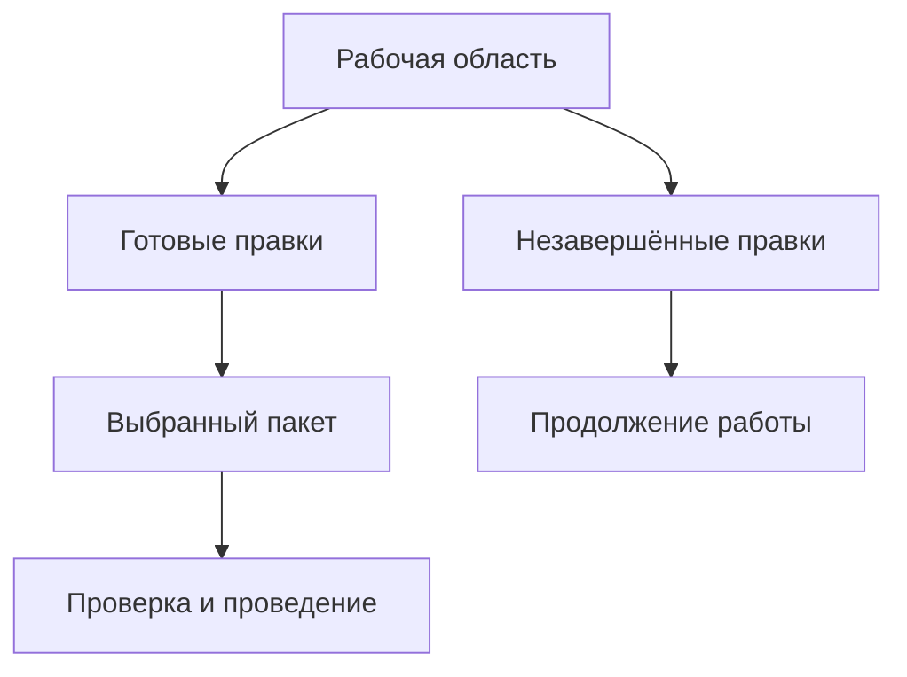

# Что такое пакет изменения и где его границы

## Пользовательская потребность

Инженерное изменение редко ограничивается одной карточкой. Новый подшипник может потребовать изменения вала, крышки, сборочного чертежа и технологии. Эти правки подготавливают разные люди, а вводить их в производство иногда необходимо одновременно. Рядом может идти эксперимент, который ещё не готов к выпуску и не должен задерживать согласованный результат.

В целевой модели Interlink **пакет изменения определяет, что именно принять одним согласованным результатом сейчас**. Это выбранные рабочие данные и предметные действия, проверенные вместе. Пакет не обязан охватывать всю работу команды, все объекты извещения или всё, что инженер видит на экране.

«Провести пакет» означает применить его выбранный план целиком. Если обязательное условие не выполнено, ни одна из входящих в это проведение правок не становится официальной. Подготовленные рабочие данные сохраняются: отказ не означает потерю работы.

## Три разных ответа: где работаем, что видим, что выпускаем

В раннем описании Interlink пакет одновременно обозначал рабочую область и условия подбора. В актуальном решении эти границы разделены.

| Понятие | На какой вопрос отвечает | Пример |
|---|---|---|
| Рабочая область | Где сохраняется незавершённая работа? | Команда месяц модернизирует насос и держит несколько рабочих копий. |
| Контекст подбора | Какие версии и какое содержание учитывать при совместном просмотре? | Состав использует проверенный двигатель и рабочий корпус, хотя двигатель никто не редактирует. |
| Пакет изменения | Какие правки должны стать официальными вместе? | В пятницу выпускаются корпус и уплотнение; новая рама остаётся в работе. |

Рабочая область может пережить несколько проведений. Контекст может продолжать использоваться после окончания отдельных работ. Объединение контекстов для совместного просмотра не обязывает конструкторов и технологов одновременно выпускать все результаты. Подробности — в [рабочих областях и параллельной работе](10-workspaces-and-parallel-work.md) и [контекстах подбора](../version-selection/21-selection-contexts.md).

Схема показывает границу проведения: пакет выбирает готовую часть работы. Исключённые правки не исчезают и не публикуются заодно. Прежде чем разрешить такой выбор, система проверяет, что оставленная в работе часть не является обязательной зависимостью выпускаемого результата.

## Что меняется относительно механизмов IPS

Пользовательские требования IPS сохраняются: незавершённые правки нужно отделять от архивных данных, связанные работы — просматривать совместно, итерации — возвращать без потери истории, а изменение — вводить управляемо. Но одинаковая потребность не требует одинакового внутреннего контейнера.

| Потребность | Как она выражается в Interlink |
|---|---|
| Рабочая копия | Изменяемое содержание выбранной инженерной версии в рабочей области. |
| Контекст редактирования и связанные контексты | Долговечные назначения для чтения, отдельные от хранения правок и их проведения. |
| Итерация | Именованное точное сохранение промежуточного результата; возвращение в работу отдельно от публикации. |
| Мягкая конкретизация | Сохраняемое предпочтение версии у конкретной позиции и отдельные правила его активности. Оно не исчезает просто из-за закрытия пакета. |
| Жёсткая конкретизация | Закрепление инженерной версии. Для неизменности её содержания нужен более точный выбор опубликованного состояния. |
| Извещение | Предметный документ и процесс со своими строками, основаниями и согласованиями; он связан с пакетами, но не тождествен им. |
| Журнальное или быстрое действие | Упрощённый пользовательский путь с обязательными проверками, историей и защитой от конкурирующей записи. |
| Совместная актуализация | Явно выбранный пакет либо атомарный комплект нескольких пакетов. |

Это сопоставление задаёт направление воспроизведения сценариев. Детали конкретной установки IPS — обязательность извещения, запрет параллельного взятия на изменение, момент автоматического пополнения контекста — проверяются на её настройках и контрольных примерах. Они не превращаются в безусловные ограничения всех приложений Interlink.

## Версия, рабочая копия и опубликованное содержание

Инженерная версия — например «Корпус насоса, версия Б» — сохраняет обозначение, пока пользователь не принимает отдельное решение создать версию В. Внутри Б может быть несколько последовательно опубликованных состояний содержания. Каждое такое состояние неизменно: прежние размеры, состав и связанные точные файлы не перезаписываются новым исправлением.

Обычное сохранение меняет рабочую копию Б и не делает результат официальным. Проведение выбранного пакета может опубликовать следующее состояние той же Б, если это разрешено жизненным циклом. Создание новой инженерной версии является другим действием. Поэтому пять сохранений и два разрешённых завершения редактирования не обязаны породить семь новых номеров версии.

Рабочее содержание включает не только поля. Принадлежащие ему списки, исходящие связи и позиции состава сохраняются вместе с ним. Другие данные — самостоятельная оперативная запись, назначение основной версии или переход жизненного цикла — изменяются по собственным правилам. Их можно включить в общий пакет, если требуется совместный результат, но нельзя считать любое изменение новой версией изделия.

## Кому принадлежит изменение позиции

Если конструктор закрепляет подшипник версии 03 на выходном валу, он меняет позицию в рабочем содержании родительского редуктора. Сам подшипник от этого не получает новую геометрию или новое содержание. При проведении появляется новое опубликованное состояние родительской инженерной версии, если процесс разрешает её изменение; решение создать другую инженерную версию принимается отдельно.

То же правило действует для количества и номера позиции. Быстрая команда может упростить экран, но не правит опубликованный состав «сбоку». Самостоятельная связь между объектами, не принадлежащая такому состоянию состава, изменяется по своему договору. Поэтому нельзя переносить правило родительского состава на любую связь вообще.

## Из чего состоит выбранный план

Пользователь должен видеть не обещание «модернизировать насос», а проверяемый предмет действий:

- опубликовать подготовленное содержание корпуса и уплотнения;
- заменить определённые позиции состава с указанными количествами;
- назначить применяемость с выбранной серии;
- перевести перечисленные версии на разрешённые шаги жизненного цикла;
- явно изменить назначения в контекстах, если это требуется;
- включить точную редакцию таблицы норм, разрешения замены и результат проверки совместимости;
- записать предусмотренные предметные факты и основания.

До окончательного согласования система сохраняет точный подготовленный план: выбранных участников, содержание правок, необходимые исходные состояния, применённые правила и условия проведения. Изменение рабочей копии не переписывает этот план незаметно. Для другого содержания нужна новая подготовка и, если процесс требует, новое согласование.

Карточка показывает причину работы и её происхождение: действие человека, импорт, автоматическое правило или агентская задача. Ответственный за процесс и фактический исполнитель не смешиваются. Агент, запущенный инженером, не превращает свои действия в действия самого инженера.

## Когда можно провести часть работы

Выбор поднабора разрешён, если он образует самостоятельный допустимый результат. Это не команда «пропустить ошибки». Система проверяет, что опубликованный состав не ссылается на оставленное незавершённое содержание, обязательные сопутствующие изменения включены, количества согласованы, а весь результат совместим.

Если новая крышка требует нового уплотнения, нельзя выпустить крышку одну под согласованием их совместного изменения. Нужно включить уплотнение, выбрать уже опубликованное допустимое решение либо изменить замысел и заново подготовить план. Если рядом разрабатывается независимая табличка маркировки, её можно оставить в работе.

При поэтапном выпуске создаются последовательные самостоятельные пакеты. Перед каждым проведением проверяются собственные основания. Уже проведённая первая очередь не откатывается автоматически потому, что вторая потребовала доработки.

## Когда нужен комплект пакетов

Комплект нужен, если самостоятельные части подготовки имеют разных ответственных, но итог нельзя вводить по отдельности. Например, конструкторский пакет меняет базирование корпуса, а технологический — установочные элементы приспособления. Их локальные проверки ещё не доказывают пригодность общего результата: окончательная проверка рассматривает оба пакета вместе.

После подготовки общего комплекта нельзя провести только доступного участника по прежнему общему согласованию. Изменение состава или порядка комплекта требует новой подготовки. Два конкурирующих варианта содержания одной инженерной версии также не разрешаются правилом «второй пакет победит»: сначала нужно явно согласовать единый результат.

Совместное проведение возможно в общей локальной области фиксации данных. Передача в другую PLM, ERP, MES или файловое хранилище не становится атомарной от наличия общей карточки. Внешнее получение и применение учитываются отдельными фактами, с повтором доставки и сверкой исхода.

## Замены и таблицы используют тот же путь изменений

Разрешённая замена — сначала предметное правило, а не уже изменённый состав. Пользователь выбирает решение для определённого заказа или структуры; пакет содержит полный набор последствий. Например, переход на моноблочный привод требует снять два прежних агрегата, установить один новый и сохранить существующий контроллер как обязательное условие.

Другая выбранная правка не вправе незаметно удалить этот контроллер. При этом две замены, обе требующие его наличия, не означают двойного расходования одного контроллера. Проверяются как действия, так и сохраняемые предпосылки. После выбора точного содержания участников нужна итоговая [проверка совместимости](../substitution-and-compatibility/02-compatibility-matrices.md), а не только проверка названий объектов.

Если допуск аналога принадлежит определённой версии исходного двигателя, сначала устанавливается эта версия и нужное содержание её правила. Нельзя взять разрешение от любой версии того же двигателя. Затем выбирается новая цель и обычным механизмом подбирается её версия и содержание. Итоговый отказ совместимости не разрешает системе незаметно перебирать другие версии. Подробнее — [допустимые замены](../substitution-and-compatibility/01-allowed-replacements.md).

Таблица справочных данных также может стать участником изменения. Для таблицы режимов резания проверяются объявленные оси, полнота необходимой сетки и наличие обязательных значений. Загруженные пять ячеек из требуемых шести можно сохранить как незавершённую работу, но нельзя выдать за полный утверждённый справочник. Новые нормы входят в согласование именно той редакцией, которую использовал технолог. Различия обычных справочников, полных сеток и разреженных карт разобраны в [табличных данных](../tabular-data/README.md).

## Что остаётся за границей пакета

Маршрут согласования, роли и задания задаёт принимающее приложение — Alvatune либо другой продукт. Interlink проверяет точный предмет решения и допустимость действия, но не навязывает одну схему нормоконтроля всем предприятиям.

Изменение самой предметной модели — добавление типа или изменение смысла поля — проходит отдельный управляемый выпуск модели и миграцию данных. Оно не маскируется под обычную правку изделия.

САПР и файловые службы управляют байтами чертежей и моделей. Для доказуемого согласования нужны точные ресурсы и подтверждённое их сохранение, а не только путь к файлу. Полный снимок состава также является отдельно выбранным результатом. Его можно включить в общую локальную фиксацию с пакетом; если снимок создаётся позднее, его неудача не отменяет ранее проведённое изменение.

## Пример 1. Исправить обозначение шероховатости

Нормоконтроль обнаружил ошибку в чертеже корпуса версии Б. Конструктор открывает рабочую копию, исправляет обозначение и сохраняет её. Технолог с правом рабочего просмотра видит исправление. Цех продолжает получать ранее опубликованное содержание.

Если правила предприятия допускают исправление в той же инженерной версии, конструктор подготавливает небольшой пакет. После проверки появляется новое опубликованное состояние Б. Номер Б сохраняется; ранее переданный заказ продолжает ссылаться на прежнее точное содержание. Если для этого поля и стадии требуется извещение, упрощённая команда направляет пользователя в формальный процесс, а не обходит его.

## Пример 2. Выпустить часть модернизации редуктора

Рабочая область «Повышение ресурса РЦ-250» содержит правки корпуса, вала, крышки и экспериментального датчика температуры. Корпус, вал и крышка согласованы как единый подшипниковый узел. Датчик не влияет на посадочные места, но ещё проходит испытания.

Координатор включает в пакет первые три результата и связанные документы. Проверка подтверждает, что в выпускаемом составе нет ссылки на рабочий датчик и нет обязательной незавершённой зависимости. Пакет проводится целиком; опытная работа остаётся открытой. Если бы новый вал требовал ещё неготовой крышки, такое исключение не прошло бы проверку.

## Пример 3. Комплектно заменить привод и норму испытания

Для насосной станции выбран новый привод. Его применение допускается только с определённым контроллером и иной нормой вибрации. Конструктор готовит изменение состава, технолог — редакцию таблицы испытательных режимов. Отделы работают независимо, но выпускать эти результаты раздельно нельзя.

Общий план перечисляет исходную и новую комплектацию, сохраняемый контроллер, точную редакцию нормы и условия испытания. Проверка учитывает фактически выбранные состояния привода и контроллера: совпадение моделей не доказывает совместимость прошивок. При успехе оба пакета проводятся вместе. MES затем получает задание; подтверждение доставки ещё не означает, что привод установлен на реальном экземпляре станции.

## Пример 4. Перенос справочника материалов

Предприятие переносит марки материалов и их допустимые применения из IPS. В процессе сохраняются соответствия исходных записей, происхождение значений и замечания к неясным единицам или связям. Каждая выбранная порция может быть опубликована отдельно, только если образует допустимый результат по заявленной области.

Если обязательная связь марки с её стандартом отсутствует, порция не становится официально завершённой. Исправление относится к конкретным данным, а не к разрешению обойти все ограничения импорта. После потери ответа процесс сверяет прежнюю операцию и не создаёт ещё один материал с тем же смыслом под новым номером. Размер порций и очередь обработки принадлежат миграционному процессу; они не меняют значение слова «проведено».

## Что увидит пользователь в карточке

Карточка должна сначала объяснять деловое намерение, затем показывать его точный состав. Для этого нужны пять связанных областей:

1. **Паспорт:** цель, основание, вид процесса, ответственные и текущий исход.
2. **Участники:** выбранные рабочие копии и действия, новые объекты, оставшаяся вне выпуска работа.
3. **Будущий результат:** состав, сравнение до и после, влияние на документы, технологию и заказы.
4. **Проверки и решения:** обязательные ошибки, предупреждения, исключения и точный предмет согласования.
5. **История:** кто и почему включил данные, изменил план, согласовал его, провёл или отказался от проведения.

Перечень участников не заменяет перечня последствий. Например, изменение назначения основной версии затрагивает последующий живой подбор, хотя не создаёт новое содержание двигателя. Отказ от плана также не означает, что рабочие копии автоматически удалены: их дальнейшая судьба должна быть показана отдельно.

## Что пользователь должен увидеть при отказе

Отказ объясняет причину: изменилось исходное опубликованное содержание, отсутствует обязательная часть плана, отозван допуск материала, конфликтуют два решения или недоступны необходимые данные. Нехватка данных не называется несовместимостью, а разрешение не придумывается из отсутствия найденного запрета.

Если ответ на проведение потерялся, рабочее место показывает неопределённый исход и сверяет результат той же операции. Нельзя повторно провести её как новую: первая попытка могла уже завершиться. Подтверждённый результат, обязательная история и предусмотренное сообщение о дальнейшей передаче должны относиться к одной фиксации.

## Состояние реализации и приёмка

Описанное поведение является **принятым целевым контрактом**, а не готовой промышленной функцией. Сквозная реализация рабочих областей, публикации, комплектов, восстановления, табличных данных и замен ещё требует разработки и проверки. Описание согласовано с архитектурой на 6 сентября 2026 года.

Уже на ранних опытах необходимо проверить выпуск поднабора, сохранение конфликтующей рабочей копии, отсутствие скрытой подмены согласованного содержания и безопасный повтор. Полный интерфейс и сложные прикладные правила могут появиться позднее, но эти границы не откладываются до готовой PLM.

Приёмка должна показать три главных результата: непубликуемая работа сохраняется; выбранный согласованный результат применяется полностью либо не применяется; по истории можно установить точное содержание и основания каждого состоявшегося действия. Подробные критерии — в [состоянии и приёмке механизма](09-status-open-questions-and-acceptance.md).

Связанные документы: [путеводитель](README.md), [жизненный цикл изменения](02-user-journey-and-lifecycle.md), [согласование](04-preview-validation-and-approval.md), [проведение и восстановление после ошибок](05-commit-cancel-and-recovery.md).

## Основания

Описание опирается на принятые договоры семантического ядра [IL-KERNEL], процесса изменений [IL-CHANGES], агентского основания [IL-AI] и ранних проверок [IL-PLAN-V2]. Сценарии IPS сопоставляются с [IPS-A04], [IPS-A05] и историческими материалами [IPS-K04]; историческое описание не заменяет проверку конкретной установки. Расшифровка и статус источников — в [реестре](../knowledge/15-source-register.md).
