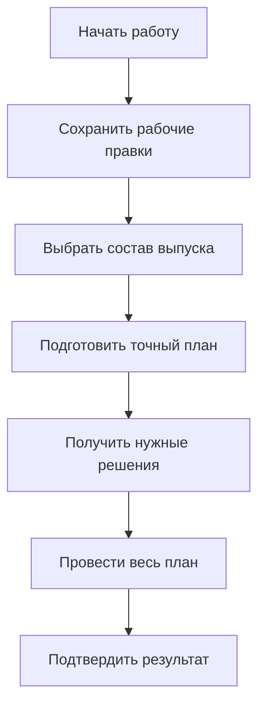
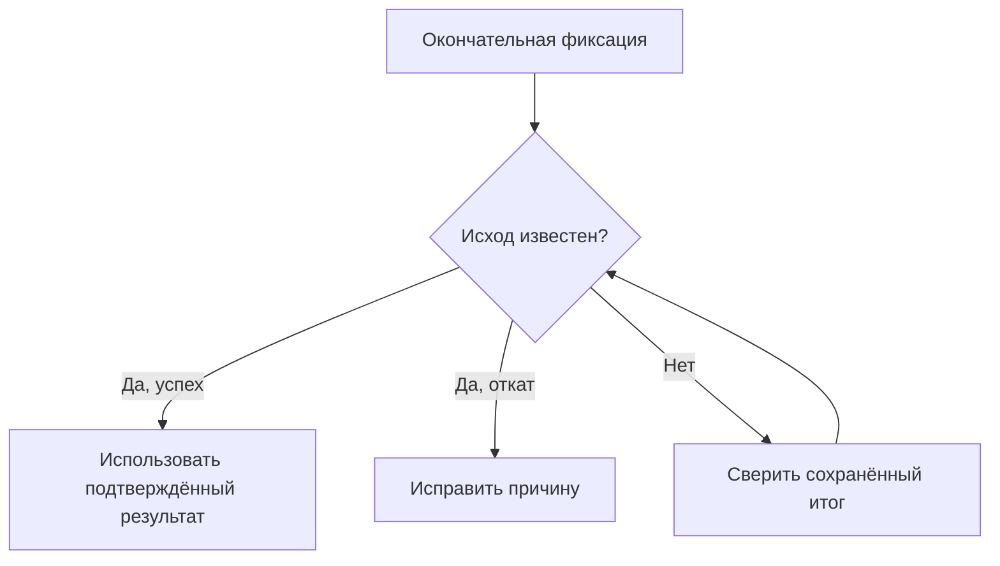

# Как пользователь проходит жизненный цикл изменения

Редакция: **6 сентября 2026 года**. Продуктовое описание принятой целевой архитектуры; состояние реализации указано отдельно.

## Один путь от намерения к подтверждённому результату

Инженеру важно не только сохранить новую геометрию. Нужно знать, какую работу видят коллеги, что именно согласовано, какие правки выпускаются вместе и что делать, если ответ о результате потерян. В целевой модели Interlink эти границы явные.

**Рабочая область** хранит длительную работу. **Контекст подбора** определяет состав для просмотра. **Пакет изменения** выбирает конкретный набор правок для совместного проведения. **Извещение** организует предметный процесс предприятия. Они могут быть связаны, но завершение одного пакета не означает автоматического окончания всего извещения или всей рабочей области.

Ниже описан планируемый пользовательский процесс. Принимающим продуктом может быть экспериментальная PLM Interlink, Alvatune или другая прикладная система. Формы, задания и маршруты относятся к этому продукту; фундамент Interlink обеспечивает проверяемые изменения и их историю.

## Кто участвует

Инициатор объясняет причину; конструктор и технолог готовят решение; специалист по конфигурации проверяет состав и применяемость; согласующие оценивают заявленный предмет; ответственный за выпуск разрешает проведение. Агент может собрать основания или подготовить предложение, но его участие не даёт права самостоятельно выпускать результат.

Принимающий продукт устанавливает личность, проверяет полномочия и ведёт процесс. Interlink проверяет, что разрешение относится к текущему точному плану, что участники и данные допустимы и что результат не нарушает обязательные ограничения. Закрытого задания «согласовать» недостаточно для разрешения произвольной записи.

## Не один обобщённый статус

| Что отслеживается | Пример различия |
|---|---|
| Работа в рабочей области | Размеры сохранены, но ещё не опубликованы |
| Подготовленный пакет | Выбран точный набор, однако разрешение на него ещё не получено |
| Согласование | Руководитель одобрил именно это содержание |
| Публикация данных | Официально появилось новое состояние инженерной версии |
| Точный комплект | Отдельно сохранён состав и нужные доказательные данные для конкретной цели |
| Доставка и внешний приём | Производство получило задание, но ещё не подтвердило принятие |
| Фактическое исполнение | Новая программа действительно установлена на конкретный станок |

Набор видимых статусов зависит от сценария, но одно событие не подменяет другое. Публикация программы не доказывает её установку. Отправка заказа не доказывает его принятие. Сохранение рабочей формы не доказывает согласование.

## Общая последовательность

Схема показывает нормальный путь. Сохранений и доработок может быть много. На согласование и проведение уходит не всё накопленное в рабочей области, а явно выбранный допустимый результат.

## Шаг 1. Начать с предметной задачи

Пользователь открывает изделие, замечание испытаний, заказ или строку извещения. Система предлагает известные исходные данные: объект, инженерную версию, опубликованное состояние-основание, проект и причину.

Например, конструктор начинает исправление корпуса насоса версии «Б» после замечания испытаний. Он должен видеть, что выбрана именно «Б» и её конкретное содержание, а не просто «последний корпус». Если требуется новое исполнение «В», это отдельное решение. Его можно начать от проверенного исторического прототипа; наличие других потомков у прототипа само по себе не запрещает новый вариант.

## Шаг 2. Организовать рабочую область и контекст

В рабочей области создаются разрешённые рабочие копии. Для исключительного режима проверяется, кто уже взял выбранную инженерную версию на изменение. В параллельном режиме другая команда может иметь собственную копию той же версии; конфликт разрешается до публикации, без потери чужой работы.

Контекст подбора настраивается отдельно. В него могут попасть рабочие копии, опубликованные версии и точные состояния деталей, которые никто не меняет. При работе по извещению его строки служат самостоятельным основанием назначения. Удаление строки извещения не должно убирать сохранившееся ручное назначение той же версии.

В объединённых контекстах проверяется не только номер версии, но и выбранное содержание. «Корпус Б после испытаний» и «корпус Б в рабочей копии технолога» не становятся одинаковым назначением из-за общей буквы.

## Шаг 3. Редактировать и сохранять

Инженер меняет размеры, состав, файлы и предметные связи по правилам их типа. Сохранение фиксирует рабочие правки, чтобы продолжить завтра или показать их разрешённому участнику. Опубликованные состояния не переписываются.

Изменение позиции состава относится к рабочему содержанию её владельца. Если нужно закрепить двигатель в составе редуктора, пользователь меняет соответствующую позицию редуктора. При этом он выбирает нужную точность: закрепить инженерную версию двигателя или неизменяемое состояние этой версии. Эти решения не равнозначны.

Не все данные требуют инженерной версии. Изменяемая оперативная карточка сохраняется с проверкой того, что её не изменил другой пользователь. Неизменяемый факт, например подтверждённое измерение, дополняется новым фактом или отдельной коррекцией. История и полномочия обязательны во всех путях, но фиктивная версия детали для записи измерения не создаётся.

## Шаг 4. Сохранить итерацию и проверить варианты

Пользователь может назвать точную итерацию «После испытания корпуса» или «Компоновка с отечественным приводом». Она сохраняет выбранное содержание, а не ссылку на постоянно меняющуюся рабочую копию.

Возврат к итерации готовит явный план переноса прежнего содержания в сегодняшние рабочие адресаты. Пользователь может восстановить только силовую часть шкафа, сохранив новое исправление маркировки. Восстановление рабочей копии не создаёт опубликованное состояние само по себе и не возвращает старые полномочия, физические установки или исполненные задания.

## Шаг 5. Выбрать состав пакета

Координатор определяет, что нужно провести сейчас. Корпус и уплотнение должны выйти вместе, потому что новый размер требует нового уплотнения. Монтажное примечание ещё обсуждается и остаётся в рабочей области.

В пакет входят выбранные рабочие копии и явные действия: публикация содержания, применяемость, назначение основной версии, переход готовности, изменение контекста или другое разрешённое предметное действие. Включение в пакет не публикует данные. Исключение из пакета само по себе не удаляет рабочую копию.

Если отдельные пакеты механики и электрики не могут быть выпущены независимо, создаётся общий комплект проведения. Совместный просмотр или одно извещение не образуют такой комплект автоматически.

## Шаг 6. Просмотреть будущий результат

Предпросмотр показывает разницу до и после, полный выбранный состав, используемые состояния, влияние на заказы и предупреждения. Он нужен для понимания, но может устареть. Поэтому перед согласованием выполняется отдельная проверка точного будущего результата.

Для замен различаются несколько действий. Если допуск принадлежит исходной версии компонента, сначала устанавливается эта версия и её содержание. Затем читается её допуск, выбирается замена и обычным механизмом подбирается содержание нового компонента. После этого проверяется совместимость конечного сочетания. Отказ не должен незаметно запустить поиск другого двигателя или другой версии под видом того же решения.

При замене группы позиций проверяется весь выбранный набор: что снимается, что устанавливается и что обязано сохраниться. Два решения могут требовать наличия одного контроллера, не расходуя его дважды. Но если другое решение удаляет этот контроллер, общий результат недопустим, даже когда изменения записываются в разные позиции.

## Шаг 7. Подготовить точный план и основания

Подготовка фиксирует точные правки, участников, порядок зависимых действий, исходные состояния, правила и результаты обязательных проверок. Получается неизменяемая редакция плана. Её контрольный отпечаток — метка значимого содержания, позволяющая обнаружить подмену.

Следует явно назвать предмет решения. Можно согласовывать только правки корпуса; можно — точную конфигурацию всей насосной станции, включая нетронутый двигатель. Во втором случае одной метки изменённых полей недостаточно: сохраняются также выбранный граф и необходимые входы расчёта.

Расчёт тепла, внешнее заключение или файл испытания не становятся доказательством автоматически от наличия ссылки. Принимающий продукт должен связать точный вход, результат и назначение заключения с предметом согласования.

### Как рабочее место объясняет результаты проверки

Проверка должна различать блокирующую ошибку, вопрос для разрешённого предметного решения, предупреждение и информационное пояснение. Например, замкнутый запрещённый состав блокирует проведение; недостаточная подтверждённость оснастки получает реакцию по правилам конкретного выпуска; изменение справочной массы может быть пояснением влияния.

Классификация задаётся моделью и политикой предприятия, а не желанием оператора закончить пакет. Система не может превратить обязательный запрет в предупреждение или выдать отсутствие доступа к нужным данным за отсутствие ошибки. Пользователь должен видеть, какое условие нарушено, что уже проверено и какое действие позволит продолжить.

## Шаг 8. Согласовать и определить требование актуальности

По умолчанию согласующий должен понимать, какое из двух намерений он подтверждает:

| Намерение | Что произойдёт, если после согласования назначена другая основная версия двигателя |
|---|---|
| Выпустить именно согласованный точный состав | Двигатель не подменяется новым; сохраняется ранее одобренное содержание |
| Выпустить состав, только если перечисленные основания остались актуальными | Изменение объявленного основания вызывает конфликт и новую подготовку |

Требование актуальности не выводится из факта, что система когда-то прочитала значение. Оно задаётся явно: например, «назначение двигателя», «допуск материала» или «отсутствие открытого блокирующего замечания».

Оба варианта всё равно проверяют все явно заявленные условия операции, текущие права, обязательные запреты, неизменность плана и основы записываемых данных. Сохранённое одобрение не разрешает использовать сегодня запрещённый материал. Новая неиспользованная редакция справочного правила, напротив, не обязана автоматически отменять точное решение.

## Шаг 9. Доработать при необходимости

Если инженер изменил содержание, по которому готовился план, прежний план не обновляется незаметно. Создаётся новая подготовка и повторяются требуемые решения. Старое одобрение остаётся историческим свидетельством того, что согласовывалось раньше.

Правка, оставшаяся вне выбранного выпуска и не меняющая его объявленные зависимости, не обязана аннулировать всё согласование команды. Именно поэтому важны точные границы пакета и предмета решения.

## Шаг 10. Провести выбранный результат

Перед окончательной фиксацией система заново проверяет ожидаемые рабочие и опубликованные основания, полномочия, обязательные ограничения и совокупный результат. Пакет или явно согласованный комплект становится официальным только целиком.

В самостоятельном режиме Interlink выполняет окончательное сохранение своего результата. Если операция включена в общую фиксацию принимающего продукта, промежуточный ответ Interlink означает лишь «подготовлено»: окончательное сохранение выполняется для всей общей операции. Её подтверждённый откат не оставляет отдельно опубликованных данных Interlink. Потеря ответа о завершении — другой случай: данные уже могли сохраниться, поэтому их фактический исход устанавливается сверкой.

В обоих режимах вместе с предметным результатом сохраняются обязательный журнал действий, запись, позволяющая достоверно подтвердить итог операции, и намерение предусмотренной обязательной передачи. Это одна фиксация «всё либо ничего», а не последующее добавление истории или задания отправки. Поэтому нельзя получить официальный выпуск без обязательного свидетельства и затем потерять требуемую передачу при сбое. Само внешнее сообщение доставляется позднее по отдельному договору.

При публикации рабочей копии возникает новое неизменяемое состояние соответствующей инженерной версии. Само проведение не обязано создавать новую инженерную версию, назначать её основной, повышать готовность или закрывать всю рабочую область. Эти последствия должны быть предусмотрены отдельными действиями плана.

При подтверждённом откате не остаётся частично опубликованного набора. При конфликте чужой публикации рабочие правки сохраняются для сравнения. При потерянном ответе нельзя запустить то же намерение под новым номером и надеяться, что первая попытка не прошла: сначала требуется достоверно установить её исход.

## Шаг 11. Отдельно выпустить точный комплект

Для передачи в производство или архива нужен снимок конкретной конфигурации и, по назначению, комплект файлов и доказательств. Он создаётся отдельным решением. Проведение правок без снимка также допустимо, когда полный комплект не требуется.

Принимающий продукт может объединить публикацию данных и подготовленный снимок в одну локальную операцию «всё либо ничего». Пока общая операция ещё не завершена, оба результата лишь подготовлены. Если попытка окончательной фиксации уже выполнена, но ответ потерян, нельзя утверждать, что публикации не было: и данные, и снимок могли уже стать долговечными. Рабочее место показывает неизвестный исход, проверяет сохранённый итог и не запускает новую публикацию вслепую. Внешняя передача при этом не становится частью той же локальной гарантии.

Снимок фиксирует объявленную область. Наличие дерева состава не означает автоматического сохранения всех файлов, подписей и внешних справочников. Всё необходимое для повторения конкретного решения должно быть включено и сохранено явно.

## Шаг 12. Передать результат и проверить исполнение

Передача опирается на подтверждённый сохранённый результат. Если доставка не удалась после успешной публикации, повторяется доставка того же результата по договору получателя, а не инженерное проведение заново.

При неизвестном внешнем исходе порядок повтора зависит от возможностей принимающей системы. Где она надёжно распознаёт повторы одного сообщения, используется тот же номер. Где такой гарантии нет, нужна сверка. Принятие задания, фактическая установка и измерение результата ведутся отдельными фактами.

## Три прикладных примера

**Электрошкаф станка.** Электрик сохраняет замену преобразователя и кабелей в рабочей области. Пакет включает шкаф, схему и перечень элементов; обсуждаемая инструкция оператора остаётся вне выпуска. Согласуется точный комплект с выбранным автоматом защиты. После публикации производство получает снимок, а факт установки нового преобразователя регистрируется отдельно.

**Рама насосной станции.** Конструктор и технолог используют общий контекст, но завершают независимые правки в разные дни. Если новая рама требует одновременно новой сварочной оснастки, именно этот набор переводится в общий комплект проведения. Общность контекста сама по себе не заставляет выпустить все остальные технологические работы.

**Возврат ошибочного размера корпуса.** После неудачного испытания инженер восстанавливает размеры из прежней итерации в рабочую копию версии «Б». Текущее исправление материала сохраняет по явно выбранному поднабору. Публикации ещё нет. Новый результат проходит прочность и нормоконтроль; только затем появляется следующее состояние «Б», а предыдущие состояния и оба расчёта остаются в истории.

## Что уточнить у продуктового специалиста IPS

Нужны конкретные примеры границ извещения и выпуска: когда одна работа завершается несколькими последовательными публикациями, а когда даже временный частичный выпуск недопустим. Отдельно следует установить, какие роли вправе согласовать сами правки, кто подтверждает полную конфигурацию и какие живые основания обязаны оставаться актуальными до проведения.

Для такого разбора полезен пример электрошкафа: если после теплового расчёта изменили длину кабеля, какие решения надо повторить, какие входы расчёта должны быть сохранены и можно ли выдать схему до готовности инструкции? Ответы превращаются в проверяемые правила, а не в общий флаг «согласовано».

## Приёмка и состояние реализации

Нужно подтвердить не только успешный путь, но и конфликт параллельной публикации, изменение согласованных входов, запрет опасной комбинации, восстановление без публикации и потерю ответа без дублирования результата.

Контракты приняты как целевая модель. Полный исполняемый путь, формы согласования, рабочие места и интеграции реализуются поэтапно; этот документ не объявляет их готовыми.

Связанные документы: [рабочие данные](03-working-state-visibility-and-concurrency.md), [виды изменений](06-quick-formal-and-bundled-changes.md), [предпросмотр и одобрение](04-preview-validation-and-approval.md), [проведение и восстановление](05-commit-cancel-and-recovery.md), [сквозные примеры](08-end-to-end-examples.md).

## Основания

Архитектурное поведение сверено с нормативными документами Interlink и актуальным планом. Источники IPS используются для требований и сравнения; прежние ограничения прототипа Interlink не переносятся из них обратно в целевой контракт.

Основные источники: [IL-KERNEL], [IL-CHANGES], [IL-AI], [IL-PLAN-V2], [IPS-A05], [IPS-K04]. Расшифровка, статус и местонахождение — в [реестре источников](../knowledge/15-source-register.md).
