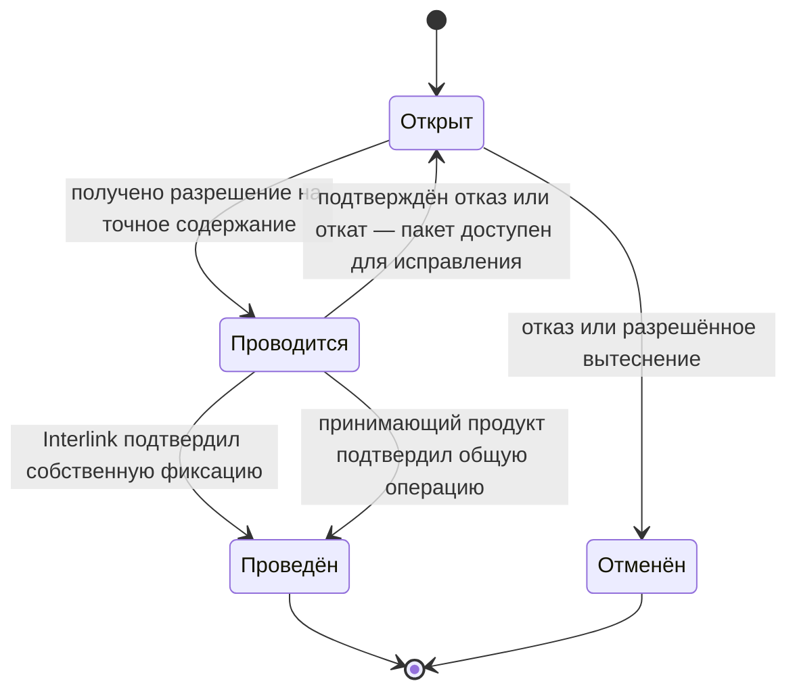
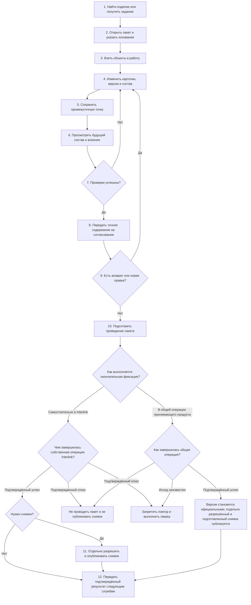

# Как пользователь проходит жизненный цикл изменения

## Участники

Один пакет может объединять работу нескольких ролей:

- инициатор формулирует причину и ожидаемый результат;
- конструктор или технолог готовит предметные правки;
- специалист по конфигурации проверяет состав, применяемость и точные фиксации;
- нормоконтролёр и согласующие оценивают точное будущее содержание;
- ответственный за выпуск разрешает проведение;
- администратор может разрешённо вытеснить зависший пакет;
- агент анализирует влияние или готовит предложение, но не получает скрытого права фиксации;
- принимающий продукт ведёт задания, полномочия, уведомления и подписи;
- Interlink хранит рабочий набор, проверяет инварианты и фиксирует предметный результат.

Конкретные названия ролей и маршрутов различаются между предприятиями. Неизменным остаётся то, что процесс работает с точным содержанием пакета, а не с абстрактным номером задания.

## Три независимые линии состояний

У самого пакета Interlink только короткий предметный жизненный цикл:

| Состояние пакета | Что означает |
|---|---|
| Открыт | Можно добавлять рабочие версии и подготовленные операции |
| Проводится | Система повторно проверяет точное содержание; новые правки временно запрещены |
| Проведён | Все подготовленные данные стали официальными и пакет закрыт |
| Отменён | Рабочий набор удалён целиком; официальные данные не изменились |

Вторая линия — процесс принимающего приложения. «На согласовании», «возвращён на доработку», «ожидает нормоконтроль» и «отклонён руководителем» описывают работу людей и заданий, а не состояние предметного пакета. Один открытый пакет может несколько раз проходить проверку и возврат, оставаясь открытым в Interlink.

Третья линия — внешняя передача. Система планирования ресурсов предприятия (ERP, учёт закупок, запасов и ресурсов) или система управления производственными операциями (MES, диспетчеризация и учёт исполнения в цехе) может ещё не подтвердить получение уже проведённого результата. Пользователь видит все три линии, а не один неточный статус «готово». Например, пакет уже проведён, снимок заказа опубликован, а сообщение для производства всё ещё ожидает подтверждения; в этом случае повторяется доставка того же сообщения, но не проведение пакета и не публикация снимка.

Если связь оборвалась и неизвестно, завершилась ли собственная фиксация Interlink или общая операция принимающего продукта, пакет не возвращается в «Открыт» автоматически. Он остаётся заблокированным от повторной фиксации до обязательной сверки. Переход назад разрешён только после подтверждения, что пакет не был проведён и новые официальные версии не появились.

## Полный путь пользователя

В самостоятельном режиме Interlink сам подтверждает, проведён ли пакет и появились ли новые официальные версии. Если ответ потерян, рабочее место сверяет состояние пакета и новых версий в Interlink до любой повторной попытки. В общей операции Interlink подготавливает результат и ждёт решения принимающего продукта: подтверждённого успеха, подтверждённого полного отката или сверки неизвестного исхода. В обоих режимах неизвестный исход не считается отказом и не разрешает нажать «провести» ещё раз.

## Шаг 1. Начало из предметной задачи

Пользователь может начать с карточки изделия, задания процесса, замечания производства, требования заказчика или результата агента. Рабочее место заранее подставляет известные данные: корневое изделие, запрос на изменение, проект и предложенный вид пакета.

Например, конструктор открывает редуктор РЦ-250 и выбирает «Начать изменение». Система показывает текущую зафиксированную версию и предупреждает, если объект уже занят.

## Шаг 2. Открытие пакета

Пользователь указывает понятное основание: прекращение поставки, замечание испытаний, снижение массы, заказное исполнение. Для формального извещения может потребоваться номер по корпоративному правилу. Происхождение пользователя или агента берётся из доверенной сессии, а не вводится вручную.

На этом шаге официальные данные ещё не меняются. Создаётся рабочая область будущего изменения и связь с процессом принимающего продукта.

## Шаг 3. Взятие объектов в работу

При первой правке Interlink резервирует объект за этим пакетом. Рабочая версия создаётся только тогда, когда меняется собственное версионируемое содержание объекта. Она продолжает последнюю зафиксированную вершину истории. Если нужно взять за образец старое исполнение, его содержимое копируется в новую рабочую версию, но новая история всё равно продолжается от актуальной вершины и не создаёт параллельную ветвь.

Не каждое изменение требует нового поколения. Постоянный признак самого объекта, самостоятельная связь, не являющаяся позицией версионируемого состава, метка, диапазон применяемости, назначение основной версии либо управляемое действие над уже выпущенным состоянием могут сохраняться в пакете как отдельные подготовленные операции. Они всё равно резервируют затронутый объект, входят в предпросмотр и фиксируются вместе с остальным пакетом, но не создают искусственную новую версию там, где предметный смысл этого не требует.

Точная фиксация версии вложенного компонента устроена иначе. Она принадлежит конкретной позиции в конкретной версии родительского состава. Поэтому пользователь берёт родительский узел в работу, создаёт его рабочую версию и меняет позицию в ней. Например, чтобы закрепить преобразователь версии 04 в электрошкафе, нужно выпустить новую версию электрошкафа; отдельная фиксация, существующая независимо от версии шкафа, не создаётся.

Пользователь видит:

- от какой официальной версии начата работа;
- кто занял объект и в каком пакете;
- является ли объект новым или уже официальным;
- какие действия разрешены его ролью.

## Шаг 4. Предметное редактирование

Конструктор меняет не «универсальную запись», а конкретную карточку и состав. При добавлении двигателя система знает допустимый тип цели, единицу количества, обязательность обозначения, правила точной фиксации и ограничения цикла. Эти знания происходят из выпущенной предметной модели.

Каждая операция сначала попадает в рабочий набор. В обычном чтении базы она не выглядит официальной правкой. Все экраны участника используют один и тот же явный контекст пакета, поэтому карточка, дерево и проверка не расходятся из-за скрытого переключателя.

## Шаг 5. Сохранение промежуточной точки

Сохранение формы и создание официальной версии разделены. Пользователь может назвать точку «До замены двигателя» или «Вариант с упругой втулочно-пальцевой муфтой МУВП-4» и позднее вернуться к ней.

Точка охватывает весь рабочий набор, а не только текущую карточку. Возврат отменяет также поздние изменения состава, временные предпочтения и плановую применяемость. Официальные данные не затрагиваются.

## Шаг 6. Предпросмотр будущего результата

Рабочее место строит результат так, как он будет выглядеть после проведения. Пользователь сравнивает:

- версии и значения до и после;
- структуру состава;
- выбранные версии вложенных компонентов;
- верхние изделия и заказы, которые могут быть затронуты;
- будущую применяемость;
- предупреждения и блокирующие ошибки.

Предпросмотр не заменяет процесс согласования. Он создаёт точное содержание, которое можно безопасно передать процессу.

## Шаг 7. Проверка

Проверяются правила типа и связей, обязательные значения, циклы, однозначность применяемости, незакрытые временные предпочтения, допустимость будущей степени готовности и корпоративная матрица вида изменения.

Ошибки делятся по последствиям:

- блокирующая — проведение невозможно;
- требующая решения — процесс должен получить явное разрешение ответственного;
- предупреждение — пользователь может продолжить по установленной политике;
- информационная — объясняет влияние или отличие.

Точная классификация относится к продукту и настройке предприятия. Interlink не должен молча понижать блокирующую проблему до предупреждения.

## Шаг 8. Согласование точного содержания

После проверки система формирует отпечаток будущего результата. Согласующий получает сравнение, влияние и этот точный признак содержания. Он подтверждает не просто пакет «Замена преобразователя шкафа СТ-500», который ещё можно изменить, а конкретное состояние всех его подготовленных данных.

Если после решения меняется хотя бы одна значимая правка или применяемое правило, прежнее разрешение больше не подходит. Рабочее место показывает различия и возвращает пакет на предусмотренный этап.

## Шаг 9. Возврат на доработку

Возврат процесса не понижает уже выпущенную версию до рабочей. Пакет остаётся открыт, его рабочие версии продолжают принадлежать ему, а инженер исправляет тот же будущий набор.

Предприятие определяет, какие решения сохраняются после несущественной правки и какие должны быть получены повторно. Interlink предоставляет новый отпечаток и точное сравнение; принимающий продукт применяет процессную политику.

## Шаг 10. Проведение

Перед фиксацией Interlink повторно проверяет, что все подготовленные операции, точная уже выпущенная редакция предметной модели, применимые настройки и фактически использованные правила совпадают с согласованным отпечатком, а глобальные ограничения всё ещё выполняются. Затем все новые версии и операции подготавливаются к одновременной фиксации.

Если Interlink сам завершает свою операцию, после её успешной фиксации рабочие версии становятся зафиксированными, получают место в линейной истории и целевую степень готовности. Пакет закрывается, блокировки освобождаются, история и происхождение сохраняются.

Если проведение включено в общую операцию принимающего продукта, подготовленный результат ещё не считается официальным. Он становится долговечным только после успешного завершения этой общей операции. Если принимающий продукт выполняет откат, новые версии не становятся официальными, подготовленный снимок не публикуется, пакет не считается проведённым, а пользователю показывается подтверждённый отказ без частичного результата.

При подтверждённом отказе официальное состояние не меняется частично. Пользователь получает диагностику и после исправления начинает новую попытку с повторной проверкой актуальной основы. Если исход общей операции неизвестен, новую попытку запускать нельзя: сначала обязательна сверка, которая подтвердит фиксацию либо откат.

## Шаг 11. Публикация точного результата

Если требуется выпустить полный комплект, передать заказ или создать архивное свидетельство, после проведения отдельным явным действием публикуется неизменяемый снимок. Для обычной работы в актуальном составе этот шаг необязателен. Принимающий продукт может объединить проведение и подготовку снимка одной общей операцией, но до её окончательной фиксации снимок считается только подготовленным и недоступен как опубликованное свидетельство.

Снимок использует точные версии и сохраняет происхождение подбора. Новый выпуск компонента не меняет уже опубликованный снимок.

## Шаг 12. Продолжение процесса

Только после подтверждённой фиксации принимающий продукт отправляет уведомления, создаёт задания для технологии, архива или производства, формирует внешнюю передачу и связывает её с точным результатом. Interlink не объявляет внешнюю отправку успешной только потому, что предметные версии зафиксированы: граница и сверка определяются интеграционным сценарием.

## Как выглядит отказ от работы

Пользователь выбирает «Отменить пакет» и видит последствия: какие рабочие версии, новые объекты и операции будут удалены, какие объекты освободятся. После подтверждения незавершённый набор исчезает, но сама запись о пакете, причине и авторе отказа остаётся для аудита.

Отмена пакета не является удалением официальных версий. Если ошибочный результат уже проведён, исправление оформляется новым пакетом.

## Пример. Изменение электрошкафа станка

Электрик-конструктор меняет частотный преобразователь в шкафу станка СТ-500. Он открывает формальное изменение, берёт в работу электрошкаф, схему и перечень элементов. Внутри пакета новая версия преобразователя временно предпочитается для проверки, хотя связь ещё не зафиксирована точно.

Предметный модуль теплового расчёта, находящийся за границей Interlink, рассчитывает новую тепловую нагрузку. Рабочее место связывает результат расчёта с предпросмотром и показывает необходимость заменить автомат защиты. После исправления состав становится полным. До передачи на согласование инженер обязан удалить временное предпочтение. Если выбор должен сохраниться, пакет создаёт рабочую версию электрошкафа и записывает точные фиксации в нужных позициях его состава; после проверки постоянного решения исходное общее предпочтение удаляется. Согласующий подтверждает точное содержание. Затем инженер меняет длину кабеля; отпечаток становится другим, и решение требуется повторить. Проведение одновременно выпускает шкаф, схему и перечень. Для производственной передачи отдельным явным действием создаётся базовый снимок комплекта.

## Состояние реализации

Жизненный цикл является целевой моделью полного пакета после опытного подтверждения основного фундамента. Текущий интерфейс Alvatune не реализует описанное рабочее место; существуют преимущественно каркасы будущих модулей. Документ задаёт продуктовый результат, который нужно подтвердить сквозным испытанием.

Связанные документы: [предпросмотр и согласование](04-preview-validation-and-approval.md), [фиксация и восстановление](05-commit-cancel-and-recovery.md), [сквозные примеры](08-end-to-end-examples.md).

Основания: [IL-VERS-SPEC §3.1–§3.13], [IL-HOST §4], [IL-PLM §7], [IPS-A05], [IPS-K04], [ALV-ADR070]. Расшифровка — в [реестре источников](../knowledge/15-source-register.md).
