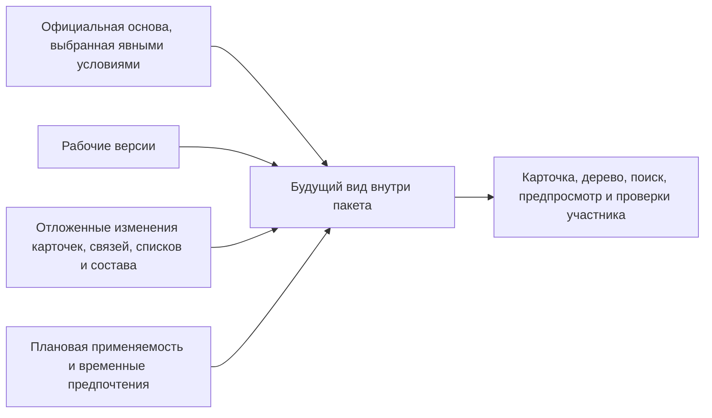

# Рабочие данные, видимость и параллельность

## Три представления предметных данных, которые нельзя смешивать

Один и тот же объект может участвовать в трёх разных представлениях:

1. **Официальное состояние** — зафиксированные версии и данные, которые выбираются явными условиями чтения. Это не обязательно самая новая версия: рабочее место может запросить точный идентификатор, назначенную основную версию, результат правила или опубликованный снимок. Основная версия у объекта может вообще не быть назначена.
2. **Будущее состояние пакета** — официальная основа плюс рабочие версии и отложенные операции конкретного изменения.
3. **Опубликованный снимок** — точный исторический результат, который вообще не пересчитывается.

Пользователь должен всегда видеть, в каком из трёх режимов он находится. Скрытое глобальное переключение контекста считается недостаточным: выбранный пакет, серия, дата и правило должны быть видны в рабочем месте и передаваться в каждое чтение.

## Как строится будущее состояние

Будущее состояние пакета не является второй независимой копией базы. Это согласованный будущий вид, который строится из официальной основы и полного набора подготовленных правок. Одни и те же правила используются карточкой, деревом, поиском и предпросмотром.

## Рабочая версия

Зафиксированная версия никогда не становится изменяемой снова. Когда пакет меняет собственное версионируемое содержание существующего объекта, для него создаётся единственная рабочая версия от последней вершины линейной истории. Изменение постоянного признака объекта, самостоятельной связи, не являющейся позицией версионируемого состава, метки, применяемости, назначения основной версии или состояния уже выпущенной версии может быть представлено отдельной подготовленной операцией без искусственного нового поколения.

Точная фиксация версии в составе относится к позиции конкретной версии родительского узла. Изменить её отдельной операцией без новой версии родителя нельзя. Пакет берёт родительский узел в работу, создаёт его рабочую версию, меняет нужную позицию и затем выпускает следующую официальную версию родителя. Это правило сохраняет однозначную историю того, в какой версии состава действовала фиксация.

Если пользователь хочет восстановить содержимое старой версии насоса, система не создаёт ветвь истории от прошлого. Она создаёт рабочую версию от актуальной вершины и явно копирует в неё выбранное старое содержимое. В результате новый выпуск остаётся следующим состоянием объекта, а происхождение копирования видно в истории.

Новый объект до первого проведения существует только как предварительный объект и первая рабочая версия своего пакета. При отмене обе незавершённые части удаляются. Объект, который уже хотя бы раз стал официальным, так удалить нельзя.

## Видимость участникам и остальным

### Участник пакета

Прикладная система открывает данные с точным контекстом пакета. Если участник прямо открывает собственную рабочую карточку, он видит рабочую версию вместо её официальной основы, а будущие операции — так, как они будут выглядеть после проведения.

При формировании многоуровневого состава правило тоньше. Готовый опубликованный снимок уже содержит точный результат и не пересчитывается. В живом составе точная фиксация версии в позиции имеет приоритет над рабочей версией пакета. Только если более сильного указания нет, подбор может выбрать рабочую версию видимого пакета. Поэтому фраза «рабочая версия всегда заменяет официальную» допустима для прямого открытия своей карточки, но неверна для любой позиции состава.

### Обычный пользователь

Продолжает читать официальное состояние. Он может получить отметку «объект находится в изменении», имя ответственного и ожидаемую дату, если это разрешено политикой, но не видит закрытые значения автоматически.

### Согласующий

Получает доступ к точному предпросмотру по процессному разрешению. Это не означает, что весь пакет становится общедоступным.

### Агент

Видит только тот контекст и те данные, которые предоставлены его запуску. Агент другого процесса не получает рабочие версии лишь потому, что знает номер пакета.

## Почему один объект нельзя менять в двух пакетах

Два конструктора могут независимо открыть один редуктор для чтения, но не должны одновременно подготовить два несовместимых будущих состава без заранее определённых правил объединения двух изменений состава.

Interlink резервирует затрагиваемый объект при первой правке — не только при создании рабочей версии, но и при изменении постоянного признака, связи или состояния версии. Резервирование действует до проведения или отмены.

Это даёт простое правило пользователю:

> Если объект уже участвует в открытом изменении, новую правку нужно включить в существующую работу, отложить либо завершить предыдущую работу явным управляемым способом.

Очередь независимых ветвей и автоматическое слияние сознательно не выбраны как базовая модель. Для состава, технологии и применяемости «последний записавший победил» неприемлем.

## Что происходит при конфликте занятости

Рабочее место показывает:

- какой пакет удерживает объект;
- его вид и основание;
- ответственного;
- какие действия доступны текущей роли;
- можно ли попросить включение в работу;
- допускается ли административное вытеснение.

Обычные варианты:

1. присоединить новую потребность к существующему пакету;
2. дождаться проведения или отмены;
3. разделить предметные области так, чтобы они не затрагивали один объект;
4. с обязательным основанием вытеснить весь пакет.

Частичное вытеснение одного объекта из многообъектного пакета не допускается: оставшийся набор мог бы потерять смысл.

## Вытеснение

Вытеснение — не техническое снятие замка. Оно означает полную отмену чужого незавершённого пакета с явным основанием, автором и уведомлением владельца со стороны принимающего продукта.

Перед решением уполномоченный пользователь может посмотреть предпросмотр вытесняемой работы, если имеет право. После вытеснения удаляются её рабочие версии и операции, освобождаются все объекты, а официальные данные остаются прежними.

## Точки возврата

Точка возврата сохраняет весь рабочий набор пакета. Например, конструктор создаёт точку «Вариант с отечественным двигателем», затем пробует импортный двигатель и связанные изменения муфты. Возврат должен восстановить не только двигатель, но и состав, количества, применяемость и временные предпочтения.

Объекты, которые когда-либо были заняты пакетом после точки возврата, могут оставаться зарезервированными до завершения пакета. Это предотвращает гонку, когда другой пакет начинает менять объект, а первый затем снова восстанавливает старое рабочее состояние.

Пользователь должен видеть различие между:

- объектом, который реально входит в текущий будущий результат;
- объектом, который только продолжает удерживаться для безопасного восстановления.

## Временное предпочтение версии

Внутри пакета можно сказать: «для текущей проработки показывать двигатель версии 04». Это не создаёт рабочую версию двигателя и не меняет позиции состава навсегда.

Перед проведением каждое временное предпочтение должно исчезнуть из рабочего набора как временное решение:

- оно удаляется, если было нужно только для анализа;
- для тех позиций, где нужен постоянный точный выбор, создаются рабочие версии соответствующих родительских составов и в их позициях записываются точные фиксации, после чего предпочтение удаляется;
- если инженерный смысл выражается применяемостью или штатным правилом, это постоянное решение подготавливается отдельно и проверяется, а временное предпочтение всё равно удаляется.

Автоматически закреплять временный выбор во всех местах нельзя: одно предпочтение по объекту может затронуть несколько позиций с разным смыслом. Нельзя также считать применяемость или правило простым переименованием предпочтения — у них другая область действия, владелец и срок жизни.

## Пример 1. Два изменения корпуса насоса

Конструктор начал снижение массы корпуса насоса НЦ-80. Позже служба качества требует срочно изменить материал того же корпуса из-за дефекта поставки. Второй пакет получает конфликт занятости.

Если материал влияет на расчёт толщины, две работы объединяются. Если срочность требует вытеснения, уполномоченный руководитель сначала оценивает незавершённый вариант, затем отменяет его целиком с основанием. Новый пакет начинается от последней официальной версии, а не от скрытого фрагмента отменённой работы.

## Пример 2. Одновременная работа над сборкой и независимым документом

Пакет изменения редуктора занимает сборку и спецификацию. Другой специалист может независимо менять инструкцию по упаковке, если она является отдельным объектом и первый пакет её не затрагивает. Сам факт общей связи с редуктором не блокирует весь граф без необходимости.

Если первый пакет позднее пытается изменить эту инструкцию, он получает конфликт и должен согласовать границу работ.

## Пример 3. Возврат варианта электрошкафа

Проектировщик сохранил точку с преобразователем российского поставщика, затем заменил его импортным и добавил сетевой фильтр. После отказа заказчика он возвращается к точке. Импортный преобразователь и фильтр исчезают из будущего результата, но удержание затронутых объектов может сохраняться до закрытия пакета. В интерфейсе это объясняется отдельно, чтобы пользователь не считал невидимую правку потерянной ошибкой.

## Открытые продуктовые вопросы

- Достаточно ли резервировать целый объект за одним открытым пакетом для реальных процессов IPS, или некоторые сценарии конкретного предприятия требуют более узкой области?
- Какие сведения о чужом пакете видят смежники без права на его содержание?
- Нужно ли пользователю видеть точки возврата как привычные итерации IPS?
- Кто и при каких условиях может вытеснить формальное извещение?
- Как долго допускается удерживать объект без активности и кто отвечает за разбор зависших работ?

## Состояние реализации

Правило «один объект — один открытый пакет», построение будущего состояния из официальных и рабочих данных, точки возврата, временные предпочтения и вытеснение описаны целевым нормативным контрактом полного пакета. Их полное исполняемое поведение и пользовательские экраны относятся к последующим этапам.

Связанные документы: [жизненный цикл](02-user-journey-and-lifecycle.md), [фиксация и восстановление](05-commit-cancel-and-recovery.md), [открытые вопросы](09-status-open-questions-and-acceptance.md).

Основания: [IL-VERS-SPEC §3.2–§3.6], [IL-QUERY §3, §7], [IL-ADR ADR-044, ADR-046], [IPS-K04]. Расшифровка — в [реестре источников](../knowledge/15-source-register.md).
