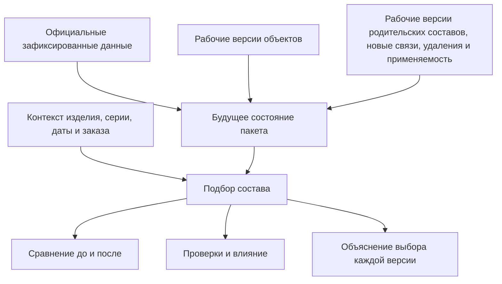
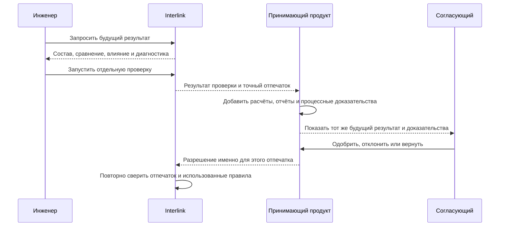

# Предпросмотр, проверка и согласование

## Зачем выделять этот этап

Пользователю недостаточно знать, что в пакет изменения добавлены пять объектов и двенадцать операций. До согласования он должен получить ответ на более практический вопрос: **каким станет изделие, если всё подготовленное сейчас провести**.

Для этого Interlink формирует предпросмотр будущего состояния. Он собирает официальные данные, рабочие версии и ещё не проведённые операции пакета так, как они будут выглядеть после успешного проведения. Это не отдельная копия базы и не предварительная публикация. Это вычисленное будущее состояние, доступное участникам конкретного изменения.

## Два разных уровня информирования

### Обзор открытого пакета

Обычный обзор показывает:

- цель, вид и состояние изменения;
- перечень затронутых объектов;
- ответственных и удерживаемые объекты;
- наличие рабочих версий, предупреждений и решений;
- дату последней активности.

Такой обзор полезен руководителю и смежникам, но он не раскрывает каждое ещё не согласованное значение.

### Точный предпросмотр

Предпросмотр показывает именно будущий результат:

- карточки объектов после применения рабочих значений;
- будущий многоуровневый состав;
- добавленные, удалённые и заменённые позиции;
- версии, которые будут выбраны на каждой позиции;
- будущую степень готовности и применяемость;
- влияние на верхние изделия, документы, маршруты и заказы;
- ошибки, из-за которых проведение сейчас невозможно;
- причины каждого выбора версии.

Разделение важно для конфиденциальности и удобства. Не каждому человеку, который видит факт открытого изменения, требуется доступ к его незавершённому содержанию.

## Как строится будущий результат

Система не просто накладывает изменённые поля. Она заново проходит будущий состав в нужном контексте: учитывает включение позиций, замены, точные фиксации, рабочие версии пакета, применяемость и правила подбора. Поэтому предпросмотр способен обнаружить проблему, которой не видно в отдельной карточке.

Например, новый двигатель допустим сам по себе, но после его установки в привод может потребоваться другой переходной фланец, кабель и автомат защиты. Будущий состав должен показать весь такой каскад.

## Что именно проверяется

### Полнота предметных данных

Проверяется наличие обязательных обозначений, единиц измерения, количества, материалов, владельцев, состояний и других данных, предусмотренных моделью предприятия.

### Целостность состава

Система проверяет, что связи ведут к существующим объектам, не создают запрещённый цикл и соответствуют допустимым типам. Если вал нельзя включать непосредственно в электрический шкаф, это должно быть остановлено правилами модели, а не замечено позже в отчёте.

### Однозначность выбора версий

Живой предпросмотр может законно показать результат «подходящая версия не найдена». Это полезная диагностика при разработке: инженер видит точную позицию, проверенные условия и причину остановки, а не получает случайную подстановку. Сам по себе такой диагностический результат не всегда запрещает проведение пакета — запрет определяется корпоративной политикой для того контрольного контекста, который обязан быть полным.

Для публикации базового снимка или снимка заказа правило безусловно строже: каждая обязательная позиция должна получить точную версию. Неизменяемый снимок с нерешённой позицией не создаётся ни при каком согласовании. Техническая проекция состава проверяется столь же полно, но относится к другому виду результата: это заменяемое ускоряющее представление, которое можно перестроить и которое не является свидетельством выпуска или заказа. Несколько взаимоисключающих замен и незакрытое временное предпочтение также должны быть показаны как понятные проблемы, но их влияние на проведение пакета, публикацию неизменяемого снимка и построение технической проекции нельзя смешивать.

### Согласованность истории

Рабочая версия существующего объекта должна продолжать последнюю официальную версию, от которой пакет был начат. Если за время работы официальная основа законно изменилась, система не должна молча применить подготовленную правку к другому содержанию.

### Процессные ограничения предприятия

Политика может требовать формального извещения для выпущенного изделия, запрещать быстрое исправление определённых атрибутов, требовать конкретную степень готовности или отдельное решение службы качества. Interlink предоставляет точные предметные факты; принимающий продукт определяет маршрут и полномочия.

### Внешние последствия

Проверка влияния может показать затронутые заказы, производственные ведомости, технологические процессы, оснастку и уже опубликованные снимки. Наличие влияния не всегда означает запрет. Оно означает, что человек должен видеть последствия и выполнить предусмотренные действия.

## Ошибка, предупреждение и замечание

Для пользователя важно различать три результата:

| Уровень | Что означает | Что может сделать пользователь |
|---|---|---|
| Ошибка | Будущее состояние противоречит обязательному правилу, проведение невозможно | Исправить данные, изменить состав или отказаться от пакета |
| Предупреждение | Результат допустим, но имеет существенное последствие | Подтвердить осознанное решение, приложить обоснование либо изменить результат |
| Замечание | Полезная подсказка без влияния на допустимость | Учесть по необходимости |

Право «игнорировать предупреждение» не должно превращаться в общий обход правил. Для каждого разрешённого исключения фиксируются основание, полномочие и точное содержание, к которому решение относилось.

## Отпечаток содержания

Предпросмотр отвечает на вопрос «что получится», но сам по себе ещё не является официальной проверкой. Отдельная операция проверки повторно оценивает точное будущее состояние и возвращает **отпечаток содержания** — короткое однозначное представление предметного набора, который Interlink готов провести.

Граница обязательного отпечатка Interlink уже определена. В него входят:

- все рабочие версии и без исключения все подготовленные операции пакета;
- будущая степень готовности, применяемость, точные фиксации в рабочих версиях родительских составов и другие решения по составу;
- точная уже выпущенная редакция предметной модели, по которой построены и проверены данные;
- все применимые настройки и фактически использованные правила.

На последующем этапе контракт будет расширен отпечатками содержимого файлов точных версий, когда файлы входят в предметную границу выпуска. Это отмечается как целевое расширение, а не как уже готовая функция.

Расчёты, отчёты, последствия в системе планирования ресурсов предприятия (ERP) или заказах, решения согласующих и подписи не попадают в отпечаток Interlink автоматически только потому, что показаны рядом на экране. Принимающий продукт формирует собственный комплект процессных доказательств: ссылается на отпечаток Interlink и добавляет точные результаты внешних расчётов, отчёты, подписи и другие материалы, требуемые процессом предприятия.

Отпечаток нужен не пользователю для ручного сравнения символов. Он нужен системе, чтобы доказать: принимающий продукт согласовал именно тот предметный набор, который затем проводится. Комплект процессных доказательств принимающего продукта, в свою очередь, показывает, какие внешние материалы и решения сопровождали это согласование.

## Как проходит согласование

Маршрут, задания, сроки, замещение согласующего, проверка личности и полномочий, одноразовость разрешения и юридически значимая подпись принадлежат принимающему продукту — например, Alvatune. Interlink отвечает за предметную часть: при проведении отпечаток должен совпасть, а точная выпущенная редакция модели, применимые настройки и использованные правила не должны измениться. Разрешение нельзя применить к другому содержанию. После подтверждённой фиксации принимающий продукт помечает разрешение использованным. Если исход неизвестен, то же разрешение нельзя выдать повторно или заменить новым до сверки фактически сохранённого состояния.

## Что происходит после любой правки

Если после согласования инженер меняет длину кабеля, количество крепежа, применяемость или даже значимое правило подбора, отпечаток меняется. Старое разрешение больше не подходит.

Пользователь должен увидеть:

1. что пакет изменён после последнего решения;
2. какие именно различия появились;
3. какие проверки выполнены заново;
4. какое решение требуется повторить;
5. можно ли сохранить часть прежних решений по политике предприятия.

Interlink не решает, должен ли повторно согласовывать весь совет или только технолог. Он даёт принимающему продукту точный факт изменения содержания. Процессная политика принимает решение о маршруте.

## Как выглядит рабочее место

Целевое рабочее место предпросмотра состоит из шести связанных областей:

1. **Итог:** можно ли проводить пакет и почему.
2. **Сравнение:** что добавлено, удалено и изменено.
3. **Будущий состав:** дерево изделия с выбранными версиями и причинами выбора.
4. **Влияние:** где используются изменяемые объекты и какие передачи затронуты.
5. **Проверки:** ошибки, предупреждения и подтверждённые исключения.
6. **Решения:** кто, когда и какое точное содержание согласовал.

Переход от ошибки к месту исправления должен быть прямым. Сообщение «состав недопустим» без указания позиции, правила и возможного действия недостаточно.

## Пример 1. Замена подшипника в редукторе

Конструктор заменяет подшипник 36210 на усиленный аналог в редукторе РЦ-250. В карточке подшипника всё выглядит корректно. Предпросмотр будущего состава показывает, что наружный диаметр изменился и существующая крышка не подходит. Одновременно система находит три исполнения редуктора, где используется та же крышка.

Пользователь добавляет рабочую версию крышки и новое уплотнение. Повторная проверка подтверждает геометрию и показывает предупреждение: складской остаток старого подшипника останется невостребованным после серии 145. Служба снабжения фиксирует решение использовать остаток на ремонте. Согласование относится ко всему будущему комплекту, а не только к строке подшипника.

## Пример 2. Изменение маршрута изготовления вала

Технолог переносит термообработку вала после предварительного шлифования. Предпросмотр показывает будущую последовательность операций, новые нормы времени, требуемую оснастку и влияние на производственную ведомость. Проверка обнаруживает, что контроль твёрдости остался привязан к прежней позиции маршрута.

Технолог переставляет контрольную операцию. После этого предупреждение сообщает о росте длительности цикла на четыре часа. Руководитель производства подтверждает допустимость, а служба качества согласует контроль. При проведении нельзя использовать старое решение, если порядок операций снова изменился.

## Пример 3. Предложение инженерного агента

В будущем агент Alvatune может подготовить предложение по замене материала корпуса насоса. Он создаёт пакет от имени ответственного инженера, прикладывает расчётное основание и останавливается перед согласованием. Человек видит не «ответ агента», а тот же предметный предпросмотр, что и для ручного изменения: будущую карточку, состав, влияние, проверки и происхождение.

Агент не получает право провести изменение только потому, что проверки пройдены. Принимающий продукт проверяет полномочия и получает человеческое либо предусмотренное политикой машинное решение для точного отпечатка.

## Состояние реализации

Точное содержание предпросмотра, его отпечаток и повторная проверка перед проведением входят в целевой нормативный контракт. Полная поверхность предпросмотра пакета, разрешение принимающего продукта и маршруты согласования относятся к последующим этапам после базового опытного подтверждения. Текущий Alvatune пока не содержит готового рабочего места и процесса согласования.

Связанные документы: [жизненный цикл](02-user-journey-and-lifecycle.md), [проведение и восстановление](05-commit-cancel-and-recovery.md), [снимки и доказательства](07-snapshots-evidence-and-user-history.md).

Основания: [IL-VERS-SPEC §3.9–§3.12], [IL-HOST §4], [IL-PLM §7], [IL-QUERY §7], [IPS-A05], [ALV-ADR070]. Расшифровка — в [реестре источников](../knowledge/15-source-register.md).
