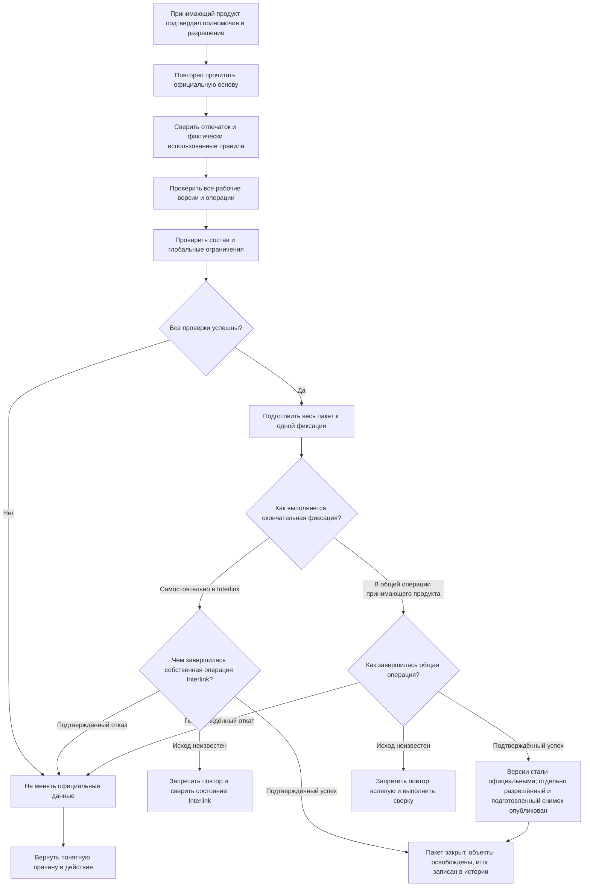
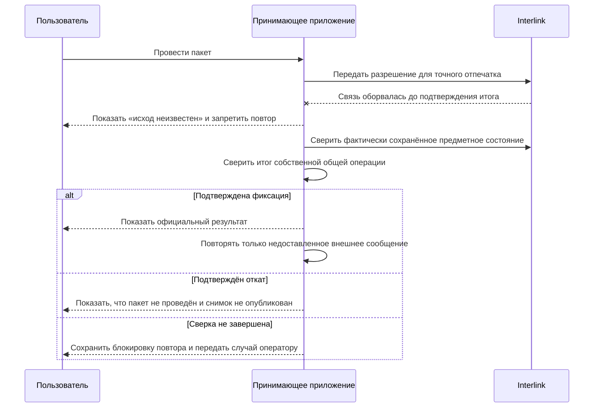

# Фиксация, отмена и восстановление после ошибок

## Что означает «провести изменение»

Проведение — это единственный момент, когда подготовленное будущее состояние становится официальным. До него рабочие версии и операции видны только в контексте пакета. После него появляются новые зафиксированные версии, связи и состояния, которые могут читать остальные пользователи и системы.

Главное требование: пакет проводится **целиком либо не проводится вообще**. Нельзя получить новую версию вала без связанного чертежа, половину заменённого состава или степень готовности без самой версии.

## Полный путь проведения

При самостоятельной фиксации Interlink сам сообщает, проведён ли пакет и появились ли новые официальные версии либо фиксация подтверждённо не состоялась. Если ответ потерян, принимающий продукт сначала сверяет состояние пакета и новых версий в Interlink. В общей операции принимающего продукта Interlink подготавливает результат и ждёт общего решения: подтверждённого успеха, подтверждённого полного отката либо сверки неизвестного исхода. Ни в одном из режимов неизвестный исход нельзя превращать в автоматическую новую попытку.

### 1. Проверка разрешения

Принимающий продукт до обращения к Interlink проверяет личность пользователя, его полномочия, завершение маршрута, подпись, срок действия и то, что разрешение ещё не использовано. После подтверждённой фиксации он помечает разрешение использованным. При неизвестном исходе повторное применение блокируется до сверки. Эти процессные свойства не проверяются ядром Interlink.

Interlink проверяет только предметную привязку: переданный отпечаток должен совпасть с текущим пакетом, а точная уже выпущенная редакция модели, фактически использованные правила и применимые настройки — с теми, для которых выполнена проверка. Так ни одна сторона не приписывает себе чужую ответственность: принимающий продукт отвечает за законность решения, Interlink — за тождество проводимого содержания проверенному.

### 2. Повторное чтение официальной основы

Система проверяет, что каждая рабочая версия всё ещё продолжает ту официальную версию, от которой была создана. Даже при удержании объектов эта проверка остаётся обязательной защитой от административных операций, миграции и гонок.

### 3. Повторение предметных проверок

Проверяются обязательные данные, допустимость связей, уникальность, отсутствие запрещённых циклов, применяемость, точные фиксации, степень готовности, незавершённые временные предпочтения и политика изменения. Диагностический результат «подходящая версия не найдена» в живом исследовательском составе сам по себе не всегда запрещает проведение пакета. Запрет возникает, если корпоративная политика требует полного результата в данном контрольном контексте. Для публикации базового снимка или снимка заказа нерешённая обязательная позиция запрещена безусловно. Техническая проекция также строится только как полный состав, но остаётся заменяемым ускоряющим представлением, а не публикуемым свидетельством.

### 4. Общая проверка будущего состава

Некоторые ошибки видны только после соединения всех частей: две допустимые замены вместе создают конфликт; новая версия узла делает позицию неприменимой; пакет из нескольких частей оставляет внешний состав без результата. Проверяется полный будущий состав, а не каждое отдельное изменение изолированно.

### 5. Единая фиксация

Если всё допустимо, система подготавливает к одновременной фиксации:

- превращает рабочие версии в новые зафиксированные поколения;
- применяет изменения карточек, связей и списков;
- назначает основную версию, степень готовности и применяемость там, где это предусмотрено;
- записывает происхождение и причины;
- обновляет обслуживающие представления;
- закрывает пакет;
- освобождает удерживаемые объекты.

Промежуточное состояние не должно становиться доступным читателям. Если Interlink завершает собственную операцию, результат становится официальным после её подтверждения. Если Interlink включён в общую операцию принимающего продукта, подготовленные версии и операции не становятся официальными, а отдельно разрешённый снимок не публикуется до окончательной фиксации общей операции. При подтверждённом откате новые официальные версии не появляются и снимок не публикуется.

## Что пользователь видит при успехе

Рабочее место показывает:

- номер и время проведения;
- новые официальные версии всех затронутых объектов;
- итоговое сравнение;
- решения, на основании которых проведён пакет;
- предупреждения и подтверждённые исключения;
- отдельно опубликованные снимки, если они создавались, и состояния внешних передач;
- следующие задания процесса.

Пользователь, открывающий изделие после проведения, видит официальное состояние согласно своему контексту подбора. Это может быть новая версия, но назначенная основная версия может остаться прежней, если такова политика продвижения. Открытая до проведения карточка должна получить уведомление, что официальная основа изменилась, а не продолжать бесшумно показывать устаревшее дерево.

## Что пользователь видит при отказе

При подтверждённом отказе проверки, конфликте одновременной записи или подтверждённом откате официальные данные остаются прежними. Рабочий пакет остаётся доступным для исправления, если политика не требует его отменить.

Обрыв связи с неизвестным исходом — другое состояние. В этот момент нельзя честно утверждать ни «ничего не изменилось», ни «всё проведено». Рабочее место показывает «исход неизвестен», запрещает повтор вслепую и запускает сверку с фактически сохранённым состоянием.

Диагностика должна отвечать на четыре вопроса:

1. Что именно не проведено?
2. Какое правило или внешнее условие нарушено?
3. Подтверждён ли откат и поэтому известно ли, что официальные данные не изменились?
4. Что может сделать пользователь — исправить, обновить основу, получить новое согласование, дождаться сверки или отменить пакет после подтверждённого отката?

## Типовые причины отказа

| Причина | Что произошло | Действие пользователя |
|---|---|---|
| Содержание изменилось после согласования | Отпечаток не совпал с разрешённым | Просмотреть различия и согласовать заново |
| Официальная основа стала другой | Рабочая версия больше не продолжает ожидаемую версию | Разобрать конфликт и подготовить новое изменение от актуальной основы |
| Осталось временное предпочтение | Аналитический выбор ошибочно оставлен в проводимом наборе | Если постоянный выбор не нужен — удалить предпочтение. Если нужен — создать рабочие версии соответствующих родительских составов, задать точные версии в нужных позициях и проверить новые версии родителей либо отдельно подготовить применяемость или правило; затем обязательно удалить исходное предпочтение |
| В обязательном контрольном составе нет допустимой версии | Живой подбор дал полезную диагностику, но политика требует полноты | Исправить обязательность позиции, применяемость, правило или точную фиксацию и повторить полный подбор |
| Появился запрещённый цикл | Новые связи замкнули состав | Исправить структуру |
| Изменились модель или политика | Согласование относится к старым правилам | Повторить предпросмотр и решение |
| Временный технический сбой с подтверждённым откатом | Операция точно не была зафиксирована | Устранить причину, повторить проверку актуальной основы и только затем начать новую попытку |
| Обрыв с неизвестным исходом | Нет подтверждения ни фиксации, ни отката общей операции | Не повторять; выполнить обязательную сверку и только после неё выбрать дальнейшее действие |

## Четыре исхода и правила восстановления

Наличие номера попытки полезно для прослеживаемости, но текущий контракт Interlink не обещает, что повтор проведения сам найдёт прежний результат или станет безопасным автоматически. Поэтому восстановление строится не вокруг повторной кнопки, а вокруг точной классификации исхода.

| Исход | Что известно | Разрешённое действие |
|---|---|---|
| Подтверждённый откат | Новые версии не стали официальными, подготовленный снимок не опубликован | Исправить причину, заново проверить актуальное содержание и начать новую попытку |
| Конфликт одновременной записи | Фиксация отклонена до появления новых официальных данных | Перечитать официальную основу, пересобрать предпросмотр и при изменении отпечатка получить новое решение |
| Неизвестный исход собственной или общей операции | Нельзя доказать ни фиксацию, ни отказ или откат | Заблокировать повтор вслепую; для собственной операции сверить состояние Interlink, а для общей — также состояние принимающего продукта; затем оформить подтверждённый итог |
| Проведение подтверждено, внешнее сообщение не доставлено | Предметные версии и, если требовалось, снимок уже официальны | Не проводить пакет и не создавать снимок снова; повторять только доставку того же сообщения, ссылающегося на тот же снимок и результат |

Если связь оборвалась после подтверждённой предметной фиксации, но до внешнего уведомления, сама фиксация не откатывается. Принимающий продукт продолжает недоставленное сообщение по своей надёжной очереди и показывает оператору расхождение.

## Граница общей операции с принимающим продуктом

Interlink может участвовать в общей операции, которой управляет принимающий продукт. Тогда предметное проведение, отдельное создание требуемого снимка и запись намерения внешней отправки могут быть согласованы как единое целое. До подтверждения общей фиксации версии ещё не являются официальными, а снимок остаётся подготовленным и не опубликованным. При подтверждённом откате новые официальные версии не появляются и снимок не публикуется.

Однако внешняя система планирования ресурсов предприятия (ERP) или система управления производственными операциями (MES) обычно не участвует в той же окончательной фиксации. Поэтому правильный результат выглядит так:

1. После подтверждённого завершения общей операции Interlink имеет официальный предметный результат.
2. Принимающий продукт имеет записанное намерение отправить именно этот результат или снимок.
3. До подтверждения внешней системы повторяется только то же сообщение доставки, а не проведение и не публикация снимка.
4. Сверка обнаруживает потерянные, повторные и отклонённые сообщения.

Надпись «проведено» не должна означать «ERP точно приняла», если подтверждения ещё нет.

## Обычная отмена до проведения

Автор или уполномоченный пользователь выбирает отмену и сначала получает перечень последствий:

- какие рабочие версии будут удалены;
- какие новые, ещё ни разу не ставшие официальными объекты исчезнут;
- какие подготовленные связи и состояния не состоятся;
- какие объекты освободятся;
- какие задания и внешние ожидания нужно закрыть.

После подтверждения весь незавершённый набор удаляется целиком, без частично оставшихся рабочих данных. Официальные версии остаются неизменными. Сохраняется запись о самом пакете, причине отмены, участниках и времени.

## Разница между удалением рабочей версии и отменой пакета

Рабочую версию существующего объекта можно убрать из открытого пакета, если остальные операции остаются целостными. Сам объект и его официальная история сохраняются.

Для нового объекта до первого проведения удаляются и предварительная запись о новом объекте, и его первая рабочая версия. После того как объект хотя бы раз стал официальным, его нельзя стереть таким способом: исправление выполняется новой операцией жизненного цикла.

Отмена всего пакета удаляет все его рабочие версии и операции как единое будущее состояние.

## Вытеснение срочным изменением

Если критическое изменение требует занять объект, уже удерживаемый другим пакетом, уполномоченный процесс может вытеснить прежнюю работу. Это не скрытая передача блокировки.

Сначала пользователь видит цель, владельца, возраст и последствия прежнего пакета. Затем весь прежний пакет отменяется с причиной и ссылкой на срочное основание. Только после этого новый пакет начинает работу от последней официальной версии.

Частичное сохранение незавершённых правок в новом пакете возможно лишь как отдельное осознанное действие с повторной проверкой происхождения.

## Восстановление после ошибки пользователя

Если ошибка сделана внутри открытого пакета, участник может вернуться к сохранённой точке или удалить отдельную рабочую операцию. Это не меняет официальную историю.

Если ошибочный пакет уже проведён, «откатить базу назад» нельзя. Создаётся новое корректирующее изменение, которое:

- явно ссылается на ошибочный результат;
- создаёт следующее официальное поколение;
- проходит применимые проверки и согласование;
- сохраняет обе части истории.

Такой подход важен для прослеживаемости производства: нельзя сделать вид, что выпущенной версии никогда не существовало.

## Пример 1. Комплексное изменение редуктора

Пакет содержит вал, крышку, спецификацию и применяемость с серийного номера 145. На последней проверке обнаруживается, что новая крышка уже обозначена в другом проекте предприятия. Проведение отказывает до появления любой новой версии. Конструктор меняет обозначение, получает новое согласование и повторяет проведение. Тогда все четыре части становятся официальными одновременно.

## Пример 2. Обрыв связи при передаче заказа

Планировщик отдельными явными действиями проводит новую версию производственного заказа и публикует точный снимок; принимающий продукт может включить их в одну общую операцию. Разовое решение этого заказа хранится в его версии и снимке и не меняет общие правила подбора или состав изделия для следующих заказов. После подтверждения общей фиксации связь с MES пропадает. Пользователь видит: новая версия заказа стала официальной, снимок опубликован, а внешняя передача ожидает подтверждения. Очередь повторяет только то же сообщение со ссылкой на тот же снимок; пакет не проводится повторно и новый снимок не создаётся. После подтверждения состояние передачи меняется на завершённое.

## Пример 3. Исправление уже выпущенной инструкции

После выпуска инструкции сборки обнаружена неверная величина момента затяжки. Архивная версия не удаляется и не редактируется. Создаётся срочный пакет, новая рабочая версия инструкции, проверяется влияние на открытые заказы и выпущенные комплекты. После согласования появляется следующее поколение, а история показывает причину исправления и перечень затронутых передач.

## Состояние реализации

Фиксация целиком без частичного результата, повторная проверка, запрет слепого повтора при неизвестном исходе и разделение предметной фиксации от внешней доставки являются принятыми требованиями. Полный пакет, разрешение принимающего продукта, сверка неизвестного исхода и пользовательские операции отмены относятся к последующим этапам реализации. Они должны быть подтверждены отказоустойчивыми испытаниями, а не только обычным успешным примером. Автоматический поиск результата прежней попытки и безопасная повторяемость самого проведения текущим контрактом не обещаны.

Связанные документы: [рабочее состояние и параллельность](03-working-state-visibility-and-concurrency.md), [предпросмотр и согласование](04-preview-validation-and-approval.md), [снимки и доказательства](07-snapshots-evidence-and-user-history.md).

Основания: [IL-VERS-SPEC §3.6–§3.13], [IL-HOST §2–§4], [IL-PLM §7], [IL-ADR ADR-044, ADR-046], [IPS-A05]. Расшифровка — в [реестре источников](../knowledge/15-source-register.md).
