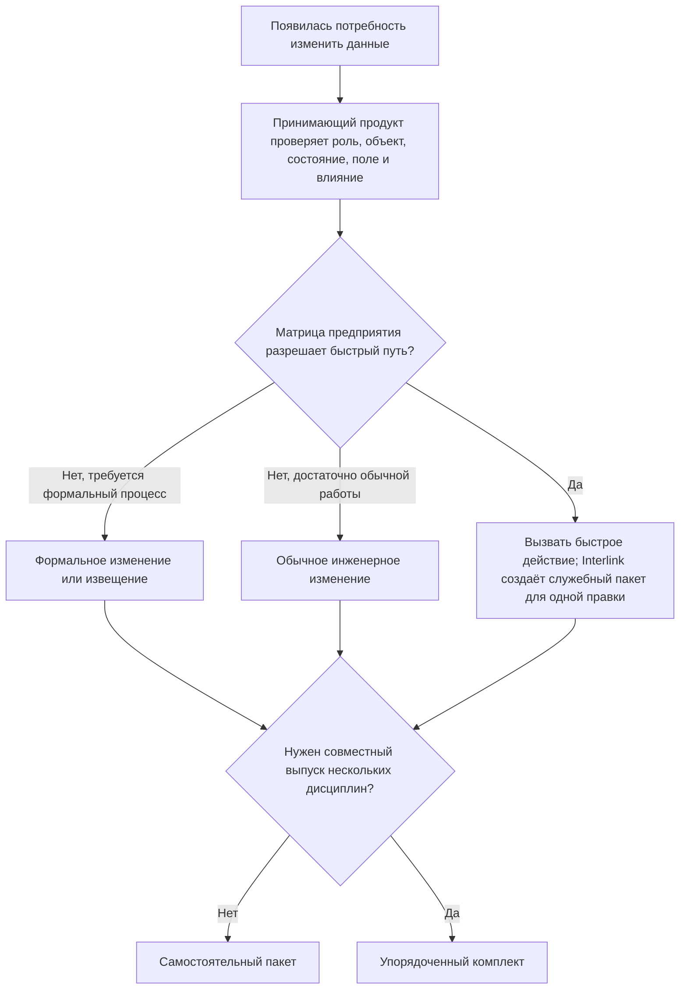
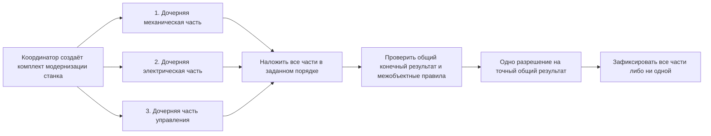

# Быстрые, формальные и составные изменения

## Одна предметная модель, разные пользовательские процессы

На предприятии не каждое изменение оформляется одинаково. Исправление опечатки, извещение об изменении выпущенного изделия, загрузка справочника и согласованный выпуск нескольких дисциплин требуют разного числа участников и документов.

Interlink не заставляет показывать пользователю один тяжёлый экран во всех случаях. Но внутри все эти действия проходят общий путь: открывается пакет, собирается будущее состояние, выполняются проверки, фиксируется точное решение и результат проводится целиком.

Это устраняет опасный разрыв, когда «быстрая кнопка» меняет данные по другим правилам, чем формальный процесс.

## Два независимых признака

У пакета есть **вид работы** и **роль в совместном выпуске**.

Вид объясняет, зачем создан пакет:

- быстрое изменение;
- обычное инженерное изменение;
- формальное извещение;
- импорт;
- системное обслуживание.

Роль объясняет, проводится ли пакет один или входит в упорядоченный комплект:

- самостоятельный пакет;
- управляющий комплект;
- дочерняя часть комплекта.

Эти признаки нельзя смешивать. Например, дочерней частью общего выпуска может быть и формальное извещение механиков, и системно подготовленная корректировка справочника.

## Как выбрать пользовательский путь

Окончательное решение определяется политикой предприятия: типом объекта, степенью готовности, характером поля, влиянием, проектом и полномочиями автора.

## Быстрое изменение

### Для чего нужно

Быстрый путь предназначен для понятного одиночного действия, которое не требует отдельной карточки большого процесса. Пользователь может выбрать «исправить массу», «назначить основную версию» или «уточнить складскую единицу».

### Что происходит внутри

В целевой модели принимающий продукт сначала проверит полномочия и матрицу предприятия, затем вызовет разрешённое действие. Будущий механизм Interlink автоматически создаст служебный пакет для одной правки, включит нужный объект, сформирует рабочее состояние, выполнит проверки и проведёт результат. Даже если интерфейс показывает одно подтверждение, история должна содержать автора, основание, старое и новое значение, правила и итог. Механизм автоматического создания такого пакета пока не реализован.

### Когда путь запрещён

Быстрый путь запрещён не самим фактом выпуска или изменения состава, а результатом явной корпоративной матрицы. Она учитывает тип и состояние объекта, изменяемое поле или связь, влияние, проект, роль и другие существенные условия. Если матрица требует извещения либо обычного инженерного процесса, действие не выполняется «в обход»: пользователь получает объяснение и предложение открыть подходящую работу с уже заполненным основанием.

### Пример

Нормировщик замечает, что для покупной шайбы указана масса 0,12 кг вместо 0,012 кг. Изделие ещё находится в рабочей степени готовности, масса не влияет на геометрию и состав. Политика разрешает быстрое изменение. Пользователь видит сравнение, подтверждает, и новая версия карточки фиксируется через автоматический пакет.

Для той же правки в утверждённой спецификации двигателя матрица конкретного предприятия может потребовать формальное изменение, поскольку она влияет на сводную массу выпущенного изделия. На другом предприятии с иной классификацией риска допустим облегчённый путь с дополнительным подтверждением. Документ не подменяет эту матрицу безусловным правилом.

## Обычное инженерное изменение

### Для чего нужно

Это основной путь для разработки ещё не выпущенного изделия, технологического процесса или справочника, когда затрагиваются несколько связанных данных и требуется совместная проверка.

### Как работает пользователь

Инженер создаёт пакет с целью, берёт объекты в работу, готовит версии, использует точки возврата, приглашает участников, проверяет будущий состав и передаёт результат по выбранному маршруту. Формальная форма извещения может отсутствовать, но предметная фиксация и история остаются полными.

### Пример

При проектировании насосной станции конструктор увеличивает толщину рамы, меняет четыре крепёжные позиции и массу сборки. Технолог параллельно уточняет операцию сварки в том же пакете. До первого выпуска это обычное инженерное изменение с согласованием конструктора и технолога.

## Формальное извещение

### Для чего нужно

Формальный путь применяется, когда меняется уже выпущенная документация или изделие, а предприятие требует номер извещения, причины, сроки внедрения, перечень затронутых документов и решения служб.

### Что добавляет принимающий продукт

Interlink хранит точные рабочие версии, операции, применяемость и предметный результат. Alvatune или другой продукт добавляет:

- карточку извещения и корпоративную нумерацию;
- маршрут согласования;
- задания и сроки;
- подписи и полномочия;
- уведомления и рассылку;
- контроль выполнения последующих действий.

Извещение не становится вторым способом менять данные. Оно управляет тем же пакетом и разрешает проведение его точного содержания.

### Пример

После серии 144 в редукторе РЦ-250 меняется подшипниковый узел. Извещение включает новые версии вала, крышки, спецификации и чертежей, а также применяемость «с серийного номера 145». Снабжение оценивает остатки, производство — незавершённые заделы, качество — контроль. После согласования весь предметный набор проводится одновременно.

## Импорт

### Для чего нужен отдельный вид

При миграции из IPS или загрузке внешнего справочника автором выступает управляемый процесс, а объём может быть большим. Нужно сохранять источник, идентификатор записи, порцию, преобразование и диагностику.

### Что остаётся общим

Импорт не получает право писать напрямую в обход модели. Каждая публикуемая порция проходит предметные проверки и оставляет происхождение. Порции выбираются так, чтобы ошибка не создавала ложное частичное завершение целого связанного набора данных.

### Пример

При переносе справочника материалов одна марка стали ссылается на отсутствующий стандарт. Порция, в которую входит зависимый набор, не проводится; остальные независимые порции могут завершиться. Оператор видит точный остаток и повторяет только исправленную часть.

## Системное обслуживание

Системный пакет может без ручного редактирования установить начальные предметные данные, исправить служебные предметные записи или выполнить другую разрешённую операцию над обычными данными предприятия. Такой пакет имеет явно указанного системного автора, основание, версию инструмента и тот же аудит. Он не означает неограниченные полномочия: политика определяет, какие действия допустимы автоматически и где требуется человеческое решение.

Изменение самих определений типов, полей, связей и ограничений не выполняется предметным пакетом изменения. Для него существует отдельный жизненный цикл выпуска модели и управляемая миграция. Поэтому в системный пакет могут входить начальные справочники и обслуживающие предметные данные, но не новая редакция языка модели.

## Зачем нужен комплект пакетов

Иногда один огромный пакет неудобен: механическая, электрическая и программная части имеют разных владельцев, маршруты и сроки. Но провести их независимо нельзя, потому что только совместный набор образует допустимое изделие.

Упорядоченный комплект не связывает задним числом уже существующие самостоятельные пакеты. Координатор создаёт сам комплект и дочерние части внутри него. Команды готовят части относительно независимо, но с момента создания у них общая окончательная судьба.

## Как работает комплект

1. Координатор создаёт общий выпуск, дочерние части и определяет их порядок.
2. Каждая команда ведёт свою дочернюю часть и отвечает за её содержание. Часть можно готовить независимо, но нельзя отдельно провести, отменить, перенести в другой комплект или превратить в самостоятельный пакет.
3. Участники видят локальный результат и согласованную совокупную картину.
4. Interlink последовательно применяет изменения дочерних частей к общему будущему состоянию в установленном порядке. Не требуется, чтобы результат после каждой промежуточной части уже был допустимым изделием: электрическая часть, например, может временно ссылаться на интерфейс, который добавит следующая часть.
5. После применения всех частей Interlink проверяет объединённый конечный результат, включая правила между объектами и дисциплинами. Ошибка объясняется через породившие её части, но допустимость оценивается для целого.
6. Принимающий продукт получает решения ответственных дисциплин и итоговое разрешение.
7. Перед проведением повторно проверяются все части, общий отпечаток, точная уже выпущенная редакция предметной модели, применимые настройки, фактически использованные правила и официальная основа.
8. Комплект проводится целиком. Ошибка любой обязательной части не оставляет остальные официально выпущенными.

Порядок является частью содержания. Если электрическая часть предполагает уже изменённый механический интерфейс, перестановка частей способна изменить результат и требует нового предпросмотра.

## Почему не делать один огромный пакет

Один пакет удобен, когда объектная граница и команда действительно общие. Комплект полезен, когда нужно сохранить:

- самостоятельные цели и ответственность дисциплин;
- отдельные перечни затронутых данных;
- собственные согласования;
- понятную историю ответственности каждой дисциплины внутри одного выпуска;
- общий запрет на несовместимый частичный результат.

Комплекты не должны вкладываться друг в друга без ограничения: глубокая иерархия делает порядок и ответственность непрозрачными. Целевая модель предусматривает один управляющий уровень и упорядоченные дочерние части. Дочерняя часть не переносится и не используется повторно. Если её идея нужна в другом выпуске, на основе понятого содержания создают новую часть нового комплекта и заново проверяют официальную основу, влияние и происхождение.

## Пример. Модернизация обрабатывающего центра

Механики меняют шпиндель и крепление датчика. Электрики устанавливают другой преобразователь и автомат. Разработчики управляющей программы добавляют новый диапазон оборотов.

Если выпустить только механику, старый преобразователь может повредить шпиндель. Если выпустить только программу, станок получит недопустимую команду. Команды ведут три части, а координатор видит совместный состав, интерфейсы и проверки. Общий выпуск проводится только после подтверждения всех дисциплин.

## Что увидит пользователь

При создании изменения интерфейс спрашивает не внутренний технический вид, а понятную цель. Политика предлагает подходящий путь и объясняет ограничения.

В карточке самостоятельного пакета пользователь видит его вид и причину. В карточке комплекта дополнительно видны:

- все части и их владельцы;
- порядок;
- готовность каждой части;
- междисциплинарные ошибки;
- общий будущий результат;
- решения по частям и итоговое решение;
- единый статус проведения.

## Состояние реализации

Единый предметный путь для быстрых и формальных действий является принятым направлением. Полные виды пакета, механизм автоматического создания пакета для одного разрешённого действия и упорядоченный комплект относятся к целевой модели после базового опытного подтверждения. Процессные формы, маршруты и рабочие места должен реализовать принимающий продукт.

Связанные документы: [границы пакета](01-what-is-change-package.md), [жизненный цикл](02-user-journey-and-lifecycle.md), [сквозные примеры](08-end-to-end-examples.md).

Основания: [IL-VERS-SPEC §3.1, §3.13], [IL-PLM §7], [IL-HOST §4], [IPS-A04], [IPS-A05], [IPS-K04]. Расшифровка — в [реестре источников](../knowledge/15-source-register.md).
