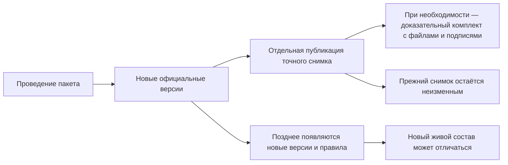
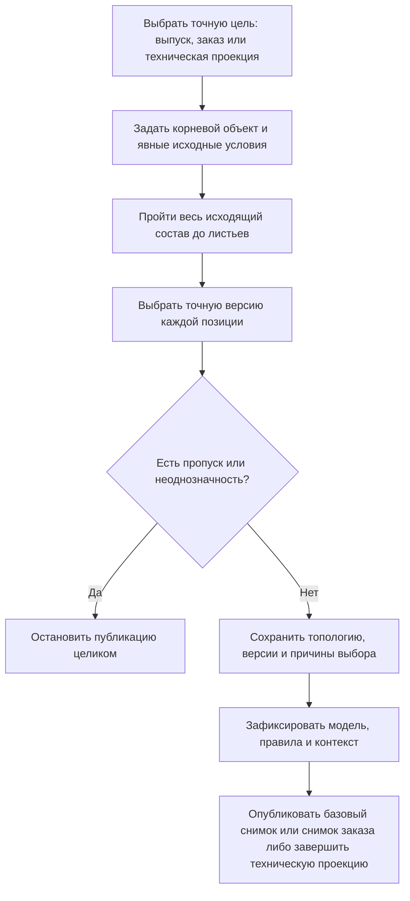

# Снимки, доказательства и история пользователя

## Три результата, которые нельзя называть одним словом

После изменения предприятие может получить три разных результата:

1. **Новые официальные версии** — зафиксированные состояния отдельных объектов и связей.
2. **Снимок состава** — неизменяемый перечень точных версий полного многоуровневого графа для конкретной цели.
3. **Самодостаточный доказательный комплект** — подготовленный принимающим продуктом архив значимых данных, файлов, подписей и правил, который можно проверять независимо от дальнейшей жизни рабочей базы.

Проведение пакета не обязано автоматически создавать снимок. Снимок не обязан копировать все файлы и атрибуты. Поэтому юридически или архивно автономный комплект не возникает сам собой.

## Проведение и снимок отвечают на разные вопросы

Проведение отвечает: **какие новые версии и состояния стали официальными?**

Неизменяемый снимок отвечает: **какой точный полный состав был опубликован для конкретного выпуска или заказа?** Техническая проекция отвечает на другой вопрос: **какое заранее построенное представление ускоряет чтение большого состава сейчас?** Проекцию можно заменить, поэтому она не служит историческим доказательством.

Например, после изменения подшипника появились новые версии вала и крышки. Обычный текущий просмотр может позже выбрать ещё более новые версии. Базовый снимок выпуска продолжит показывать именно тот состав, который был опубликован тогда.

## Два неизменяемых снимка и заменяемая техническая проекция

### Базовый снимок

Базовый снимок фиксирует конфигурацию для выпуска, обмена, отчёта или аудита. Он неизменяем и дополняет историю новыми публикациями, не переписывая прежние.

В пользовательском языке это может быть «состав выпуска редуктора РЦ-250 от 12 мая» или «комплект для сертификационных испытаний».

### Снимок заказа

Снимок заказа фиксирует точную комплектацию конкретной передачи в производство. Сам заказ остаётся живым версионируемым объектом: его можно перепланировать и выпустить следующую версию. Каждая официальная передача получает новый снимок.

Производство читает снимок без повторного подбора по текущим правилам. Поэтому выпущенная завтра версия двигателя не меняет вчерашний заказ.

Разовый выбор для конкретного заказа сохраняется в версии живого заказа и затем в его неизменяемом снимке. Он не меняет общий состав изделия, назначенную основную версию, применяемость или корпоративное правило подбора для следующих заказов. Если то же решение должно действовать для будущих заказов, его оформляют отдельным пакетом изменения общих инженерных данных.

### Техническая проекция состава — не снимок выпуска

Техническая проекция состава — ускоряющее представление большого графа. Она может быть перестроена, заменена или удалена. Это не свидетельство выпуска и не точный заказ, даже если структура хранения похожа на снимок.

Пользователь обычно не создаёт его вручную. Однако требования полноты к нему те же: построение проходит весь исходящий граф от корня до листьев, без пользовательского ограничения глубины, произвольного фильтра и скрытия отдельных ветвей по построчным правам.

Готовность технической проекции оценивается по точному набору исходных условий, с которыми она была построена: выпущенной редакции модели, редакциям правил подбора и применимым настройкам. Изменение одной из этих основ переводит проекцию в состояние «требуется перестроение». Простое появление более новой предметной версии или новой связи само по себе не объявляет уже построенную проекцию испорченной: она остаётся точным техническим представлением исходного среза. Принимающий продукт явно запрашивает новую проекцию, когда ему нужен новый предметный срез.

Эксплуатационный экран показывает состояние «готова», «требуется перестроение», «перестраивается» или «недоступна из-за ошибки». Так потребитель не принимает старое ускоряющее представление за актуальный живой состав.

## Как публикуется снимок

Для базового снимка, снимка заказа и технической проекции нельзя скрытно обрезать глубину, пропустить недоступную ветвь или применить произвольный пользовательский фильтр. Нельзя также строить их из дерева, которое было предварительно урезано правами текущего пользователя. Иначе заявление о полном точном составе вводит потребителя в заблуждение.

Если хотя бы для одной обязательной позиции нет допустимой версии, публикация не создаёт частичный снимок.

## Публикация снимка не равна его доставке

Interlink сначала подтверждает, что базовый снимок или снимок заказа полностью опубликован и доступен как неизменяемый результат. Только после этого принимающий продукт отправляет во внешнюю систему сообщение или представление со ссылкой на уже опубликованный снимок. Получатель может принять сообщение, отклонить его, принять только часть предусмотренного объёма либо не вернуть достоверный ответ.

Эти события учитываются раздельно. Если снимок опубликован, но сообщение не доставлено, снимок не создаётся повторно: принимающий продукт повторяет только доставку того же сообщения и сохраняет связь с тем же снимком. Если неизвестно, была ли подтверждена сама публикация, повтор запрещён до сверки фактически сохранённого состояния. Так потеря связи не создаёт второй снимок и не переписывает историю заказа.

## Что сохраняет снимок

Снимок содержит достаточно данных, чтобы восстановить точный граф и объяснить выбор:

- корень и назначение публикации;
- точные версии каждой позиции;
- структуру и направление связей;
- номера позиций, количество и единицы измерения;
- параметры исполнения и применяемости позиции;
- причину выбора версии;
- контекст головного изделия, серии, даты и заказа;
- точную уже выпущенную редакцию модели данных, редакции использованных правил и применимых настроек;
- автора, время и происхождение публикации.

Одинаковая деталь в двух местах сохраняется как две позиции с собственным путём и смыслом, даже если выбрана одна версия детали.

## Что снимок намеренно не обещает

Снимок состава не обязан копировать внутрь:

- каждый атрибут карточки каждой версии;
- все исходные и производные файлы;
- изображения отчётов;
- сертификаты подписи;
- внешние ответы системы планирования ресурсов предприятия (ERP), системы управления производственными операциями (MES) или архива;
- отдельное автономное программное средство для чтения снимка вне Interlink.

Эти данные могут потребоваться для юридически самодостаточной поставки. Тогда принимающий продукт формирует отдельный доказательный комплект. При этом сам Interlink обязан бессрочно удерживать архивные редакции модели, правил, настроек и средства чтения, необходимые для открытия его старых снимков. Дополнительный автономный архив за пределами Interlink остаётся ответственностью принимающего продукта.

## Доказательный комплект принимающего продукта

Для автономного архива или передачи Alvatune либо другой продукт может собрать:

- сам снимок состава;
- требуемые карточки и файлы точных версий;
- сформированные документы;
- версию шаблона и правил формирования;
- входные параметры;
- решения и подписи;
- отпечатки всех значимых материалов;
- подтверждения внешней передачи;
- средство или описание способа чтения формата.

Interlink гарантирует предметное происхождение и точность ссылок. Принимающий продукт определяет юридическую границу, срок хранения, доступ и формат выдачи.

## Как пользователь читает историю

Целевой просмотр истории должен позволять двигаться от делового события к точным данным:

1. Открыть заказ, выпуск или извещение.
2. Увидеть связанные проведённые пакеты.
3. Открыть итог каждого пакета и решения.
4. Перейти к новым официальным версиям.
5. Открыть опубликованный снимок.
6. Для любой позиции увидеть точную версию и причину выбора.
7. При наличии доступа открыть доказательный комплект и внешние подтверждения.

История не должна быть только длинным техническим журналом. Пользователь сначала видит деловые события, затем раскрывает предметные подробности и, при необходимости, технические доказательства.

## Сравнение «тогда» и «сейчас»

Пользователь может сравнить:

- два официальных поколения одного объекта;
- официальный состав до и после пакета;
- два базовых снимка разных выпусков;
- две передачи одного заказа;
- старый снимок с текущим живым подбором.

Последнее сравнение особенно важно. Оно показывает, что изменилось в правилах и версиях после публикации, но не переписывает старый результат.

## Почему одного контекста подбора недостаточно

Контекст с датой, серийным номером и политикой точно описывает входные данные живого подбора. Но через год при тех же входах могут существовать новые версии, а правила — получить новую редакцию. Поэтому контекст сам по себе не является межвременным доказательством.

Для воспроизводимости нужен точный неизменяемый граф и сохранённое происхождение. Для юридической автономности может дополнительно понадобиться доказательный комплект.

## Пример 1. Выпуск редуктора

После проведения извещения предприятие публикует базовый снимок конкретного редуктора РЦ-250 с заводским номером 145. Он фиксирует точные версии корпуса, валов, подшипников, крышек и документов, а также причины выбора именно для этого заводского номера. Через месяц появляется улучшенная версия манжеты. Текущий просмотр следующего редуктора может выбрать её, но базовый снимок номера 145 остаётся прежним.

Сам по себе этот снимок не доказывает, что тот же состав действовал для всего диапазона 145–200. Такое утверждение требует отдельного доказательства принимающего продукта: например, выпущенного документа применяемости и подтверждения, что на всём диапазоне не было других публикаций или исключений.

Если отделу технической документации (ОТД) требуется автономный комплект, принимающий продукт добавляет подписанные чертежи, спецификацию, извещение и отпечатки файлов.

## Пример 2. Перепланирование насосной станции

Заказ на насосную станцию сначала подготовлен с двигателем поставщика А. Снимок заказа №1 опубликован, после чего принимающий продукт передал ссылку на него в производство и получил подтверждение доставки. Публикация и доставка остались двумя отдельными событиями истории. Из-за срыва поставки планировщик создаёт новую версию живого заказа, принимает разовое решение использовать допустимый двигатель Б, пересчитывает фланец и кабель, затем публикует снимок №2. Это решение относится только к данной версии заказа и не меняет общие правила выбора двигателей для следующих заказов.

Первый снимок не меняется и сохраняет факт прежней передачи. Производство явно переводит исполнение на №2; история показывает причину и разницу. Нельзя просто «обновить ссылку» внутри первого снимка.

## Пример 3. Сервис старого пресса

Сервисный инженер открывает базовый снимок пресса, изготовленного восемь лет назад. Он видит установленную тогда версию гидрораспределителя. Текущий справочник предлагает современный аналог, но система не подменяет им исторический состав. Инженер создаёт отдельный ремонтный пакет и документирует новую замену.

## Доступ и неизменность

Право на базовый снимок, снимок заказа или техническую проекцию применяется ко всему соответствующему артефакту. Нельзя выдать пользователю «полный точный состав», скрыв отдельные ветви из-за построчной фильтрации. При недостаточном праве система отказывает в доступе. Принимающий продукт может отдельно показать ограниченное живое представление с другим назначением, но оно не называется снимком, не используется как источник публикации базового снимка или снимка заказа и не выдаётся за полную техническую проекцию.

Базовый снимок и снимок заказа в Interlink не изменяются и не удаляются — в том числе административной «обычной очисткой». Исправление означает только новую публикацию, а прежнее свидетельство остаётся доступным в истории. Interlink также бессрочно удерживает архивные модели, правила, настройки и средства чтения, необходимые для открытия этих снимков.

Принимающий продукт и предприятие отвечают за дополнительный юридический архив: файлы, подписи, сроки обязательного хранения, запрет удаления во внешних хранилищах и выдачу автономного доказательного комплекта. Эта ответственность дополняет, но не ослабляет неизменность и неудаляемость базовых снимков и снимков заказа внутри Interlink.

## Состояние реализации

Разделение живого заказа, неизменяемых базового снимка и снимка заказа, а также заменяемой технической проекции принято нормативно. Полноценные базовые снимки и снимки заказа следуют после реализации необходимого подбора, применяемости и полного пакета изменений. Бессрочное чтение старых снимков с архивными моделью, правилами, настройками и средствами чтения является требованием Interlink. Дополнительный доказательный комплект, подписи, юридический архив и пользовательский просмотр истории принадлежат принимающему продукту и пока являются целевой возможностью. Состояния готовности и явное перестроение технической проекции также относятся к целевому контракту, а не к готовому пользовательскому механизму.

Связанные документы: [проведение и восстановление](05-commit-cancel-and-recovery.md), [точный состав заказа](../version-selection/16-order-and-snapshot.md), [публикация заказа](../orders/05-exact-publication.md).

Основания: [IL-VERS-SPEC §5–§6], [IL-PLM §5, §7], [IL-HOST §4], [IPS-A13], [IPS-K09]. Расшифровка — в [реестре источников](../knowledge/15-source-register.md).
