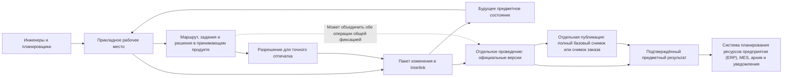

# Сквозные машиностроительные примеры

## Как читать примеры

Каждый пример проходит один и тот же полный путь: повод, исходные данные, рабочее состояние, видимость, предпросмотр, согласование, проведение, публикация и возможные ошибки. Это позволяет проверить не только отдельную функцию, но и то, как будет работать человек.

Примеры описывают целевое поведение. Они являются основой будущих демонстрационных и приёмочных сценариев, а не утверждением о готовом интерфейсе.

Во всех примерах нужно различать самостоятельную фиксацию Interlink и общую операцию окончательной фиксации принимающего продукта. В первом случае Interlink сам подтверждает, проведён ли пакет и появились ли новые официальные версии. Во втором Interlink подготавливает результат и ждёт одного из трёх явно различимых исходов: подтверждённого успеха, подтверждённого полного отката или неизвестного исхода. При неизвестном исходе повтор запрещён до сверки фактически сохранённого состояния. Внешняя доставка начинается только после подтверждённого успеха и имеет отдельный статус.

## Сценарий 1. Повышение ресурса подшипникового узла редуктора РЦ-250

### Производственная ситуация

Сервисная статистика показывает преждевременный износ подшипника выходного вала. Требуется усилить узел начиная с серийного номера 145, не меняя уже изготовленные редукторы и ремонтные комплекты предыдущих серий.

### Участники

- ведущий конструктор отвечает за техническое решение;
- технолог проверяет изготовление крышки и сборочную операцию;
- снабжение оценивает остатки старых подшипников;
- качество определяет дополнительный контроль;
- руководитель проекта координирует внедрение;
- отдел технической документации (ОТД) формирует выпускной комплект.

### Исходные данные

Официально существуют выпущенные версии редуктора, вала, крышки, спецификации и чертежей. Старый подшипник применяется без ограничения по серии. На складе есть остаток, а часть редукторов уже находится в незавершённом производстве.

### Работа пользователя

1. Ведущий конструктор создаёт формальный пакет «РЦ-250. Повышение ресурса выходного узла» и указывает основание — статистику отказов.
2. Он берёт в работу вал, крышку, сборку и связанные документы. Остальные пользователи продолжают видеть выпущенное состояние.
3. Внутри пакета создаются рабочие версии. Конструктор меняет посадочные размеры и заменяет подшипник.
4. Технолог, имеющий доступ к пакету, видит будущую геометрию и добавляет изменение операции расточки крышки.
5. Для проверки временно выбирается версия нового подшипника. До проведения этот выбор не считается постоянной конкретизацией.
6. Предпросмотр собирает весь редуктор. Он обнаруживает, что существующая манжета несовместима с новой крышкой.
7. Конструктор добавляет другую манжету. Чтобы закрепить точные выпущенные версии подшипника и манжеты в критических позициях, он меняет эти позиции в рабочей версии родительского состава редуктора. Отдельной фиксации вне версии родительской сборки не создаётся.
8. Диапазоны делаются непересекающимися: прежний узел получает применяемость для номеров 1–144, новый — с номера 145 без заданной верхней границы. Поэтому на границе диапазонов нет ни наложения двух допустимых узлов, ни промежутка без результата.
9. Влияние показывает три открытых заказа и складской остаток. Снабжение подтверждает использование остатка для ремонта; производство определяет переход для незавершённого задела.
10. После предметных проверок принимающий продукт проводит согласование точного будущего состава.
11. Любая последующая правка размера меняет отпечаток и возвращает нужные решения на повтор.
12. Проведение одновременно создаёт новые версии всех затронутых объектов и применяемость. Частичного выпуска быть не может.
13. После подтверждённого проведения отдельной явной операцией публикуется базовый снимок, а ОТД формирует самодостаточный комплект документов. Принимающий продукт может объединить проведение и отдельно разрешённую публикацию снимка одной общей операцией, но это по-прежнему два разных предметных решения. При подтверждённом успехе пакет проводится и снимок публикуется. При подтверждённом откате не появляются ни новые официальные версии, ни снимок; неизвестный исход блокирует повтор до сверки.

### Что видят разные пользователи

До проведения обычный пользователь серии 140 видит старый официальный узел. Участник пакета видит будущий усиленный узел. После проведения пользователь серии 140 по-прежнему получает старые версии, а для серии 145 — новые. Базовый снимок прежнего выпуска не изменяется.

### Возможная ошибка

Если для новой крышки не выпущена подходящая технологическая оснастка, предпросмотр показывает влияние. Политика предприятия определяет, является ли это запретом проведения или обязательным последующим заданием. Решение и основание видны в истории.

## Сценарий 2. Быстрое исправление материала невыпущенной прокладки

### Производственная ситуация

При подготовке гидроцилиндра технолог замечает, что в рабочем справочнике прокладке назначена резина неправильной марки. Изделие ещё не выпущено, состав не меняется, а требуемый материал уже разрешён стандартом предприятия.

### Работа пользователя

1. Технолог открывает карточку прокладки и выбирает «Исправить материал».
2. Принимающий продукт проверяет политику: объект не выпущен, поле разрешено для облегчённого изменения, влияние ограничено.
3. В целевом рабочем месте автоматически создаются небольшой пакет и рабочая версия; этот быстрый путь ещё предстоит реализовать.
4. Пользователь видит старую и новую марку, применимый стандарт и перечень использований.
5. Проверка подтверждает единицу измерения, плотность и совместимость со средой.
6. После подтверждения пакет проводится, появляется следующее официальное поколение, история сохраняет основание.

### Почему это не «прямая правка»

Если бы поле менялось на месте, было бы невозможно доказать, какие расчёты и составы читали прежнее значение. Пакет сохраняет простоту пользовательского действия, но не жертвует историей.

### Отрицательный вариант

Если прокладка уже входит в выпущенный гидроцилиндр и корпоративная матрица для этого типа объекта, поля и влияния требует формального извещения, быстрый путь запрещён. Интерфейс объясняет конкретное правило и предлагает открыть формальное изменение, перенося в него введённую причину и предполагаемое значение. Выпущенное состояние само по себе не подменяет решение матрицы.

## Сценарий 3. Срочное исправление управляющей программы станка

### Производственная ситуация

Инженер автоматизации готовит плановую оптимизацию программы фрезерного станка. В этот момент обнаруживается опасная ошибка останова шпинделя, требующая немедленного исправления той же программы.

### Исходное состояние

Плановый пакет удерживает программу, таблицу параметров и инструкцию оператора. В нём есть незавершённые изменения, ещё не прошедшие стендовое испытание.

### Работа при конфликте

1. Автор срочного изменения пытается взять программу в работу и получает не безликую ошибку, а сведения о владельце, цели и возрасте занятого пакета.
2. Руководитель оценивает, можно ли объединить изменения. Из-за непроверенной оптимизации совместный выпуск признан рискованным.
3. Уполномоченный пользователь выбирает вытеснение и видит, что будет потеряно: все рабочие версии и операции планового пакета.
4. Плановый пакет целиком отменяется с причиной «критическая безопасность». Официальная версия программы не меняется.
5. Срочный пакет начинается от последней официальной версии, а не от незавершённого варианта оптимизации.
6. Предпросмотр показывает программу, параметры и инструкцию; испытание и согласование относятся к точному отпечатку.
7. После проведения новая безопасная версия становится официальной. Развёртывание на станки контролируется принимающим продуктом отдельно.
8. Плановую оптимизацию при необходимости создают заново от безопасной версии. Полезные идеи из отменённого пакета переносятся осознанно, а не наследуются скрытно.

### Важная граница

Проведение версии программы в Interlink не доказывает, что она установлена на каждом станке. Alvatune или интеграционный контур ведёт задания развёртывания, подтверждения контроллеров и сверку фактического состояния.

## Сценарий 4. Совместный выпуск механики, электрики и управления станка

### Производственная ситуация

Заказчику требуется увеличить диапазон оборотов обрабатывающего центра. Меняются шпиндель, преобразователь, защита, охлаждение и управляющая программа. Дисциплины работают по разным маршрутам, но несовместимый частичный выпуск недопустим.

### Организация работы

Координатор создаёт комплект из трёх частей:

1. механическое изменение шпиндельного узла;
2. электрическое изменение шкафа и привода;
3. изменение управляющей программы и параметров.

Каждая команда ведёт собственный перечень объектов и решений. Порядок частей зафиксирован: сначала меняется механический интерфейс, затем электрическая часть использует его характеристики, после этого программа задаёт допустимый диапазон.

### Совокупный предпросмотр

Interlink накладывает части по порядку и строит общий будущий станок. Проверка обнаруживает, что при максимальных оборотах существующего расхода охлаждения недостаточно. Механики добавляют насос, электрики — пускатель и кабель, программисты — контроль расхода.

Отпечаток относится ко всему комплекту и его порядку. Изменение одной части аннулирует итоговое разрешение и те дисциплинарные решения, которые политика считает затронутыми.

### Проведение

Все части повторно проверяются и проводятся как одно целое. Если программа не прошла испытание, механическая часть не становится отдельно выпущенной под видом завершённой модернизации.

После подтверждённого проведения отдельная операция публикации строит базовый снимок не как архив трёх дочерних частей, а как полный результат изделия: от точной корневой версии обрабатывающего центра через все позиции до листьев. В нём сохранены точные версии механики, электрической части, управления и остальных неизменившихся компонентов, без которых граф не был бы полным. Отдельный процесс развёртывания отслеживает конкретные станки и фактические установленные версии.

## Сценарий 5. Перепланирование производственного заказа насосной станции

### Производственная ситуация

Заказчик согласовал насосную станцию с двигателем поставщика А. После первой передачи в производство поставщик переносит срок на два месяца. Требуется заменить двигатель на допустимый вариант Б, не стирая факт прежнего задания.

### Первая публикация

1. Живой заказ содержит требования по расходу, напору, климату и напряжению.
2. Подбор формирует точную конфигурацию станции.
3. Планировщик проверяет состав, маршрут и обеспеченность.
4. После согласования отдельной операцией проводится официальная версия живого заказа.
5. Затем отдельной явной операцией публикуется снимок заказа №1. Только после подтверждённой публикации принимающий продукт отправляет ссылку на него в систему управления производственными операциями (MES). Публикация и внешняя доставка имеют разные состояния. Принимающий продукт может включить проведение заказа и отдельно разрешённую публикацию снимка в одну общую фиксацию, если при подтверждённом откате официальная версия заказа останется прежней, а снимок не будет опубликован.

### Перепланирование

1. Срыв поставки становится основанием нового пакета изменения живого заказа.
2. В рабочем контексте двигатель Б временно выбирается для оценки.
3. Будущий состав показывает необходимость другого фланца, кабеля и настройки защиты.
4. После расчёта разовое решение использовать двигатель Б сохраняется именно в рабочей версии данного заказа и войдёт в снимок заказа №2. Исходное временное предпочтение удаляется, а состав проверяется до листьев. Это решение не меняет общую версию насосной станции, постоянные фиксации её инженерного состава, применяемость или корпоративное правило подбора для следующих заказов.
5. Согласование учитывает цену, срок, электрическую часть и влияние на уже начатые работы.
6. Сначала проводится новая версия живого заказа, затем отдельной операцией публикуется снимок №2. При необходимости принимающий продукт объединяет обе операции общей фиксацией.
7. MES получает явное задание перейти на №2. Снимок №1 остаётся в истории и не пересчитывается.

### Возможный сбой

Если после подтверждённой публикации снимка №2 прерывается отправка, интерфейс различает состояние предметных данных и внешней доставки: новая версия заказа стала официальной, снимок опубликован, но подтверждение MES отсутствует. Повторяется только то же сообщение со ссылкой на снимок №2; новая фиксация заказа и третий снимок не создаются.

Если связь оборвалась раньше и исход общей операции неизвестен, интерфейс не объявляет версии официальными, снимок — опубликованным и не повторяет операцию вслепую. Сначала выполняется обязательная сверка фактически сохранённого состояния Interlink и принимающего продукта. Только подтверждённый откат разрешает начать новую попытку, а подтверждённая фиксация переводит случай в повтор внешней доставки.

## Сценарий 6. Отмена ошибочной модернизации корпуса насоса

### Производственная ситуация

Конструктор начинает облегчение корпуса насоса и создаёт рабочие версии корпуса, крышки и чертежа. Расчёт прочности показывает, что выигрыш массы не оправдывает снижение ресурса.

### Отмена до проведения

Пользователь открывает последствия отмены. Система показывает три рабочие версии, временную замену материала и удерживаемые объекты. После подтверждения пакет отменяется целиком, объекты освобождаются, а официальная версия корпуса остаётся прежней. История сохраняет причину отказа и ссылку на расчёт.

### Если ошибка уже проведена

Если облегчённая версия была выпущена, удалить её как незавершённую нельзя. Создаётся корректирующий пакет, который возвращает геометрию в следующем поколении, оценивает затронутые заказы и проходит новый маршрут. Обе версии остаются частью прослеживаемой истории.

## Общая схема ролей и данных

На схеме внешние получатели стоят после подтверждённого предметного результата намеренно. Успешная фиксация версий не доказывает доставку, а успешная публикация снимка не доказывает его приём системой производства. Рабочее место отдельно показывает состояние процесса, состояние пакета, наличие опубликованного снимка и состояние внешнего сообщения.

## Что проверять на демонстрации

Для каждого сценария недостаточно показать только удачное проведение. Приёмочная демонстрация должна подтвердить:

- различие официального и рабочего состояния;
- видимость разным участникам;
- объяснимый конфликт занятости;
- возврат к сохранённой точке;
- точный предпросмотр состава;
- изменение отпечатка после правки;
- отказ без частичных официальных данных;
- различение подтверждённого отката, конфликта записи, неизвестного исхода и недоставленного внешнего сообщения;
- запрет повторного проведения вслепую до завершения сверки;
- неизменность прежнего снимка;
- понятную границу с внешней системой.

## Состояние реализации

Сценарии фиксируют целевую продуктовую и приёмочную модель. Базовые типы и модель Interlink развиваются сейчас; полный пакет, будущее состояние из официальных и рабочих данных, применяемость, комплекты, базовые снимки, снимки заказа и рабочие места принимающего продукта вводятся поэтапно после соответствующих опытных подтверждений.

Связанные документы: [жизненный цикл](02-user-journey-and-lifecycle.md), [виды и комплекты](06-quick-formal-and-bundled-changes.md), [состояние и приёмка](09-status-open-questions-and-acceptance.md).

Основания: [IL-VERS-SPEC], [IL-PLM], [IL-HOST], [IPS-A04], [IPS-A05], [IPS-A13], [IPS-K04], [ALV-ADR070]. Расшифровка — в [реестре источников](../knowledge/15-source-register.md).
