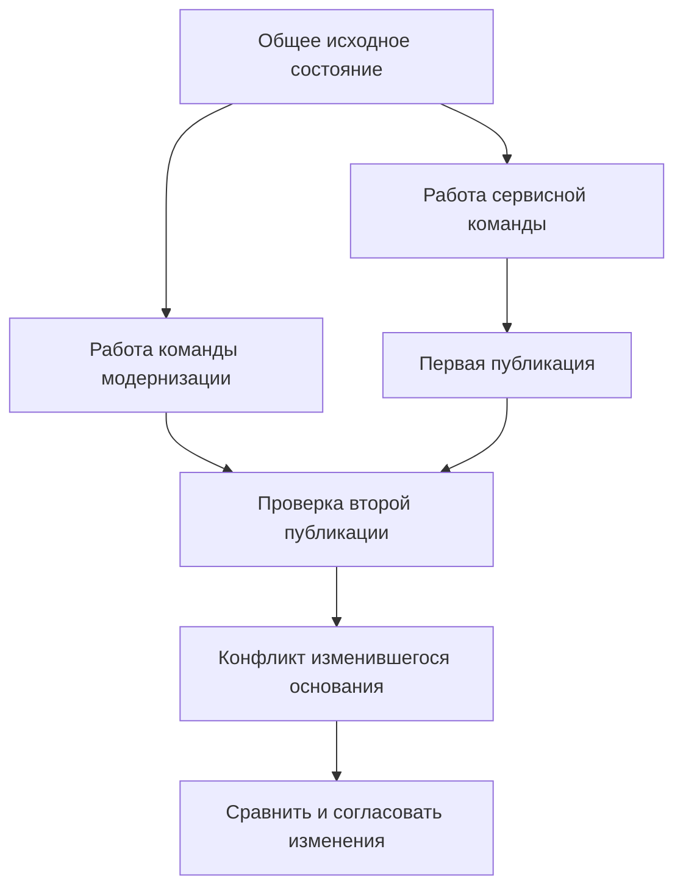

# Рабочие области и параллельная работа

## Зачем рабочая область отделена от пакета изменения

Разработка узла не укладывается в одно действие «открыть — исправить — выпустить». Конструктор сохраняет несколько вариантов, технолог проверяет отдельные детали, испытания задерживают часть изменений, а производству уже нужно небольшое согласованное исправление.

В целевой модели Interlink рабочая область хранит **незавершённую работу и её основания**. Она живёт столько, сколько требуется задаче: несколько часов, недель или циклов автоматической проработки. Выход из приложения не завершает её, а проведение одного готового пакета не закрывает оставшуюся работу.

Это позволяет отделить три решения: начать или продолжить редактирование; выбрать условия совместного просмотра; выпустить определённый результат. Для третьего решения используется [пакет изменения](01-what-is-change-package.md), для второго — [контекст подбора](../version-selection/21-selection-contexts.md).

## Что здесь сохраняется

В рабочей области находятся рабочие копии конкретных инженерных версий, исходное опубликованное содержание, от которого началось редактирование, и сохраняемые предметные правки. Участники могут подготовить несколько версий одного объекта: например, исправлять литой корпус Б и одновременно развивать сварной корпус В.

Рабочая копия относится к одной инженерной версии и содержит её изменяемые поля, списки, связи и состав. В одной рабочей области нет двух независимых действующих копий одной и той же версии: участники либо работают с общей копией, либо создают другую область для независимого решения. Несколько окон общей копии также должны обнаруживать конкурирующие сохранения.

Участие в рабочей области не даёт права на любой помещённый туда объект. Проверяются разрешения на конкретную версию и действие. Отзыв доступа прекращает дальнейшую разрешённую работу, но не стирает уже подготовленные данные.

## Как инженер начинает работу

Сначала инженер выбирает объект, инженерную версию и конкретное исходное содержание. Команда «исправить корпус Б» не должна после конфликта незаметно открыть корпус В только потому, что он стал основной версией.

Затем система проверяет право редактирования, жизненный цикл и выбранный режим взятия на изменение. Созданная рабочая копия получает понятное основание: «начата от состояния Б после нормоконтроля». Прежнее опубликованное содержание остаётся неизменным.

Если требуется новая инженерная версия, это отдельная команда. Её можно начать от исторического прототипа, даже если у него уже есть другие последующие версии. Происхождение должно показывать действительный источник. Ветка разработки не возникает просто из номера, присвоенного последней по времени записи.

## Сохранить, сохранить итерацию и опубликовать — разные действия

| Действие | Что получает пользователь | Что не происходит автоматически |
|---|---|---|
| Сохранить рабочую копию | Незавершённые правки переживают закрытие приложения. | Не создаётся официальное состояние и не увеличивается номер инженерной версии. |
| Сохранить именованную итерацию | Точный промежуточный результат можно открыть и использовать для восстановления. | Не завершается редактирование и не появляется промышленный выпуск. |
| Провести выбранный пакет | Подготовленный результат становится официальным при выполнении проверок. | Не выпускается остальная работа области и не создаётся новая инженерная версия без отдельного решения. |
| Создать новую инженерную версию | Появляется самостоятельная версия с собственным происхождением. | Не переписывается прототип и не отменяются другие ветви. |

Обычная ссылка на продолжающую меняться рабочую копию не сохраняет вчерашнее содержание. Для итерации необходима точная сохранённая копия промежуточного результата. Если под прежним именем итерации записано новое содержание, прежняя запись должна остаться в истории.

## Два допустимых режима параллельности

Предприятие может выбрать исключительное взятие версии на изменение. Тогда второй участник получает объяснение, почему эта версия занята, и разрешённые действия: ждать, запросить передачу либо работать над другой версией. Такое ограничение задаётся процессом предприятия, а не встраивается как запрет любой параллельной работы с объектом.

Другой режим допускает независимые рабочие области для одной инженерной версии. Команды сохраняют свои копии независимо. При проведении система проверяет, осталось ли опубликованное основание тем, на которое рассчитывал план. Если другая команда уже изменила его, поздний результат получает конфликт. Он не перезаписывает первую публикацию и не исчезает.

Смысл схемы — не запретить второй команде сохранять работу, а не позволить ей потерять уже опубликованное исправление. Конфликт должен привести к явному сравнению и решению, а не к автоматической победе последнего записавшего.

Исключительное взятие тоже не отменяет окончательные проверки: разрешённая административная или иная операция могла изменить исходное состояние. Кроме того, два окна одного пользователя могут одновременно сохранить одну рабочую копию. Устаревшее окно должно получить конфликт, а не вернуть прежние значения поверх новых.

## Что видят конструктор, технолог и цех

Автор видит свою рабочую копию в явно выбранном рабочем режиме. Технолог может увидеть её, если ему разрешён такой просмотр и контекст направляет его к этой работе. Обычное опубликованное чтение продолжает получать прежнее официальное содержание.

Готовый заказ или иной точный исторический результат читает сохранённые состояния напрямую. Новые рабочие копии и смена основной версии не подмешиваются в его состав. Разрешение видеть карточку работы также не должно раскрывать файлы или детали из другой закрытой области.

Если два контекста назначают корпус Б, этого ещё недостаточно для признания их совместимыми. Один может требовать Б в прежнем точном состоянии, а другой — редактируемую Б из другой рабочей области. Пользователь должен увидеть расхождение выбранного содержания. Система не вправе скрыть его за совпадением обозначения версии.

## Как контекст пополняется автоматически

Для воспроизведения IPS различаются обычное автоматическое пополнение и назначения от извещения. При включённом обычном режиме взятие на изменение, создание новой инженерной версии и нового объекта в составе обновляют предусмотренные назначения. Простое присоединение уже существующего объекта не объявляется общим поводом такого пополнения. Выключение обычного режима не отключает автоматически независимую синхронизацию извещения.

Контекст хранит причину, по которой версия в нём появилась. Например, чертёж добавлен и вручную для проверки, и из строки извещения. Удаление строки снимает только её основание; ручное назначение остаётся. Если новая строка требует несовместимую версию или другое содержание, нужен объяснимый конфликт, а не молчаливая замена назначения.

Производная часть извещения меняется через исходные строки извещения. Пользователь не должен вручную поправить автоматически выведенное назначение так, чтобы извещение и контекст начали описывать разные результаты. Конкретные события и допустимые реакции проверяются по сценарию соответствующей установки IPS.

## Что происходит после проведения

Публикуются только выбранные и проверенные участники пакета. Остальные рабочие копии продолжают жить. Если пользователь выбрал «завершить изменение, но оставить версию за собой», дальнейшая работа должна начаться от только что опубликованного содержания, а не незаметно продолжиться от старого основания.

Контексты тоже не закрываются автоматически. Если назначение указывало прямо на завершаемую рабочую копию, нужна явная политика: заменить её точным опубликованным результатом, продолжить выбор по инженерной версии допустимым способом либо отказать при несовместимых условиях. Пропажа рабочей копии не является разрешением переключиться на основную версию.

Совместное чтение конструкторской и технологической работы не означает обязательного совместного выпуска. Для действительно неразделимого результата создаётся отдельный общий комплект. Этот выбор должен быть виден пользователю до согласования.

## Отмена, восстановление и передача работы

Отказ от проведения конкретной редакции пакета не равен удалению всех рабочих копий. Отмена выбранной копии существующей версии не удаляет объект, инженерную версию и опубликованную историю.

Новый, ни разу не опубликованный объект иногда можно отменить вместе с единственной начальной работой. Но отсутствие публикации ещё не доказывает безопасность удаления: уже могла появиться другая версия, работа другого участника, итерация или обязательное удержание. Простая отмена должна отказать, а не расширить удаление на всю эту область. Более широкое прекращение работы требует отдельного явного решения о зависимостях и сохранении истории.

Восстановление из итерации сначала показывает, что и в какую рабочую копию возвращается. Можно восстановить разрешённый поднабор, если это объявлено и проверено. Потеря права на одного участника в последний момент не должна молча превратить согласованное восстановление целого в восстановление остатка. При необходимости создаётся страховочная итерация нынешних перезаписываемых данных.

## Пример 1. Исправление без закрытия рабочей области

Конструктор исправляет шероховатость корпуса Б и сохраняет рабочую копию. Технолог просматривает её и подтверждает изменение. Конструктор проводит небольшой пакет с сохранением права редактирования.

Появляется новое опубликованное состояние Б, а продолжаемая копия получает его как основание. Завтра инженер исправляет примечание уже поверх сегодняшнего результата. Старое окно, открытое до проведения, не может сохранить прежние данные без обнаружения конфликта. Выпущенная в прошлом партия остаётся связана с прежним точным чертежом.

## Пример 2. Срочный ремонт и будущая модернизация

Сервисная команда исправляет крепёжное отверстие насоса Б. Команда модернизации в другой рабочей области увеличивает толщину стенки той же Б. Предприятие разрешило независимую подготовку, поэтому обе команды сохраняют результаты.

Сервис выпускает исправление первым. При попытке второго проведения система показывает: основание изменилось, новая публикация могла бы потерять исправленное отверстие. Копия модернизации и её файлы сохраняются. Инженер сравнивает исходное содержание, свои правки и сервисный результат, затем явно объединяет их либо создаёт отдельную инженерную версию. Ни один вариант не выбирается автоматически.

## Пример 3. Северное исполнение и частичный выпуск

Северное исполнение насосной станции развивается от испытанного исторического варианта, хотя более новая версия уже применяется в тёплом климате. Команда создаёт отдельную инженерную версию и сохраняет точное происхождение. В рабочей области готовятся корпус, уплотнения, рама и подогреватель.

Корпус с уплотнениями готовы раньше. Их можно выпустить отдельным пакетом, если комплект самодостаточен и не ссылается на незавершённый подогреватель. Рама и подогреватель остаются в работе. Контекст северного исполнения продолжает существовать, а назначение опубликованных результатов обновляется по выбранной политике. Завершение этого пакета не переключает состав на тёплое исполнение.

## Как сохранить основания для дальнейшего чтения

При публикации можно завершить одну рабочую копию, оставив остальные открытыми. Но назначение контекста, точная итерация и свидетельство согласования имеют собственную историю. Закрытие рабочей области не переписывает их и не уничтожает обязательные файлы по одному признаку «работа закончена».

Историческая редакция контекста показывает, какие назначения были выбраны. Если она указывала на изменяемую копию, этого ещё недостаточно для восстановления прежних значений: нужна сохранённая точная итерация или другой доказательный комплект. Для истории решения агента дополнительно важно, какая часть материалов была действительно выдана ему, а не просто доступна в системе.

## Что нужно проверить с продуктовым специалистом IPS

Важно согласовать не названия кнопок, а наблюдаемые правила: какие версии разрешено редактировать параллельно; где предприятие требует исключительного взятия; какое содержание показывается технологу; когда контекст пополняется автоматически; что остаётся после завершения и отмены.

Приёмочные примеры должны включать две независимые работы одной версии, конфликт двух окон, завершение с сохранением взятия, выпуск поднабора, удаление строки извещения при ручном основании, восстановление только в работу и отказ от небезопасной отмены нового объекта.

## Состояние реализации

Рабочие области, разделение версий и состояний, правила контекстов и конфликты описаны как целевой контракт архитектуры на 6 сентября 2026 года. Сквозная реализация и пользовательские экраны ещё требуют разработки и испытаний. Ранний опыт должен проверить две рабочие области одной версии, конфликт согласованных назначений и восстановление только в работу; эти условия не откладываются до готовности всего интерфейса. Будущие агентские циклы используют эти же границы работы, но не определяют обязательный интерфейс для обычного конструктора.

Связанные страницы: [пакет изменения](README.md), [рабочая видимость](03-working-state-visibility-and-concurrency.md), [контексты](../version-selection/21-selection-contexts.md), [итерации](../version-selection/22-iterations-and-checkpoints.md), [мягкая конкретизация](../version-selection/20-durable-soft-concretion.md), [агенты и прослеживаемость](../agents/01-agents-and-traceability.md).

## Основания

Описание опирается на принятые договоры семантического ядра [IL-KERNEL], процесса изменений [IL-CHANGES], агентского основания [IL-AI] и ранних проверок [IL-PLAN-V2]. Сценарии IPS сопоставляются с [IPS-A04], [IPS-A05] и историческими материалами [IPS-K04]; историческое описание не заменяет проверку конкретной установки. Расшифровка и статус источников — в [реестре](../knowledge/15-source-register.md).
