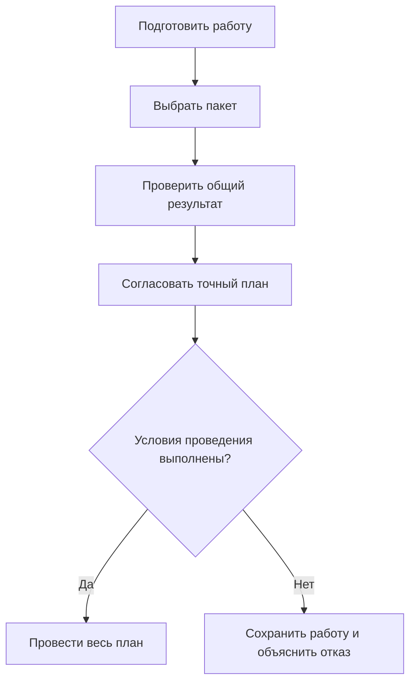

# Пакет изменения в Interlink

## Что это такое

Пакет изменения — выбранный набор правок, который необходимо проверить и принять как одно целое. В него могут входить подготовленное содержание деталей и документов, изменения состава, применяемость, переходы жизненного цикла, решения о заменах и редакции справочных данных.

Пакет отвечает на вопрос **«что провести вместе сейчас?»**. Он не равен всей рабочей области конструктора и не определяет сам по себе, какие версии видны в составе. Для незавершённой работы служит рабочая область; для долговечных назначений версий при просмотре — контекст подбора. Эти механизмы связаны, но имеют разный срок жизни.

Например, команда модернизирует редуктор несколько недель. Сегодня можно выпустить уже проверенные корпус и крышку, оставив датчик температуры в работе, если он не является обязательной зависимостью выпуска. Выбранный пакет проводится полностью либо не проводится. «Выпустить согласованную часть всей работы» допустимо; «пропустить неудавшиеся строки уже согласованного пакета» — нет.

## Что изменилось в новой архитектуре

Ранее пакет описывался как единственный контейнер работы, подбора и фиксации. Такое объединение оказалось слишком жёстким для полного воспроизведения IPS и дальнейшего развития. Актуальный план предусматривает независимые рабочие области, контексты, инженерные версии и точные опубликованные состояния.

Пользователь сможет многократно сохранять рабочую копию без публикации. Разрешённое завершение редактирования создаст новое неизменяемое состояние той же инженерной версии; новый номер версии появится только по отдельному предметному решению. Восстановление итерации в работу также не будет автоматически выпускать восстановленное содержание.

Параллельные работы не запрещаются для всего объекта разом. Предприятие сможет выбрать исключительное взятие версии на изменение либо независимую подготовку с обнаружением конфликта при проведении. Неудавшееся проведение должно сохранить правки и объяснить расхождение.

## Как читать этот комплект

Для первого знакомства достаточно общей картины и двух страниц о подготовке результата:

1. [Что такое пакет изменения и где его границы](01-what-is-change-package.md) — зачем разделены работа, чтение и проведение.
2. [Рабочие области и параллельная работа](10-workspaces-and-parallel-work.md) — как долго живут правки, что видят другие участники, откуда берутся конфликты.
3. [Жизненный цикл изменения](02-user-journey-and-lifecycle.md) — путь от потребности до официального результата.

Дальнейшие страницы раскрывают конкретные решения:

- [Рабочие данные, видимость и параллельность](03-working-state-visibility-and-concurrency.md) — опубликованное, рабочее и точное историческое чтение.
- [Предпросмотр, проверка и согласование](04-preview-validation-and-approval.md) — что именно согласуется и что проверяется повторно.
- [Проведение, отмена и восстановление после ошибок](05-commit-cancel-and-recovery.md) — граница «всё или ничего», конфликты и потеря ответа.
- [Быстрые, формальные и совместные изменения](06-quick-formal-and-bundled-changes.md) — упрощённые действия, извещения, несколько самостоятельных пакетов и общий комплект.
- [Снимки, доказательства и история](07-snapshots-evidence-and-user-history.md) — точный состав, файлы, итерации и основания решений.
- [Сквозные машиностроительные примеры](08-end-to-end-examples.md) — разбор целых пользовательских задач.
- [Состояние, открытые вопросы и приёмка](09-status-open-questions-and-acceptance.md) — что должно быть реализовано и какими примерами это доказать.

## Основной путь пользователя

Сначала пользователь готовит рабочие копии и действия. Затем выбирает, что войдёт в ближайшее проведение. Система показывает совокупный будущий результат, проверяет зависимости и сохраняет точный план для согласования. Упрощённый разрешённый путь может не требовать отдельного ручного согласования, но не пропускает обязательные проверки.

Окончательная операция сверяет план, его исходные основания, действующие полномочия и обязательные запреты. При успехе применяется весь выбранный результат и записывается обязательная история. При конфликте рабочие копии остаются доступны для сравнения и доработки. Проведение не закрывает остальную рабочую область автоматически.

## Согласование не означает «всегда брать самое новое»

Для выпуска важно заранее понимать предмет решения. Можно согласовать только правки, а можно — точную конфигурацию со всеми существенными зависимостями: двигателем, прошивкой, нормами, файлами и выбранными заменами. Это разные по силе утверждения.

Также различаются два способа последующего проведения:

- выпустить именно согласованный точный результат;
- выпустить его только при условии, что перечисленные живые основания всё ещё актуальны.

В первом случае новая основная версия покупного двигателя не заменяет согласованный двигатель и сама по себе не отменяет старое решение. Во втором изменение явно контролируемого назначения вызовет конфликт. В обоих случаях сохраняются нынешние запреты и полномочия: историческое согласование не разрешает сегодня использовать отозванный материал.

## Три прикладных маршрута

### Небольшое исправление чертежа

Конструктор меняет примечание в рабочей копии чертежа «Корпус, версия Б». Несколько сохранений не создают новых официальных состояний. После проверки он завершает редактирование разрешённым способом; новое состояние Б становится доступно обычному опубликованному чтению. Старый производственный комплект продолжает читать прежнее точное содержание.

Для этого маршрута полезны [жизненный цикл](02-user-journey-and-lifecycle.md) и [видимость](03-working-state-visibility-and-concurrency.md). Ключевой вопрос продуктового специалиста: какие изменения на данной стадии допускаются без нового номера версии и когда обязательно извещение?

### Взаимозависимые конструкторские и технологические правки

Корпус получает новые установочные базы, а приспособление — соответствующие опоры. Отделы готовят разные пакеты, но применить только один опасно. Создаётся общий комплект, проверяется совокупный результат и получается решение именно для него.

Если после согласования технолог изменил опору, прежнее согласование общего содержания не подходит. Остальная экспериментальная работа отделов не включается автоматически. Этот маршрут разобран в [видах и комплектах изменений](06-quick-formal-and-bundled-changes.md).

### Замена привода в серийном заказе

Для насосной станции разрешён другой привод, но только с подходящим контроллером и нормой испытания. Инженер выбирает замену в конкретном заказе, подбирает версии и проверяет их фактическое содержание. Согласование связывается с этой комплектацией и точной нормой, а не с одним наименованием альтернативы.

Если два решения одновременно удаляют необходимую позицию либо одно снимает предпосылку другого, общий план получает отказ. Положительная проверка и разрешение изменения не доказывают физическую установку: факт монтажа регистрируется отдельно. Связанные страницы — [допустимые замены](../substitution-and-compatibility/01-allowed-replacements.md), [совместимость](../substitution-and-compatibility/02-compatibility-matrices.md) и [заказы](../orders/README.md).

## Как сюда входят новые возможности

Новые предметные пакеты используют общую механику изменения, не создавая обходных путей.

Табличные нормы подготавливаются как проверяемое содержание. Полная сетка должна действительно покрывать объявленные комбинации осей; неизвестное измерение нельзя выдавать за известное. Изменение таблицы и инженерного объекта может требовать совместного проведения. См. [табличные данные](../tabular-data/README.md), [справочные таблицы](../tabular-data/01-reference-tables.md) и [многомерные таблицы](../tabular-data/02-multidimensional-tables.md).

Мягкая конкретизация остаётся самостоятельным позиционным намерением, с историей активности. Закрытие пакета не стирает её и не превращает в жёсткую фиксацию. См. [мягкую конкретизацию](../version-selection/20-durable-soft-concretion.md).

Долговечные итерации позволяют вернуться к точному прежнему рабочему результату, в том числе выборочно. Возвращение в работу и последующий выпуск разделены. См. [итерации и восстановление](../version-selection/22-iterations-and-checkpoints.md).

Агентские действия используют те же проверки, но дополнительно сохраняют фактического исполнителя, пределы его полномочий и контекст решения. См. [агентов и прослеживаемость](../agents/01-agents-and-traceability.md).

## Четыре независимых подтверждения

Для продукта важно различать ход согласования, факт проведения, точную публикацию и внешнюю передачу. Завершённое задание согласующего ещё не подтверждает, что данные проведены. Проведённые правки не создают снимок автоматически. Сохранённый снимок не доказывает его получение производством, а получение не означает фактическую установку.

Пакет и отдельно разрешённый снимок могут получить одно общее локальное подтверждение. Предметные решения остаются разными: пользователь должен явно заказать оба результата. Обязательная история, подтверждение результата и намерение необходимой передачи сохраняются вместе с соответствующим проведением. Это правило действует и при самостоятельной операции Interlink, и при общей операции принимающего продукта. Внешняя отправка следует после подтверждения, не подменяя его.

Если ответ о фиксации потерян, неизвестно, успела ли она завершиться. Сверяется та же операция с тем же намерением; новая попытка не используется для обхода неизвестности. Более подробно границы объяснены в [проведении и восстановлении](05-commit-cancel-and-recovery.md).

## Чья версия меняется при конкретизации позиции

Подшипник может применяться в нескольких редукторах. Решение закрепить его версию в позиции выходного вала принадлежит составу конкретного родительского узла, а не карточке подшипника вообще. Поэтому пользователь редактирует рабочее содержание родителя и проводит именно это изменение. Появляется новое опубликованное состояние выбранной инженерной версии родителя; новый номер её версии не обязателен. Независимое изменение позиции в уже неизменяемом опубликованном составе не допускается.

## Граница готовности

Комплект описывает **целевое поведение по архитектуре на 6 сентября 2026 года**. Это не инструкция к уже работающему промышленному месту конструктора. Interlink развивает необходимые модель, хранение и проверяемые команды; сквозные рабочие области, публикация, согласования, восстановление и прикладные экраны ещё должны быть реализованы и испытаны вместе.

Ранние проверки фундамента должны подтвердить различия рабочей области, контекста и пакета, сохранение конфликтующей работы, точные основания и безопасный повтор. Табличные данные, комплектные замены и агентский контекст участвуют в таких небольших проверках раньше появления полнофункциональных прикладных модулей.

Alvatune или другой принимающий продукт будет задавать роли, маршруты, задания, формы и внешние передачи. Наличие этих замыслов не означает, что соответствующий интерфейс уже создан. Проверка готовности должна пройти на реальных сценариях IPS и отрицательных примерах — с конкурирующими правками, неподходящими версиями, потерей ответа и частичным отказом внешнего получателя.

Связанные материалы: [версии, изменения и точная история](../knowledge/07-versioning-changes-snapshots.md), [как система будет работать](../knowledge/16-operating-model-and-user-work.md), [подбор версий](../version-selection/README.md), [вопросы об объектах и изменениях](../open-questions/02-objects-versions-and-changes.md).

## Основания

Описание опирается на принятые договоры семантического ядра [IL-KERNEL], процесса изменений [IL-CHANGES], агентского основания [IL-AI] и ранних проверок [IL-PLAN-V2]. Сценарии IPS сопоставляются с [IPS-A04], [IPS-A05] и историческими материалами [IPS-K04]; историческое описание не заменяет проверку конкретной установки. Расшифровка и статус источников — в [реестре](../knowledge/15-source-register.md).
