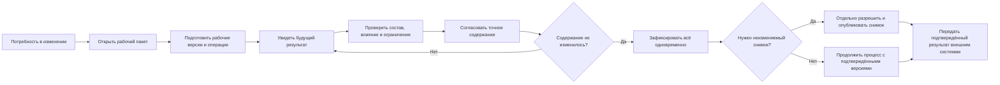

# Пакет изменения в Interlink

## Что это такое в одном абзаце

Пакет изменения — это явная рабочая область, в которой несколько будущих правок инженерных данных подготавливаются, проверяются, согласуются и фиксируются как единый результат. В нём могут одновременно находиться новые версии деталей и документов, изменения состава, применяемость, точные фиксации, справочные связи и управляемые изменения состояния уже выпущенных версий.

Пока пакет открыт, его участники видят будущий результат, а остальные пользователи продолжают видеть официальное состояние, выбранное их явными условиями просмотра. Это может быть назначенная основная версия, точная версия или опубликованный снимок, а не обязательно самое новое поколение. После успешной проверки и согласования пакет либо проводится целиком, либо не изменяет официальные данные вообще.

Пользователь при этом видит не один расплывчатый признак «готово», а три независимые линии. Первая показывает состояние самого пакета в Interlink: открыт, проводится, проведён или отменён. Вторая показывает ход согласования и заданий в принимающем продукте. Третья показывает, доставлен ли уже подтверждённый результат во внешнюю производственную или учётную систему. Пакет может быть проведён, а внешняя передача — всё ещё ожидать подтверждения; это не ошибка предметных данных и не повод проводить пакет повторно.

Это не просто папка, маршрут согласования или номер извещения. Пакет является единой штатной рабочей областью для подготовки предметных изменений в целевой модели Interlink. Для быстрого одиночного действия предусмотрен тот же путь: принимающий продукт сначала проверит полномочия и корпоративную матрицу, затем вызовет разрешённое действие, а будущий механизм Interlink автоматически создаст и завершит служебный пакет для одной правки. Сам факт, что объект выпущен или правка касается состава, ещё не запрещает быстрый путь — решение должна принимать явно настроенная матрица предприятия. Автоматический путь быстрого действия пока не реализован.

Точная фиксация версии относится не к дочерней детали вообще, а к конкретной позиции в конкретной версии родительского состава. Поэтому изменить такую фиксацию можно только через рабочую версию родительского узла: пользователь берёт родителя в пакет, меняет нужную позицию, проверяет весь будущий состав и выпускает следующую версию родителя. Отдельной правки точной фиксации «сбоку» от версии состава не существует.

## Зачем подготовлен отдельный комплект

В IPS потребность распределена между рабочей копией, итерациями, контекстом редактирования, связанными контекстами, мягкой конкретизацией, извещением, журналом изменений и актуализацией. Interlink не копирует эту конструкцию буквально. Он собирает неизменяемый пользовательский результат из меньшего числа явно разделённых механизмов.

Комплект позволяет понять:

- что именно входит в пакет и что остаётся за его пределами;
- как конструктор или технолог начинает и сохраняет работу;
- почему незавершённые данные не видны посторонним;
- как предотвращаются параллельные несовместимые изменения;
- что показывает предпросмотр;
- к какому точному содержанию относится согласование;
- как происходит полная фиксация;
- чем отмена отличается от новой версии;
- когда после изменения нужен неизменяемый снимок;
- что реализовано сейчас, а что является целевой моделью после опытного подтверждения архитектуры.

## Путь чтения

1. [Что такое пакет изменения и где его границы](01-what-is-change-package.md)
2. [Как пользователь проходит жизненный цикл изменения](02-user-journey-and-lifecycle.md)
3. [Рабочие данные, видимость и параллельность](03-working-state-visibility-and-concurrency.md)
4. [Предпросмотр, проверка и согласование](04-preview-validation-and-approval.md)
5. [Фиксация, отмена и восстановление после ошибок](05-commit-cancel-and-recovery.md)
6. [Быстрые, формальные и составные изменения](06-quick-formal-and-bundled-changes.md)
7. [Снимки, доказательства и история пользователя](07-snapshots-evidence-and-user-history.md)
8. [Сквозные машиностроительные примеры](08-end-to-end-examples.md)
9. [Состояние, открытые вопросы и приёмка](09-status-open-questions-and-acceptance.md)

## Главная схема

Если общей операции принимающего продукта нет, Interlink самостоятельно фиксирует пакет и возвращает подтверждённый предметный результат. Принимающий продукт может включить проведение пакета и отдельно разрешённую публикацию снимка в одну общую операцию окончательной фиксации. Это не превращает их в одно предметное решение. При подтверждённом успехе пакет проводится и снимок, если он был отдельно разрешён и подготовлен, публикуется. При подтверждённом откате новые официальные версии не появляются и снимок не публикуется, а при неизвестном исходе повтор блокируется до сверки. Внешняя доставка начинается только после подтверждённой фиксации и имеет собственное состояние.

## Важная граница готовности

Полный механизм пакета изменения, построение будущего состояния из официальных и рабочих данных, точки возврата, комплекты пакетов и проведение по разрешению принимающего продукта являются принятым целевым контрактом после соответствующих этапов опытного подтверждения. Сейчас Interlink развивает предшествующий фундамент: предметную модель, согласованные прикладные представления, а затем проверяемые операции записи и чтения.

Целевые рабочие места, маршруты, задания, согласования, подписи и уведомления создаются в Alvatune или другом принимающем продукте. Их описание в комплекте нужно для проверки будущего пользовательского результата, но не означает наличие готового интерфейса.

## Связанные материалы

- [Версии, изменения и снимки](../knowledge/07-versioning-changes-snapshots.md)
- [Как Interlink будет работать для пользователя](../knowledge/16-operating-model-and-user-work.md)
- [Подбор версий](../version-selection/README.md)
- [Заказы и производство](../orders/README.md)
- [Открытые вопросы об объектах и изменениях](../open-questions/02-objects-versions-and-changes.md)

Основные основания: [IL-VERS-SPEC], [IL-PLM], [IL-QUERY], [IL-HOST], [IPS-A04], [IPS-A05], [IPS-K04]. Расшифровка — в [реестре источников](../knowledge/15-source-register.md).
