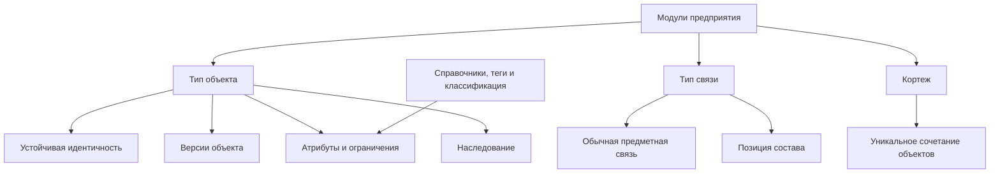

# Предметные возможности системы типов

## Из каких строительных блоков собирается модель

Система типов Interlink рассчитана не только на карточки изделий. Она должна выражать устойчивые объекты, их версии, самостоятельные связи, позиции состава, контекстные сочетания объектов, справочники, расширяемые свойства и будущие факты эксплуатации.

## Объект и версия

Для версионируемого типа Interlink различает:

- устойчивый объект — например, «Редуктор РЦ-250»;
- конкретную версию — например, состояние с новым материалом корпуса;
- рабочую версию, которая ещё изменяется;
- зафиксированную версию, содержание которой больше не переписывается.

Атрибут заранее объявляет область. Обозначение может принадлежать объекту и не повторяться в каждой версии. Масса, материал или наименование исполнения могут принадлежать версии. Это разделение выражено и предметно, и физически.

Неверсионируемые типы тоже поддерживаются: завод, единица измерения, справочная площадка или иной объект, которому не нужна инженерная история версий, хранится проще — в одной таблице.

В будущем предусмотрен третий профиль — историзируемые факты. Он нужен для сведений физического мира с периодом действия: где был установлен насос, кому принадлежал экземпляр, какое состояние действовало на указанную дату. Такой факт не должен порождать инженерную версию изделия и не должен терять историю при перезаписи.

## Наследование типов

Типы могут образовывать одиночную иерархию. Общие признаки задаются один раз, а специализированный тип добавляет свои. Например:

- «Инженерный объект» задаёт номер и представление;
- «Изделие» добавляет массу и материал;
- «Редуктор» добавляет передаточное отношение;
- «Планетарный редуктор» добавляет число сателлитов.

Interlink поддерживает две стратегии физического хранения иерархии. Обычная стратегия сохраняет отдельные таблицы уровней с общим ключом. Для небольшой стабильной иерархии близких типов может использоваться одна таблица с признаком конкретного вида. Выбор является частью модели и проверяемой миграции.

## Связи как самостоятельные предметные факты

Связь имеет собственный тип, таблицу, атрибуты и ограничения концов. Она может соединять устойчивые объекты, точные версии или комбинацию этих уровней.

Для состава используется специальная связь — позиция состава. Она принадлежит версии родителя, но обычно указывает на устойчивый дочерний объект. Точная версия ребёнка выбирается по условиям либо фиксируется отдельно. Это сильное решение IPS сохранено в Interlink.

Каждая связь получает две человекочитаемые формулировки: «редуктор содержит вал» и «вал входит в редуктор». Благодаря этому дерево, обратный поиск, отчёт и объяснение агента говорят предметным языком.

## Атрибуты и ограничения

Поддерживаются основные классы данных:

- строки, числа, даты, логические значения и идентификаторы;
- длинный текст и двоичные ссылки;
- списки допустимых значений;
- ссылки на объект или на точную версию;
- упорядоченные списки значений и ссылок;
- измеряемые величины с единицей и нормализованным значением;
- интервалы дат или чисел;
- локализованные строки;
- вычисляемые значения;
- ссылки из данных на определения типов.

Ограничения обязательности, уникальности, длины, диапазона, допустимого списка и принадлежности ссылки не остаются только подсказкой интерфейсу. Там, где это возможно, они материализуются в правила базы данных и дублируются проверкой командного слоя.

## Кортежи

Кортеж представляет уникальное сочетание нескольких объектов, у которого есть собственные атрибуты. Пример — «деталь × завод»: для одной детали на разных площадках различаются маршрут, код закупки и нормативный запас.

Структурная уникальность гарантирует, что сочетание не будет случайно создано дважды. Это заимствует проверенный производственный образ SAP MARC, не превращая пару в искусственный объект с ручной нумерацией.

## Справочники, теги и классификация

Списки значений имеют стабильные машинные коды, подписи, порядок и активность. Предприятие может дополнять разрешённые списки без изменения закрытой части модели.

Теги предназначены для лёгкой группировки. Они не подменяют атрибуты, состояния или классификацию.

Классификация с наборами характеристик запланирована как композиция дерева классов, единого пула типизированных атрибутов и механизма прикрепления значений. Это позволяет избежать второй параллельной системы свойств.

## Три режима атрибутов

| Режим | Предметный смысл | Физический подход |
|---|---|---|
| Основной | Поле является штатной частью типа | Колонка или специализированная таблица значений |
| Прикрепляемый по необходимости | Поле известно модели, но требуется не каждому экземпляру | Типизированный контейнер расширений |
| Открытый | К экземпляру разрешено прикреплять определения из утверждённого пула | Тот же контейнер с обязательным определением каждого значения |

В открытом режиме не допускаются безымянные пары «ключ–значение». У каждого значения есть определение, тип, домен и авторство.

## Пример 1. Редуктор и его состав

Номер редуктора хранится на устойчивом объекте, материал корпуса — на версии. Позиция «Выходной вал» имеет количество, порядок и при необходимости точную фиксацию версии. База различает все уровни и не позволяет сослаться на версию чужого вала.

## Пример 2. Технологический документ

Инструкция связана с операцией отношением «регламентирует». У связи есть область применения и признак обязательности. Это самостоятельный факт, поэтому его нельзя корректно заменить простым ссылочным полем на карточке операции.

## Пример 3. Параметр насоса по требованию заказчика

Поле «содержание абразива» требуется только для части насосов. Оно прикрепляется по необходимости, но остаётся числовой величиной с единицей и допустимым диапазоном. Ошибочное текстовое значение не принимается.

## Пример 4. Заводские данные детали

Для детали «Корпус насоса» завод А использует собственный маршрут и размер партии, завод Б — другой. Кортеж «деталь × завод» хранит эти различия без копирования самой детали.

## Что это даёт по сравнению с IPS

IPS доказал ценность универсальной предметной модели. Interlink усиливает её тем, что известные типы и ограничения становятся видимыми СУБД, а приложение получает единый согласованный контракт. Это уменьшает число ошибок, которые в универсальной схеме можно обнаружить только в коде или специальной проверкой целостности.

## Критерии приёмки

1. Модель выражает версионируемые и неверсионируемые типы без параллельных ядер.
2. Объектные и версионные атрибуты физически различены.
3. Связь имеет атрибуты, ограничения концов и понятные формулировки.
4. Позиция состава сохраняет семантику «версия родителя → объект ребёнка».
5. Список ссылок и кортеж защищены реальными ограничениями целостности.
6. Расширенное значение невозможно сохранить без определения и проверки типа.

## Состояние реализации

Основная метамодель и большая часть перечисленных определений уже входят в нормативный контракт и компилятор. Историзируемый профиль, классификационные схемы, сигналы и полный конфигуратор зафиксированы как развитие после опытного подтверждения. Физические таблицы и команды записи приходят в следующих фазах.

## Связанные документы

- [DSL как язык модели](03-dsl-product-language.md)
- [Материализация в базе данных](04-physical-database-materialization.md)
- [Цифровые двойники](11-digital-twin-roadmap.md)

Основания: [IL-META], [IL-DB], [IL-ADR ADR-037–043, ADR-047, ADR-050–052], [IPS-A01], [IPS-A03]. Расшифровка — в [реестре источников](../knowledge/15-source-register.md).
