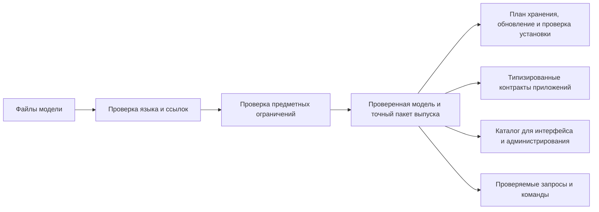

# DSL как язык модели предприятия

## Что такое DSL

DSL — специализированный предметный язык, от английского Domain-Specific Language. В Interlink это текстовое описание типов, атрибутов, отношений и правил работы с данными. Модель может относиться к машиностроению, лаборатории, логистике или иной области. Её задача — не заставить продуктового специалиста программировать, а дать единую, однозначную и проверяемую форму для того, что в обычной настраиваемой системе распределено между конфигуратором, установочными пакетами и прикладной логикой.

DSL задаёт поставляемую модель и границы настройки. Перед использованием она проверяется и собирается в точный пакет выпуска с зависимостями и правилами интерпретации данных. Работающее приложение должно быть допущено именно к установленному выпуску. Сам текст модели, совпадение названий таблиц или запись в каталоге не доказывают, что промышленная база обновлена правильно.

База хранит результат установки и разрешённые локальные изменения предприятия, но не может незаметно переопределить смысл поставляемых типов. Для пользовательского интерфейса подготавливается отдельное согласованное описание: подписи, поля, единицы и доступные действия. Это представление установленной модели, а не второй независимый источник правил.

## Что описывается в языке

Язык охватывает:

- модель, её стабильный идентификатор и версию;
- предметные модули и зависимости между ними;
- типы объектов, наследование и способ изменения: инженерные версии, оперативные записи или добавляемые факты;
- типы связей, допустимые концы, кардинальность и формулировки;
- позиции состава и политику циклов;
- сочетания объектов с собственными признаками, например «деталь на заводе»;
- определения и привязки атрибутов;
- списки допустимых значений;
- вычисляемые представления и правила отображения экземпляра;
- стратегии физического хранения, колонки и индексы;
- уровни владения и разрешённого расширения;
- начальные системные экземпляры;
- именованные запросы и схемы обхода;
- переходы между версиями модели и специальные шаги обработки данных.

Этот перечень объединяет существующее основание и принятые направления развития. Не все конструкции уже исполняются, а для новых способов изменения и табличных форм ещё уточняется поддерживаемое описание. Незнакомая или неподдержанная форма должна быть явно отвергнута, а не молча сохранена без необходимых проверок.

Особенно важно не смешивать старый механизм сочетаний объектов с новыми [табличными данными](../tabular-data/README.md). Сочетание «деталь × завод» уже выражается как объектная структура. Полная сетка «температура × материал», справочник типоразмеров и разреженная карта «среда × проход × исполнение» имеют дополнительные требования к ключам, составу осей, полноте и историческому чтению. Их нельзя считать готовыми лишь потому, что в языке уже есть сочетания объектов.

## Почему язык лучше набора экранов конфигуратора

Экран удобен для ввода, но сам по себе плохо отвечает на вопросы: что изменилось, кто проверил зависимость, как повторить изменение в другой среде и какая версия модели соответствует данным.

Текстовая модель даёт:

- сравнимую историю изменений;
- совместное рецензирование предметного и технического смысла;
- автоматическую проверку ссылок, наследования и ограничений;
- воспроизводимую сборку для нескольких сред;
- точный отпечаток активной модели;
- возможность создать поверх языка удобный визуальный редактор без превращения редактора в второй источник истины.

Будущий административный интерфейс должен формировать проверяемое изменение модели, показывать последствия и только затем запускать управляемую поставку. Экран конфигуратора при этом остаётся полезным способом работы человека. Преимущество даёт не текст сам по себе, а проверяемый и воспроизводимый результат, который не зависит от того, вводили его в редакторе или в форме.

## Стабильные идентификаторы и переименования

Имя типа удобно человеку, но не должно определять его историческую идентичность. Поэтому каждое публичное определение имеет стабильный идентификатор. Если «Покупное изделие» переименовано в «Закупаемый компонент», миграция распознаёт переименование, сохраняет данные и меняет представления. Новый идентификатор означал бы другой тип.

При миграции IPS переносимый идентификатор исходного определения сопоставляется с целевым определением и его владельцем. Таблица соответствия сохраняется как доказательство перехода. Одинаковое имя в двух установках ещё не означает одинаковый смысл: «Давление» может обозначать рабочее, испытательное или предельное давление.

## Модули и сборка продукта

Модель делится на предметные модули. Например:

- основа инженерных объектов;
- конструкторская документация;
- технологическая подготовка;
- заказы;
- требования Alvatune;
- отраслевое расширение предприятия.

Модуль имеет выпуск, зависимости и собственную область имён. Принимающее приложение выбирает точные совместимые выпуски, Interlink проверяет их согласованность и собирает одну модель. Модуль качества не обязан заново создавать понятия детали и документа, если их уже поставляет согласованная основа.

Это позволяет нескольким командам поставлять предметные области независимо, не создавая отдельные объектные ядра или конфликтующие таблицы.

## Пять уровней проверки

Продуктово проверки можно представить так:

1. Текст языка читается однозначно.
2. Все названные типы, атрибуты и модули существуют.
3. Наследование, области атрибутов и концы связей совместимы.
4. Физическое отображение не создаёт коллизий таблиц, колонок и индексов.
5. Модель можно безопасно превратить в требуемые артефакты текущей версии инструментария.

Ошибка раннего уровня закрывает зависимые выводы. Некорректная модель не должна публиковать частично обновлённые результаты.

## Точный смысл важнее одинаковой формы

Две модели могут иметь одинаковые поля, но разные единицы, округление, списки значений или правила чтения. Поэтому одного отпечатка формы недостаточно для доказательства совместимости. Проверяется точный состав выпуска, а при установке — ещё и фактически полученная структура хранения.

Например, в новой модели расход насоса показывается с другой точностью. Новая карточка может использовать новое правило, но сохранённый расчёт заказа должен воспроизводиться по прежнему. В целевом процессе сохраняются необходимые старые определения и средства чтения; они не удаляются только потому, что текущий экран ими больше не пользуется. Срок и состав сохранения определяются назначением исторического результата.

## Начальные данные

Язык может поставлять не только определения, но и системные экземпляры: обязательные стадии, типовые справочники, базовые теги или предметные шаблоны. Они получают одинаковые переносимые идентификаторы во всех установках одной и той же поставки.

Уровень защиты задаёт, может ли предприятие менять такой экземпляр. Обновление сравнивает прежнее значение поставщика, новое значение и локальную правку. Пользовательское изменение сохраняется либо попадает в явный конфликт, но не исчезает молча.

## Пример 1. Новая разновидность редуктора

Продуктовая команда добавляет тип «Планетарный редуктор» как потомок редуктора, определяет передаточное отношение, число сателлитов и допустимые связи. До появления таблиц компилятор проверяет наследование, имена, диапазоны и физическое отображение.

После рецензирования новый тип проходит проверку модели, построение хранения, пробный переход и проверку потребителей. Только успешная установка делает его доступным промышленному приложению. Построение физической схемы уже имеет реализацию; безопасный сквозной выпуск пересмотренной архитектуры ещё требуется завершить.

## Пример 2. Переименование технологической операции

Тип «Операция мехобработки» получает более точное имя «Операция механической обработки». Его смысл и устойчивое определение не меняются. Ответственный явно оформляет переименование; сравнение модели не должно принять его за удаление и создание другой сущности. Технолог продолжает видеть прежние операции под новым названием, а исторический согласованный документ сохраняет необходимое первоначальное представление.

## Пример 3. Отраслевой модуль насосного оборудования

Поставщик PLM выпускает основной модуль изделий, а предприятие — модуль насосных характеристик. Предприятие фиксирует совместимый выпуск основы. Если новая основа меняет смысл ссылки на материал, нельзя просто подключить её к прежнему модулю. Сначала выясняются последствия для карточек, поиска и ранее подготовленных изменений; несовместимость должна обнаружиться до промышленного переключения.

## Пример 4. Справочник материалов предприятия

Поставщик добавляет новый стандартный материал, а предприятие ранее добавило собственную марку и изменило русскую подпись существующей. При повторной поставке новый материал появляется, локальная марка сохраняется, а конфликт подписи показывается ответственному.

## Ограничения

DSL не является языком произвольных программ, сценариев интерфейса или скрытых обработчиков. Он намеренно декларативен. Сложная предметная обработка выполняется типизированными модулями принимающего продукта, а специальное преобразование данных при миграции — проверяемым шагом перехода.

## Критерии приёмки

1. Изменение порядка файлов не меняет смысл модели.
2. Одинаковый полный вход и версия инструментария дают одинаковый результат.
3. Переименование по стабильному идентификатору не теряет данные.
4. Некорректная модель не публикует частичные артефакты.
5. Несовместимая зависимость модулей обнаруживается до развёртывания.
6. Локальные настройки и начальные данные согласуются без молчаливого затирания.

## Состояние реализации

Разбор, связывание, нормализация, модули и часть прикладных представлений реализованы. В текущем коде есть построение физической схемы, её описания и плана миграций. Полный пересмотренный выпуск модели, безопасный установщик, команды и запросы ещё не приняты как единая работающая система. Новые табличные формы, расширения времени работы и полный путь чтения старых данных остаются планируемыми возможностями. Наличие определения в языке не доказывает готовую пользовательскую функцию.

Смысл новых форм, единиц, координат и точных ссылок должен быть проверен до того, как от него начнут зависеть установка и прикладные операции. Это ранняя проверка архитектурной основы, а не обещание готового визуального редактора всех предметных моделей.

## Связанные документы

- [Возможности системы типов](02-type-system-capabilities.md)
- [Расширяемость и настройка](05-extensibility-and-customization.md)
- [Миграция базы IPS](08-ips-database-migration-strategy.md)

## Основания

Актуальные уточнения архитектуры: [IL-STORAGE], [IL-NEUTRAL], [IL-TD], [IL-DATA-MODEL], [IL-PLAN-V2]. При расхождении с ранними описаниями действуют пересмотренные специализированные договоры. Состояние реализации относится к срезу документации от 6 сентября 2026 года.

Исходные предметные и исследовательские основания: [IL-DSL], [IL-ARCH], [IL-MIG], [IL-ADR ADR-001, ADR-033, ADR-048, ADR-053–054], [IL-CODE-COMPILER]. Расшифровка — в [реестре источников](../knowledge/15-source-register.md).
