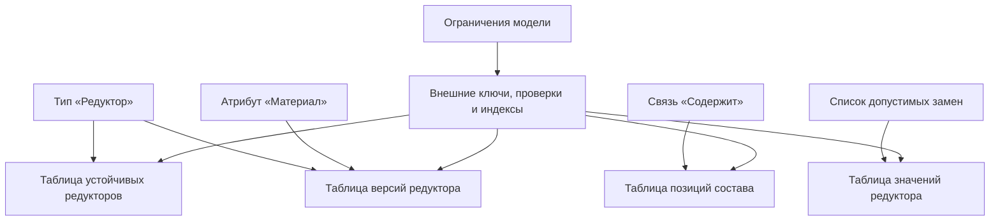
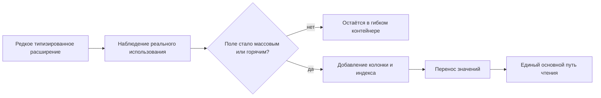

# Как типы материализуются в физическую базу данных

## Что означает «тип становится таблицей»

После проверки модели Interlink создаёт не универсальную таблицу «все объекты», а физическую схему, соответствующую конкретным предметным типам.

- неверсионируемый тип получает собственную таблицу;
- версионируемый тип получает таблицу устойчивых объектов и таблицу их версий;
- тип связи получает собственную таблицу;
- позиция состава получает таблицу с концами, количеством, порядком и точной фиксацией версии;
- многозначный основной атрибут получает таблицу значений своего типа;
- кортеж получает таблицу с уникальным сочетанием слотов;
- часто используемый атрибут становится типизированной колонкой;
- объявленные ограничения превращаются в ключи, проверки и индексы PostgreSQL.

Это и называется материализацией модели: предметные определения приобретают реальную физическую форму, понятную оптимизатору базы данных.

## Физическое разделение объекта и версии

В таблице устойчивых объектов хранятся данные, которые не должны дублироваться по версиям: переносимый идентификатор, номер, дата создания. В таблице версий — изменяемое состояние: наименование, материал, масса, степень готовности и происхождение.

Такое разделение даёт практические преимущества:

- уникальность обозначения выражается обычным правилом базы;
- ссылка на объект не зависит от количества версий;
- ссылка на точную версию физически отличается от плавающей ссылки;
- база не позволяет версии одного объекта быть выданной за версию другого;
- история и текущий выбор не смешиваются в одной строке.

Это устраняет характерную для старого физического среза IPS путаницу, где поле с названием «идентификатор объекта» могло адресовать версию, а устойчивый объект обозначался другим полем.

## Реальные ограничения вместо поздней проверки

Interlink стремится отдавать СУБД всё, что она умеет проверять надёжно:

- обязательность значения;
- уникальность номера;
- принадлежность ссылки допустимому объекту;
- принадлежность точно выбранной версии своему объекту;
- допустимый элемент справочника;
- отсутствие двух текущих версий;
- отсутствие двух рабочих версий одного объекта;
- верхнюю границу кардинальности связи;
- уникальность сочетания кортежа;
- непересечение периодов применяемости или будущих историзируемых фактов.

Командный слой даёт предметную диагностику раньше, а ограничения базы остаются последней линией защиты при конкуренции и сбое.

## Индексы создаются из смысла модели

Каждая предметная ссылка индексируется. Для составов отдельно предусмотрены пути:

- получить детей версии сборки в правильном порядке;
- найти все применения компонента;
- найти конкретную нить позиции;
- выбрать текущую или рабочую версию;
- загрузить полный снимок последовательным диапазонным чтением.

Дополнительные индексы могут быть объявлены в модели. Поэтому индексный набор отражает реальные запросы конкретного типа, а не пытается одной универсальной таблицей обслужить все возможные сценарии.

## Почему это быстрее универсального хранения

Архитектурное преимущество возникает из нескольких факторов:

1. Значение лежит в колонке правильного типа, а не в одной из нескольких универсальных колонок.
2. Для чтения карточки не нужно собирать каждое поле из набора строк «атрибут–значение».
3. Статистика PostgreSQL строится по конкретной предметной колонке.
4. Индекс создаётся для понятного профиля запросов.
5. Внешние ключи упрощают допущения планировщика и защищают соединения.
6. Для горячего типа нет обязательного выбора между универсальным хранилищем и дополнительным срезом.
7. Предсказуемая форма запроса может заранее сравниваться с эталонным планом.

Это даёт Interlink обоснованный потенциал выдерживать более высокую параллельную нагрузку, чем универсальная схема IPS, где признаки разных типов хранятся строками общих таблиц. Однако конкретный выигрыш зависит от модели, объёма и запросов и должен измеряться на сопоставимых данных.

## Как сохраняется гибкость редких полей

Не каждое редкое поле заслуживает немедленной колонки. Для расширяемых типов существует локальный контейнер дополнительных значений. В отличие от безымянного универсального набора «признак — значение», каждое такое значение обязано иметь типизированное определение.

Если поле становится массовым или участвует в критичном поиске, оно переводится в колонку:

Ключевое отличие от IPS: продвижение должно заменить прежний путь, а не создать второй авторитетный путь к тем же данным.

## Пример 1. Поиск редуктора по обозначению

Обозначение находится в колонке таблицы устойчивых редукторов и защищено уникальным индексом. Поиск не соединяет общую таблицу объектов с общей таблицей атрибутов и не фильтрует универсальную строковую колонку по идентификатору атрибута.

## Пример 2. Развёртка состава станка

Позиции состава имеют индекс по версии владельца и порядку, а обратный поиск — по объекту компонента. Рекурсивный обход использует ограниченный набор типизированных таблиц связей. Для опубликованного большого состава может применяться снимок, читаемый последовательным диапазоном без повторной рекурсии.

## Пример 3. Измеряемая масса корпуса

Масса хранится числом вместе с единицей и нормализованным значением. Диапазон проверяется базой. Сортировка и сравнение выполняются над числовой колонкой, а не над универсальным текстовым представлением.

## Пример 4. Редкое поле поставщика

Код покрытия поставщика сначала используется у 2 % деталей и хранится в расширении. После включения в ежедневные отчёты поле переводится в колонку с индексом. Старое значение переносится, а прикладной запрос сохраняет предметный смысл.

## Признанная цена

- количество таблиц и индексов растёт вместе с моделью;
- изменение основной модели требует миграции;
- полиморфный запрос может объединять несколько таблиц;
- неверный выбор индексов всё равно способен создать плохой план;
- большие изменения требуют окна обслуживания и поэтапного переноса данных;
- преимущество над IPS должно подтверждаться испытаниями, а не только схемой.

## Критерии приёмки

1. Каждый конкретный тип имеет однозначное физическое отображение.
2. Основной атрибут читается одним авторитетным путём.
3. Все предметные ссылки имеют физическую целостность, где она выразима.
4. Состав и обратный поиск используют предсказуемые индексы.
5. Перевод расширения в колонку не оставляет параллельный источник значений.
6. Нагрузочные планы сравниваются с эталонными запросами на тех же данных.

## Состояние реализации

Физический контракт PostgreSQL подробно зафиксирован, но миграционный эмиттер и промышленное исполнение схемы относятся к фазе 3. Поэтому преимущества являются обоснованной архитектурной гипотезой до завершения интеграционных и нагрузочных испытаний.

## Связанные документы

- [Расширяемость и настройка](05-extensibility-and-customization.md)
- [Производительность и агенты](06-performance-and-agent-load.md)
- [Отличия от IPS](07-differences-from-ips.md)

Основания: [IL-DB §1–§9], [IL-META §2–§6], [IL-POC §6–§8], [IPS-DB01], [IPS-CRITIQUE]. Расшифровка — в [реестре источников](../knowledge/15-source-register.md).
