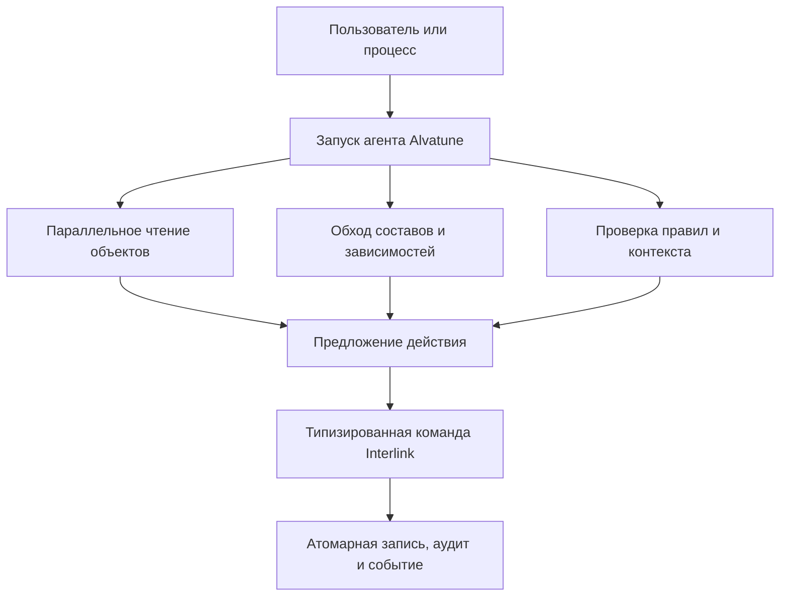

# Производительность, высокая нагрузка и оркестрация агентов

## Почему профиль нагрузки изменится

Обычная PLM-система обслуживает людей, интеграции и фоновые задания. Планируемая Alvatune добавит управляемые агентские процессы, способные резко увеличить машинную активность. Один пользовательский запрос может породить несколько параллельных чтений контекста, сравнение вариантов, проверку ограничений, подготовку предложений и повторную сверку результата. Следующие разделы описывают архитектурные предпосылки и программу испытаний, а не уже подтверждённую промышленную производительность.

Агенты не должны получать обходной путь к данным, но они значительно увеличат:

- число точечных чтений объектов и версий;
- частоту обходов составов и обратного поиска;
- объём повторных запросов одинаковых справочников;
- число проверок модели и полномочий;
- количество коротких конкурирующих попыток изменений;
- поток аудита, событий и корреляционных записей;
- потребность сохранять точные основания значимых решений и действий, включая прочитанные данные и файлы.

Поэтому Interlink проектируется не только для интерактивной карточки, но и для машинной оркестрации с высокой параллельностью.

## Архитектурные источники масштабируемости

### Типизированные таблицы

Горячий запрос работает с колонками конкретных типов, для которых PostgreSQL имеет статистику и специализированные индексы. Это уменьшает зависимость от универсальных соединений «объект–атрибут–тип атрибута».

### Предсказуемые формы запросов

Планируемые запросы используют известные системе типы, свойства, отношения и условия. Предприятие получает повторяемые сценарии, которые можно измерять и сравнивать после обновления модели. Быстрый поиск не должен незаметно менять предметный результат или обходить проверку доступа.

### Индексы из предметного смысла

Средства быстрого поиска предусматриваются для детей состава, обратной применяемости, рабочих областей, опубликованного содержания и снимков. Они распределяются по предметному хранению. Общий реестр объектов обеспечивает адресацию и проверку принадлежности ссылок, но не собирает все характеристики в одну универсальную таблицу. Его стоимость также включается в испытания.

### Потоковое чтение

Большой список или состав не должен целиком загружаться в память только ради просмотра первой части. Планируется ограниченная выдача с продолжением и отдельные способы обработки больших результатов. Однако продолжение обычного живого запроса не обещает единого момента чтения всех порций: для воспроизводимого результата нужен соответствующий точный снимок.

### Материализованные снимки

Повторно используемая большая структура может быть сохранена как последовательный набор записей. Полная загрузка выполняется без повторного рекурсивного расчёта. Деловой снимок остаётся неизменяемым, а техническое ускоряющее представление может перестраиваться и не подменяет доказательный результат.

### Управляемое кэширование

Повторное использование уже вычисленного результата допускается только для совместимой модели, той же области данных, условий запроса и действующих прав. Устаревший результат нельзя объявлять свежим. После восстановления базы или смены установленной модели прежнее совпадение имён таблиц не разрешает продолжать использовать старые результаты. Конкретные способы такого ускорения и их работа в нескольких узлах ещё требуют реализации и проверки.

### Оптимистическая конкурентность

Для короткой записи система сравнивает ожидаемое состояние с фактическим и не затирает чужую правку. Для длительной инженерной работы используются отдельные рабочие области и согласованная публикация. Проверка полного комплекта может обнаружить конфликт даже между изменениями разных строк; тогда повторяется и перепроверяется вся соответствующая операция, а не только её последний шаг.

### Единый путь записи

Человек, системная операция и агент используют одинаково контролируемые предметные действия. Для инженерной публикации, изменения оперативной записи и добавления факта применяются разные уместные способы изменения данных, но никто не получает прямой обход. Обязательная история, квитанция результата и задания внешней доставки должны сохраняться согласованно с самим изменением.

Это имеет значение при сбое связи. Если агент не получил ответ, нельзя считать, что операция не состоялась, и создать вторую такую же выдачу заказа. Сначала сверяется результат исходной операции. Такая защита уменьшает не только риск дублирования, но и бесполезную повторную нагрузку.

## Почему ожидается преимущество над старым физическим срезом IPS

В исследованном историческом физическом срезе IPS значительная часть признаков хранится в общих таблицах значений, а для некоторых типов применяются дополнительные ускоряющие представления. Такой подход даёт широкую настройку, но создаёт цену универсальных поисков и согласования нескольких путей чтения. Это характеристика исследованного среза, а не утверждение обо всех современных установках IPS.

Interlink переносит горячую типовую семантику непосредственно в схему. Поэтому для известных типов ожидаются:

- меньше соединений при чтении карточек и фильтрации;
- точнее статистика распределения значений;
- меньше ветвлений «читать универсальный путь или срез»;
- меньше глобальной конкуренции за одни и те же таблицы и индексы;
- возможность оптимизировать один тип, не перегружая все остальные;
- более предсказуемое поведение при росте числа агентов.

Это архитектурное преимущество, а не готовый сравнительный протокол. Современная установка IPS могла получить иные оптимизации. Превосходство подтверждается только одинаковыми сценариями, объёмами и оборудованием.

## Нагрузочная программа

Принятый план предусматривает:

- 10 тысяч, 100 тысяч и 1 миллион объектов;
- 100 тысяч, 1 миллион и 10 миллионов позиций состава;
- глубину структур 5, 25 и 100 уровней;
- широкие сборки и повторное применение компонентов;
- различную долю точных фиксаций версий и расширений;
- точечное чтение, состав, обратное применение и свёртку количеств;
- сравнение рекурсивного расчёта с материализованным снимком;
- проверку постоянства памяти при потоковом чтении;
- оценку размера индексов;
- сценарий миллиона физических единиц и десяти миллионов исторических фактов для будущего цифрового двойника.

Один из ориентиров испытаний — сравнение типовых структурных запросов с вручную оптимизированным эталоном; зафиксированный в техническом плане порог 1,5 раза является поводом пересмотреть решение, а не обещанной пользователю задержкой и не результатом сравнения с IPS.

Программа должна учитывать новые формы нагрузки: поиск строк справочника, проверку полноты многомерной сетки, разрешение координатной карты и проверку совместимости полного комплекта. Проверка каждой пары компонентов не заменяет более сложного общего ограничения. Измерения должны включать правильный результат, стоимость обязательных проверок, параллельную запись и влияние агентских заданий на время ответа человеку.

## Пример 1. Десять агентов анализируют один станок

В целевом сценарии агенты параллельно проверяют состав, документы, поставщиков и изменения. Принимающая платформа ограничивает объём и приоритет работ, чтобы инженер мог продолжать интерактивную работу. Согласованные неизменные данные можно читать повторно без нового расчёта, но каждый доступ проверяет текущие права. Ни один агент не изменяет объект напрямую; значимое предложение связывается с точным прочитанным основанием.

## Пример 2. Массовая проверка применяемости редукторов

Фоновая операция проверяет сто тысяч применений компонента. Согласованный путь обратного поиска находит затронутые составы, после чего проверка обрабатывает результат ограниченными порциями. Принимающая платформа решает, можно ли продолжить сейчас или отложить работу ради производственного пользователя. На испытании измеряется и память, и правильность учёта изменений между порциями; для официального отчёта выбирается воспроизводимое основание.

## Пример 3. Повторное чтение выпущенной конфигурации

Несколько агентов строят отчёты по одной утверждённой линии. Вместо повторной развёртки графа они читают неизменяемый снимок. Это снижает стоимость одинаковой сложной конфигурации и обеспечивает одинаковый результат.

## Пример 4. Конкурирующие предложения изменения насоса

Два агента предлагают изменить материал корпуса на основании одного опубликованного содержания. Их рабочие предложения могут существовать параллельно. После публикации первого второе нельзя автоматически применить к уже изменившейся основе. Система показывает конфликт или требует повторной подготовки и проверки. Даже если изменялось другое поле, ранее полученное согласование должно относиться именно к тому содержанию, которое будет опубликовано.

## Пример 5. Поток фактов будущего двойника

Миллионы эксплуатационных наблюдений не должны обнулять кэш всех конструкторских типов. Зависимости кэша разделены по типам. При этом высокочастотная телеметрия остаётся во внешнем хранилище рядов; Interlink хранит определения сигналов и конфигурационно значимые факты.

## Границы обещания

- согласованное повторное использование результатов в нескольких узлах ещё требует реализации и проверки;
- секционирование крупнейших таблиц оставлено после опытного этапа;
- массовая пакетная запись для эксплуатационных фактов не реализована;
- PostgreSQL является единственным целевым диалектом текущего этапа;
- результат зависит от качества модели, запросов и индексов;
- сравнение с IPS требует промышленного профиля целевой установки.

## Критерии приёмки

1. Нагрузочный прогон выполняется на заявленных объёмах и публикует планы и память.
2. Типовые запросы сравниваются с вручную оптимизированным эталоном.
3. Параллельная запись не теряет изменения и не возвращает устаревший кэш.
4. Потоковое чтение сохраняет ограниченное потребление памяти.
5. Снимок крупных структур быстрее повторной рекурсии в целевом профиле.
6. Агент не получает отдельный путь записи или обход прав.
7. Сравнение с IPS использует одинаковые данные и явно фиксирует конфигурацию продукта.

## Состояние реализации

Нагрузочные объёмы и критерии зафиксированы в плане. Помимо модели и части прикладных представлений, в текущем коде уже есть строительные блоки физической схемы и планирования миграций. Полноценные команды, запросы, пересмотренное хранение, снимки и агентская платформа ещё не приняты как единый промышленный контур. Утверждение о превосходстве по нагрузке остаётся проверяемой архитектурной гипотезой, а не опубликованным результатом испытаний.

Минимальные нагрузочные и функциональные проверки новых оснований включаются в ранний опытный контур: типизированное хранение, полные сетки, совместимость и безопасные действия агента нельзя целиком отложить до завершения архитектуры. Полный промышленный масштаб и удобства агентской платформы проверяются отдельно.

## Связанные документы

- [Физическая материализация](04-physical-database-materialization.md)
- [Сравнение с IPS](07-differences-from-ips.md)
- [Цифровые двойники](11-digital-twin-roadmap.md)
- [Агенты и прослеживаемость](../agents/01-agents-and-traceability.md)
- [Безопасные действия агента](../agents/02-safe-actions-and-recovery.md)
- [Табличные данные](../tabular-data/README.md)

## Основания

Актуальные уточнения архитектуры: [IL-STORAGE], [IL-AI], [IL-TD], [IL-SC], [IL-PLAN-V2]. При расхождении с ранними описаниями действуют пересмотренные специализированные договоры. Состояние реализации относится к срезу документации от 6 сентября 2026 года.

Исходные предметные и исследовательские основания: [IL-DB §6–§9], [IL-QUERY §8–§13], [IL-POC §6–§8], [IL-HOST §2–§3], [ALV-ADR068], [ALV-ADR070], [ALV-AGENT], [IPS-DB01]. Расшифровка — в [реестре источников](../knowledge/15-source-register.md).
