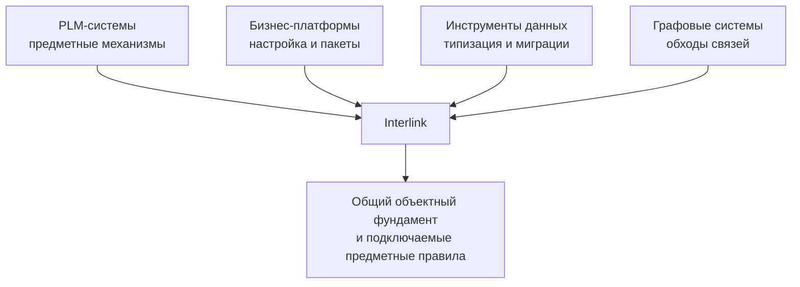

# Сравнение с PLM-, бизнес- и инструментальными платформами

## Как правильно читать сравнение

Interlink не пытается быть шире Teamcenter, гибче Salesforce, зрелее Hibernate или проще Prisma одновременно. Смысл сравнения в другом: у многих ключевых решений есть промышленные прецеденты. Замысел Interlink — соединить проверяемую модель, типизированное хранение, управляемые изменения и точные основания решений. Инженерная семантика становится важным подключаемым слоем, но не обязательной процедурой для любой складской записи или измерения.

## Сравнение с PLM-системами

| Система | Что подтверждает | Что берёт Interlink | Существенное отличие |
|---|---|---|---|
| IPS | Богатую объектно-версионную семантику, составы, применяемость и конфигурацию | Предметные инварианты и пользовательские сценарии | Основная модель превращается в типизированную схему вместо универсальных таблиц значений |
| Aras Innovator | Тип объекта может соответствовать таблице, связь может быть самостоятельной записью | «Тип → таблица», устойчивый объект и версия, слои поставщика и заказчика | Типы не редактируются через обычный объектный интерфейс; модель живёт в репозитории |
| Teamcenter BMIDE | Управляемое моделирование вне эксплуатации и поставку шаблонов | Модульный выпуск модели, типизированные прикладные контракты, схемы обхода | Interlink стремится к более лёгкому встраиваемому ядру и более глубокой общей генерации |
| Windchill | Базовая линия как точный набор версий | Явное сохранение точного комплекта | Историческое чтение Interlink не запускает новый подбор; физическое размещение выбирается отдельно от смысла точности |
| 3DEXPERIENCE | Работа над выпущенными данными в контексте изменения | Управляемый пакет изменения и явный контекст чтения | Один поддерживаемый путь записи для обычных и быстрых изменений |
| Agile PLM | Изменения с наглядным представлением «до/после» | Предпросмотр и осведомлённость о незавершённых изменениях | В Interlink допускаются отдельные рабочие области для одной инженерной версии; публикация выявляет конфликт общего основания |

Interlink сознательно не конкурирует с готовыми приложениями этих платформ: интеграциями САПР, рабочими местами, маршрутами согласования и отраслевыми пакетами. Его цель — более чистое и встраиваемое объектное основание.

## Новые заимствования: не только машиностроение

Centric показывает, насколько много решений принимается ещё до окончательного выпуска конструкции: коллекция, размер, цвет, материал, предложение поставщика и план ассортимента. Для Interlink полезен сам класс задачи — контекстные сочетания и несколько взаимосвязанных представлений одного продукта. Это наш архитектурный вывод, а не утверждение о внутренней базе Centric. У поставщика PLM, планирование, ценообразование и другие направления представлены отдельными продуктами; их наличие не доказывает одну общую транзакцию. Основание: [обзор решений Centric для одежды](https://www.centricsoftware.com/fashion-apparel).

В Teamcenter описано матричное задание и проверка ограничений конфигурации с версиями и применяемостью. Для Interlink отсюда важен пользовательский вывод: матрица должна быть удобным способом работы с правилами, а не их отдельной, противоречащей текстовым условиям копией. Способ физического хранения Interlink выбирает самостоятельно. Основание: [обзор Teamcenter 2406](https://blogs.sw.siemens.com/teamcenter/intro-teamcenter-2406-software/).

В Windchill различаются общие альтернативы детали и замены для конкретного использования; в Aras наличие подходящей замены не означает автоматическую замену состава. Для Interlink это подтверждает необходимость разделить разрешённые предложения, контекстный выбор и применение. Один заказ может выбрать двигатель другого поставщика, а соседний — сохранить исходный. Общий справочник разрешённых замен не должен иметь один «актуальный вариант», принудительно одинаковый для всех заказов. Основания: [замены в Windchill](https://support.ptc.com/help/windchill/r13.1.2.0/en/Windchill_Help_Center/prodstructure/PMPartReplacementsAbout.html), [замены в Aras](https://www.aras.com/community/documentationlibrary/Innovator/35/Content/Innovator%2024%20Docs/Aras%20PE%2014%20-%20User%27s%20Guide/Substitutes.htm).

При заимствовании этих идей покрытие IPS сохраняется. Если конкретная установка IPS использует иные приоритеты, область действия или оформление текущего варианта, они воспроизводятся явными правилами совместимости с этой установкой, а не навязываются всем будущим предметным областям.

## Сравнение с бизнес-платформами

### SAP

SAP подтверждает ценность словаря данных, пространств имён заказчика, версионных изменений и контекстных кортежей вроде «материал × завод». Interlink заимствует отдельное пространство расширений и структурно уникальные кортежи, но стремится к единой системе инженерных атрибутов вместо параллельных характеристик и табличных полей.

### Salesforce

Salesforce показывает масштабируемость управляемых полей и пакетов в огромной многопользовательской платформе. Его универсальные физические слоты и специальные индексы оптимальны для другой задачи. Interlink использует типизированный гибкий контейнер только для локальных расширений, а массовые поля переводит в обычные колонки.

### ServiceNow

ServiceNow показывает ценность изменения словаря в работающей системе и одновременно риск широкого влияния таких изменений. Interlink сохраняет быструю настройку в ограниченном контуре, но запрещает приложению свободно перестраивать закрытую схему.

### Odoo

Odoo даёт зрелые прецеденты модулей, внешних идентификаторов, начальных данных, ссылок и иерархических категорий. Interlink усиливает защиту начальных данных, использует детерминированные идентификаторы и добавляет инженерную версионность.

## Сравнение с инструментами данных

| Система | Полезная практика | Развитие в Interlink |
|---|---|---|
| Prisma | Файл модели → миграции → типизированный клиент | Тот же конвейер дополняется PLM-версиями, связями и структурными запросами |
| Entity Framework Core | Миграции, внедрение зависимостей, подготовленные запросы | Нет отслеживания загруженного графа и скрытого контекста; запись выполняется командами |
| jOOQ | Типизированные описатели полей и явное потоковое чтение | Запросы строятся поверх предметной модели, а не непосредственно поверх готовой схемы |
| sqlc | Предварительная проверка запросов и генерация функций | Исходна объектная модель, а не вручную написанный запрос |
| SQLAlchemy | Композиция проверяемых предикатов | Статическая типизация операндов и PLM-контекст |
| Hibernate | Сессионная память и кэш с инвалидацией по затронутым таблицам | Более полный ключ учитывает модель, типы, настройки, политику и доступ |
| Flyway / Liquibase | Цепочки переходов, контрольные суммы, журнал применения | План строится из смысловой разницы моделей; ручными остаются только особые преобразования |

Interlink не стремится покрыть весь язык запросов jOOQ, все способы объектно-реляционного отображения данных или десятки разновидностей баз данных. Ограниченная поверхность является способом сохранить проверяемый предметный смысл.

## Сравнение с Neo4j

Neo4j естественно выражает обход нескольких типов рёбер. Interlink заимствует идею именованной схемы обхода, но выполняет её в PostgreSQL. Это позволяет хранить инженерный граф рядом с транзакционными данными, версиями и ограничениями, не вводя вторую базу и синхронизацию.

Цена — Interlink не является системой произвольной графовой аналитики. Обходы ограничены объявленными связями, направлением и глубиной. Для PLM это сознательная ставка на предсказуемость.

## Где Interlink предлагает более сильную композицию

### Один источник смысла

Prisma компилирует модель, Aras материализует типы в таблицы, Flyway ведёт миграции, Hibernate умеет инвалидацию, Windchill фиксирует базовые линии. Interlink соединяет эти подходы вокруг одного нормализованного смысла инженерной модели.

### Гибкость с путём взросления

Salesforce и ServiceNow сильны быстрыми расширениями, Teamcenter — управляемой поставкой. Целевая архитектура Interlink должна соединить оба режима: расширение можно будет создать в контролируемом контуре, измерить его использование и затем по решению владельца перевести в строгую модель. Эксплуатационный контур этого пути ещё не реализован.

### Инженерная семантика как часть платформы

Обычный инструмент данных сам по себе не задаёт разницу объекта и инженерной версии, позиции состава и простой ссылки, жёстко выбранной версии и точного содержания, живого расчёта и исторического комплекта. В Interlink эти различия являются явными договорами. При этом нейтральное приложение может работать без инженерного жизненного цикла: общими остаются типы, полномочия, сохранность, конфликты и происхождение.

## Пример 1. Добавление типа гидроцилиндра

Подход Prisma подтверждает, что файл-модель способен породить схему и клиент. Подход Aras подтверждает таблицу на тип. Interlink добавляет версии гидроцилиндра, позиции состава, точные ссылки и миграционную сохранность истории.

## Пример 2. Расширение карточки станка

Как Salesforce, предприятие может добавить локальное поле. Как Teamcenter, зрелая модель поставляется управляемой версией. Interlink связывает эти этапы штатным продвижением расширения в колонку.

## Пример 3. Миллион повторных агентских чтений

Из Hibernate берётся дисциплина кэша и известные риски устаревания. Из jOOQ — явные запросы и потоковое чтение. Interlink добавляет типы, права, контекст подбора и происхождение агентского запуска в ключ корректности.

Например, два агента открывают одинаковую насосную станцию, но один имеет доступ к проекту нового двигателя, а другой — только к выпущенной документации. Повторное использование ранее полученных данных не должно открыть второму чужой рабочий результат. Если требуется доказать решение, сохраняется именно использованное основание, а не только настройка ускоренного чтения.

## Пример 4. Обход структуры линии

Neo4j подтверждает удобство объединения типов связей. Teamcenter подтверждает именованные правила замыкания. Interlink компилирует ограниченную схему обхода в реляционный план и сохраняет версионную семантику каждого ребра.

## Честные границы

- зрелость отдельных аналогов измеряется десятилетиями;
- Interlink не имеет их готовых интерфейсов и экосистем;
- уникальная композиция механизмов ещё требует опытного доказательства;
- поддерживается один диалект PostgreSQL;
- свободная настройка эксплуатационной схемы намеренно ограничена;
- мультитенантность Salesforce-класса не заявлена текущим этапом.

## Критерии продуктовой проверки

1. Каждый ключевой механизм имеет понятный промышленный прецедент.
2. Заимствование не переносит известный отказный режим аналога.
3. Сильная сторона аналога, которой нет в Interlink, названа явно.
4. Композиция проверяется сквозным сценарием, а не ссылкой на отдельный продукт.
5. Сравнение не выдаёт план или контракт за готовую функцию.

## Состояние реализации

Каталог аналогов и прецеденты решений сформированы. Они снижают риск отдельных архитектурных выборов, но не доказывают совместную производительность Interlink. Такое доказательство является задачей опытного вертикального среза.

## Связанные документы

- [Реестр отраслевых оснований](../knowledge/15-source-register.md)
- [Замысел системы типов](01-type-system-vision.md)
- [Статус и риски](13-status-risks-and-acceptance.md)
- [Табличные данные](../tabular-data/README.md) и [матрицы совместимости](../substitution-and-compatibility/02-compatibility-matrices.md)
- [Предметные сценарии за пределами машиностроения](../object-foundation/02-multidomain-scenarios.md)

## Основания и границы источников

Актуальный замысел, договоры и последовательность проверки: [IL-KERNEL], [IL-STORAGE], [IL-FOUNDATION], [IL-NEUTRAL], [IL-AI], [IL-TD], [IL-SC], [IL-DATA-MODEL], [IL-PLAN-V2]. Предметные и исторические основания этой страницы: [IL-PRECEDENTS], [IL-ANALOGS], [IL-ADR], [IL-VISION]. Расшифровка обозначений и пределы свидетельств — в [реестре источников](../knowledge/15-source-register.md).

Описание IPS относится к исследованным материалам и проверяется по конкретной установке. Прежние исследования и решения объясняют происхождение идей, но не заменяют актуальный архитектурный договор и не подтверждают готовность реализации.
