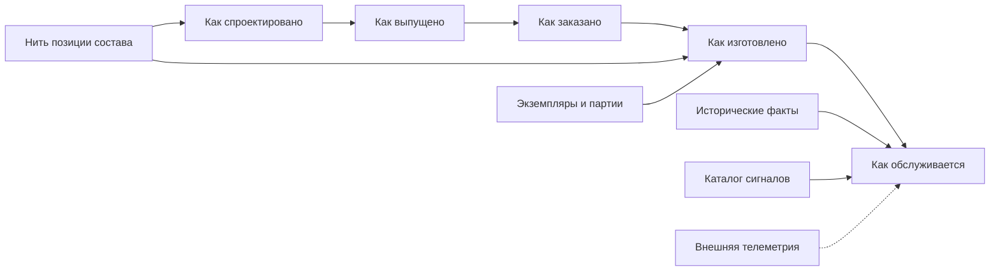

# Развитие в сторону цифровых двойников

## Почему система типов уже создаёт правильный фундамент

Цифровой двойник — это не ещё одна карточка оборудования. Ниже рассматривается промышленный экземплярный двойник; другие отрасли могут подключать свои представления поверх того же объектного фундамента. Для промышленного изделия нужно связать:

- как оно спроектировано;
- какая конфигурация выпущена;
- что было заказано;
- что фактически изготовлено;
- какие экземпляры и партии установлены;
- что менялось при эксплуатации;
- какие сигналы и наблюдения относятся к конкретной единице.

Целевая архитектура Interlink связывает устойчивые объекты, инженерные версии и их точное содержание, позиции состава, физические экземпляры и неизменяемые факты. Поэтому система типов может стать структурным основанием двойника без второго несовместимого объектного ядра. Это направление развития, а не утверждение о готовой сервисной системе.

## Целевой первый вид двойника

Принято направление **экземплярного двойника**: цифровое представление конкретной физической единицы с серийным номером и связью между проектным, изготовленным и обслуживаемым составом.

Полная эксплуатационная платформа с массовой телеметрией остаётся дальнейшим направлением. Но необходимые для неё границы проверяются раньше: физическая единица не равна инженерной версии, факт не равен плану, дата события не равна дате появления сведений. Нельзя отложить эти различия до завершения ядра, а затем надеяться добавить их без переделки истории.

Процессный двойник для управления работой людей и агентов также является возможным развитием. Он сможет опираться на определения процессов, происхождение действий и точные контексты. Само хранение этих данных ещё не создаёт модель прогнозирования процесса или готовую функцию процессного двойника.

## Что уже заложено

### Устойчивая идентичность

Один переносимый идентификатор позволяет связывать данные между PLM, производством, сервисом и внешними платформами.

### Нить позиции состава

Конкретная строка состава относится к определённому содержанию родителя. Историческую строку нельзя удалять лишь потому, что в новом содержании её больше нет. Нить позиции связывает последовательные представления одного места в конструкции и помогает сравнивать выпуски. При этом одно и то же место внутри повторно используемого узла может встречаться в машине несколько раз: для монтажа важно указать конкретное появление в составе, а не только общую нить.

Отдельно существует функциональное место, например «резервный насос контура охлаждения». Сегодня на нём стоит один серийный насос, завтра другой. Это место не является ни серийным номером, ни автоматически той же самой строкой конструкторского состава.

### Точные снимки

Снимок сохраняет не сегодняшнее вычисление, а доказуемую конфигурацию. Он становится основанием для сравнения «как выпущено», «как заказано» и «как изготовлено».

### Происхождение людей и агентов

В целевом контуре для значимой операции сохраняются фактический исполнитель, полномочия, запуск и использованные основания. Агент может действовать самостоятельно в разрешённом цикле либо по поручению человека или другого агента; эти варианты не смешиваются. Для аудируемого двойника это часть доверия к данным, а не только запись имени в журнале.

### Ссылки на определения

Стабильные определения типов и сигналов могут адресоваться из данных и внешних хранилищ одинаково во всех развёртываниях.

## Что предстоит добавить

### Экземпляры, партии и родословная

Нужна исполняемая предметная модель физических единиц, производственных и поставочных партий, установок и снятий компонентов. Её основные различия и связь с заказным контуром уже описаны в плане. Карточка экземпляра может появиться до изготовления, например для планируемых единиц производственного заказа. Наличие карточки и серийного обозначения само по себе не доказывает, что вещь уже изготовлена или установлена: нужны соответствующие факты.

### Историзируемые факты

Факты с временем события и временем регистрации получают отдельные правила хранения: установка, демонтаж, измерение, принадлежность, состояние, наработка. Исправление ошибочного акта создаёт новое связанное утверждение, а не незаметно переписывает исходное. Инженерные версии не должны засоряться эксплуатационными изменениями.

Из фактов строится ответ «какой состав мы считаем действующим». Если акты противоречат друг другу или отсутствуют, ответ должен показывать неопределённость, а не достраивать удобную историю. Пригодность самого агрегата к эксплуатации проверяется отдельно: точный состав ещё не является разрешением на запуск.

### Расширенная форма снимка

Снимок «как изготовлено» должен хранить фактическую цель позиции: конкретный экземпляр, партию, разрешённое отклонение и происхождение.

### Каталог сигналов

Тип сигнала, размерность, единица, диапазон и носитель должны определяться в общей модели. Сами высокочастотные выборки остаются во внешнем хранилище временных рядов.

### Массовая загрузка

Для эксплуатационных данных нужны управляемая пакетная загрузка, защита от повторной доставки и понятный результат частичного отказа внешней системы. Масштабирование обработки и разделение крупнейших таблиц выбираются по измеренной нагрузке; они не становятся обязательной ценой каждой небольшой установки.

## Почему не нужно хранить всю телеметрию в Interlink

PLM-семантика сильна там, где нужны версии, конфигурация, происхождение и точная история. Миллионы измерений в секунду требуют специализированного хранилища рядов. Правильная граница:

- Interlink определяет, какие сигналы существуют и к чему относятся;
- внешняя платформа хранит измерения;
- стабильный идентификатор сигнала, экземпляра или нити связывает два мира;
- конфигурационно значимые события возвращаются как исторические факты.

Так Interlink не превращается в систему диспетчерского управления и сбора данных оборудования, обычно обозначаемую SCADA, а телеметрическая платформа не становится вторым источником истины о конструкции.

## Пример 1. Насосная станция с серийным номером

Экземпляр станции связан с заказным и выпущенным снимком. Для каждого двигателя и уплотнения известен фактически установленный экземпляр или партия. При рекламации можно пройти от серийного номера до версии чертежа и разрешения замены.

## Пример 2. Замена двигателя при обслуживании

Состояние «как изготовлено» сохраняет исходный двигатель. Сервисная бригада регистрирует снятие старого и установку нового, привязывая оба факта к конкретному экземпляру, месту и основанию ремонта. Они не меняют исходный акт изготовления и не создают новую конструкторскую версию станции.

Предположим, ремонт выполнен 3 сентября, а акт поступил 8 сентября. На вопрос «что стояло 5 сентября по нынешним сведениям?» система учитывает поздний акт. На вопрос «что диспетчер знал 5 сентября?» — ещё не учитывает. Если 9 сентября исправили ошибочно указанную партию двигателя, сохраняются первоначальная запись, исправление и причина. Именно это позволяет разбирать решение диспетчера без подмены прошлого сегодняшним знанием.

## Пример 3. Вибрация подшипникового узла

В модели объявлен сигнал вибрации с размерностью, единицей и связью с конкретным узлом и датчиком. Внешнее хранилище получает значения. Агент Alvatune анализирует выбранный интервал и создаёт предложение осмотра. Для доказательства решения сохраняются точное основание конфигурации, применённые пределы, сведения о датчике и пригодная ссылка на удерживаемый набор измерений либо согласованный снимок нужных данных.

Обычная ссылка на «последние измерения» не подходит: завтра интервал сдвинется, калибровка изменится, а датчик заменят. Если нужные внешние данные позднее недоступны по правилам хранения, история должна честно указать ограничение воспроизводимости. Сохранённое описание решения не даёт права объявлять отсутствующие измерения сохранёнными.

## Пример 4. Отзыв партии подшипников

Партия поставщика связана с фактическими экземплярами редукторов. После уведомления поставщика система находит все затронутые машины, их текущие места установки и обслуживающие организации.

## Этапы развития

1. Во время переработки ядра проверить точные ссылки, неизменяемые факты, два времени и адресацию конкретного появления позиции. Эти архитектурные проверки не ждут готового цифрового двойника.
2. На небольшом сквозном примере связать проектное основание, планируемый экземпляр, факт изготовления, установку, поздний акт и исправление. Обязательные сценарии заказа IPS должны сохраниться.
3. Развить предметные модули физических единиц, партий, ремонта и родословной. Не выдавать полный сервисный продукт за обязательную часть самого объектного ядра.
4. Подключить каталог сигналов и согласованный способ удержания внешних оснований решения.
5. Проверить рост объёма фактов, конкурентные операции и восстановление после повторной доставки сведений.
6. Открывать большие телеметрические потоки, прогнозирование ресурса и отраслевые рабочие места отдельными обоснованными этапами.

## Критерии приёмки первого двойника

1. Экземпляр связан с точным проектным и заказным основанием.
2. Конкретное появление позиции адресуется в точном составе; связь последовательных представлений сохраняется нитью позиции, а функциональное место и установленный экземпляр различаются.
3. «Как спроектировано», «как изготовлено» и «как обслуживается» не перезаписывают друг друга.
4. Замена имеет период, причину и автора.
5. Партия поставщика прослеживается до всех экземпляров.
6. Массовые высокочастотные ряды остаются в специализированном хранилище; использованный интервал удерживается там либо сохраняется отдельно как необходимое основание решения.
7. Агентское решение восстанавливается по точному контексту и происхождению.

## Состояние реализации

Направление экземплярного двойника принято; в актуальной архитектуре подробно описаны экземпляры, партии, функциональные места, факты, их исправления и два времени. Ранние проверки этих границ входят в развитие фундамента и покрытие обязательных заказных сценариев. Полные приложения изготовления, сервиса, телеметрии и прогнозирования — следующие предметные этапы, а не уже реализованная функция.

## Связанные документы

- [Развитие к цифровым двойникам](../object-foundation/03-digital-twins-and-domain-extension.md)
- [Экземпляры, партии и фактический состав](../orders/09-units-lots-and-as-built.md)
- [Производительность и агенты](06-performance-and-agent-load.md)
- [Точные основания агентского решения](../agents/01-agents-and-traceability.md)
- [Другие отрасли и нейтральные данные](../object-foundation/02-multidomain-scenarios.md)

## Основания и границы источников

Актуальный замысел, договоры и последовательность проверки: [IL-KERNEL], [IL-STORAGE], [IL-FOUNDATION], [IL-NEUTRAL], [IL-AI], [IL-TD], [IL-SC], [IL-DATA-MODEL], [IL-PLAN-V2]. Предметные и исторические основания этой страницы: [IL-ADR], [IL-META], [IL-HOST], [ALV-ADR068], [ALV-ADR070], [ALV-AGENT]. Расшифровка обозначений и пределы свидетельств — в [реестре источников](../knowledge/15-source-register.md).

Описание IPS относится к исследованным материалам и проверяется по конкретной установке. Прежние исследования и решения объясняют происхождение идей, но не заменяют актуальный архитектурный договор и не подтверждают готовность реализации. Материалы Alvatune используются как основание потребностей будущего продукта, а не как неизменный план его реализации.
