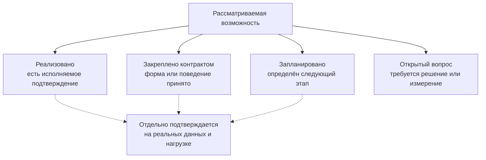

# Состояние, риски и программа подтверждения

## Зачем отделять замысел от готовой функции

Архитектура Interlink уже достаточно подробно описывает будущую систему данных, но разные её части находятся на разных стадиях. Для продуктового решения важно не смешивать четыре уровня:

- **реализовано** — функция присутствует в текущей основной версии и проверяется автоматически;
- **закреплено контрактом** — поведение принято в архитектуре, но весь рабочий путь ещё не завершён;
- **запланировано** — определены направление и этап выполнения;
- **открытый вопрос** — решение требует опыта, измерений или продуктового выбора.

Такое разделение делает «продающее» описание сильнее, а не слабее: специалист видит не обещание без основания, а ясный путь от уже работающего ядра к промышленной эксплуатации.

Стрелки от возможности к четырём категориям показывают выбор её **текущего статуса**, а не обязательную лестницу зрелости. Реализованное не «переходит назад» в контракт или план. Подтверждение на реальных данных является дополнительным свидетельством и может требоваться как для уже реализованного механизма, так и для принятого целевого решения.

## Карта зрелости

| Возможность | Текущее состояние | Что ещё требуется |
|---|---|---|
| Чтение и проверка языка описания модели | Реализовано в основном коде | Расширять проверки по мере появления новых конструкций |
| Объединение модулей и расчёт неизменяемого отпечатка модели | Реализовано в основном коде | Подтвердить на полном промышленном пакете |
| Формирование типизированных прикладных представлений модели | Этапы 1–7, включая представления связей и преобразование строк результата в типизированные записи, находятся в основной версии `3df67f5` | Этап 8 командного запуска и эталонного примера находится в локальной работе; этап 9 приёмки не начат |
| Формирование реальных таблиц основных типов и связей | Архитектура подробно определена, исполнитель ещё не реализован | Генератор физической схемы, проверка на PostgreSQL и эталонные примеры |
| Формирование ограничений и основных индексов | Спроектировано как производная от модели | Реализация физической схемы и нагрузочные измерения |
| Применение изменений к действующей базе | Закреплено контрактом, относится к следующему этапу | Исполнитель миграций, журнал, откат и восстановление |
| Команды создания и изменения предметных объектов | Запланировано | Единый путь проверок, прав и аудита |
| Управляемая настройка предприятия | Архитектурный контракт принят | Каталог установленных настроек и трёхстороннее обновление |
| Типизированные расширения времени выполнения | Архитектурный контракт принят | Хранение, проверка, поиск и перевод востребованных признаков в штатные поля |
| Перенос метаданных и данных IPS | Стратегия описана | Средства извлечения, черновик модели, пробные прогоны и сверка |
| Работа под высокой нагрузкой агентов | Архитектурные средства предусмотрены | Нагрузочный стенд, профили запросов и подтверждение пределов |
| Экземплярный цифровой двойник | Направление принято, ключевые понятия определены | Физические единицы, партии, фактический состав и интеграция сигналов |

Важно различать два созвучных результата. Реализованный компонент преобразует уже полученную строку результата в типизированную прикладную запись. Он **не создаёт таблицы PostgreSQL**. Генератор физической схемы, исполнитель миграций, путь записи предметных объектов и исполнитель запросов — отдельные следующие этапы.

## Какие утверждения уже обоснованы

### Можно утверждать сейчас

- Interlink строит систему вокруг предметных типов PLM, а не вокруг единого универсального хранилища признаков.
- Типы модели предназначены для материализации в реальные таблицы PostgreSQL с подходящими ограничениями и индексами.
- Изменение модели рассматривается как управляемая миграция, а не как скрытая правка метаданных.
- Архитектура предусматривает разные скорости развития: выпускаемую модель, настройку предприятия и типизированное оперативное расширение.
- Пользователи, интеграции и агенты должны использовать общие предметные правила чтения и изменения; корпоративные права, задания и согласования применяет принимающий продукт.
- Для цифрового двойника выбрано развитие от проектной модели к физическим единицам, партиям и историзируемым фактам.

### Точная граница текущей поставки

- В основной версии собраны и автоматически проверяются язык модели, его проверенное смысловое описание, нормализация, отпечаток, модули и этапы 1–7 формирования прикладных представлений.
- Командный запуск формирования файлов и обновлённый эталонный пример относятся к этапу 8 и пока находятся в локальной работе.
- Общая приёмка этапа 9 ещё не начата.
- Анализ промышленной базы, подсчёт затронутых записей, построение физического плана PostgreSQL, применение миграции, запись предметных данных и выполнение структурных запросов не входят в уже готовое ядро.

### Можно утверждать как ожидаемое преимущество

Предметные таблицы, точные индексы и предсказуемые запросы устраняют ряд известных издержек универсального хранения IPS. Поэтому архитектура Interlink рассчитана на более устойчивую работу под интенсивными чтениями, обходами состава и параллельными действиями агентов. Это сильное техническое основание ожидать более высокую нагрузочную способность.

До завершения измерений нельзя обещать конкретное число одновременных агентов, фиксированное превосходство во всех запросах или гарантированное ускорение любой базы IPS. Итог зависит от объёма состава, распределения признаков, оборудования, настроек PostgreSQL, характера прав доступа и профиля операций.

### Что пока нельзя объявлять готовым

- автоматический перенос произвольной базы IPS без обследования;
- непрерывное изменение структуры промышленной базы без предусмотренного окна обслуживания;
- готовый цифровой двойник полного жизненного цикла;
- доказанная производительность на всех целевых масштабах;
- автоматическое обновление любых пользовательских настроек без конфликта.

## Главные риски и способы управления

| Риск | Как проявится | Как снижается |
|---|---|---|
| Предметная модель слишком рано закрепила неверные границы типов | Частые тяжёлые изменения таблиц | Опытный срез, анализ реальных данных IPS, устойчивые идентификаторы и дисциплина изменений |
| Гибкость вернётся к бесконтрольному универсальному контейнеру | Сложный поиск и непредсказуемое качество данных | Расширения ограничиваются конкретным типом, проверяются и переводятся в штатные поля при росте востребованности |
| При переносе потеряется скрытая семантика IPS | Формально полные, но неверно интерпретированные данные | Инвентаризация форм, обработчиков и практик; участие продуктовых специалистов; контрольные машиностроительные сценарии |
| Две системы одновременно меняют один набор данных | Расхождение редакций и составов | Один источник записи на каждом этапе, фиксированное окно переключения и повторяемый план возврата |
| Агенты обойдут проверки ради скорости | Массовое распространение ошибки | Единая командная граница, контекст действующего лица, связь операций и неизменяемый аудит |
| Массовые обходы состава перегрузят базу | Рост времени ответа и памяти | Индексы по направлениям связи, потоковая выдача, снимки, кэширование и измерения на целевых объёмах |
| Цифровой двойник превратит PLM в хранилище телеметрии | Неконтролируемый рост и конкуренция нагрузок | Сигналы и инженерный контекст в Interlink, высокочастотные ряды во внешнем специализированном хранилище |

## Программа нагрузочного подтверждения

### Масштабы испытаний

План предусматривает несколько ступеней данных, чтобы результат не зависел от маленького демонстрационного набора:

- десятки тысяч, сотни тысяч и миллионы предметных объектов;
- сотни тысяч, миллионы и до десяти миллионов позиций состава;
- неглубокие и глубокие структуры, включая глубину до ста уровней;
- миллион физических единиц и до десяти миллионов историзируемых фактов для будущего экземплярного двойника.

### Какие операции измеряются

- открытие карточки и получение текущей редакции;
- выбор редакций по состоянию, дате и закреплённому выбору;
- раскрытие состава на несколько уровней;
- обратная применяемость;
- массовая проверка ограничений агентами;
- запись параллельных изменений с контролем конфликтов;
- чтение снимка заказа или контекста агента;
- восстановление фактического состава на дату.

Для каждой операции фиксируются обычное и замедленное время ответа, потребление памяти, план выполнения, число затронутых строк и поведение при росте параллельности. Сформированные системой структурные запросы должны быть сопоставимы с тщательно подготовленными вручную запросами; в плане опытного подтверждения заложен ориентир — не хуже чем в полтора раза для выбранных структурных сценариев. Отдельно те же предметные сценарии выполняются на согласованной установке IPS или на сохранённой эталонной выгрузке её измерений с одинаковыми объёмами и инфраструктурными оговорками; без такой базы сравнения нельзя количественно заявлять преимущество над IPS.

## Программа подтверждения переноса IPS

Успешность переноса определяется не только совпадением числа строк. Приёмка включает:

1. Полноту типов, редакций, связей, значений и справочников.
2. Сохранение устойчивого соответствия исходной и новой сущности.
3. Совпадение контрольных составов и обратной применяемости.
4. Воспроизводимость выпущенной конфигурации на выбранную дату.
5. Проверку дополнительных признаков предприятия.
6. Отдельный разбор каждой записи в карантине.
7. Повторный пробный перенос с тем же результатом.
8. Проверенный возврат к исходной системе до окончательного переключения.

## Продуктовые вопросы, которые ещё нужно закрыть

### Границы первой промышленной версии

Нужно определить обязательный набор типов и операций для первого предприятия: какие виды изделий, документов, связей, справочников и состояний жизненного цикла входят в поставку, а какие остаются расширением.

### Допустимое окно изменения базы

Некоторые изменения больших таблиц нельзя безопасно выполнить мгновенно. Нужен согласованный продуктовый режим: плановое окно, поэтапное заполнение, временная совместимость версий приложения и правила возврата.

### Политика расширений предприятия

Следует закрепить, кто может создавать дополнительный признак, кто подтверждает его перевод в штатную модель, какие признаки разрешено искать и индексировать и как разрешаются конфликты при обновлении пакета.

### Профиль агентской нагрузки

Для честного измерения нужен прогноз Alvatune: число активных агентов, частота чтений и изменений, типичная глубина состава, размер контекстного снимка и доля параллельных операций над одним объектом.

### Граница цифрового двойника

Нужно уточнить первую коммерчески полезную цепочку: изготовление по заказу, гарантийное обслуживание, управление заменами, прослеживаемость партий или диагностика. Архитектура поддерживает общее направление, но первая поставка должна иметь ограниченный и измеримый результат.

## Условия перехода к промышленному обещанию

Interlink можно позиционировать как подтверждённую высоконагруженную основу после того, как одновременно выполнены следующие условия:

- полный вертикальный срез работает на реальной PostgreSQL;
- структура сформирована из предметной модели без ручного исправления;
- миграция вперёд и проверенный возврат проходят повторяемо;
- контрольный набор IPS перенесён с доказанным сохранением смысла;
- целевые сценарии состава и применяемости выдерживают согласованный объём;
- агентская нагрузка не обходит проверки и аудит;
- результаты измерений опубликованы вместе с конфигурацией стенда и ограничениями.

До этого момента корректная формулировка такова: **Interlink архитектурно рассчитан на нагрузку выше характерной для универсального хранения IPS и устраняет конкретные причины его усложнения; величина преимущества подтверждается опытными измерениями.**

## Связанные документы

- [Физическая структура базы](04-physical-database-materialization.md)
- [Производительность и агентская нагрузка](06-performance-and-agent-load.md)
- [Выполнение и доказательство переноса](09-migration-execution-and-proof.md)
- [Сквозные машиностроительные примеры](12-engineering-examples.md)

Основания: [IL-POC], [IL-ADR], [IL-DB], [IL-MIG], [IL-HOST], [IL-DT-OPPORTUNITY], [IL-DT-CONCLUSION], [ALV-ADR068], [ALV-AGENT], [IPS-CRITIQUE]. Расшифровка — в [реестре источников](../knowledge/15-source-register.md).
