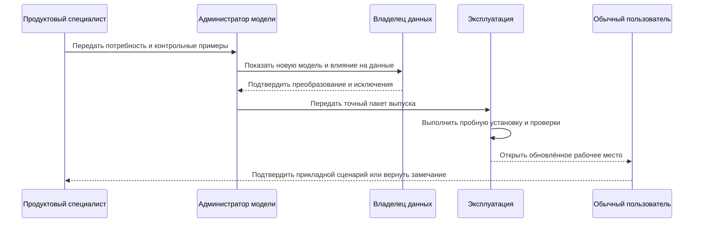
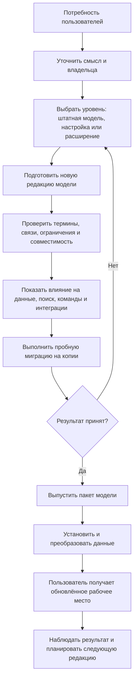

# Как изменяется модель предприятия

## Главное для продуктового специалиста

Обычный конструктор, технолог или планировщик не работает с предметным языком модели напрямую. Он формулирует потребность: добавить характеристику, новый тип документа, связь, справочник или правило. Подготовкой модели занимаются назначенные специалисты, а пользователь получает уже проверенную карточку, поиск, команды и ограничения.

Изменение модели — это управляемая поставка продукта внутри предприятия, а не редактирование таблицы администратором «на ходу».

Ниже описан **целевой промышленный процесс**. Уже реализованы чтение и проверка модели, формирование производных прикладных представлений, смысловое сравнение редакций, исходное планирование миграций и каталог определений. Создание предметных таблиц находится в отдельно проверяемой локальной работе. Полный установщик, обследование действующей базы перед переходом, промышленное переключение и административное рабочее место ещё не готовы. Наличие плана изменений не означает, что он уже безопасно исполняется на предприятии.

Модель описывает не только инженерные данные. Для конструкции редуктора нужны инженерные версии и неизменяемые опубликованные состояния; для текущего назначения погрузчика на рейс может быть достаточно управляемой оперативной записи; для взвешивания груза нужен новый неизменяемый факт. Пересмотр модели определяет эти правила, а ежедневная работа создаёт и меняет данные в уже установленной форме. Сохранение черновика конструкции, выпуск её состояния и установка новой модели — три разных действия.

## Участники и ответственность

### Продуктовый специалист предметной области

Описывает деловую потребность, термин, примеры, обязательность, правила заполнения и ожидаемые пользовательские сценарии. Он отвечает за смысл, но не обязан знать устройство базы.

### Архитектор предметной модели

Определяет, является ли потребность новым типом, признаком, связью, справочником, состоянием или расширением. Проверяет повторное использование и не создаёт второй термин для уже существующего смысла.

### Администратор модели предприятия

Готовит изменение на предметном языке описания модели, собирает модули и управляет локальными настройками. Он видит техническую диагностику, но работает в рамках разрешённых конструкций.

### Владелец данных и миграции

Определяет, как заполнить новый обязательный признак для существующих записей, как сопоставить старые значения и что делать с неоднозначностями.

### Эксплуатационный специалист

Проводит пробную установку, измеряет время, блокировки и нагрузку, готовит переключение, наблюдение и восстановление.

### Разработчик принимающего приложения

Использует опубликованную модель и типизированные контракты для карточек, процессов и интеграций. Не должен обходить модель прямой записью.

Именно принимающее приложение организует рабочие места, задачи, полномочия, маршруты согласования и решения о выпуске. Interlink предоставляет проверяемую модель и обязательные границы её применения, но не подменяет корпоративную систему управления доступом и согласованиями.

### Обычный пользователь

Проверяет, что новая возможность понятна в реальной работе: поле находится в правильной группе, поиск его использует, ошибка объяснима, старые объекты открываются корректно.

## Полный путь от потребности до рабочего места

Схема показывает целевой путь. Сквозной выпуск, миграция, установка и обновление рабочего места ещё не реализованы. Уже работающий компилятор модели является основанием этого пути, но не заменяет его.

## Шаг 1. Формулировка потребности

Хорошее требование отвечает не только «какое поле добавить», но и:

- кто его заполняет;
- для каких объектов;
- является ли значение общим для объекта, относится ли оно к инженерной версии или к её содержанию, к текущей оперативной записи либо к отдельному факту;
- обязательно ли оно;
- кто имеет право менять;
- участвует ли оно в поиске, составе, подборе версий, отчёте или интеграции;
- что происходит со старыми данными;
- какие реальные примеры и исключения существуют.

### Пример

Фраза «добавить климатическое исполнение» недостаточна. Для электродвигателя оно может относиться к конкретной версии, влиять на допустимость аналога и комплектацию заказа. Для типоразмера корпуса это может быть общее классификационное свойство. Эти варианты требуют разной модели.

## Шаг 2. Выбор уровня расширения

### Штатная закрытая модель

Используется для фундаментальных понятий, от которых зависят гарантии системы: устойчивый объект, типизированная связь и договор изменения данных. При подключении инженерного модуля к ним добавляются версия, её опубликованное состояние, пакет изменения и снимок. Предприятие не может произвольно переопределить смысл подключённого механизма, но нейтральной модели перевозок не требуется подключать весь инженерный набор.

Ускоряющая проекция — отдельный результат: её можно пересоздавать, но она не получает доказательную силу неизменяемого комплекта только из-за слова «снимок». Для ранее переданного заказа сохраняются именно точное содержание передачи и необходимые основания, а не только средство ускорить сегодняшний расчёт.

### Настраиваемая часть

Предназначена для разрешённых списков, степеней готовности, наименований, профилей правил и других параметров в заранее установленной семантической рамке.

### Расширение предприятия

Используется для локального признака или дополнительного предметного типа, который не должен сразу становиться частью общего продукта. Расширение имеет владельца, область и ограничения.

### Новый штатный модуль

Если локальная потребность повторяется, влияет на несколько контуров и получила устойчивую семантику, её можно перевести в версионируемый модуль общей модели. Это отдельное решение, а не автоматическое повышение любого поля заказчика.

## Шаг 3. Подготовка редакции модели

Администратор модели описывает типы, свойства, связи, единицы измерения, ограничения, индексы и начальные справочники на предметном языке DSL — языке описания модели предприятия.

Стабильные внутренние идентификаторы позволяют переименовать пользовательский термин без потери истории. Видимое название может измениться с «Марка материала» на «Обозначение материала», а данные и интеграции продолжают ссылаться на тот же смысл.

Редакция состоит из модулей. Например, общая инженерная основа, модуль технологии, модуль насосного оборудования и локальное расширение предприятия собираются как один согласованный продукт.

## Шаг 4. Проверка модели и будущая проверка базы данных

Уже реализованный компилятор проверяет само описание модели ещё до установки:

- нет ли дублирующихся или конфликтующих идентификаторов;
- существуют ли все ссылочные типы и свойства;
- допустимы ли наследование и связи;
- согласованы ли единицы и диапазоны;
- совместимы ли модули;
- однозначно ли описаны поддерживаемые языком переходы и переименования.

Проверка описания не равна обследованию промышленной базы. Уже существующее сравнение редакций может определить, что свойство добавлено, удалено или изменило ограничение, и подготовить исходный план перехода. Оно не доказывает, что все действующие записи подходят под новое правило. Будущий полный анализ установки должен отдельно сообщить, например: «свойство становится обязательным, но для 18 420 существующих деталей нет значения», и показать согласованный способ обработки таких записей.

## Шаг 5. Анализ влияния

**Целевой механизм.** До выпуска должны показываться последствия по нескольким слоям. Сейчас полного автоматического анализа действующей базы, рабочих мест и интеграций нет.

### Данные

Какие записи требуют заполнения, преобразования или разбора исключений? Какие значения не укладываются в новый список или диапазон?

### Хранение и производительность

Какие реальные таблицы, столбцы, ограничения и индексы будут созданы или изменены? Насколько вырастет объём и время установки?

### Пользовательские рабочие места

Какие карточки, формы поиска, деревья, отчёты и объяснения должны отобразить новый признак? Что произойдёт со старым сохранённым фильтром?

### Команды и интеграции

Какие операции должны передавать новое значение? Какие внешние контракты требуют новой редакции и периода совместимости?

### Правила и агенты

Участвует ли признак в подборе версий, применяемости или решениях агента? Получит ли агент точное описание поля, единицы и допустимых значений?

## Шаг 6. Пробная миграция

**Целевой механизм.** Для приёмки полного контура установки новая модель должна устанавливаться на контролируемую копию реальных данных. Процесс будет измерять:

- сколько объектов преобразовано;
- какие записи не сопоставлены;
- какие ограничения нарушены;
- сколько времени занимают преобразование и индексация;
- какие блокировки возникают;
- работают ли ключевые карточки, поиски, составы и интеграции;
- совпадает ли результат с ожидаемыми примерами IPS.

Неоднозначные случаи образуют управляемый перечень очистки с владельцами. Они не подменяются случайным значением ради красивой статистики завершения.

В целевом миграционном контуре неоднозначный случай отделяется от данных, готовых к продвижению. Сохраняются исходная запись и её происхождение, причина карантина, предложенное исправление, решение уполномоченного владельца и результат повторной проверки. Если авторитетный источник остаётся внешним, принимающий продукт отдельно решает, требуется ли обратное исправление в нём, и контролирует подтверждение. Простая передача списка владельцу справочника ещё не означает завершённую миграцию.

## Шаг 7. Рецензирование и решение о выпуске

**Целевой процесс принимающего продукта.** Решение должно приниматься по полному пакету:

- текст потребности;
- новая редакция модели;
- анализ влияния;
- план преобразования;
- результаты пробной миграции;
- пользовательские примеры;
- нагрузочные измерения;
- план установки и восстановления;
- список известных ограничений.

Изменение после рецензирования требует повторной проверки затронутых частей. Выпуск модели должен ссылаться на точное содержание, как и предметное изменение.

## Шаг 8. Установка

**Целевой механизм.** Эксплуатационный контур должен:

1. Получить точный проверенный пакет выпуска, а не заново собирать модель из случайно оказавшихся на сервере исходных файлов.
2. Сверить пакет с исходной установленной редакцией, фактическим состоянием хранилища и совместимым приложением.
3. Подготовить восстановление, остановить допуск новых операций и дождаться завершения уже начатых. Затем повторить значимые проверки: ранний результат мог устареть.
4. Применить принятый план преобразования и проверить существующие данные, ограничения и читаемость удерживаемой истории.
5. Зафиксировать подтверждённый факт успешной установки и только затем сделать эту редакцию действующей.
6. Допустить совместимые приложения. Старая открытая сессия не должна незаметно продолжить запись по прежним правилам.

Первый промышленный профиль планируется с управляемой остановкой работы на время перехода. Обновления без простоя остаются отдельным будущим направлением: даже добавление поля нельзя заранее объявлять безопасным для любых приложений и любых объёмов. Сложное разделение типа, удаление столбца или массовое заполнение требует отдельного окна и репетиции.

В истории различаются попытка установки, подтверждённая успешная установка и редакция, активная сейчас. Неудачная попытка не изображается установленным выпуском; прежняя успешная установка остаётся историческим фактом после перехода на следующую.

## Шаг 9. Что получает обычный пользователь

После будущего полного выпуска пользователь должен видеть не язык модели и не таблицу базы, а предметный результат:

- новое поле в понятной группе карточки;
- единицу измерения и допустимые значения;
- поиск и фильтр;
- новое правило обязательности;
- понятную ошибку при неверном вводе;
- использование признака в составе, отчёте или интеграции;
- историю изменения значения в правильном носителе: рабочем содержании, опубликованном состоянии, оперативной записи либо отдельном факте.

Если принимающее приложение ещё не поддерживает новый признак, выпуск модели нельзя объявлять полностью завершённым для пользователя. Модель и интерфейс могут поставляться раздельно технически, но продуктовый план должен показывать обе части.

## Как работает локальный признак предприятия

### Пример. Код внутреннего покрытия

Одному заводу нужен признак «код внутреннего покрытия» для корпусов насосов. Он не является общим свойством всех изделий Interlink.

1. Продуктовый специалист определяет справочник покрытий, обязательность и связь с технологией.
2. Архитектор выбирает локальное расширение версии корпуса насоса.
3. Анализ показывает 4 800 существующих версий без значения.
4. Для текущей проработки значения загружаются из технологических карт после проверки происхождения. Если значение нужно сделать частью нового официального состояния корпуса, оно проходит отдельную публикацию. Старое опубликованное содержание не дописывается задним числом: позднее уточнение хранится отдельно либо архив продолжает показывать явно отмеченную неизвестность.
5. Пробная миграция проверяет карточку, поиск, отчёт и передачу в систему управления производством (MES).
6. После выпуска пользователи получают поле, а агенты — типизированное описание, не произвольный текст.

Если позднее несколько предприятий используют один смысл, расширение может стать штатным модулем с отдельной миграцией и сохранением идентичности данных.

## Пример 2. Новый тип оснастки

Завод внедряет сменные захваты робота как самостоятельные объекты. Для конструкции требуются инженерные версии и точные опубликованные состояния; для изготовленного захвата — фактический экземпляр; для проверки износа — отдельный результат измерения. Все эти данные связаны, но не имеют искусственно одинакового жизненного цикла.

Это не одно дополнительное поле. Архитектор моделирует тип, его версии, связи с оборудованием и технологической операцией. Анализ влияния включает карточку, дерево оснастки, поиск по грузоподъёмности, обслуживание и интеграцию с MES. Пилот сначала проводится на одной линии, затем модуль расширяется.

## Пример 3. Обязательный класс точности

Для зубчатых колёс класс точности становится обязательным. В базе есть исторические версии без значения.

Политика миграции различает:

- рабочее содержание действующих инженерных версий, для которого требуется заполнить значение до следующей публикации;
- прежние опубликованные состояния, в которых сохраняется исходное содержание и явно отмеченная историческая неизвестность; позднее уточнение не выдаётся за знание на дату выпуска;
- новые публикации, которые нельзя разрешить без значения.

Так сохраняется история и одновременно повышается качество новых данных.

## Конфликт локальных модулей

Текущий компилятор останавливает механически обнаружимый конфликт, например одинаковый устойчивый идентификатор с несовместимыми определениями. Он не умеет по названиям распознать, совпадает ли смысл двух разных идентификаторов. Нельзя без решения человека слить «Климатическое исполнение двигателя» и «Категорию размещения изделия» только потому, что оба поля имеют одинаковый список.

Будущее рабочее место администратора должно показывать владельцев модулей, области использования и варианты разрешения: переиспользовать общий термин, сохранить независимые понятия или разработать новую общую конструкцию.

## Откат и последующее исправление

Простое выключение приложения не отменяет уже выполненное преобразование базы. Поэтому план восстановления зависит от вида изменения:

- до открытия новой промышленной записи можно использовать предусмотренную прежнюю копию, если подтверждено сохранение нужной работы и сверены внешние последствия;
- после начала промышленной записи часто требуется следующая исправляющая миграция;
- удаляющие изменения предваряются периодом устаревания и резервным сохранением;
- история опубликованных данных не переписывается задним числом.

В целевом полном процессе принимающий продукт должен хранить происхождение, план, фактический результат и контрольные измерения каждого выпуска. Текущий паспорт компиляции содержит более узкий набор сведений и не является полным паспортом установки.

Для истории недостаточно оставить номер прежней модели. Необходимо сохранить её точное описание, правила прочтения значений, единиц и файлов либо проверенный способ чтения после преобразования. Например, старый расчёт давления должен открываться с теми единицами и способом округления, с которыми был утверждён. Новое удобное представление можно показывать рядом, но не вместо прежнего доказательства. Если переход делает обязательную историю нечитаемой, он не допускается даже при остановленных пользователях.

Обновление также не превращает ранее согласованную работу в автоматически разрешённую операцию новой модели. Незавершённый пакет изменения, импорт или агентское задание повторно проверяются на совместимость. Если изменилось существенное содержание либо правила его проверки, требуется новое решение ответственного.

## Как это отличается от IPS

В IPS значительная часть расширяемости связана с метаданными и исторически сложившимися физическими представлениями. Interlink строит процесс вокруг проверяемой поставки модели; в целевой системе часто используемые типы материализуются в реальные таблицы, а чтение и изменение используют согласованные прикладные способы. Это не перенос всех механизмов IPS буквально: сохраняются потребности предприятия, а их представление проверяется по пользовательским сценариям конкретной установки.

Преимущество не в том, что изменение становится безусловно мгновенным. Оно становится объяснимым, воспроизводимым и проверяемым до воздействия на промышленную базу.

## Критерии продуктовой приёмки

Целевой процесс можно считать понятным и готовым к промышленной проверке, когда:

- продуктовый специалист видит предметное сравнение двух редакций, а не только технические сообщения;
- один и тот же точный пакет проходит испытательную и промышленную среды без ручной правки содержания;
- анализ конкретной копии данных показывает затронутые записи и не выдаёт эту проверку за работу компилятора модели;
- принимающий продукт явно применяет полномочия, решения о выпуске и задания очистки;
- пробная установка воспроизводит карточки, поиск, составы и интеграции на контрольных изделиях;
- фактический результат установки и известные исключения остаются связанными с точной редакцией модели;
- неудачная установка следует заранее проверенному способу остановки или восстановления;
- прежнее опубликованное содержание, точные файлы и необходимые правила их прочтения остаются доступными по действующим полномочиям;
- незавершённая работа не удаляется и не публикуется автоматически при обновлении.

## Состояние реализации

По состоянию актуализации книги 6 сентября 2026 года реализованы язык и проверка модели, формирование производных прикладных представлений, паспорт компиляции, смысловое сравнение редакций, исходный планировщик миграций и каталог определений. Создание предметных таблиц присутствует в отдельно проверяемой локальной работе. Эти строительные блоки не доказывают готовность промышленной установки. Исполнение переходов, согласованная активация, контроль допуска приложений, полный анализ влияния и административное рабочее место остаются планом. Документ задаёт именно этот целевой процесс поставки.

Связанные документы: [язык модели](03-dsl-product-language.md), [материализация](04-physical-database-materialization.md), [расширяемость](05-extensibility-and-customization.md), [установка и работа системы](15-model-to-runtime.md), [миграция IPS](08-ips-database-migration-strategy.md), [предметно-независимый фундамент](../object-foundation/README.md), [табличные данные](../tabular-data/README.md), [действия агентов и прослеживаемость](../agents/01-agents-and-traceability.md).

## Основания

[IL-DSL], [IL-META], [IL-MIG] и [IL-CODEGEN] описывают проверяемую модель и существующие строительные блоки; [IL-KERNEL], [IL-STORAGE], [IL-NEUTRAL] и [IL-DATA-MODEL] — разделение версий, состояний и договоров данных; [IL-AI], [IL-TD], [IL-SC] — новые зависимости исторического чтения; [IL-MODEL-RELEASE] — целевой договор выпуска и установки; [IL-IPS-MIGRATION] — проверку переноса и разбор неоднозначных данных; [IL-PLAN-V2] — порядок реализации и приёмки. [IPS-A01] объясняет исходную объектную метамодель, а [IPS-A44] — настройку типов и конфигурации предприятия средствами IPS. Эти исследования не доказывают, что весь описанный здесь целевой процесс поставки уже существует в IPS. Расшифровка и границы применимости — в [реестре источников](../knowledge/15-source-register.md).
