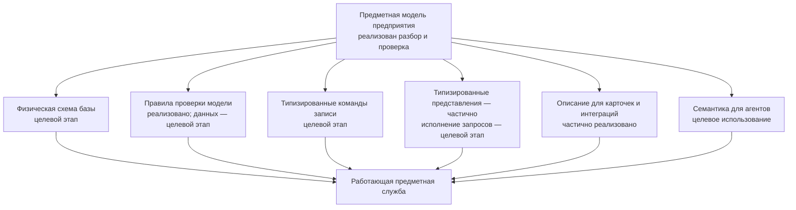
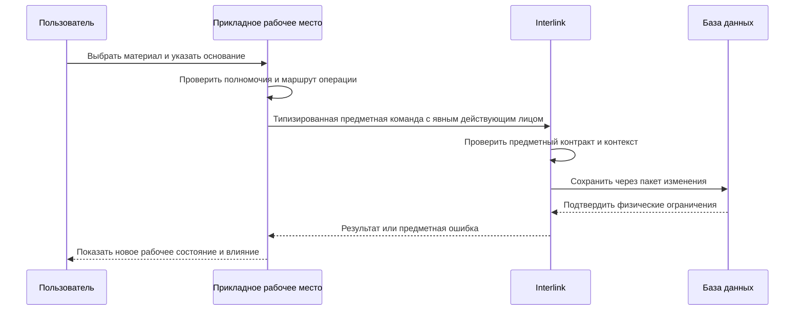

# Как модель превращается в работающую систему

## Зачем объяснять внутренний путь продуктовым языком

Фраза «тип материализуется в таблицу» описывает только часть результата. Продуктовому специалисту важно понимать всю цепочку: как одно определение модели одновременно влияет на хранение, проверку, поиск, команды, интерфейс и работу агентов.

Цель Interlink — не заставить разные команды повторно программировать один и тот же смысл в шести местах.

Документ показывает **целевой работающий контур** и рядом называет текущую границу. Сегодня модель уже компилируется в проверенное смысловое представление и в значительную часть типизированных прикладных представлений. Создание схемы PostgreSQL, исполнение миграций, запись предметных объектов и выполнение структурных запросов ещё не готовы.

## Одна модель — несколько согласованных поверхностей

Модель является источником согласования, но это не означает, что любой экран возникает полностью автоматически. Принимающее приложение использует описания и контракты, добавляет удобный предметный интерфейс, процессы и права.

## Что происходит при сборке модели

### Разрешение модулей

Система соединяет основную модель, отраслевые модули и разрешённые расширения предприятия. Зависимости должны быть явными. Если модуль технологии использует тип «Материал», его точная совместимая редакция известна заранее.

Это ядро сборки модулей уже реализовано.

### Семантическая проверка

Проверяются типы, свойства, связи, единицы, ограничения, наследование, заявленные индексы и стабильные идентификаторы. Ошибка блокирует дальнейшую сборку. Эта проверка модели реализована, но она не анализирует содержимое действующей промышленной базы.

### Построение плана хранения

**Целевой этап фазы 3.** Для каждого горячего предметного типа должна определяться реальная таблица и физические столбцы. Для версии объекта отдельно хранится изменяемое между поколениями содержимое. Связи с собственными свойствами получают предметно подходящее хранение и ограничения. Генератора такого физического плана пока нет.

### Создание индексов и ограничений

**Целевой этап.** Из смысла модели должны строиться индексы для типовых поисков и соединений, а также обязательность, уникальность, ссылочная целостность и допустимые диапазоны. Тогда база данных сможет предотвращать часть ошибок в момент записи, а не обнаруживать их ночным отчётом.

### Создание типизированной поверхности

Этапы 1–7 формирования типизированных прикладных представлений находятся в основной версии `3df67f5`: в частности, сформированы представления связей и преобразование уже прочитанных строк результата в типизированные записи. Это преобразование не создаёт таблицы. Командный запуск и эталонный пример этапа 8 находятся в локальной работе, а общая приёмка этапа 9 ещё не начата. Команды записи и исполнитель запросов относятся к дальнейшим этапам.

## Как пользовательская запись проходит систему

Ниже показан **целевой путь**, который появится после реализации команд записи. Рассмотрим изменение материала корпуса насоса.

Пользователь не знает имя таблицы. В целевой системе физическая схема позволит быстро найти материал, проверить ссылку и использовать обычные механизмы базы под высокой нагрузкой. Полномочия, рабочее место и решение о согласовании принадлежат принимающему приложению; Interlink не объявляет себя самостоятельной системой корпоративных прав.

## Как выполняется чтение

1. Прикладное рабочее место передаёт цель и явный режим чтения. Для точной версии, исторического перечня или неверсионных данных полный контекст подбора может не требоваться. Если нужно выбрать версию, принимающее приложение всегда передаёт явный контекст подбора; скрытого окружения и неявного значения «по умолчанию» нет.
2. Заказ читается по указанному неизменяемому снимку передачи. Его нельзя незаметно пересчитать по текущей дате, площадке или новейшим версиям.
3. Interlink строит разрешённый типизированный запрос. Исполнитель такого запроса пока относится к целевому контуру.
4. База использует физические таблицы и индексы.
5. Версионный слой выбирает официальное, рабочее или опубликованное состояние.
6. Результат возвращается с продолжением для больших списков. Подробные причины подбора и происхождение рассчитываются и передаются только когда вызывающая операция их запросила или когда это требуется для доказательного результата.

В целевом контуре одинаковый предметный запрос доступен интерфейсу, интеграции и агенту через контролируемую поверхность. Это снижает расхождения между каналами.

Принимающее приложение до вызова определяет полномочия пользователя или агента и допустимую область данных. Interlink получает явного действующего участника и предметный контекст, но не владеет корпоративными ролями, заданиями, маршрутами согласования или экранными правами.

## Почему реальные таблицы дают производительность

В универсальном хранилище каждое поле часто записано как отдельная строка «объект — имя свойства — значение». Для поиска редукторов по обозначению, типоразмеру и массе приходится многократно соединять одну большую таблицу и преобразовывать значения.

В целевой физической схеме Interlink часто используемые свойства лежат в столбцах своего типа. База заранее знает, что масса — число с единицей, обозначение — строка с правилом уникальности, а ссылка на материал ведёт к допустимому типу.

Это позволяет:

- строить узкие предметные индексы;
- использовать статистику базы для планирования запросов;
- разделять очень большие таблицы по выбранной стратегии;
- применять ограничения без дополнительного обхода;
- предсказуемо обслуживать горячие типы;
- масштабировать чтения и фоновые расчёты.

Обещание превосходства должно подтверждаться нагрузочными испытаниями на данных, похожих на установку IPS. Архитектурное преимущество создаёт потенциал, но не заменяет измерение.

## Как сохраняется расширяемость

Не каждый редкий локальный признак требует перестройки горячей таблицы. Модель различает:

- штатные свойства с физическими столбцами;
- настраиваемые значения в разрешённой рамке;
- ограниченные расширения времени работы для редких данных.

Если расширение становится массовым, участвует в частом поиске или важном ограничении, целевой процесс предлагает продвинуть его в штатную модель. После принятия решения для него создаются столбец, индекс и управляемая миграция. Автоматического механизма такого продвижения пока нет.

Так Interlink сочетает гибкость пилота с производительностью промышленного контура, но не обещает «любое поле в любой момент без цены».

## Как модель влияет на карточку пользователя

Уже формируемая часть содержит устойчивые идентификаторы и проверенные определения типов, свойств, списков значений и связей, а также типизированные записи и представления связей. Она позволяет приложению не угадывать базовую форму предметных данных.

На следующих этапах целевая прикладная поверхность должна дополнительно дать рабочему месту сведения, необходимые для полноценного интерфейса:

- названия и пояснения;
- тип значения и единицу;
- обязательность;
- допустимые значения;
- принадлежность объекту или его версии;
- доступные операции;
- признаки поиска и сортировки;
- диагностические сообщения.

На этой основе можно построить согласованную форму. Продуктовая команда дополнительно определяет группировку, подсказки, массовые операции и специализированное представление. Для сложного редактора состава или технологии одной автоматической формы недостаточно.

## Как модель влияет на интеграции

Внешняя система получает версионируемый контракт. При добавлении необязательного поля старый потребитель может продолжить работу в период совместимости. При переименовании видимого термина стабильная идентичность не обязательно меняется. При разрушительном изменении выпускается новая редакция контракта и план перехода.

Интеграция не должна писать напрямую в физические таблицы, даже если они известны. Иначе она обходит пакет изменения, историю и проверки.

## Как модель помогает агентам

В целевом контуре агент получает не неструктурированную выгрузку базы, а предметные типы, свойства, связи, единицы, ограничения и разрешённые команды. Это уменьшает вероятность перепутать массу и длину, объект и версию, рабочее и официальное состояние.

Агенты существенно увеличат число чтений, сравнений и предложений. Физические таблицы и индексы должны помогать выдерживать нагрузку, а контролируемая прикладная поверхность не предоставляет агенту «быстрый обход» предметных правил. Принимающая платформа обязана отдельно закрыть прямой доступ к базе полномочиями, учётными данными и сетевыми ограничениями: одни типизированные средства не могут запретить выданный в обход доступ.

Предложение агента всё равно проходит пакет, предпросмотр, проверку и предусмотренное решение человека или политики.

## Как обрабатываются ошибки

Ошибка проверки самой модели уже существует. Остальные случаи ниже описывают поведение целевых команд, запросов и установки.

### Ошибка модели

Обнаруживается при сборке или установке и блокирует выпуск. Сообщение указывает модуль, предметный элемент и конфликт.

### Ошибка пользовательских данных

Команда отвергается до проведения: отсутствует обязательное значение, неверна единица, ссылка ведёт к недопустимому типу. Пользователь получает предметное объяснение.

### Конкурентное изменение

В целевом пути команда несёт точное основание или отметку прочитанной версии. Если официальная основа уже изменилась, Interlink отвергает проведение всей команды и не перезаписывает новое состояние. Рабочий пакет, уже сохранённый принимающим продуктом, остаётся доступен для обновления основы или разбора конфликта; несохранённый текст на экране сам Interlink сохранять не обещает.

### Ошибка установки

План миграции прекращается по контролируемой границе. Эксплуатация видит, какие шаги выполнены, какие нет и какой предусмотрен способ восстановления.

### Медленный запрос

Наблюдение связывает задержку с типом, запросом, объёмом и редакцией модели. Решение может включать индекс, изменение модели, проекцию или ограничение сценария, но не скрытое изменение предметного результата.

## Пример 1. Поиск подшипников

В целевом рабочем месте конструктор ищет радиальные подшипники по внутреннему диаметру, грузоподъёмности и производителю. Эти характеристики типизированы и индексированы. Поиск возвращает порции результатов с единицами и показывает применённые условия.

В целевом процессе после добавления часто используемого признака «класс зазора» анализ влияния предлагает физический столбец и индекс. Пробная миграция заполняет значение по справочнику. Неоднозначные записи отделяются в карантин с исходным значением, происхождением и причиной; владелец НСИ принимает исправление, после чего запись проверяется повторно. Если авторитетный справочник остаётся внешним, обратное исправление и подтверждение организует принимающий продукт.

## Пример 2. Многоуровневый состав станка

Планировщик разворачивает большой состав обрабатывающего центра. В целевом физическом контуре таблицы связей и точные определения направлений позволяют базе эффективно проходить дерево. При живом расчёте версионный подбор применяет один явно переданный контекст на всех уровнях; объяснение причины каждой версии строится по запросу. При чтении заказа используется его точный снимок, и живой подбор заново не запускается.

Для повторяющегося массового чтения может использоваться техническая проекция. Решение о выпуске принадлежит принимающему продукту и должно опираться на именованный неизменяемый снимок заказа, созданный целиком или не созданный вовсе. Чтение большого готового снимка может идти порциями, но итог проверки явно сообщает полноту; частичный живой обход не объявляется полным составом заказа.

## Пример 3. Массовые предложения агентов

В будущем контуре Alvatune сотни агентских задач анализируют устаревающие комплектующие. Они используют ограниченные запросы с продолжением, общий кэш и наблюдаемую очередь принимающей платформы, а не выгружают всю базу. Каждое предложение содержит точные исходные версии и создаёт изменение только через разрешённую команду.

Нагрузочные ограничения и приоритеты принадлежат принимающей платформе; Interlink обеспечивает предсказуемую предметную поверхность.

После успешной фиксации предметных данных Interlink возвращает принимающему продукту точный результат. Надёжное уведомление ERP, MES и других потребителей, повтор после сбоя и защита от двойного применения принадлежат принимающему продукту. Запись в базе и внешнее сообщение нельзя считать одной автоматически гарантированной операцией.

## Что отличается от IPS

Целевая архитектура Interlink стремится уменьшить разрыв между метаданными и физической схемой: горячие типы заранее превращаются в оптимизируемые таблицы, а из одной модели выводятся согласованные ограничения и контракты. Это даёт больше возможностей для обычной оптимизации PostgreSQL и строгой проверки.

Взамен требуется дисциплина выпуска модели и явная миграция. Нельзя бесконтрольно добавить любое поле в промышленную установку и одновременно гарантировать прежнюю производительность.

## Критерии продуктовой приёмки

Сквозной механизм считается подтверждённым, когда на одной точной редакции модели одновременно доказаны следующие результаты:

- физическая схема, прикладные представления и правила проверки не расходятся по смыслу;
- пользователь создаёт и изменяет объект только через разрешённую предметную операцию принимающего продукта;
- точная версия, история и неверсионные данные читаются без искусственного контекста, а любой живой подбор получает явные условия;
- ранее переданный заказ всегда читается по своему неизменяемому снимку без живого переподбора;
- подробная причина выбора строится по запросу и совпадает с фактически полученным результатом;
- ошибка ограничения, конфликт параллельной работы и ошибка установки дают понятное действие, а не частично скрытый результат;
- нагрузочные измерения подтверждают целевые сценарии на объёмах, сопоставимых с IPS.

## Состояние реализации

В основной версии `3df67f5` готовы компиляция модели, нормализация, отпечаток, сборка модулей и этапы 1–7 формирования типизированных прикладных представлений. Этап 8 командного запуска находится в локальной работе, этап 9 приёмки не начат. Полный путь создания и применения промышленной схемы, команды записи, исполнитель структурных запросов, проекции, рабочие места и агентская оркестрация ещё не готовы как единая система. Преимущества высокой нагрузки являются архитектурно обоснованной гипотезой, которую нужно подтвердить измерениями.

Связанные документы: [жизненный цикл модели](14-model-lifecycle-and-user-work.md), [физическая материализация](04-physical-database-materialization.md), [производительность и агенты](06-performance-and-agent-load.md), [поиск и запросы](16-search-and-query-user-experience.md).

Основания: [IL-META], [IL-DSL], [IL-DB], [IL-QUERY], [IL-CODEGEN], [IL-POC], [IPS-A01], [AN-PG], [AN-ARAS]. Расшифровка — в [реестре источников](../knowledge/15-source-register.md).
