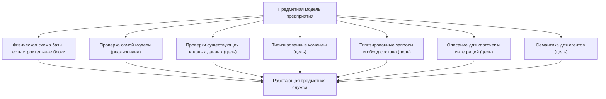
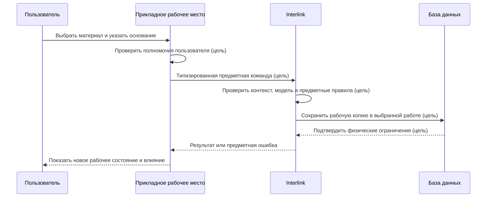

# Как модель превращается в работающую систему

## Зачем объяснять внутренний путь продуктовым языком

Фраза «тип материализуется в таблицу» описывает только часть результата. Продуктовому специалисту важно понимать всю цепочку: как одно определение модели одновременно влияет на хранение, проверку, поиск, команды, интерфейс и работу агентов.

Цель Interlink — не заставить разные команды повторно программировать один и тот же смысл в шести местах.

На срезе документации от 6 сентября 2026 года Interlink уже читает, проверяет и нормализует модель, собирает модули и формирует часть прикладных представлений. В коде также есть построение физической схемы, описание её создания, метакаталог и планирование миграций. Однако безопасное промышленное обновление, полное исполнение команд и запросов и весь пользовательский путь ниже ещё требуют реализации и приёмки. Новая архитектура не считается готовой только потому, что её предшествующий вариант уже имеет таблицы.

## Одна модель — несколько согласованных поверхностей

Модель является источником согласования, но не означает, что любой экран возникает полностью автоматически. Принимающее приложение использует подготовленное описание для интерфейса, добавляет предметную компоновку, процессы и проверку полномочий. Сама структура таблиц не является инструкцией для построения формы. Пометка «цель» означает, что соответствующий сквозной результат ещё не реализован.

## Что происходит при сборке модели

### Разрешение модулей

Система соединяет основную модель, отраслевые модули и разрешённые расширения предприятия. Зависимости должны быть явными. Если модуль технологии использует тип «Материал», его точная совместимая редакция известна заранее.

### Семантическая проверка

Проверяются типы, свойства, связи, единицы, ограничения, наследование, индексы и стабильные идентификаторы. Ошибка блокирует выпуск до создания физической базы. Проверка определения модели уже имеет реализацию, но сама по себе не исследует все существующие данные промышленного предприятия.

### Построение плана хранения

Для поддержанного текущего среза построение физической схемы уже присутствует в коде. Целевой пересмотр разделяет устойчивый объект, инженерную версию, её неизменяемое содержание и рабочую копию. Предметные характеристики остаются в типизированных таблицах, а общий небольшой реестр обеспечивает согласованную адресацию и принадлежность. Этот пересмотр ещё нужно последовательно провести через установку, запись и чтение.

### Создание индексов и ограничений

В текущем физическом срезе уже описываются ограничения и средства быстрого поиска. Они должны быть согласованы с новой моделью и проверены вместе с исполняемыми операциями. База предотвращает часть ошибок записи, но проверка полного состава, совместимости или прав не сводится к одному ограничению поля.

### Проверенный выпуск и допуск приложения

Перед началом работы недостаточно обнаружить в базе таблицы с подходящими названиями. Установка должна подтвердить точный выпуск модели, состав модулей, фактическую структуру хранения и совместимость подключённого приложения. Попытка обновления, успешная установка и текущий используемый выпуск — разные события. Неудачная попытка не должна выглядеть как успешно действующая новая модель.

Практический пример: две поставки описывают одинаковое поле «Расход», но одна округляет до десятых, другая — до сотых. Одинаковая форма таблиц не делает их взаимозаменяемыми. Система обязана знать, по каким правилам сохранено и читается значение. Если совместимость не подтверждена, работа блокируется до исправления поставки, а не продолжается с предполагаемо подходящей схемой.

### Создание типизированной поверхности

Часть типизированных представлений уже реализована: идентификаторы, записи, связи и преобразование уже полученных строк результата в предметные записи. Типизированные команды записи и выполнение запросов к PostgreSQL остаются будущими возможностями.

## Как пользовательская запись проходит систему

Рассмотрим изменение материала корпуса насоса.

Пользователь не знает имя таблицы. Сохранённая правка доступна в разрешённой рабочей области, но ещё не меняет официальное содержание корпуса. Для его публикации нужна отдельная операция с проверкой основания, согласований и полного результата. Схема показывает целевой путь инженерной правки, а не обязательный пакет изменения для любого поля в любой предметной области.

Например, изменение телефона склада может сохраняться как обычная оперативная запись. А результат измерения добавляется как неизменяемый факт. Ни склад, ни измерение не обязаны получать инженерную версию. Общими остаются проверка полномочий, защита от конкурирующей записи, история обязательных действий и понятный исход операции.

## Как выполняется чтение

1. Прикладное рабочее место передаёт цель и явный режим чтения.
2. Если требуется **подобрать** версию, приложение дополнительно передаёт явный контекст подбора. Для чтения уже указанного точного содержания, истории, неверсионного объекта или готового снимка такой контекст не нужен.
3. Interlink строит разрешённый типизированный запрос.
4. База использует физические таблицы и индексы.
5. Версионный слой либо выбирает инженерную версию и необходимое содержание, либо читает точно указанное состояние без пересчёта. Закрепление только обозначенной версии не равно фиксации её содержания.
6. Результат возвращается с достаточным происхождением и продолжением для больших списков.

В целевом контуре одинаковый предметный запрос будет доступен интерфейсу, интеграции и агенту через контролируемую поверхность. Это должно снизить расхождения между каналами. Перед чтением проверяются текущие права и допуск приложения к конкретной области данных; результат из ускоряющего хранилища не обходит эти проверки.

Для исторического заказа сохраняется не только перечень деталей. Нужны также точное содержание файлов, необходимые определения модели и правила интерпретации значений. Обновление модели не вправе незаметно прочитать старую величину по новым единицам или заменить старую подпись в доказательном документе. Современное название можно показать рядом, сохранив первоначальный смысл. Состав и срок такого сохранения задаются назначением документа, а не обещанием хранить всё бесконечно.

## Почему реальные таблицы дают производительность

В универсальном хранилище каждое поле часто записано как отдельная строка «объект — имя свойства — значение». Для поиска редукторов по обозначению, типоразмеру и массе приходится многократно соединять одну большую таблицу и преобразовывать значения.

В целевой физической схеме Interlink часто используемые свойства будут лежать в столбцах своего типа. База будет заранее знать, что масса — число с единицей, обозначение — строка с правилом уникальности, а ссылка на материал ведёт к допустимому типу.

Это позволяет:

- строить узкие предметные индексы;
- использовать статистику базы для планирования запросов;
- разделять очень большие таблицы по выбранной стратегии;
- применять ограничения без дополнительного обхода;
- предсказуемо обслуживать горячие типы;
- масштабировать чтения и фоновые расчёты.

Обещание превосходства должно подтверждаться нагрузочными испытаниями на данных, похожих на установку IPS. Архитектурное преимущество создаёт потенциал, но не заменяет измерение.

## Как сохраняется расширяемость

Не каждый редкий локальный признак требует перестройки горячей таблицы. Модель различает:

- штатные свойства с физическими столбцами;
- настраиваемые значения в разрешённой рамке;
- ограниченные расширения времени работы для редких данных.

В будущем, если расширение станет массовым, будет участвовать в частом поиске или важном ограничении, владелец сможет продвинуть его в штатную модель. Тогда целевой исполнитель создаст столбец и индекс и проведёт управляемую миграцию. Этот эксплуатационный контур ещё не реализован.

Так Interlink сочетает гибкость пилота с производительностью промышленного контура, но не обещает «любое поле в любой момент без цены».

## Как модель влияет на карточку пользователя

Приложение должно получать специально подготовленное, согласованное с установленной моделью описание для рабочих мест. Это не произвольное чтение внутренних определений или угадывание смысла по названиям таблиц. В таком описании нужны:

- названия и пояснения;
- тип значения и единицу;
- обязательность;
- допустимые значения;
- принадлежность объекту или его версии;
- доступные операции;
- признаки поиска и сортировки;
- диагностические сообщения.

На этой основе можно построить согласованную форму. Продуктовая команда дополнительно определяет группировку, подсказки, массовые операции и специализированное представление. Для сложного редактора состава или технологии одной автоматической формы недостаточно. Добавление поля в модель также не делает его автоматически доступным старой версии любого внешнего приложения: совместимость потребителей проверяется отдельно.

## Как модель влияет на интеграции

В целевом контуре внешняя система будет получать версионируемый контракт. Совместимость каждого потребителя должна подтверждаться принимающим продуктом; неизвестному приложению она автоматически не обещается.

Прикладное приложение и интеграция не должны читать или писать предметные данные напрямую через физические таблицы как через поддерживаемый деловой интерфейс: так теряются версионный режим, правила подбора, история и проверки. Прямая запись запрещена. Диагностическое чтение администратором базы может использоваться для эксплуатации, но не является контрактом приложения и не должно самостоятельно трактовать предметный смысл.

## Как модель помогает агентам

Агент должен будет получать не неструктурированную выгрузку базы, а предметные типы, свойства, связи, единицы, ограничения и разрешённые команды. Это уменьшит вероятность перепутать массу и длину, объект и версию, рабочее и официальное состояние.

Агенты существенно увеличат число чтений, сравнений и предложений. В целевой системе физические таблицы и индексы должны помогать выдерживать нагрузку, а принимающая платформа отдельно должна закрывать прямой доступ к базе полномочиями, учётными данными и сетевыми ограничениями.

Предложение агента проходит разрешённый для этого вида данных путь. Инженерная публикация требует предусмотренной подготовки и одобрения; обычное оперативное действие не обязано создавать пакет изменения. Во всех случаях агент не получает обход правил. Для значимого решения фиксируется действительно использованный контекст, а не только время запуска. Подробнее — [агенты и прослеживаемость](../agents/01-agents-and-traceability.md).

## Как обрабатываются ошибки

Ниже зафиксировано целевое поведение полного контура. Сейчас уже работает проверка модели при сборке; обработку пользовательской записи, исполнения запросов и установки ещё предстоит подтвердить сквозными испытаниями.

### Ошибка модели

Ошибка самой модели уже обнаруживается при сборке и блокирует выпуск манифеста. Проверка ошибки установки относится к будущему исполнителю миграций.

### Ошибка пользовательских данных

Команда отвергается до проведения: отсутствует обязательное значение, неверна единица, ссылка ведёт к недопустимому типу. Пользователь получает предметное объяснение.

### Конкурентное изменение

Система обнаруживает, что официальная основа или запись изменилась, и не теряет чужую работу. Пользователь обновляет контекст либо разбирает конфликт пакета. Уже сохранённая рабочая копия остаётся для разбора; несохранённый текст в окне не превращается автоматически в сохранённые данные Interlink. Принимающее приложение отдельно отвечает за предупреждение о несохранённой работе.

### Ошибка установки

План миграции прекращается по контролируемой границе. Эксплуатация видит, какие шаги выполнены, какие нет и какой предусмотрен способ восстановления. Потеря ответа не считается доказательством, что действие не состоялось: сначала проверяется его фактический результат. Нельзя просто запустить всё повторно и рискнуть продублировать перенос либо активацию.

### Медленный запрос

Наблюдение связывает задержку с типом, запросом, объёмом и редакцией модели. Решение может включать индекс, изменение модели, проекцию или ограничение сценария, но не скрытое изменение предметного результата.

## Пример 1. Поиск подшипников

После реализации физической схемы и запросов конструктор сможет искать радиальные подшипники по внутреннему диаметру, грузоподъёмности и производителю. Эти характеристики будут типизированы и индексированы, а поиск будет возвращать порции результатов с единицами и применёнными условиями.

После добавления часто используемого признака «класс зазора» владелец модели определяет способ его хранения и поиска. Пробная миграция заполняет изменяемые данные по авторитетному справочнику. Неоднозначные записи отделяются для разбора с исходным значением, происхождением и причиной; владелец нормативно-справочной информации (НСИ) принимает исправление, после чего запись проверяется повторно. Старое опубликованное содержание не дополняется задним числом: оно продолжает читаться по своему договору. Если справочник принадлежит внешней системе, обратное исправление и подтверждение организует принимающий продукт.

## Пример 2. Многоуровневый состав станка

Планировщик разворачивает большой состав обрабатывающего центра. Физические таблицы связей и точные определения направлений позволяют базе эффективно проходить дерево. Подбор последовательно применяет явные условия ко всем уровням. Причину выбора можно запросить для проверки; при создании доказательного результата сохраняется необходимое происхождение. Обычный просмотр не обязан архивировать все рассмотренные варианты.

Для повторяющегося массового чтения в будущем может использоваться техническая проекция — заменяемое ускоряющее представление. Она способна отставать от источника истины, поэтому должна сообщать редакцию и свежесть, может быть перестроена или удалена и не служит основанием выпуска либо аудита без проверки актуальности. Для конкретного выпуска заказа всё равно строится и проверяется всё дерево точного содержания. Только завершённая проверка всего требуемого состава позволяет зафиксировать снимок: он становится доступен как полный артефакт целиком либо не становится доступен вовсе. Порционное чтение или проверка отдельных ветвей не позволяют объявить промежуточный результат полным.

## Пример 3. Массовые предложения агентов

В целевом сценарии сотни агентских задач анализируют устаревающие комплектующие. Они используют ограниченные запросы с продолжением, разрешённое повторное чтение результатов и управляемую очередь, а не выгружают всю базу. Значимое предложение сохраняет точное прочитанное содержание и создаёт изменение только через разрешённую команду.

Нагрузочные ограничения и приоритеты принадлежат принимающей платформе; Interlink обеспечивает предсказуемую предметную поверхность.

## Где заканчивается локальная запись и начинается внешнее исполнение

Успешная публикация даёт точный локальный результат. Если операция требует обязательной истории, квитанции и задания на внешнюю доставку, они должны сохраняться согласованно с предметным изменением. Нельзя сначала объявить успех, а затем надеяться, что сообщение когда-нибудь будет сформировано.

При этом запись в Interlink и применение изменения в ERP или MES не становятся одной общей неразрывной операцией. Принимающий продукт организует доставку, подтверждение, повтор и сверку внешнего результата. Потеря ответа не даёт права создать вторую выдачу: сначала выясняется исход прежней операции. Пользователь должен различать «состав опубликован», «сообщение ожидает доставки» и «внешняя система подтвердила применение».

## Новые табличные формы используют тот же путь

Индексируемый справочник, полная многомерная таблица и разреженная карта соответствий не должны становиться отдельным островом данных. Их формы, единицы, ссылки, полномочия и правила изменения проходят тот же проверяемый выпуск модели. Содержание набора меняется по собственному предметному процессу: добавление строки не всегда является изменением модели, а перестройка осей или смысла значения может им быть.

Технолог, например, добавляет новую строку нормы расхода для уже описанного типоразмера. Это работа с данными. Добавление оси «вид охлаждения» меняет форму справочника и требует анализа старых строк и потребителей. [Табличные данные](../tabular-data/README.md) подробно объясняют это различие; новые возможности ещё не являются готовым расширением текущего языка.

## Что отличается от IPS

Целевая архитектура Interlink должна уменьшить разрыв между метаданными и физической схемой: горячие типы будут материализоваться в оптимизируемые таблицы, а из одной модели будут выводиться согласованные ограничения и контракты. Это создаёт потенциал для обычной оптимизации PostgreSQL и строгой проверки, который ещё предстоит подтвердить.

Взамен требуется дисциплина выпуска модели и явная миграция. Нельзя бесконтрольно добавить любое поле в промышленную установку и одновременно гарантировать прежнюю производительность.

## Критерии продуктовой приёмки

Сквозной механизм считается подтверждённым, когда на согласованном выпуске модели доказаны следующие результаты:

- физическое хранение, прикладные представления и проверки не расходятся по смыслу;
- оперативная запись, добавляемый факт и инженерная публикация используют уместный способ изменения, но ни один из них не обходит права и обязательную историю;
- точное содержание, история и неверсионные данные читаются без искусственного подбора, а любой живой подбор получает явные условия;
- конкретный выпущенный комплект заказа читается без пересчёта; живое перепланирование ведётся отдельно;
- причина выбора по запросу соответствует фактическому результату, а доказательное чтение сохраняет необходимые основания;
- ошибка ограничения, параллельная правка и сбой установки дают понятный исход и путь продолжения;
- локальная фиксация не выдаётся за уже подтверждённое внешнее исполнение;
- нагрузочные измерения подтверждают заявленные сценарии на согласованных объёмах.

## Состояние реализации

Реализованы проверка и сборка модели, часть прикладных представлений; в коде есть средства построения физической схемы, её описания, метакаталога и плана миграций. Полный пересмотренный путь установки, записи, запросов и исторического чтения ещё не принят. Интерфейсы, эксплуатационные расширения, табличные формы и агентская оркестрация остаются целевыми возможностями. Потенциал высокой нагрузки нужно подтвердить измерениями, включая обязательные проверки и сохранение истории.

Физическое построение и часть миграционного контура являются текущей незавершённой работой, а не готовым промышленным установщиком. Минимальные сквозные проверки новых способов записи, таблиц, совместимости и агентской прослеживаемости включаются в раннее опытное подтверждение; весь этот фундамент не переносится в неопределённое «потом».

Связанные документы: [жизненный цикл модели](14-model-lifecycle-and-user-work.md), [физическая материализация](04-physical-database-materialization.md), [производительность и агенты](06-performance-and-agent-load.md), [поиск и запросы](16-search-and-query-user-experience.md).

## Основания

Актуальные уточнения архитектуры: [IL-KERNEL], [IL-STORAGE], [IL-FOUNDATION], [IL-NEUTRAL], [IL-AI], [IL-TD], [IL-SC], [IL-DATA-MODEL], [IL-PLAN-V2]. При расхождении с ранними описаниями действуют пересмотренные специализированные договоры. Состояние реализации относится к срезу документации от 6 сентября 2026 года.

Исходные предметные и исследовательские основания: [IL-META], [IL-DSL], [IL-DB], [IL-QUERY], [IL-CODEGEN], [IL-POC], [IPS-A01]. Расшифровка — в [реестре источников](../knowledge/15-source-register.md).
