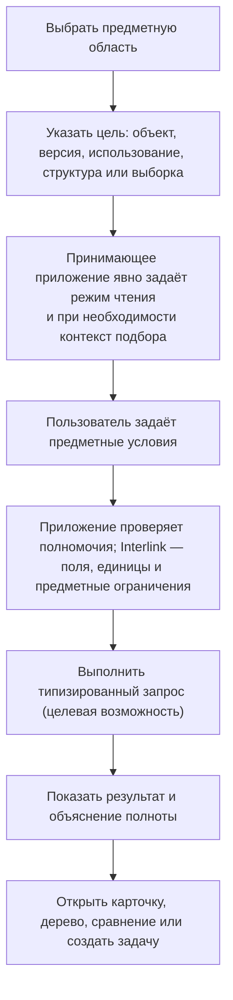
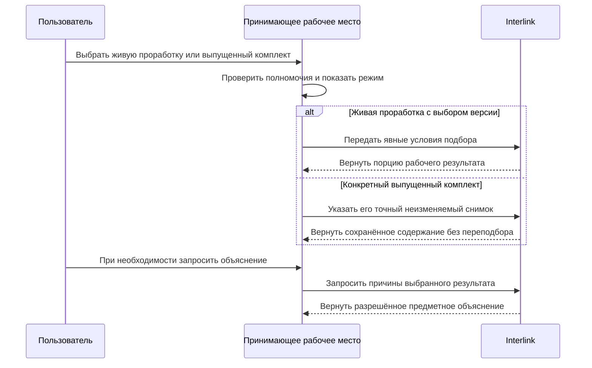

# Поиск, выборки и обход связей глазами пользователя

## Почему поиск является частью модели данных

В PLM недостаточно найти карточку по обозначению. Пользователь ищет:

- устойчивый объект или конкретную его версию;
- все изделия, где применяется деталь;
- документы определённой степени готовности;
- позиции состава, удовлетворяющие инженерному условию;
- объекты, изменяемые в конкретном пакете;
- точный состав заказа или выпуска;
- данные с дополнительным признаком предприятия.

Чтобы такие ответы были одинаковыми в интерфейсе, отчёте, интеграции и работе агента, поиск должен использовать ту же типизированную модель и явно указанный режим чтения. Контекст подбора версий обязателен только тогда, когда система должна выбирать. Для чтения точно известного неизменяемого содержания, истории, неверсионных данных или готового снимка он не требуется.

## Пять разных задач пользователя

### Найти объект

Пользователь ищет деталь, документ, материал, процесс или заказ как устойчивый предмет независимо от числа его версий.

### Найти версию

Нужно найти обозначенную инженерную версию, а затем явно выбрать, какое содержание открыть: опубликованное, рабочее в разрешённой области или точно зафиксированное историческое. Например, версия Б корпуса насоса и её состояние после согласования нового посадочного размера — не один и тот же адрес.

### Найти по связям

Например: «в каких редукторах применяется этот подшипник», «какие операции используют эту оснастку», «какие требования покрывает испытание».

### Развернуть структуру

Нужно пройти состав, маршрут, трассировку требований или другую именованную структуру в определённом направлении и контексте.

### Выполнить именованную выборку

Предприятие может опубликовать именованную выборку: «выпущенные детали без назначенного материала», «заказы с резервным подбором», «оснастка с истекающим ресурсом».

Эти задачи имеют разные результаты и не должны скрываться за одним неясным полем «поиск везде».

## Как пользователь начинает поиск

Рабочее место может заранее заполнить контекст подбора из текущей задачи, но при выборе версии обязано показать и передать его явно. При открытии конкретного согласованного или выпущенного комплекта производственного заказа приложение передаёт его неизменяемый снимок. Interlink возвращает зафиксированное содержание и не выполняет новый подбор по текущей дате, площадке или изменившимся правилам.

Сам заказ не обязан быть замороженным целиком: для его живой проработки и перепланирования передаётся явный рабочий контекст. Пользователь может сравнить новый вариант с ранее выданным комплектом, но не подменить им старую выдачу. Новый официальный результат требует отдельной фиксации. При работе над изменением поиск может показывать разрешённые рабочие копии.

Следующая схема показывает целевую последовательность для живого поиска и чтения конкретного выпущенного комплекта. В обоих случаях права проверяются сейчас, а не считаются полученными навсегда вместе со снимком.

Главный смысл: новое планирование не подменяет прежнюю выдачу. Подробное объяснение не обязано утяжелять каждый обычный ответ; оно запрашивается, когда нужно человеку, проверке или основанию решения.

## Устойчивый объект и конкретная версия

Результат «Деталь ВАЛ-250» должен ясно отличаться от «версия 04 детали ВАЛ-250».

В списке объектов показываются:

- обозначение и наименование;
- тип;
- показанная версия и режим, в котором она получена;
- степень готовности;
- наличие открытого изменения;
- возможность отдельно запросить объяснение выбора версии.

В списке версий дополнительно показываются обозначение версии, даты, происхождение и доступные состояния содержания. Рабочая копия отделена от опубликованного результата. Историческое содержание не становится текущим только потому, что пользователь нашёл и открыл его.

## Явный режим чтения и контекст подбора

Каждый запрос явно сообщает требуемый режим чтения:

- официальное состояние с подбором версий по переданному контексту;
- будущее состояние конкретного пакета с подбором версий по переданному контексту;
- указанная инженерная версия с явным способом чтения её содержания либо точно известное неизменяемое содержание;
- точный неизменяемый снимок основы или заказа;
- история всех версий;
- неверсионные справочные данные.

Если операция требует подбора, но принимающее приложение не передало обязательный контекст, Interlink отказывает до выполнения запроса. Скрытого «безопасного режима по умолчанию» нет. Сам пользователь может видеть заранее заполненную форму, но отправляемая операция всё равно содержит точную цель, правило и нужные условия. Это требование не распространяется на чтение, в котором выбирать версию вообще не нужно.

Контекст подбора не требуется там, где никакого выбора версии нет: при чтении точно указанного неизменяемого содержания, истории всех версий, неверсионируемого объекта или готового снимка. Готовый снимок читается напрямую и не пересчитывается по сегодняшним правилам.

## Предметные условия вместо технических выражений

Пользователь выбирает доступные свойства из модели:

- диаметр от 40 до 50 мм;
- материал входит в группу коррозионностойких сталей;
- степень готовности не ниже «допущено в производство»;
- используется в изделии РЦ-250;
- применимо для серии 145 на заданную дату.

Рабочее место проверяет единицы, тип значения и совместимость условий до выполнения. Массу нельзя сравнивать с длиной, а дату — с обозначением.

## Поиск по связям и обратная применяемость

### Прямой обход

От сборки к компонентам, от технологического процесса к операциям, от требования к подтверждающим испытаниям.

### Обратный обход

От детали к верхним изделиям, от оснастки к операциям, от документа к использующим его процессам.

Пользователь выбирает заранее определённый предметный маршрут, а не произвольное соединение таблиц. Определение маршрута задаёт допустимые типы связей, направление, глубину и форму результата.

### Пример

Служба качества ищет насосы, куда фактически установлено уплотнение дефектной партии. Одной обратной применяемости конструкторской детали недостаточно: она покажет, где такое уплотнение предусмотрено, но не докажет происхождение установленных экземпляров. Нужны связи партии, фактических установок и выпущенных насосов. Пользователь должен получить именно этот вид результата либо явное сообщение, каких фактов не хватает. Система не выдаёт возможное применение конструкции за доказанный список отзываемых изделий.

## Именованные выборки и их управление

Именованная выборка — многократно используемое определение запроса с понятным названием и устойчивым идентификатором. Её содержание входит в точную редакцию всей модели; отдельной независимой версии выборки Interlink не обещает. Принимающий продукт при необходимости добавляет владельца, согласование, доступность пользователям и расписание выполнения. Типизированное выполнение и весь сквозной пользовательский контур пока не реализованы.

При подготовке новой редакции модели продуктовая команда определяет:

- деловой смысл;
- допустимые параметры;
- тип результата;
- версионный контекст;
- сортировку и продолжение;
- правила полноты и доступа;
- контрольные примеры;
- ожидаемый масштаб.

Изменение поставляемого определения именованной выборки входит в новую редакцию модели. Два отчёта с одинаковым названием не должны незаметно использовать разные условия: они сохраняют ссылку на устойчивый идентификатор выборки и точную редакцию модели.

### Какие сценарии IPS не исчерпываются именованным запросом

В IPS выборка может быть ручным списком, автоматически вычисляемым набором, персональной или общей рабочей папкой, а также источником уведомлений. Пользователь может добавить временный фильтр, начать поиск от выбранного объекта либо сохранить удобный способ навигации. Поэтому наличие определения запроса в модели ещё не воспроизводит весь этот пользовательский опыт.

Для Interlink эти сценарии нужно проверять раздельно. Ручной список сохраняет выбранное членство, автоматическая выборка — условия; повторный запуск не должен незаметно превращать одно в другое. Принимающий продукт определяет владельца, доступность, персональные настройки и расписание уведомлений, используя проверяемые запросы Interlink. Выбор значения уже разрешённого параметра не является выпуском новой модели. Изменение же поставляемого определения запроса или смысла доступного поля проходит жизненный цикл модели. Рабочий стол, недавние объекты, уведомления и полнотекстовая строка остаются отдельными прикладными возможностями, готовность которых нельзя вывести только из наличия типизированного поиска.

## Поиск по таблицам и многомерным данным

В план добавлены три самостоятельных вида табличного чтения. Для справочника строк пользователь отбирает подходящие записи: например, стандартные винты с нужным диаметром и длиной. Для полной сетки он выбирает срез: коэффициент для каждого материала при заданных температурах. Для координатной карты он задаёт сочетание условий и получает связанную конструкцию, версию либо значение согласно определению карты.

Эти действия не следует смешивать. Отсутствие винта в конкретном справочнике не доказывает, что такой винт запрещён в производстве. Пустое соответствие в карте «среда × проход × исполнение» означает, что в этой редакции не задан результат, если отдельное правило не определило иной смысл. Наличие всех клеток сетки также не означает, что во всех клетках есть известный и проверенный показатель: измерение может быть ещё не выполнено.

При историческом расчёте используются точная редакция таблицы, сохранённый набор значений осей и правила единиц. Добавленный сегодня материал не расширяет задним числом область вчерашнего испытания. Эти запросы запланированы; существующий механизм сочетаний объектов ещё не является готовым многомерным поиском. Подробнее — [табличные данные](../tabular-data/README.md) и [координатные карты](../tabular-data/03-coordinate-maps.md).

## Большие результаты

Целевой запрос не должен требовать загрузки миллиона строк одним ответом. Базовый контракт предполагает ограниченную страницу или продолжение с сохранением порядка и контекста. Обычный запрос с продолжением не гарантирует единый момент чтения для всех порций: между ними данные могут измениться. Если результат должен воспроизводиться позднее, сначала создаётся подходящий неизменяемый снимок и последующее чтение выполняется по нему. Техническая проекция для ускорения поиска не является доказательным снимком: её можно пересоздать или удалить.

Общий объём может быть дорог или неизвестен; обещание всегда показывать точное число строк, процент выполнения, фоновое задание и кнопку остановки пока не принято.

Если предприятию нужна длительная выгрузка, принимающий продукт может организовать её как собственное задание и зафиксировать условия, редакцию модели и момент чтения. Конкретные средства прогресса, отмены и расписания должны быть спроектированы и испытаны отдельно.

## Полнота и права доступа

Права не должны менять предметную истину незаметно. Возможны три явных результата:

1. Пользователь имеет право на полный результат.
2. Пользователь получает безопасный ограниченный список с указанием, что он неполон.
3. Операция, требующая полного графа — например публикация снимка, — запрещается целиком.

Нельзя назвать дерево полным, если отдельные ветви скрыты политикой доступа. Для чувствительного делового снимка применяется право на весь артефакт. И историческое чтение, и повторно использованный результат всё равно проверяют текущие права: право увидеть документ в прошлом не является бессрочным разрешением читать его сегодня.

## Что сохраняется в объяснении

Для обычного результата доступны краткие сведения, необходимые пользователю:

- цель запроса;
- тип и версия модели;
- предметные условия и единицы;
- версионный контекст;
- применённая именованная выборка и точная редакция модели, в которую она входит;
- сортировка и продолжение;
- путь связей;
- причина выбора версии, если объяснение было запрошено;
- предупреждения о неполноте;
- время и происхождение, если результат зафиксирован как отчёт.

Обычный просмотр не обязан вычислять подробную цепочку причин или сохранять всех рассмотренных кандидатов. Объяснение запрашивается отдельно, когда оно нужно пользователю, проверке или решению агента; его полный формат остаётся целевой возможностью. Обычный просмотр не архивирует каждое нажатие пользователя. Но опубликованный отчёт, решение агента или доказательный комплект должны сохранять достаточное происхождение.

## Как дополнительный признак входит в поиск

В целевом контуре, если дополнительный признак разрешён для поиска, будут публиковаться его тип, единица и область применения. Первоначально такой поиск может быть менее эффективным, а принимающий продукт сможет наблюдать его частоту и стоимость.

Если признак станет массовым, владелец сможет решить перевести его в штатное физическое поле с индексом и миграцией. Это управляемое развитие модели, а не автоматическое действие уже работающего ядра. Пользовательское имя и смысл должны сохраниться.

## Что делает агент

Агент использует те же разрешённые выборки и типизированные запросы, но принимающий продукт задаёт ограничения объёма, времени и полномочий. Для проверки конкретного выпущенного комплекта заказа агент читает его точный снимок. Для предложения перепланирования он отдельно получает живой рабочий контекст и сравнивает новый вариант с исходным комплектом. Новая проработка не переписывает прежнее основание исполнения. Продолжение больших результатов является целевым договором, а не уже доступной функцией.

В основании значимого решения агента сохраняются точное прочитанное содержание, использованные файлы, таблицы и правила интерпретации. Одних обозначений версий или времени запроса недостаточно. Если данных не хватает, агент обращается к человеку через механизм заданий принимающей платформы, а не додумывает отсутствующую ветвь. Это целевой сценарий, а не готовая функция текущего ядра. Подробнее — [агенты и прослеживаемость](../agents/01-agents-and-traceability.md).

## Ошибки и действия пользователя

| Ситуация | Понятное сообщение | Следующее действие |
|---|---|---|
| Не передан контекст операции подбора | Нельзя однозначно выбрать версии без явной цели и политики | Принимающее приложение должно сформировать и показать контекст; скрытое значение по умолчанию не используется |
| Неизвестное поле | Признак не входит в установленную модель | Выбрать доступный признак или запросить расширение |
| Неверная единица | Условие задано в несовместимой величине | Исправить единицу |
| Рабочая область недоступна | Не подтверждены необходимые права на эту работу или выбранное содержание | Открыть разрешённое официальное состояние либо запросить доступ |
| Слишком широкий запрос | Ожидается чрезмерный объём | Уточнить условия; длительную выгрузку организует принимающий продукт, если она поддерживается |
| Неполный результат из-за прав | Часть данных недоступна | Использовать разрешённое представление; не публиковать как полный состав |
| Нет версии в контексте | Объект найден, но допустимая версия отсутствует | Открыть объяснение подбора и создать задачу владельцу |
| Определение выборки устарело | Установленная модель несовместима с прежней редакцией | Исправить определение в следующей редакции модели или использовать совместимую редакцию модели |

## Пример 1. Конструктор ищет подшипник

Конструктор задаёт внутренний диаметр 50 мм, динамическую грузоподъёмность не ниже требуемой и климатическое исполнение. Поиск возвращает устойчивые объекты, а для каждого показывает версию, выбранную политикой проектирования. Один подшипник найден, но его последняя версия аннулирована; объяснение показывает, что выбрана предыдущая допустимая версия или результат остановлен — согласно явной политике.

Конструктор сравнивает кандидатов и отдельно изменяет позицию в своей работе. Он может закрепить обозначенную инженерную версию либо точное проверенное содержание — по задаче. Сам поиск состав не меняет, а сохранение выбранного варианта ещё не публикует изменение.

## Пример 2. Технолог ищет использование оснастки

Перед списанием штампа технолог запускает обратную применяемость. Система показывает технологические операции, версии процессов, изделия и открытые заказы, где штамп требуется. Исторические процессы отделены от текущих, а рабочие копии доступны только при подтверждённых полномочиях на соответствующую область работы.

## Пример 3. Руководитель контролирует незаполненные материалы

В целевом решении принимающий продукт каждую ночь запускает именованную выборку «выпущенные детали без материала» и формирует рабочий список. После изменения модели определение проверяется заново. Планировщик заданий, владельцы, права и экран динамики принадлежат принимающему продукту; Interlink предоставляет идентифицированное определение запроса и целевой типизированный путь его выполнения.

## Критерии продуктовой приёмки

Поиск и обходы можно считать подтверждёнными, если:

- запрос подбора без обязательного контекста отклоняется, а точное и неверсионное чтение не требует лишних условий;
- конкретный согласованный или выпущенный комплект заказа открывается по снимку и не меняется после новых версий; живая проработка читается отдельно и требует новой фиксации результата;
- продолжение выдачи не создаёт ложного обещания общего количества, процента выполнения или единого момента чтения;
- объяснение можно запросить отдельно, и оно соответствует фактическому результату;
- именованная выборка сохраняет устойчивый идентификатор и связь с точной редакцией модели;
- ручные списки, автоматические условия, контекстный поиск и персональные настройки не подменяют друг друга; уведомляющие выборки проверяются вместе с принимающим продуктом;
- полный доказательный результат не строится из скрытых политикой доступа ветвей;
- поиск, обратная применяемость и многоуровневые обходы проходят контрольные сценарии IPS при одинаковых исходных условиях, а каждое различие получает понятную классификацию.

## Состояние реализации

В текущей реализации язык модели содержит определения запросов и обходов; сформирована часть прикладных представлений, а физическая схема и планирование её изменения уже имеют строительные блоки. Полноценного промышленного поиска, исполнения всех запросов к PostgreSQL и конечного рабочего места пока нет. Новые табличные формы, явный режим чтения, порционная выдача, объяснения и доказательный контекст агента остаются целевым договором, который предстоит подтвердить на сценариях и нагрузке масштаба IPS.

Базовые запросы новых таблиц, различение неизвестного и отсутствующего, проверка доступа и воспроизводимость значимого агентского чтения должны испытываться на раннем опытном контуре. Это не требует немедленно построить все поисковые рабочие места, но не позволяет закрепить несовместимый фундамент.

Связанные документы: [как модель работает](15-model-to-runtime.md), [подбор версий](../version-selection/18-user-operating-model.md), [производительность](06-performance-and-agent-load.md), [жизненный цикл модели](14-model-lifecycle-and-user-work.md).

## Основания

Актуальные уточнения архитектуры: [IL-KERNEL], [IL-STORAGE], [IL-NEUTRAL], [IL-AI], [IL-TD], [IL-SC], [IL-PLAN-V2]. При расхождении с ранними описаниями действуют пересмотренные специализированные договоры. Состояние реализации относится к срезу документации от 6 сентября 2026 года.

Исходные предметные и исследовательские основания: [IL-QUERY], [IL-META], [IL-VERS-SPEC §4–§6], [IL-HOST], [IPS-A01], [IPS-A10], [IPS-A06]. Аспект IPS-A10 непосредственно описывает поиск и виды выборок; IPS-A01 — происхождение доступных полей и связей из метамодели. Расшифровка — в [реестре источников](../knowledge/15-source-register.md).
