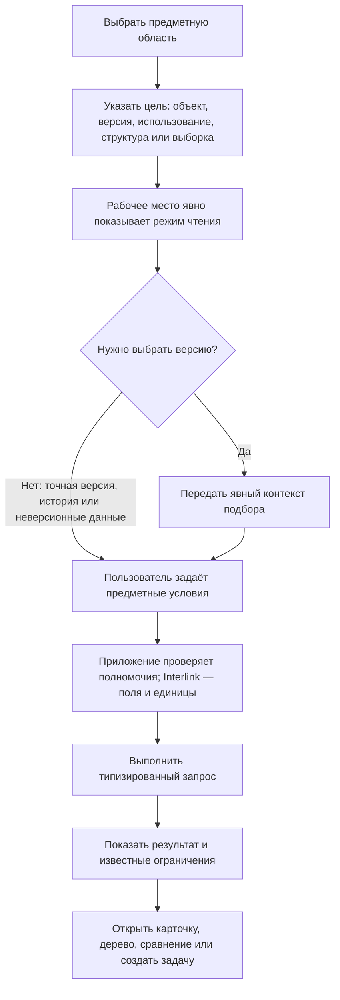
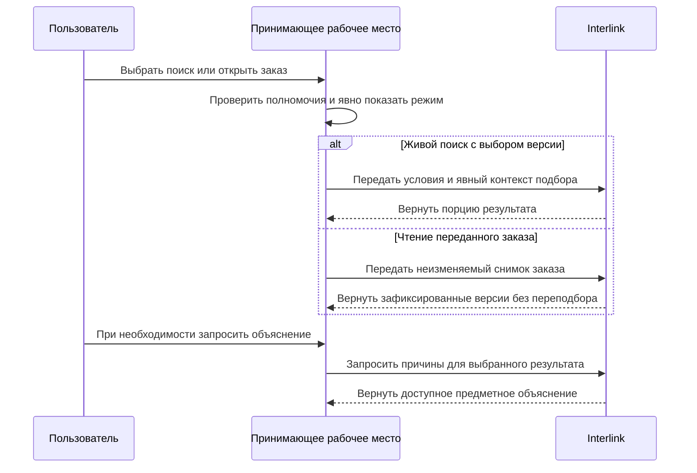

# Поиск, выборки и обход связей глазами пользователя

## Почему поиск является частью модели данных

В PLM недостаточно найти карточку по обозначению. Пользователь ищет:

- устойчивый объект или конкретную его версию;
- все изделия, где применяется деталь;
- документы определённой степени готовности;
- позиции состава, удовлетворяющие инженерному условию;
- объекты, изменяемые в конкретном пакете;
- точный состав заказа или выпуска;
- данные с дополнительным признаком предприятия.

Чтобы такие ответы были одинаковыми в интерфейсе, отчёте, интеграции и у агента, поиск должен использовать ту же типизированную модель и явный режим чтения, что и остальные механизмы Interlink. Контекст подбора версий обязателен именно там, где система должна выбрать версию; для запроса точной известной версии, списка истории или неверсионных данных он может не требоваться.

## Пять разных задач пользователя

### Найти объект

Пользователь ищет деталь, документ, материал, процесс или заказ как устойчивый предмет независимо от числа его версий.

### Найти версию

Нужно открыть точное поколение: выпущенное, рабочее в пакете, историческое или указанное в снимке.

### Найти по связям

Например: «в каких редукторах применяется этот подшипник», «какие операции используют эту оснастку», «какие требования покрывает испытание».

### Развернуть структуру

Нужно пройти состав, маршрут, трассировку требований или другую именованную структуру в определённом направлении и контексте.

### Выполнить именованную выборку

Модель может содержать именованную выборку: «выпущенные детали без назначенного материала», «заказы с резервным подбором», «оснастка с истекающим ресурсом». Её устойчивый идентификатор и содержание относятся к точной редакции всей модели. Согласование, публикация пользователям и расписание выполнения — возможный процесс принимающего продукта, а не уже принятый самостоятельный жизненный цикл ядра Interlink.

Эти задачи имеют разные результаты и не должны скрываться за одним неясным полем «поиск везде».

## Как пользователь начинает поиск

Рабочее место может заранее заполнить поля из текущей задачи, но режим и контекст не становятся скрытыми: приложение показывает их и явно передаёт в запросе. Если операция требует выбора версии, а контекст не передан, запрос отвергается. При чтении производственного заказа приложение передаёт идентификатор его неизменяемого снимка; Interlink читает зафиксированные версии и не пересчитывает их по текущей дате или площадке. При поиске внутри пакета изменения явный контекст может включать рабочие версии этого пакета.

Следующая схема показывает **целевую последовательность** и важное различие между живым поиском и чтением уже зафиксированного заказа.

Главный смысл: принимающее рабочее место проверяет полномочия и не скрывает режим, а Interlink не заменяет снимок заказа живым расчётом. Подробное объяснение не утяжеляет каждый обычный ответ и запрашивается тогда, когда действительно нужно.

## Устойчивый объект и конкретная версия

Результат «Деталь ВАЛ-250» должен ясно отличаться от «версия 04 детали ВАЛ-250».

В списке объектов показываются:

- обозначение и наименование;
- тип;
- показанная версия и режим, в котором она получена;
- степень готовности;
- наличие открытого изменения;
- возможность отдельно запросить объяснение выбора версии.

В списке версий дополнительно показываются поколение, даты, автор, происхождение, состояние и сравнение. Историческая версия не становится текущей только потому, что пользователь нашёл и открыл её.

## Явный режим чтения и контекст подбора

Каждый запрос явно сообщает, какой результат нужен:

- официальное состояние с выбором версии по переданному контексту;
- будущее состояние конкретного пакета с выбором версии по переданному контексту;
- точная известная версия;
- точный неизменяемый снимок основы или заказа;
- исторический просмотр всех версий;
- неверсионные справочные данные.

Скрытого «безопасного профиля по умолчанию» нет. Принимающее приложение может заранее заполнить понятные поля, но обязано показать и передать их явно. Если для выбора версии нет обязательного контекста, операция завершается предметной ошибкой. Запрос точной версии, истории или неверсионных данных не обязан искусственно создавать контекст подбора. Нельзя смешать рабочие версии одного пакета с официальными данными другого или незаметно пересчитать исторический снимок.

## Предметные условия вместо технических выражений

Пользователь выбирает доступные свойства из модели:

- диаметр от 40 до 50 мм;
- материал входит в группу коррозионностойких сталей;
- степень готовности не ниже «допущено в производство»;
- используется в изделии РЦ-250;
- применимо для серии 145 на заданную дату.

Рабочее место проверяет единицы, тип значения и совместимость условий до выполнения. Массу нельзя сравнивать с длиной, а дату — с обозначением.

## Поиск по связям и обратная применяемость

### Прямой обход

От сборки к компонентам, от технологического процесса к операциям, от требования к подтверждающим испытаниям.

### Обратный обход

От детали к верхним изделиям, от оснастки к операциям, от документа к использующим его процессам.

Пользователь выбирает заранее определённый предметный маршрут, а не произвольное соединение таблиц. Определение маршрута задаёт допустимые типы связей, направление, глубину и форму результата.

### Пример

В целевом рабочем месте служба качества ищет все выпущенные насосы, где применяется уплотнение определённой партии. Обратный обход поднимается от уплотнения к узлам и насосам, учитывает точные версии опубликованных составов и показывает путь каждого использования. Результат для фактически изготовленных экземпляров может потребовать отдельного контура «как изготовлено».

## Именованные выборки и их управление

Именованная выборка — многократно используемое определение запроса с понятным названием и устойчивым идентификатором. Определение входит в точную редакцию всей модели; отдельной независимой версии выборки ядро не обещает. Она нужна для рабочих списков, контроля качества, отчётов и агентов.

В **целевом процессе принимающего продукта** владелец перед предоставлением выборки пользователям определяет:

- деловой смысл;
- допустимые параметры;
- тип результата;
- версионный контекст;
- сортировку и продолжение;
- правила полноты и доступа;
- контрольные примеры;
- ожидаемый масштаб.

Изменение содержания входит в новую редакцию модели. Принимающий продукт при необходимости добавляет владельца, согласование, доступность пользователям и расписание. Это возможная корпоративная дисциплина, но не принятый отдельный механизм выпуска выборок внутри ядра Interlink. Два отчёта с одинаковым видимым названием должны сохранять ссылку на устойчивый идентификатор и редакцию модели, чтобы условия не различались незаметно.

## Большие результаты

Целевой интерфейс не обязан возвращать миллион строк одним ответом. Он должен поддерживать ограниченную порцию и продолжение с сохранением порядка и явного режима чтения. При этом основной контракт **не гарантирует**, что заранее известны общее количество строк, процент выполнения или время завершения. Продолжение означает «получить следующую порцию», а не обещание фоновой задачи или шкалы прогресса.

Принимающее приложение может построить поверх этого фоновую выгрузку, кнопку остановки и собственный прогресс, но это его функция. Обычный запрос с продолжением также не гарантирует единый момент чтения для всех порций. Если результат должен быть воспроизводимым, сначала создаётся подходящий неизменяемый снимок основы или заказа и чтение ведётся по нему. Техническая проекция для ускорения не равна доказательному снимку: её можно пересоздать или удалить по правилам обслуживания.

## Полнота и права доступа

Права не должны менять предметную истину незаметно. Возможны три явных результата:

1. Пользователь имеет право на полный результат.
2. Пользователь получает безопасный ограниченный список с указанием, что он неполон.
3. Операция, требующая полного графа — например публикация снимка, — запрещается целиком.

Нельзя назвать дерево полным, если отдельные ветви скрыты политикой доступа. Для чувствительного бизнес-снимка применяется право на весь артефакт.

## Что сохраняется в объяснении

Для результата по запросу доступны:

- цель запроса;
- тип и версия модели;
- предметные условия и единицы;
- версионный контекст;
- применённая именованная выборка и её редакция;
- сортировка и продолжение;
- путь связей;
- причина выбора версии, если вызывающая операция запросила объяснение;
- предупреждения о неполноте;
- время и происхождение, если результат зафиксирован как отчёт.

Обычный просмотр не обязан вычислять подробную цепочку причин и навсегда архивировать каждое нажатие пользователя. Объяснение запрашивается отдельно, когда оно нужно человеку, проверке или решению агента. Опубликованный отчёт, решение агента или доказательный комплект должны сохранять достаточное происхождение по правилам принимающего продукта.

## Как дополнительный признак входит в поиск

В целевом контуре, если редкий дополнительный признак разрешён для поиска, его описание публикует тип, единицу и область. Сначала запрос может обслуживаться менее эффективно. Принимающий продукт наблюдает частоту и стоимость.

Когда признак становится массовым, владелец может принять решение перевести его в штатное физическое поле с индексом и миграцией. Это целевой процесс; пользовательское имя и смысл должны сохраниться.

## Что делает агент

В целевом контуре агент использует те же именованные выборки и типизированные запросы, но с собственными ограничениями объёма, времени и полномочий. Полномочия определяет принимающая платформа; агент получает продолжение, а не пытается выгрузить всю базу.

В ответе агента сохраняются точные исходные объекты и версии. Если данных недостаточно, агент обращается к человеку через механизм заданий принимающей платформы, а не додумывает отсутствующую ветвь.

## Ошибки и действия пользователя

| Ситуация | Понятное сообщение | Следующее действие |
|---|---|---|
| Неизвестное поле | Признак не входит в установленную модель | Выбрать доступный признак или запросить расширение |
| Неверная единица | Условие задано в несовместимой величине | Исправить единицу |
| Рабочий пакет недоступен | Пользователь не является участником или пакет закрыт | Открыть официальное состояние либо запросить доступ |
| Слишком широкий запрос | Ожидается чрезмерный объём | Уточнить условия; принимающий продукт может предложить собственную выгрузку |
| Неполный результат из-за прав | Часть данных недоступна | Использовать разрешённое представление; не публиковать как полный состав |
| Нет версии в контексте | Объект найден, но допустимая версия отсутствует | Открыть объяснение подбора и создать задачу владельцу |
| Определение выборки устарело | Установленная модель несовместима с прежней редакцией | Исправить определение в следующей редакции модели или использовать совместимую редакцию |

## Пример 1. Конструктор ищет подшипник

В целевом рабочем месте конструктор задаёт внутренний диаметр 50 мм, динамическую грузоподъёмность не ниже требуемой и климатическое исполнение. Поиск возвращает устойчивые объекты, а для каждого показывает версию, выбранную политикой проектирования. Один подшипник найден, но его последняя версия аннулирована; по отдельному запросу объяснение показывает, что выбрана предыдущая допустимая версия или результат остановлен — согласно явной политике.

Конструктор сравнивает кандидатов и создаёт точную фиксацию позиции через пакет изменения. Сам поиск состав не меняет.

## Пример 2. Технолог ищет использование оснастки

В целевом рабочем месте перед списанием штампа технолог запускает обратную применяемость. Система показывает технологические операции, версии процессов, изделия и открытые заказы, где штамп требуется. Исторические процессы отделены от текущих, а рабочая версия открытого пакета видна только его участникам по правилам принимающего продукта.

## Пример 3. Руководитель контролирует незаполненные материалы

Принимающий продукт каждую ночь запускает именованную выборку «выпущенные детали без материала» и формирует рабочий список. После изменения модели определение проверяется заново. Планировщик заданий, владельцы, права и экран динамики принадлежат принимающему продукту; Interlink предоставляет идентифицированное определение запроса и целевой типизированный путь выполнения.

## Критерии продуктовой приёмки

Поиск и обходы можно принимать, если:

- запрос выбора версии без обязательного явного контекста отвергается, а точное и неверсионное чтение не требует лишних условий;
- заказ открывается по переданному снимку и не меняется после выпуска новых версий деталей;
- ограниченная порция и продолжение не создают ложного обещания общего количества, прогресса или единого момента чтения;
- подробное объяснение можно запросить отдельно и оно соответствует фактическому результату;
- именованная выборка сохраняет устойчивый идентификатор и связь с точной редакцией всей модели;
- права и задания принимает на себя принимающий продукт, а полный доказательный артефакт не строится из скрытых ветвей;
- обратная применяемость и многоуровневый обход проходят контрольные примеры IPS с понятной классификацией различий.

## Состояние реализации

Язык модели и её проверенное смысловое описание уже содержат запросы и обходы; типизированные прикладные представления частично сформированы в этапах 1–7 основной версии `3df67f5`. Полноценного PostgreSQL-исполнителя, промышленного поиска, самостоятельного жизненного цикла именованных выборок и конечного рабочего места пока нет. Явный контекст подбора, порционная выдача и объяснения здесь описаны как целевой пользовательский контракт без гарантий общего количества, фонового выполнения или единого момента чтения.

Связанные документы: [как модель работает](15-model-to-runtime.md), [подбор версий](../version-selection/18-user-operating-model.md), [производительность](06-performance-and-agent-load.md), [жизненный цикл модели](14-model-lifecycle-and-user-work.md).

Основания: [IL-QUERY], [IL-META], [IL-VERS-SPEC §4–§6], [IL-HOST], [IPS-K02], [IPS-A06]. Расшифровка — в [реестре источников](../knowledge/15-source-register.md).
