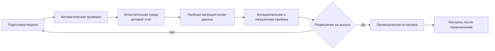
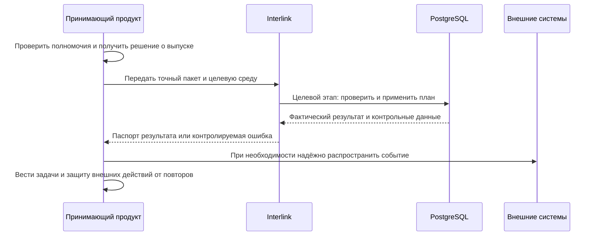

# Пакет выпуска модели, установка и обновление

## Что именно поставляется

Нужно различать три понятия:

- **модуль модели** — самостоятельная поставляемая часть, например инженерная основа или технология;
- **редакция модели предприятия** — согласованный набор точных редакций всех модулей и настроек;
- **пакет выпуска модели** — целевой полный комплект, по которому новую редакцию можно проверить, установить и доказать результат.

Пакет инженерного изменения изделий не заменяет пакет выпуска модели. Первый меняет экземпляры и версии предметных объектов; второй меняет определения типов, свойств, связей и правил.

## Состав пакета выпуска

Ниже приведён **целевой промышленный выпускной комплект из 14 частей**. В нём различаются неизменяемое поставляемое содержание и добавляемые к нему свидетельства конкретной среды. Все свидетельства ссылаются на отпечаток одного поставляемого содержания.

1. исходную и целевую редакции модели;
2. точный перечень модулей и зависимостей;
3. устойчивый отпечаток нормализованной модели;
4. смысловое сравнение для продуктового специалиста;
5. технический план физических изменений базы;
6. правила преобразования существующих данных;
7. начальные справочники и их происхождение;
8. обнаруженные конфликты настроек предприятия;
9. влияние на команды, запросы, карточки, отчёты и интеграции;
10. контрольные изделия и ожидаемые результаты;
11. результаты пробной миграции и нагрузки;
12. решения ответственных;
13. порядок установки, условия остановки и восстановления;
14. отчёт о фактически установленном состоянии.

Части 1–10 и 13 образуют неизменяемое поставляемое содержание: модель, план, правила и ожидаемые результаты. Части 11, 12 и 14 являются неизменяемыми записями испытания, решения и фактической установки в конкретной среде; они добавляются к досье выпуска, а не переписывают поставляемое содержание.

Сегодня паспорт результата компиляции модели, или манифест, уже фиксирует идентичность, имя и версию модели, версию языка, пространство имён, устойчивый отпечаток, шкалы готовности, именованные запросы, заявленные переходы и переименования, а также модули с их версиями, зависимостями, объявлениями и отпечатками. Это важная, но более узкая часть полного комплекта. Физический план PostgreSQL, анализ действующей базы, результаты миграций и нагрузки, решения ответственных, порядок восстановления и паспорт фактической установки пока не формируются ядром как единое досье.

В целевом полном пакете каждый автоматически или вручную преобразованный результат должен ссылаться на исходную запись, редакцию правила, автора решения и итог: перенесено, пропущено по утверждённому правилу, помещено в карантин или завершилось ошибкой. Одна общая цифра «обработано» не заменяет эти различия.

Полномочия на выпуск, маршруты согласования и решение «разрешить установку» принадлежат принимающему продукту и организации заказчика. Interlink должен предоставить точное содержание и проверяемые результаты, но не подменяет корпоративный процесс утверждения.

## Среды и продвижение

Следующая схема — **целевой процесс** после появления исполнителя схемы и миграций.

Между средами продвигается одно и то же точное поставляемое содержание. Каждая среда добавляет собственные записи испытания, решения и установки, связанные с его отпечатком. Нельзя вручную «доправить» промышленную модель после испытания и всё равно считать результат проверенным.

Эта последовательность также показывает границу ответственности: Interlink отвечает за предметный и физический контракт установки, а принимающий продукт — за пользователей, права, согласования, эксплуатационные задания и внешнее распространение. Если уведомление или синхронизация с ERP/MES должны пережить сбой, принимающий продукт использует собственный надёжный журнал исходящих действий и защиту от повторной обработки.

## Чистая установка

**Целевой механизм.** После реализации физической схемы при создании новой площадки специалист должен:

1. подготовить поддерживаемую версию PostgreSQL и необходимые расширения;
2. проверить пустоту и принадлежность целевых схем;
3. установить управляющую часть Interlink;
4. загрузить пакет модели;
5. создать предметные таблицы, ограничения, индексы и начальные данные;
6. установить согласованное принимающее приложение;
7. проверить отпечаток модели и базы;
8. выполнить контрольное создание, чтение, состав и отказ при неверных данных;
9. записать паспорт установленного состояния.

Если любой обязательный шаг не завершён, площадка не объявляется готовой.

## Обновление существующей установки

Весь раздел ниже описывает **целевой исполнитель миграций**; в текущей версии его нет.

### Предварительная проверка

Целевой исполнитель сравнивает установленную и целевую редакции, проверяет исходный отпечаток, свободное место, длительные операции, несовместимые настройки и состояние приложений. Принимающий продукт либо временно останавливает запись, либо обеспечивает доказанное совместимое окно; иначе данные могут измениться после проверки и сделать её недействительной.

### Проверка данных

До изменения схемы выполняются запросы-предусловия: заполнены ли значения, существуют ли дубликаты, можно ли сузить диапазон, не используются ли удаляемые элементы. Пакет фиксирует точку или интервал проверки, а перед переключением повторно подтверждает, что запрещённые изменения не появились.

### Преобразование

План должен выполнять только предусмотренные шаги в известном порядке. Для длительных преобразований реализация может предусмотреть контролируемые порции и безопасное продолжение. Базовый контракт пока не обещает точный процент выполнения или возможность продолжить любой шаг: это определяется отдельно для каждой операции.

### Переключение

Принимающий продукт оркестрирует переключение модели и совместимого приложения. Это не обещание мгновенной общей операции между разными системами: используется остановка записи, барьер развёртывания либо заранее испытанное окно совместимости. Несовместимый потребитель не допускается к новой схеме.

### Проверка результата

После установки сверяются отпечаток, физические объекты базы, ограничения, начальные данные, критичные запросы и прикладные сценарии. Вместе с ожиданиями сохраняются точная модель, настройки предприятия, площадка, момент действия, действующий участник и его область доступа, а для сценария состава — явный контекст подбора или снимок. Отчёт сохраняет фактическое время и отклонения.

## Что видит продуктовый специалист

Не перечень команд установки, а понятный паспорт:

- что добавлено, изменено, устарело и удаляется;
- какие пользователи и процессы затронуты;
- сколько записей просмотрено, изменено, пропущено, завершилось ошибкой и помещено в карантин — для тех операций, которые надёжно считают эти итоги;
- какие исключения остались;
- какие контрольные сценарии пройдены;
- как изменились время поиска и обхода состава;
- какая редакция действительно активна;
- технически ли готова среда и какие ограничения известны; разрешение продолжать работу отдельно выдаёт принимающий продукт.

## Что видит администратор эксплуатации

Целевое рабочее место принимающего продукта показывает этап и известные контрольные данные: выполненные шаги, блокировки, объём, диагностические записи и разрешённые действия. Прогресс и ожидаемая длительность отображаются только когда конкретная операция умеет их надёжно оценить. Кнопка «повторить» доступна только для шагов, спроектированных как безопасно повторяемые.

## Ошибка до переключения

**Целевое поведение.** Если проблема обнаружена до изменения промышленной базы, она остаётся неизменной. Пакет возвращается владельцу со структурированной причиной: несовместимые записи прикладываются, когда они действительно найдены; сбой доступа, связи, времени ожидания или ресурсов описывается отдельно и не маскируется под ошибку данных.

### Пример

Новое правило требует уникального обозначения оснастки в пределах завода. Проверка находит 74 дубликата. Установка не создаёт ограничение поверх неверных данных. Ответственные разбирают список, а затем повторяют пробу.

## Ошибка во время установки

Это **целевой контракт** исполнителя и принимающего продукта.

В целевом пакете для каждого шага должна быть заранее указана стратегия:

- операция находится внутри безопасной транзакции и откатывается;
- длительный шаг, если он специально так спроектирован, работает порциями и продолжает от подтверждённой точки;
- до переключения старые пользователи продолжают работу только при доказанной обратной совместимости уже выполненных изменений; иначе принимающий продукт удерживает запись остановленной;
- если обратный путь опаснее, выпуск останавливается для управляемого исправления вперёд.

Фраза «откатить миграцию» не должна быть общим обещанием. Удаление данных, переписывание большого объёма и начало новой промышленной записи имеют разную обратимость.

## Ошибка после переключения

**Целевое поведение.** Если пользователи уже создали данные по новой модели, возврат старой базы может потерять работу. Обычно выпускается исправляющая редакция. Принимающий продукт может временно отключить проблемную команду, сохранив чтение и остальные совместимые функции.

Целевая история установленной модели показывает обе редакции и причину исправления.

## Совместимость приложений и интеграций

Целевой полный пакет классифицирует изменения:

- совместимое добавление;
- изменение, требующее обновления потребителя;
- устаревание с переходным периодом;
- разрушающее изменение новой крупной редакции.

Для каждого потребителя, зарегистрированного принимающим продуктом в точном снимке инвентаризации, указывается поддерживаемая редакция. Анализ совместимости относится именно к этому снимку; незарегистрированного потребителя нельзя считать автоматически проверенным. Агент, интерфейс или интеграция не должны продолжать работу, если они неверно трактуют новое обязательное поле.

Три примера ниже показывают работу целевого полного пакета и исполнителя миграций.

## Пример 1. Добавление класса точности

В модель зубчатого колеса добавляется обязательный класс точности. Пробная проверка разделяет действующие и архивные версии. Действующие классифицируются, архивные получают разрешённое состояние «не установлено исторически», новые нельзя провести без значения.

После установки карточка и поиск используют поле, а контрольный состав проверяет, что правила выбора не изменились неожиданно.

## Пример 2. Разделение типа документа

Общий тип «Протокол испытаний» разделяется на гидравлический и электрический. Анализ показывает, что часть старых документов можно классифицировать по шаблону, а 320 требуют решения специалиста. Пока карантин не разобран либо не принята явная политика истории, выпуск не считается полностью подтверждённым.

## Пример 3. Индекс для агентской нагрузки

После пилота агенты часто ищут компоненты по признаку прекращения поставки. Поле уже существует, но не индексировано. Новая редакция добавляет физический индекс без изменения предметного смысла. Пробная установка измеряет время построения и ускорение запросов; промышленное окно выбирается по реальному объёму.

## Критерии продуктовой приёмки

Полный процесс выпуска можно принять, когда:

- все 14 частей пакета относятся к одному точному содержанию и не собираются вручную заново для промышленной среды;
- текущий паспорт компиляции проверяется как основа, но не выдаётся за полный эксплуатационный пакет;
- решение ответственного относится к неизменившемуся пакету, а полномочия проверяет принимающий продукт;
- чистая установка и обновление повторены на испытательной среде с одинаковыми обязательными инвариантами: итоговым отпечатком модели и базы, ограничениями и результатами контрольных сценариев; время и количества записей могут зависеть от среды;
- для каждого опасного шага известны условия остановки, повторяемость и способ восстановления;
- внешние уведомления переживают сбой без потери и двойного применения благодаря принимающему продукту;
- паспорт после установки показывает фактически активную редакцию и все отклонения от плана.

## Состояние реализации

В основной версии `3df67f5` реализованы проверка и нормализация модели, её отпечаток, текущий манифест поставки и этапы 1–7 формирования типизированных прикладных представлений. Этап 8 командного запуска и эталонного примера находится в локальной работе; этап 9 приёмки не начат. Генерация физических таблиц PostgreSQL, исполнитель миграций, проверка расхождения модели и базы, полный 14-частный пакет и промышленное рабочее место установки относятся к следующим этапам. Поэтому документ описывает целевой эксплуатационный контракт и отдельно называет уже готовую основу.

Связанные документы: [жизненный цикл модели](14-model-lifecycle-and-user-work.md), [миграция и доказательство](09-migration-execution-and-proof.md), [настройки предприятия](18-enterprise-settings.md), [состояние и риски](13-status-risks-and-acceptance.md).

Основания: [IL-MIG], [IL-DSL], [IL-META], [IL-DB], [IL-HOST], [IL-POC], [IPS-K10]. Расшифровка — в [реестре источников](../knowledge/15-source-register.md).
