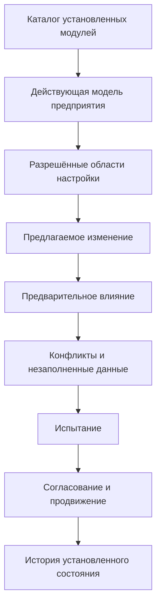
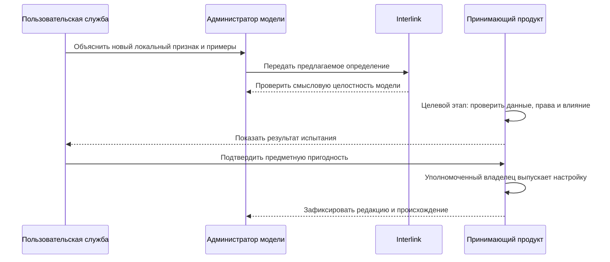

# Настройки предприятия и разрешение конфликтов

## Почему нужны разные режимы настройки

Предприятия должны развивать модель без постоянной доработки ядра. Но одинаковая кнопка «добавить поле» для любого изменения приводит либо к жёсткости, либо к неуправляемому набору метаданных.

Interlink разделяет три режима по цене и ответственности.

Эти три режима задают **целевую архитектуру расширяемости**. В текущем ядре уже есть язык и смысловая модель для поставляемых списков значений и признак того, что список допускает настройку. Каталога настроек предприятия, хранения эксплуатационных изменений, административного рабочего места и автоматического продвижения локального признака в штатную модель пока нет.

## Режим 1. Разрешённая настройка

Применяется там, где семантическая рамка уже определена. Например:

- добавить значение в корпоративный справочник;
- настроить отображаемое название;
- определить профиль выбора версии;
- настроить разрешённую степень готовности;
- включить модуль для организационной единицы.

В целевой системе настройка проверяется и связывается с установленной редакцией модели, но не меняет фундаментальный тип хранения. Профили выбора версий, область применения и выпуск настройки организует принимающий продукт; ядро Interlink пока не реализует их самостоятельный жизненный цикл.

## Режим 2. Дополнительный типизированный признак

В целевой системе предприятие добавляет редкое локальное свойство в разрешённой области. Для него задаются название, тип, единица, допустимые значения, владелец и доступность в поиске.

Такой признак не является произвольным текстовым мешком. Система должна знать его тип и проверять команды. Но массовые запросы по нему могут стоить дороже, чем по штатному физическому столбцу. Хранение и выполнение команд для таких эксплуатационных расширений ещё не реализованы.

## Режим 3. Новая редакция модели

Нужна, когда появляется новый предметный тип, связь, обязательное ограничение, часто используемое поле или изменение, влияющее на физическую схему и контракты.

В целевом процессе редакция проходит полный выпуск, миграцию и установку. Генератор физической схемы и исполнитель миграций относятся к следующим этапам.

## Рабочее место администратора модели

Следующая схема описывает **целевое рабочее место принимающего продукта**, а не уже готовый экран Interlink.

Администратор должен видеть не только локальные изменения, но и их происхождение: штатная поставка, отраслевой модуль, корпоративная настройка или оперативное расширение. Рабочие задания, полномочия и решения о выпуске хранит принимающий продукт.

Схема отделяет уже существующую проверку модели от целевого эксплуатационного процесса. Interlink может обнаружить структурный конфликт определения, но промышленную пригодность данных, права и решение о выпуске обеспечивает принимающий продукт.

## Как создаётся дополнительный признак

Ниже приведена **целевая пользовательская последовательность**; автоматического рабочего контура пока нет.

1. Пользовательская служба формулирует смысл и примеры.
2. Администратор выбирает разрешённый тип объектов и принадлежность объекту либо версии.
3. Задаёт тип значения, единицу, обязательность и справочник.
4. Проверка модели контролирует имя, стабильную идентичность и структурный конфликт с установленной моделью.
5. Целевой анализатор показывает влияние на существующие данные и поиск; текущий компилятор не подключается к промышленной базе и не считает затронутые записи.
6. Проводится испытание на копии.
7. Уполномоченный владелец выпускает настройку.
8. Принимающее приложение показывает признак в предусмотренной универсальной области либо получает отдельное обновление формы.

## Когда локальный признак следует продвигать

В целевом эксплуатационном контуре принимающий продукт собирает показатели востребованности:

- заполнен у большой доли объектов;
- участвует в частом поиске;
- нужен нескольким модулям или предприятиям;
- влияет на подбор, состав или обязательное ограничение;
- требует отдельного индекса;
- его смысл стабилизировался.

Решение о продвижении принимает владелец продукта. В новой редакции создаётся штатное поле, будущий исполнитель миграций переносит значения, а старая форма расширения получает период совместимости и затем закрывается. Автоматического продвижения сейчас нет.

## Конфликт с новой поставкой

### Совпадение имени

Поставщик добавляет штатный признак «Класс покрытия», а предприятие уже имеет локальный признак с таким названием. Имя само по себе не доказывает одинаковый смысл. Целевое рабочее место показывает определения, типы, единицы и использования.

Варианты:

- подтвердить одинаковую семантику и мигрировать в штатное поле;
- сохранить два понятия с различёнными названиями;
- отказаться от поставки до переработки;
- создать явное преобразование.

### Совпадение идентичности

Два модуля используют один устойчивый идентификатор для разных определений. Сборка блокируется: автоматическое разрешение невозможно.

### Несовместимое ограничение

Новая модель делает поле обязательным или сужает диапазон, а локальные данные не соответствуют. На целевом этапе пробная установка показывает точные записи и требует миграционного решения. Текущий компилятор видит изменение определения, но не исследует промышленную базу.

### Конфликт интерфейса

Локальная форма ожидает старое свойство, которое устаревает. Целевой полный пакет выпуска должен показать несовместимый потребитель и не объявлять обновление полностью готовым без плана перехода.

## Начальные справочники и локальные значения

Уже реализованный минимальный контракт списка значений позволяет модели задать устойчивый идентификатор и имя списка, упорядоченные начальные элементы со стабильным ключом и локализованной подписью, не более одного элемента по умолчанию и признак разрешённой настройки списка. Эти определения проходят проверку и входят в отпечаток и редакцию модели.

**Целевой корпоративный каталог** добавляет эксплуатационные сведения, которых в текущем минимальном контракте нет: владельца, область предприятия, период действия, активность, правила замещения, согласование и происхождение локального изменения. Принимающий продукт хранит эти сведения и применяет полномочия.

Обновление модуля не должно стирать локальные значения. Если новое штатное значение дублирует локальное, целевой процесс требует сопоставления и сохранения ссылок. Механизм трёхстороннего обновления поставляемого и локального состава ещё не реализован.

## Настройки и несколько предприятий

В целевой многопредприятной установке область настройки должна быть явной: вся группа, юридическое лицо, завод, проект или другое утверждённое измерение. Пользователь видит, почему значение доступно на одной площадке и недоступно на другой.

Область не должна подменять права. Сначала определяется предметная применимость настройки, затем принимающий продукт проверяет полномочия пользователя. Interlink не хранит корпоративные роли, задания и маршруты согласования.

## Пример 1. Марки термообработки

В целевом рабочем месте завод добавляет значение «низкотемпературное азотирование» в разрешённый технологический справочник. Оно проходит проверку на дубликат, получает ссылку на стандарт и область завода. После выпуска карточка операции и поиск используют значение без новой физической таблицы.

## Пример 2. Протокол вихретокового контроля

В целевом контуре локальный признак «номер протокола вихретокового контроля» добавляется версии детали. Сначала он редок и хранится как типизированное расширение. После распространения контроля на всю линейку признак становится обязательным, часто ищется и включается в отчёт. Продуктовая команда переводит его в штатную модель с физическим столбцом и миграцией.

## Пример 3. Модуль цифрового паспорта оборудования

В целевом процессе предприятие подключает модуль фактических экземпляров, измерений и обслуживания. Это не набор полей основной детали, а новая предметная область со связями и жизненным циклом. Модуль устанавливается как отдельная зависимость, а его дальнейшее развитие создаёт основу цифрового двойника.

## Ошибки и восстановление

В целевом процессе изменение настройки до выпуска остаётся черновиком администратора. После публикации оно имеет редакцию и историю. Ошибочное выпущенное значение не переписывается незаметно: создаётся следующая редакция, а затронутые данные проходят предусмотренное преобразование. Хранение такого черновика и истории обеспечивает принимающий продукт; готового контура в Interlink пока нет.

В целевом процессе при конфликте промышленная система продолжает использовать последнюю совместимую активную редакцию. Новая поставка не становится частично активной.

## Критерии продуктовой приёмки

Механизм настроек можно считать подтверждённым, если:

- пользователь ясно различает разрешённую настройку, дополнительный локальный признак и новую редакцию штатной модели;
- минимальный список значений сохраняет устойчивые ключи, порядок, подписи и допускает не более одного элемента по умолчанию;
- корпоративные владелец, область, период действия и согласование не приписываются уже реализованному минимальному контракту;
- принимающий продукт проверяет полномочия и хранит задания, решения и историю локальных редакций;
- обновление поставки не стирает локальные значения и требует явного решения при совпадении смыслов;
- продвижение локального признака в штатное поле сохраняет идентичность и проверяется миграцией;
- конфликт не оставляет промышленную среду на частично активной смеси двух редакций.

## Состояние реализации

В основной версии `3df67f5` реализованы чтение, проверка и типизированные прикладные представления поставляемых определений модели, включая минимальный контракт списков значений. Уровни эксплуатационной расширяемости и их ограничения описаны как целевая архитектура. Полноценного каталога корпоративных настроек, хранения локальных редакций, административного рабочего места, анализа действующих данных, трёхстороннего обновления и продвижения расширений пока нет. Эти возможности должны развиваться после подтверждения основного контура физической схемы и миграций.

Связанные документы: [расширяемость](05-extensibility-and-customization.md), [жизненный цикл модели](14-model-lifecycle-and-user-work.md), [выпуск и установка](17-model-release-and-installation.md), [цифровые двойники](11-digital-twin-roadmap.md).

Основания: [IL-DSL], [IL-META], [IL-MIG], [IL-HOST], [AN-ARAS], [AN-THINGWORX]. Расшифровка — в [реестре источников](../knowledge/15-source-register.md).
