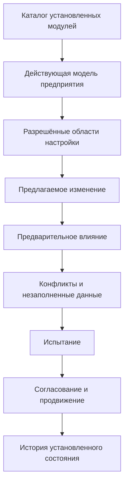
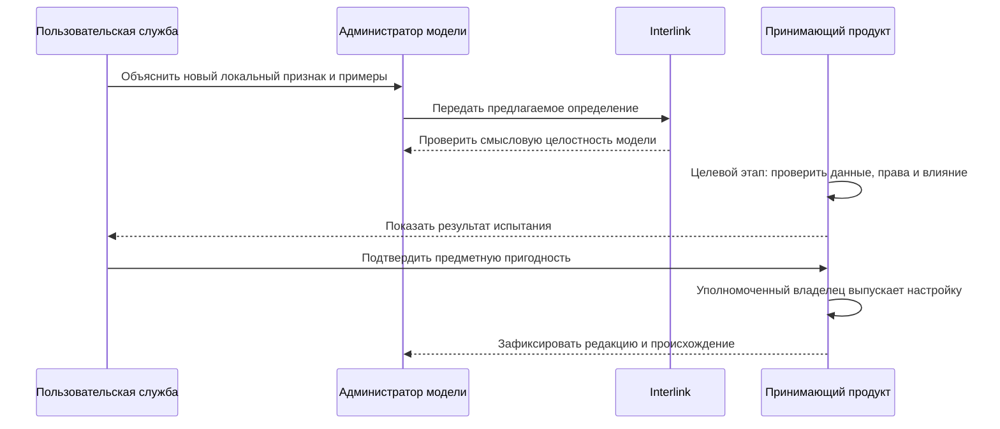

# Настройки предприятия и разрешение конфликтов

## Почему нужны разные режимы настройки

Предприятия должны развивать модель без постоянной доработки ядра. Но одинаковая кнопка «добавить поле» для любого изменения приводит либо к жёсткости, либо к неуправляемому набору метаданных.

Целевая архитектура Interlink разделяет три режима по цене и ответственности. Реализованы язык модели, композиция модулей, исходная модель поставляемых списков значений и строительные блоки сравнения редакций. Каталога эксплуатационных настроек, хранения локальных изменений, административного рабочего места и команд для оперативных расширений пока нет. Ниже описан порядок, к которому должен прийти продукт, а не уже доступное административное меню.

## Режим 1. Разрешённая настройка

Применяется там, где семантическая рамка уже определена. Например:

- добавить значение в корпоративный справочник;
- настроить отображаемое название;
- определить профиль выбора версии;
- настроить разрешённую степень готовности;
- настроить область действия уже установленного модуля в заранее разрешённых границах.

В будущем настройка должна проверяться, связываться с точной редакцией установленной модели и не менять фундаментальный тип хранения. Область применения, выпуск и полномочия задаёт принимающий продукт.

Настройка представления, выбор разрешённых параметров правила и изменение самого исполняемого правила — не одно действие. Например, выбрать для завода предусмотренный профиль подбора можно в установленной рамке. Ввести неизвестный системе способ расчёта совместимости нельзя просто новым текстом настройки: требуется проверенное расширение возможностей и его выпуск. Перестановка полей на личном экране, напротив, обычно относится к данным принимающего приложения и не меняет модель предприятия.

## Режим 2. Дополнительный типизированный признак

В целевом режиме предприятие сможет добавлять редкое локальное свойство в разрешённой области. Для него будут задаваться название, тип, единица, допустимые значения, владельцы и доступность в поиске.

Такой признак не должен быть произвольным текстовым мешком. Будущий контур будет знать его тип и проверять команды, но массовые запросы по нему могут стоить дороже, чем по штатному физическому столбцу. Хранение и команды эксплуатационных расширений ещё не реализованы.

## Режим 3. Новая редакция модели

Нужна, когда появляется новый предметный тип, связь, обязательное ограничение, часто используемое поле или изменение, влияющее на физическую схему и контракты.

В целевом процессе редакция будет проходить полный выпуск, миграцию и установку. Сравнение моделей, планирование изменений и каталог определений уже имеют реализацию; создание предметных таблиц находится в отдельно проверяемой локальной работе. Это ещё не готовый исполнитель установки: он должен доказать преобразование данных, сохранность истории и соответствие приложения установленной модели.

Граница проходит по смыслу изменения, а не по наличию кнопки в будущем интерфейсе. Добавить разрешённую пару «материал — покрытие» в уже установленную таблицу совместимости — изменить предметные данные. Изменить правила толкования такой пары, тип её значения или набор измерений — пересмотреть договор модели. Аналогично новый результат измерения температуры не требует новой редакции модели, а добавление оси «влажность» в справочную таблицу требует проверки формы таблицы и судьбы старых данных. Подробнее: [табличные данные](../tabular-data/README.md) и [матрицы совместимости](../substitution-and-compatibility/02-compatibility-matrices.md).

## Рабочее место администратора модели

Ниже описано целевое рабочее место принимающего продукта, а не текущий экран Interlink.

Администратор должен видеть не только локальные изменения, но и их происхождение: штатная поставка, отраслевой модуль, корпоративная настройка или оперативное расширение.

Схема сохраняет границу между проверкой предлагаемого определения и эксплуатационным решением. Структурная проверка модели уже имеет реализацию; административный путь принятия локального расширения, испытание данных и выпуск настройки остаются целевым процессом. Задания, полномочия и решения хранит принимающий продукт. Ни успешная проверка определения, ни разрешение пользователя сами по себе не меняют промышленную модель.

## Как создаётся дополнительный признак

1. Пользовательская служба формулирует смысл и примеры.
2. Администратор выбирает разрешённый тип и смысл принадлежности: постоянные сведения об объекте, сведения об инженерной версии, изменяемое рабочее содержание, обычная оперативная запись либо отдельный неизменяемый факт.
3. Задаёт тип значения, единицу, обязательность и справочник.
4. Определение проходит предусмотренную проверку типов и структурных конфликтов. Существующий компилятор является основанием такой проверки; готового контура приёма оперативных расширений пока нет.
5. Будущий анализатор установки покажет влияние на существующие данные и поиск.
6. Проводится испытание на копии, включая открытие прежних опубликованных состояний. Сохранение нового значения в рабочем содержании не должно само по себе публиковать его для производственного применения.
7. Уполномоченный владелец выпускает настройку.
8. Принимающее приложение показывает признак в предусмотренной универсальной области либо получает отдельное обновление формы.

## Когда локальный признак следует продвигать

В целевом контуре принимающий продукт сможет собирать признаки востребованности:

- заполнен у большой доли объектов;
- участвует в частом поиске;
- нужен нескольким модулям или предприятиям;
- влияет на подбор, состав или обязательное ограничение;
- требует отдельного индекса;
- его смысл стабилизировался.

Решение о продвижении будет принимать владелец продукта. После этого выпускается новая редакция модели, а будущий исполнитель миграций создаёт штатное поле, переносит значения и закрывает старую форму расширения после предусмотренного периода совместимости. Автоматического продвижения сейчас нет.

## Конфликт с новой поставкой

### Совпадение имени

Поставщик добавляет штатный признак «Класс покрытия», а предприятие уже имеет локальный признак с таким названием. Имя само по себе не доказывает одинаковый смысл. Система показывает определения, типы, единицы и использования.

Варианты:

- подтвердить одинаковую семантику и мигрировать в штатное поле;
- сохранить два понятия с различёнными названиями;
- отказаться от поставки до переработки;
- создать явное преобразование.

### Совпадение идентичности

Два модуля используют один устойчивый идентификатор для разных определений. Сборка блокируется: автоматическое разрешение невозможно.

### Несовместимое ограничение

Новая модель делает поле обязательным или сужает диапазон, а локальные данные не соответствуют. Установка показывает точные записи и требует миграционного решения.

### Конфликт интерфейса

Локальная форма ожидает старое свойство, которое устаревает. Пакет выпуска показывает несовместимый потребитель и не объявляет обновление полностью готовым без плана перехода.

## Начальные справочники и локальные значения

Штатный модуль уже может описывать базовый список значений: машинный код, порядок, локализованную подпись, не более одного значения по умолчанию и признак разрешённой настройки. Возможность предприятия фактически добавлять локальные значения, а также владелец, область, период действия, активность и замещение относятся к будущему каталогу настроек принимающего продукта.

Поставляемый список имеет устойчивое определение, а его элементы — устойчивые ключи: порядок на экране и перевод подписи не заменяют идентичность элемента. Эти определения проходят проверку и учитываются в соответствующем выпуске модели. Отдельно надо определить, является ли местное дополнение разрешённой правкой данных или изменением установленного смысла списка; одинаковая кнопка «добавить значение» не отменяет этой классификации.

Обновление модуля не должно стирать локальные значения. Если новое штатное значение дублирует локальное, требуется сопоставление и сохранение ссылок.

## Настройки и несколько предприятий

В многопредприятной установке область настройки должна быть явной: вся группа, юридическое лицо, завод, проект или другое утверждённое измерение. Пользователь видит, почему значение доступно на одной площадке и недоступно на другой.

Область не должна подменять права. Предметная применимость отвечает на вопрос, где настройка действует, а полномочия — кто вправе её увидеть, выбрать или изменить. Обе проверки обязательны; принадлежность заводу не даёт автоматического доступа к его закрытым данным. Недоступное значение также нельзя выдавать за несуществующее и незаметно заменять другим.

## Целевые примеры

Следующие примеры показывают ожидаемое поведение будущего контура настроек и расширений.

### Пример 1. Марки термообработки

Завод добавляет значение «низкотемпературное азотирование» в разрешённый технологический справочник. Специалист сначала подтверждает, что это новый допустимый элемент существующего справочника, а не изменение смысла закрытого перечня. Значение проходит проверку на дубликат, получает ссылку на стандарт и область завода. После разрешённого выпуска справочника карточка операции и поиск предлагают новый вариант без создания отдельного предметного типа. Прежняя технологическая публикация продолжает показывать тот справочник и выбор, с которыми она была выпущена.

### Пример 2. Протокол вихретокового контроля

Локальный признак «номер протокола вихретокового контроля» сначала предлагается добавить к детали. Разбор показывает важную разницу: требование проводить такой контроль относится к инженерному определению детали, а сам протокол относится к конкретному испытанию партии или экземпляра. Один признак на версии потерял бы сведения о повторных испытаниях. Поэтому модель связывает деталь с отдельными протоколами, а редкую местную характеристику протокола оставляет типизированным расширением.

Когда контроль распространяется на всю линейку, характеристика начинает участвовать в частом поиске и отчётах. Продуктовая команда переводит её в штатное поле с проверенным переносом значений. Старые протоколы остаются самостоятельными фактами: их не пересоздают как новые инженерные версии и не объединяют только из-за одинакового номера.

### Пример 3. Модуль цифрового паспорта оборудования

Предприятие подключает модуль фактических экземпляров, измерений и обслуживания. Это не набор полей основной детали, а новая предметная область со связями и собственными правилами изменения. Карточка установленного насоса может содержать изменяемые эксплуатационные сведения, измерение давления — отдельный неизменяемый факт, а конструкция насоса — инженерные версии с опубликованными состояниями. Модуль устанавливается как проверенная зависимость, а его дальнейшее развитие создаёт основу цифрового двойника. Общий фундамент не требует проводить каждое измерение через инженерный пакет изменения.

## Ошибки и восстановление

Подготовка новой официальной редакции настройки не меняет уже применяемое содержание. Самостоятельное сохранение работы и её выпуск различаются. При этом не любая настройка обязана иметь инженерные версии: для оперативной записи допустим отдельный управляемый режим изменения, а для официальной редакции справочника сохраняется точное опубликованное содержание. Ошибочное значение, уже вошедшее в удерживаемое историческое свидетельство, не переписывается незаметно: выпускается исправление либо явное дополнение по договору соответствующих данных.

При обнаружении конфликта до применения изменений промышленная система может продолжать использовать прежнюю совместимую редакцию. Если установка уже частично изменила хранилище, работа остаётся остановленной до подтверждённого восстановления или завершения перехода. Одного наличия прежнего номера модели недостаточно, чтобы объявить среду безопасной. Новая поставка не становится частично активной.

## Критерии продуктовой приёмки

Механизм настроек можно считать подтверждённым, если:

- пользователь различает разрешённую настройку, дополнительный локальный признак и новую редакцию штатной модели;
- минимальный список значений сохраняет устойчивые ключи, порядок, подписи и допускает не более одного элемента по умолчанию;
- корпоративные владелец, область, период действия и согласование не приписываются уже реализованному минимальному описанию списка;
- принимающий продукт проверяет полномочия и хранит задания, решения и историю локальных редакций;
- обновление поставки сопоставляет прежнюю поставку, местные изменения и новую поставку: локальные значения не стираются молча;
- продвижение признака сохраняет смысл и проверенное соответствие старого и нового определения; сохранение или замена идентификатора расширения определяется явным планом, а не обещается заранее для любого перехода;
- конфликт не оставляет промышленную среду открытой на частично установленной смеси редакций.
- неподдержанная настройка отклоняется до открытия промышленной работы, а не сохраняется как якобы действующая.

## Состояние реализации

Уровни расширяемости и их ограничения описаны как целевая архитектура. Полноценного каталога корпоративных настроек, административного рабочего места, автоматического анализа конфликтов и продвижения расширений пока нет. Эти возможности должны развиваться после подтверждения основного контура модели и миграций.

Связанные документы: [расширяемость](05-extensibility-and-customization.md), [жизненный цикл модели](14-model-lifecycle-and-user-work.md), [выпуск и установка](17-model-release-and-installation.md), [цифровые двойники](11-digital-twin-roadmap.md).

## Основания

[IL-DSL], [IL-META], [IL-MIG] и [IL-HOST] — исходные уровни расширяемости и граница принимающего продукта; [IL-DB] и [IL-STORAGE] — требования к хранению и актуальной установке; [IL-NEUTRAL], [IL-DATA-MODEL] и [IL-PLAN-V2] — формы записи, их проекция и приёмка; [IL-TD] и [IL-SC] — разделение настройки формы и предметных таблиц/правил. Расшифровка и границы применимости — в [реестре источников](../knowledge/15-source-register.md).
