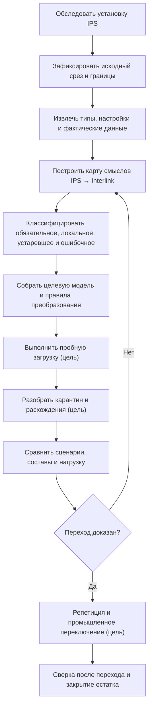
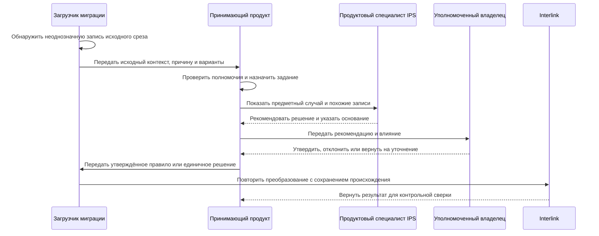

# Как продуктовые специалисты участвуют в переносе IPS

## Миграция — совместная предметная работа

Автоматическая загрузка может перенести строки, но не способна сама решить, что в конкретной установке IPS является обязательной бизнес-семантикой, историческим исключением или ошибкой данных. Поэтому миграция строится как совместная работа специалистов IPS, владельцев предметных областей, архитектора Interlink, внедрения и эксплуатации.

Цель — не только получить одинаковое число записей. Нужно доказать, что пользователи выполняют обязательные сценарии и получают объяснимо эквивалентный результат там, где поведение должно сохраниться.

Практический результат работы специалиста — согласованный профиль конкретной установки: какие возможности используются, что обязано сохраниться, какими примерами это проверяется и кто принимает результат. Отсутствие нужного механизма в сегодняшней реализации Interlink не означает, что требование IPS можно объявить неприменимым. Допустима временно ограниченная область опытной эксплуатации, но она не закрывает оставшийся разрыв.

## Основные участники

| Участник | Основная ответственность |
|---|---|
| Продуктовый специалист IPS | Объяснить реальную семантику, варианты настройки и пользовательские ожидания |
| Ключевые пользователи | Подтвердить рабочие сценарии и исключения |
| Владелец предметной области | Принять целевые термины, очистку и допустимые отличия |
| Архитектор модели Interlink | Построить целевую типизированную модель |
| Специалист миграции | Извлечь, сопоставить, преобразовать и доказать происхождение |
| Эксплуатация | Подготовить среды, окно, повтор, переключение и наблюдение |
| Владелец интеграции | Управлять временным сосуществованием и внешними идентификаторами |

Принимающий продукт и организация заказчика владеют пользователями, правами, заданиями очистки, согласованиями и решением о переключении. Interlink не должен становиться второй системой корпоративных задач или полномочий.

## Полный путь перехода

Схема описывает требуемый проектный процесс. Средства пробной загрузки, происхождения, карантина, обратной записи и переключения пока не образуют готового продукта.

Внутри пробного прогона особенно важно не потерять происхождение и не превратить неоднозначность в случайное значение. Следующая схема показывает **целевую работу с исключением**.

Interlink в этой схеме принимает уже определённое преобразование. Задание, полномочия и решение специалиста принадлежат принимающему продукту; промышленный загрузчик и хранилище происхождения пока являются целевыми средствами.

## Шаг 1. Обследование конкретной установки

Нельзя мигрировать «IPS вообще». Нужно зафиксировать:

- версии и установленные модули;
- пользовательские типы, атрибуты и справочники;
- жизненные циклы и права;
- механизмы подбора версий;
- жёсткую и мягкую конкретизацию, рабочие контексты и восстановление итераций;
- структуры, производственные ведомости и заказы;
- таблицы справочных данных, формулы, допустимые замены и правила совместимости;
- интеграции, файлы и архивы;
- объёмы, глубину составов и рабочую нагрузку;
- известные обходные процессы пользователей;
- требования хранения и юридической значимости.

Результат обследования имеет владельца и дату. Если установка продолжает изменяться, отклонения управляются отдельно.

Проверка не ограничивается составом изделия. Требования и подтверждения, процессы согласования, календарные планы, формы и отчёты, сохранённый поиск, подписки и распределённый обмен тоже могут быть обязательной частью работы предприятия. Для каждой области фиксируются используемый вариант, источник сведений и ключевой пользователь, способный подтвердить сценарий.

## Шаг 2. Исходный неизменяемый срез

Для повторяемой миграции нужен именованный исходный срез с доказанной согласованностью и точными границами. Предпочтителен согласованный транзакционный снимок источника. Если IPS нельзя получить целиком одним снимком, фиксируются начало и конец захвата, исходная и конечная отметки журнала изменений, порядок событий и правило сведения дельты. Одной отметки времени недостаточно. Формирование такого среза является задачей проекта переноса и пока не готовой функцией Interlink.

Если IPS продолжает работу до переключения, изменения после среза попадают в отдельный журнал последних изменений. Команда должна доказать отсутствие пропущенного промежутка между исходной выгрузкой и этим журналом. Нельзя незаметно смешивать данные разных моментов и объявлять результат полным. Изменение самих правил или метаданных IPS тоже учитывается: перенос одних новых карточек не компенсирует смену алгоритма их обработки.

## Шаг 3. Карта смыслов

Для каждого значимого понятия фиксируется:

- термин и описание IPS;
- физические источники и варианты хранения;
- фактические пользовательские правила;
- целевой тип, свойство или связь Interlink;
- правило идентичности и версий;
- преобразование значений;
- допустимые потери или изменение поведения;
- контрольный пример;
- владелец решения.

Внешне одинаковые столбцы могут иметь разный смысл, а один смысл IPS может храниться в нескольких путях. Карта опирается на работу системы и пользователей, не только на имя таблицы.

Для истории карта раздельно описывает объект, инженерную версию, точное опубликованное состояние и незавершённый черновик. Например, версия «Б» корпуса насоса может сохранять обозначение после публикации исправленного содержания. Снимок прежней передачи заказа должен продолжить ссылаться на прежнее точное состояние, а жёсткая конкретизация версии «Б» — сохранять именно тот смысл, который подтверждён в установке IPS. Подмена одного вида ссылки другим может не проявиться в первой выгрузке, но изменить результат следующей работы.

## Шаг 4. Классификация наследия

Каждый элемент относится к одной из групп:

- обязательная функция, которую нужно воспроизвести;
- локальное требование предприятия;
- исторический артефакт, который сохраняется только для чтения;
- ошибочные или неполные данные, требующие очистки;
- реализационная особенность IPS, которую не следует переносить буквально;
- открытый вопрос без достаточного доказательства.

Решение оставить старые данные только в архиве должно быть таким же явным, как решение перенести их в активную работу. Требование пользователя и внутреннее устройство IPS различаются: механизм можно реализовать иначе, но обязательный пользовательский результат необходимо сохранить и проверить.

## Шаг 5. Черновик целевой модели

По карте собираются модули Interlink. Специалист IPS проверяет не предметный язык модели, а понятный предметный отчёт:

- какие типы, инженерные версии, опубликованные состояния и рабочие копии появятся;
- как представлены состав и позиции;
- что станет выбором инженерной версии, точного состояния, применяемостью или правилом;
- как сохранятся итерации и история;
- какие справочники объединяются или разделяются;
- где поведение сознательно изменено.

После предметного согласования готовится проверенный пакет модели с точными зависимостями и правилами её установки. Специалист не должен утверждать «модель вообще»: решение относится к конкретному содержанию, на котором были пройдены примеры. Изменившийся пакет или правило преобразования требуют новой проверки затронутой области. Установщик обязан подтвердить соответствие пакета базе до допуска загрузки и последующей работы пользователей.

## Шаг 6. Пробная загрузка

Целевое средство загрузки должно работать порциями с устойчивыми исходными идентификаторами. Продолжение возможно только для специально спроектированного длительного шага, от подтверждённой контрольной точки и при неизменных исходном срезе, редакции модели, правилах и версии средства преобразования. Универсальный безопасный повтор любого шага не обещается.

Для каждой исходной записи назначается ровно один взаимоисключающий итог:

- перенесена;
- пропущена по утверждённому правилу;
- помещена в карантин;
- ожидает безопасного повтора;
- завершилась окончательной ошибкой.

Предупреждения и диагностика прилагаются к итогу и не образуют второй итог. Цепочка происхождения должна связывать исходный срез и запись, запуск и порцию, отпечаток целевой модели, редакцию правила, версию средства преобразования, решение и автора.

## Целевое рабочее место разбора карантина

Будущее рабочее место принимающего продукта должно показывать продуктовому специалисту предметный случай. Задания, владельцев, сроки, полномочия и решения хранит принимающий продукт; миграционный контур связывает их с исходной и целевой идентичностями.

- исходный объект IPS и его контекст;
- причину, по которой автоматическое правило не сработало;
- предлагаемые целевые варианты;
- количество похожих записей;
- влияние решения;
- образцы документов и составов;
- владельца и срок.

Решение уполномоченного владельца может применяться к одному объекту, доказанной группе или стать новой версией общего правила преобразования. Массовое правило сначала проверяется на выборке. Каждое исправление сохраняет автора, основание, исходный срез и редакцию правила и не переписывает происхождение задним числом.

### Пример

В IPS поле «Материал» иногда содержит марку стали, иногда ссылку на справочник, а иногда текст «по чертежу». Миграция не помещает всё в одно строковое поле Interlink. Ссылки сопоставляются справочнику, марки нормализуются, а «по чертежу» переводится в отдельный признак неопределённости с заданием владельцу, если материал обязателен.

## Доказательство технической полноты

Это целевой отчёт миграционного контура. Уже существующий компилятор проверяет описание модели, но не подсчитывает записи промышленной базы и не доказывает полноту переноса. Для такого доказательства нужен отдельный проверенный отчёт.

Сверяются:

- количество исходных и целевых объектов по классам;
- идентичности и версии;
- связи и позиции;
- файлы и контрольные отпечатки;
- справочники и значения;
- карантин, ошибки и исключения;
- покрытие всего исходного среза.

Утверждение «очередь обработана» недостаточно. Нужно доказать, что каждая запись источника либо перенесена, либо находится в известном принятом состоянии.

Число состояний не обязано совпасть с числом инженерных версий, а несколько рабочих областей не означают несколько разных изделий. Поэтому отчёт показывает категории отдельно. Он также позволяет перейти от конкретного результата Interlink к исходной записи и правилу переноса: иначе обнаруженное позже расхождение трудно исправить безопасно.

## Доказательство функциональной эквивалентности

Ключевые пользователи выполняют одинаковые деловые сценарии при одном сохранённом наборе условий: исходном срезе IPS, точной редакции модели, площадке, моменте действия, политике и явном контексте подбора версий:

- найти объект и его версию;
- открыть карточку и историю;
- развернуть состав;
- подобрать версии в известных режимах IPS;
- проверить мягкую конкретизацию разных позиций одного объекта и её поведение после переходов жизненного цикла;
- начать и провести изменение;
- сформировать производственную ведомость и заказ;
- открыть точную историческую публикацию;
- выполнить обмен и проверить результат.

Нужны и отрицательные случаи: у пользователя нет доступа; подходящая версия отсутствует; несколько правил дают конфликт; комплект замены заполнен лишь частично; обязательная совместимость не доказана. «Не установлено» не превращается в «разрешено», а отсутствующая возможность Interlink не маскируется под дефект исходных данных.

Сравниваются не только экраны, а выбранные объекты, версии, причины, ошибки и дальнейшие действия.

## Дифференциальная проверка составов

Это целевой стенд сравнения, который предстоит создать для проекта переноса. Сравнением называют выполнение одних и тех же сценариев в обеих системах и предметный разбор каждого отличия.

Для набора контрольных изделий IPS и Interlink получают один сохранённый контекст: идентичность исходного среза, точную редакцию модели, головное изделие, площадку, серию или заказ, момент действия, политику и явные условия подбора. Сравниваются:

- присутствующие позиции;
- выбранные объекты и замены;
- инженерные версии и точные опубликованные состояния там, где этого требует сценарий;
- количество и единицы;
- глубина и повторные вхождения;
- применяемость;
- причины различий.

Любое отличие классифицируется как ошибка переноса, принятая новая семантика, дефект исходных данных или открытый вопрос. Оно не теряется в общей статистике.

В новой модели описание допустимой замены, выбор для конкретного заказа и факт установки — разные вещи. Проверочный пример должен пройти все требуемые стадии. Если в IPS аналоги принадлежат исходной версии, проверяется и эта зависимость: список для версии «Б» нельзя подставлять версии «В» только потому, что это один объект. Для многомерной справочной таблицы дополнительно сверяются роли осей, единицы, фактический набор сочетаний, формулы и смысл незаполненных клеток.

## Нагрузочная проверка

На объёме, близком к предприятию, измеряются поиск, карточка, обратная применяемость, глубокий состав, пакет изменения, массовая загрузка и агентские запросы. Сравнение с IPS учитывает инфраструктуру и сценарий, а не только среднее время одной операции.

## Стратегии переключения

### Одномоментный переход

Подходит при ясной границе, приемлемом окне остановки и полной готовности интеграций. Запись в переводимой области IPS прекращается, переносятся и сверяются последние изменения после исходного среза, затем пользователям открывается запись в Interlink. Последовательность должна исключать промежуток, в котором обе системы независимо принимают изменения одних данных.

### Поэтапный переход по предметным областям

Области переходят последовательно. Для каждой заранее определён источник истины и допустимые направления ссылок. Нельзя позволять двум системам независимо менять один объект.

### Сопровождающий режим поверх IPS

IPS остаётся авторитетной, а новая система читает точные внешние объекты, анализирует и координирует работу. Обратная запись — целевой механизм принимающего продукта и отдельного соединителя, а не готовая функция Interlink. Намерение и внешний номер операции надёжно сохраняются до обращения к IPS. Если действие сопровождает локальное изменение, их нельзя фиксировать независимо: иначе изменение сохранится, а поручение IPS потеряется. Полномочия проверяются и при подготовке, и перед отправкой.

При потерянном ответе фиксируется «исход неизвестен». Повтор того же неизменного действия допустим только по заранее проверенному договору, который действительно защищает конкретную операцию IPS от дубля. Если такого договора нет, нужно сначала установить её результат в источнике. Тайм-аут, недоступная карточка или отсутствие записи в отстающей копии не доказывают, что действие не состоялось. До выяснения пользователь видит ожидание подтверждения, а не ложный успех или разрешение создать ещё один заказ.

## Репетиция переключения

Команда полностью повторяет:

- финальный срез;
- дельту;
- длительность каждой операции;
- переключение приложений и интеграций;
- контрольные сценарии;
- решение остановиться или продолжить;
- восстановление;
- коммуникацию пользователям.

План промышленного окна основывается на измеренной репетиции.

Отдельный сценарий репетиции — решение вернуться после появления новых данных Interlink. Владелец области заранее выбирает допустимый путь: временно не принимать новые записи, доказанно перенести их обратно или исправлять ситуацию уже в новой системе. Резервная копия IPS сама по себе не содержит новых решений пользователей и потому не является полным планом возврата.

## Что происходит после перехода

В течение согласованного периода работают усиленные сверки. Принимающий продукт назначает владельцев открытых расхождений и ведёт задания исправления. Исходный срез IPS, точные редакции моделей и справочников, правила чтения значений и необходимые файлы сохраняются по принятой политике. Одного номера версии или контрольной суммы файла для воспроизведения недостаточно.

Старая система не уничтожается автоматически после первого успешного дня. Условия архивирования и отключения определяются отдельно.

## Пример 1. История детали и итерации

У корпуса гидроцилиндра есть инженерная версия «Г», два известных опубликованных состояния и промежуточные итерации новой рабочей правки. Одна итерация использовалась для опытного изготовления. Специалист IPS выясняет, какие файлы и разрешения действительно сохранились. Перенос удерживает опубликованную историю, а рабочую итерацию — как рабочее свидетельство или точку восстановления, не придумывая факт публикации. Конструктор сможет вернуть черновик к нужному содержанию, но официальное использование полученного результата потребует отдельной проверки и публикации. При отсутствии исходного разрешения отчёт честно покажет эту границу.

## Пример 2. Производственная ведомость и заказ

Миграция должна разделить самостоятельную версионную производственную ведомость, живой производственный заказ и точный неизменяемый снимок **каждой** передачи заказа в исполнение. Их нельзя слить в один объект только потому, что в отдельных процессах IPS они идут последовательно. Содержание конкретной прежней передачи читается по её снимку без живого переподбора. Сам заказ остаётся живым объектом и может продолжать изменяться. Перепланирование сначала меняет рабочие данные; новый снимок появляется при отдельной следующей передаче в исполнение, не меняя прежнюю передачу.

Контрольный сценарий проверяет создание ведомости, согласование, формирование заказа, перепланирование и сохранение прежней передачи.

Например, по заказу на двадцать насосов вторая передача разрешает другой электродвигатель лишь для пяти ещё не собранных изделий. При миграции необходимо отличить разрешённый вариант, решение по этой пятёрке и подтверждения реально установленных двигателей. Один общий признак «замена выполнена» уничтожил бы существенную разницу между планом и фактом.

## Пример 3. Пользовательская оснастка

На одном заводе в IPS создан локальный тип оснастки с собственными атрибутами и файлами. Архитектор вместе с технологом решает, становится ли он локальным модулем Interlink или частью общего модуля технологии. Пробный перенос приспособления для расточки проверяет его связь с операцией, диапазон диаметров, чертёж нужного состояния и право допуска к работе. Если правило допустимого диаметра раньше находилось в обработчике формы, переноса одной карточки недостаточно: правило получает целевую реализацию и отдельный пример приёмки.

## Пример 4. Справочник типоразмеров и комплект замены

В справочнике подшипникового узла допустимы не все сочетания диаметра и исполнения. Кроме того, один старый подшипник разрешено заменить комплектом из подшипника другого типа и переходной втулки. Технолог проверяет две самостоятельные вещи: поиск существующего типоразмера и применение полного комплекта в конкретном узле. Пропущенная строка справочника не дополняется выдуманным изделием; неполный комплект не считается допустимой заменой. После подбора проверяется совместимость точных размеров и материала выбранных деталей. Этот пример выявляет ошибки, которые не видны при сравнении общего числа карточек.

## Критерии решения о переходе

Переход разрешается, когда:

- границы источника и дельты доказаны;
- обязательные сценарии пройдены;
- различия утверждены владельцами;
- карантин находится в допустимом согласованном состоянии;
- для каждого перенесённого объекта доказана связь с исходной записью и срезом, а решение по карантину сохраняет автора и основание;
- интеграции и внешние идентификаторы проверены;
- для сопровождающего режима проверены потерянный ответ, договор безопасного повтора и последующая сверка с IPS;
- нагрузка укладывается в цели;
- репетиция подтверждает окно;
- восстановление проверено;
- после переключения определён единственный владелец записи, а возврат учитывает новые изменения;
- пользователи обучены на новых механизмах;
- статус реализации Interlink соответствует выбранному объёму, а недостающие функции не замаскированы ручными обещаниями.

## Состояние реализации

Стратегия и доказательные требования актуализированы по целевым контрактам сентября 2026 года. Уже существующие средства проверки и сравнения модели не следует путать с готовым установщиком или средством переноса IPS. Сквозных промышленных средств извлечения, загрузки с происхождением, карантинного рабочего места, обратной записи и сравнительного стенда пока нет. Реальный проект перехода должен начинаться с обследования и опытного контура, а не с обещания автоматической конвертации всей базы. Задания, решения владельцев и пользовательские экраны относятся к принимающему продукту; это граница ответственности, а не основание исключить их из приёмки внедрения.

Связанные документы: [стратегия миграции](08-ips-database-migration-strategy.md), [выполнение и доказательство](09-migration-execution-and-proof.md), [жизненный цикл модели](14-model-lifecycle-and-user-work.md), [выпуск и установка](17-model-release-and-installation.md), [открытые вопросы миграции](../open-questions/07-customization-migration-and-operations.md).

Новые области приёмки: [табличные справочники](../tabular-data/01-reference-tables.md), [допустимые замены](../substitution-and-compatibility/01-allowed-replacements.md), [матрицы совместимости](../substitution-and-compatibility/02-compatibility-matrices.md), [действия агентов и прослеживаемость](../agents/01-agents-and-traceability.md).

## Основания

[IL-MIG], [IL-DSL], [IL-META], [IL-POC], [IPS-K10], [IPS-A01], [IPS-A16], [IL-KERNEL], [IL-STORAGE], [IL-FOUNDATION], [IL-NEUTRAL], [IL-AI], [IL-TD], [IL-SC], [IL-DATA-MODEL], [IL-PLAN-V2]. Расшифровка и границы достоверности — в [реестре источников](../knowledge/15-source-register.md).

Источники IPS описывают исходную механику и обследованные конфигурации; эквивалентность проверяется на выбранной установке. [IPS-K10] используется как исторический материал 2005–2013 годов о сценариях испытаний, а не как источник современных численных показателей или полного процесса миграции. [IPS-A16] даёт консолидированный обзор эксплуатации и статистики, но не первичное руководство переноса. Актуальные контракты Interlink определяют целевую архитектуру, но сами по себе не подтверждают готовность промышленного переноса.
