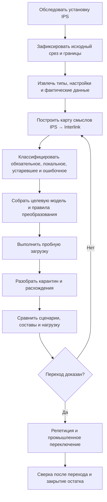
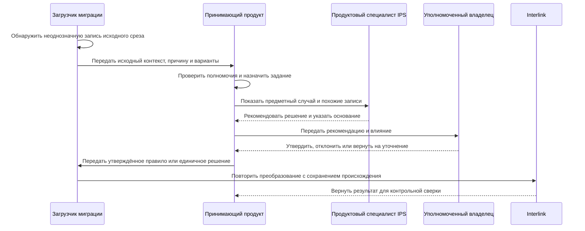

# Как продуктовые специалисты участвуют в переносе IPS

## Миграция — совместная предметная работа

Автоматическая загрузка может перенести строки, но не способна сама решить, что в конкретной установке IPS является обязательной бизнес-семантикой, историческим исключением или ошибкой данных. Поэтому миграция строится как совместная работа специалистов IPS, владельцев предметных областей, архитектора Interlink, внедрения и эксплуатации.

Цель — не только получить одинаковое число записей. Нужно доказать, что пользователи выполняют обязательные сценарии и получают объяснимо эквивалентный результат там, где поведение должно сохраниться.

Документ задаёт **целевой проектный процесс переноса**. Сегодня нет готового средства извлечения произвольной установки IPS, промышленного загрузчика, хранилища происхождения, карантинного рабочего места или механизма обратной записи. Эти части должны быть реализованы и проверены на конкретной установке; до этого перечисленные шаги выполняются командой обследования вручную или опытными средствами.

## Основные участники

| Участник | Основная ответственность |
|---|---|
| Продуктовый специалист IPS | Объяснить реальную семантику, варианты настройки и пользовательские ожидания |
| Ключевые пользователи | Подтвердить рабочие сценарии и исключения |
| Владелец предметной области | Принять целевые термины, очистку и допустимые отличия |
| Архитектор модели Interlink | Построить целевую типизированную модель |
| Специалист миграции | Извлечь, сопоставить, преобразовать и доказать происхождение |
| Эксплуатация | Подготовить среды, окно, повтор, переключение и наблюдение |
| Владелец интеграции | Управлять временным сосуществованием и внешними идентификаторами |

Принимающий продукт и организация заказчика владеют пользователями, правами, заданиями очистки, согласованиями и решением о переключении. Interlink не должен становиться второй системой корпоративных задач или полномочий.

## Полный путь перехода

Следующая схема — **целевая последовательность проекта**, а не уже готовая команда автоматической миграции.

Внутри пробного прогона особенно важно не потерять происхождение и не превратить неоднозначность в случайное значение. Следующая схема показывает **целевую работу с исключением**.

Interlink в этой схеме принимает уже определённое преобразование. Задание, полномочия и решение специалиста принадлежат принимающему продукту; промышленный загрузчик и хранилище происхождения пока являются целевыми средствами.

## Шаг 1. Обследование конкретной установки

Нельзя мигрировать «IPS вообще». Нужно зафиксировать:

- версии и установленные модули;
- пользовательские типы, атрибуты и справочники;
- жизненные циклы и права;
- механизмы подбора версий;
- структуры, производственные ведомости и заказы;
- интеграции, файлы и архивы;
- объёмы, глубину составов и рабочую нагрузку;
- известные обходные процессы пользователей;
- требования хранения и юридической значимости.

Результат обследования имеет владельца и дату. Если установка продолжает изменяться, отклонения управляются отдельно.

## Шаг 2. Исходный неизменяемый срез

В целевом средстве миграции для повторяемого прогона создаётся именованный исходный срез с точными границами и контрольными отпечатками. Предпочтителен согласованный транзакционный снимок. Если источник не позволяет получить его целиком, фиксируются начало и конец захвата, исходная и конечная отметки журнала изменений, порядок событий и правило сведения дельты. Одного времени начала недостаточно для доказательства согласованности между таблицами. Формирование такого среза относится к проекту переноса и пока не является готовой функцией Interlink.

Если IPS продолжает работу до переключения, изменения после среза попадают в отдельный журнал дельты. Нельзя незаметно смешивать данные разных моментов и объявлять результат полным.

## Шаг 3. Карта смыслов

Для каждого значимого понятия фиксируется:

- термин и описание IPS;
- физические источники и варианты хранения;
- фактические пользовательские правила;
- целевой тип, свойство или связь Interlink;
- правило идентичности и версий;
- преобразование значений;
- допустимые потери или изменение поведения;
- контрольный пример;
- владелец решения.

Внешне одинаковые столбцы могут иметь разный смысл, а один смысл IPS может храниться в нескольких путях. Карта опирается на работу системы и пользователей, не только на имя таблицы.

## Шаг 4. Классификация наследия

Каждый элемент относится к одной из групп:

- обязательная функция, которую нужно воспроизвести;
- локальное требование предприятия;
- исторический артефакт, который сохраняется только для чтения;
- ошибочные или неполные данные, требующие очистки;
- реализационная особенность IPS, которую не следует переносить буквально;
- открытый вопрос без достаточного доказательства.

Решение не удалять устаревший механизм из нового продукта должно быть таким же явным, как решение его перенести.

## Шаг 5. Черновик целевой модели

По карте команда собирает модули Interlink. Язык модели, его проверка и сборка модулей уже реализованы. Предметный отчёт для специалиста IPS — целевая часть миграционного рабочего места; специалист должен проверять не DSL, а следующее:

- какие типы и версии появятся;
- как представлены состав и позиции;
- что станет точной фиксацией, применяемостью или правилом;
- как сохранятся итерации и история;
- какие справочники объединяются или разделяются;
- где поведение сознательно изменено.

## Шаг 6. Пробная загрузка

**Целевой механизм.** Загрузка должна выполняться порциями с устойчивыми исходными идентификаторами. Повтор одной порции не должен создавать дубликаты. Для каждого целевого объекта должна сохраняться цепочка происхождения до записи и среза IPS. Промышленного загрузчика и хранилища такой цепочки пока нет.

Для каждой исходной записи назначается один итог: перенесено, пропущено по утверждённому правилу, помещено в карантин, требует безопасного повтора либо завершилось окончательной ошибкой. Отдельно к итогу могут прилагаться несколько предупреждений и диагностик. Так запись с предупреждением остаётся однозначно «перенесённой», а временный сбой не смешивается с принятым исключением.

Цепочка происхождения содержит исходный срез и запись, запуск и порцию миграции, отпечаток целевой модели, редакцию правила, версию средства преобразования, решение и автора. Для обратной записи дополнительно сохраняются внешний идентификатор операции, подтверждённый результат или состояние «исход неизвестен».

## Рабочее место разбора карантина

Это **целевое рабочее место принимающего продукта**. Оно ещё не реализовано; задания, владельцев, сроки, права и решения хранит принимающий продукт, а миграционный контур связывает их с исходными и целевыми идентичностями.

Продуктовый специалист видит предметный случай:

- исходный объект IPS и его контекст;
- причину, по которой автоматическое правило не сработало;
- предлагаемые целевые варианты;
- количество похожих записей;
- влияние решения;
- образцы документов и составов;
- владельца и срок.

В целевом процессе решение может применяться к одному объекту, доказанной группе или стать новой версией общего правила преобразования. Массовое правило сначала проверяется на выборке. Любое исправление сохраняет автора, основание, исходный срез и редакцию правила; оно не переписывает происхождение задним числом.

### Пример

В IPS поле «Материал» иногда содержит марку стали, иногда ссылку на справочник, а иногда текст «по чертежу». Миграция не помещает всё в одно строковое поле Interlink. Ссылки сопоставляются справочнику, марки нормализуются, а «по чертежу» переводится в отдельный признак неопределённости с заданием владельцу, если материал обязателен.

## Доказательство технической полноты

Это **целевой доказательный отчёт миграционного контура**. Текущий компилятор модели не подсчитывает записи промышленной базы и не строит такой отчёт.

Сверяются:

- количество исходных и целевых объектов по классам;
- идентичности и версии;
- связи и позиции;
- файлы и контрольные отпечатки;
- справочники и значения;
- карантин, ошибки и исключения;
- покрытие всего исходного среза.

Утверждение «очередь обработана» недостаточно. Нужно доказать, что каждая запись источника либо перенесена, либо находится в известном принятом состоянии.

## Доказательство функциональной эквивалентности

Ключевые пользователи выполняют одинаковые деловые сценарии:

- найти объект и его версию;
- открыть карточку и историю;
- развернуть состав;
- подобрать версии в известных режимах IPS;
- начать и провести изменение;
- сформировать производственную ведомость и заказ;
- открыть точную историческую публикацию;
- выполнить обмен и проверить результат.

Для каждого сценария сохраняются одинаковые исходные условия: срез IPS, редакция модели, площадка, момент действия, политика и явный контекст подбора версий. Сравниваются не только экраны, а выбранные объекты, версии, причины, ошибки и дальнейшие действия.

## Дифференциальная проверка составов

Это **целевой стенд сравнения**, который должен быть создан для проекта переноса.

Для набора контрольных изделий IPS и Interlink получают один сохранённый контекст: головное изделие, площадку, серию или заказ, дату действия, политику подбора, редакцию модели и идентичность исходного среза. Сравниваются:

- присутствующие позиции;
- выбранные объекты и замены;
- точные версии;
- количество и единицы;
- глубина и повторные вхождения;
- применяемость;
- причины различий.

Любое отличие классифицируется как ошибка переноса, принятая новая семантика, дефект исходных данных или открытый вопрос. Оно не теряется в общей статистике.

## Нагрузочная проверка

На объёме, близком к предприятию, измеряются поиск, карточка, обратная применяемость, глубокий состав, пакет изменения, массовая загрузка и агентские запросы. Сравнение с IPS учитывает инфраструктуру и сценарий, а не только среднее время одной операции.

## Стратегии переключения

### Одномоментный переход

Подходит при ясной границе, приемлемом окне остановки и полной готовности интеграций. После финального среза запись в IPS прекращается, выполняется дельта и пользователи переходят.

### Поэтапный переход по предметным областям

Области переходят последовательно. Для каждой заранее определён источник истины и допустимые направления ссылок. Нельзя позволять двум системам независимо менять один объект.

### Сопровождающий режим поверх IPS

IPS остаётся авторитетной, а новая система читает точные внешние объекты, анализирует и координирует работу. **Обратная запись — целевой механизм принимающего продукта и соединителя, а не готовая функция Interlink.** Принимающий продукт проверяет полномочия, создаёт надёжное исходящее действие, защищает повтор от дублирования и после ответа сверяет результат с IPS. Если ответ потерян, операция получает состояние «исход неизвестен» и сначала проверяется во внешней системе, а не повторяется вслепую. Этот режим позволяет получать пользу раньше полного переноса, но требует явной свежести, журнала происхождения и доказанного восстановления.

## Репетиция переключения

Команда полностью повторяет:

- финальный срез;
- дельту;
- длительность каждой операции;
- переключение приложений и интеграций;
- контрольные сценарии;
- решение остановиться или продолжить;
- восстановление;
- коммуникацию пользователям.

План промышленного окна основывается на измеренной репетиции.

## Что происходит после перехода

В течение согласованного периода должны работать усиленные сверки. Принимающий продукт назначает владельцев открытых расхождений и ведёт задания исправления. Исходный срез IPS и средства чтения сохраняются по политике доказательности.

Старая система не уничтожается автоматически после первого успешного дня. Условия архивирования и отключения определяются отдельно.

## Пример 1. История детали и итерации

У детали IPS есть базовая версия, несколько версий и промежуточные итерации рабочей копии. Специалист IPS определяет, какие итерации имеют внешние ссылки или юридическое значение. Значимые состояния сохраняются как исторические артефакты либо версии; чисто пользовательские точки возврата могут не становиться официальными версиями Interlink. Решение проверяется на реальных расследованиях и отчётах.

## Пример 2. Производственная ведомость и заказ

Миграция должна разделить самостоятельную версионную производственную ведомость, живой производственный заказ и точный неизменяемый снимок каждой передачи заказа в исполнение. Их нельзя слить в один объект только потому, что в отдельных процессах IPS они идут последовательно. Чтение уже переданного заказа идёт по его снимку без живого переподбора версий; перепланирование создаёт следующую редакцию заказа и новый снимок, сохраняя прежнюю передачу.

Контрольный сценарий проверяет создание ведомости, согласование, формирование заказа, перепланирование и сохранение прежней передачи.

## Пример 3. Пользовательская оснастка

На одном заводе в IPS создан локальный тип оснастки с собственными атрибутами и файлами. Архитектор решает, становится ли он локальным модулем Interlink или общим модулем технологии. Пробная миграция проверяет связи с операциями, версии файлов, поиск и права, а не только карточки.

## Критерии решения о переходе

Переход разрешается, когда:

- границы источника и дельты доказаны;
- обязательные сценарии пройдены;
- различия утверждены владельцами;
- карантин находится в допустимом согласованном состоянии;
- для каждого перенесённого объекта доказана связь с записью и исходным срезом IPS, а каждое решение по карантину сохраняет автора и основание;
- интеграции и внешние идентификаторы проверены;
- если выбран сопровождающий режим, обратная запись проверена на потерянном ответе, безопасном повторе и последующей сверке с IPS;
- нагрузка укладывается в цели;
- репетиция подтверждает окно;
- восстановление проверено;
- пользователи обучены на новых механизмах;
- статус реализации Interlink соответствует выбранному объёму, а недостающие функции не замаскированы ручными обещаниями.

## Состояние реализации

В основной версии `3df67f5` готовы язык целевой модели, его проверка, нормализация, отпечаток, сборка модулей и этапы 1–7 типизированных прикладных представлений. Стратегия и доказательные требования переноса описаны. Готовых средств полного извлечения IPS, автоматического построения модели, физической схемы PostgreSQL, промышленного исполнителя миграций, хранения происхождения, карантинного рабочего места, обратной записи и дифференциального стенда пока нет. Реальный проект перехода должен начинаться с обследования и опытного контура, а не с обещания автоматической конвертации всей базы.

Связанные документы: [стратегия миграции](08-ips-database-migration-strategy.md), [выполнение и доказательство](09-migration-execution-and-proof.md), [жизненный цикл модели](14-model-lifecycle-and-user-work.md), [выпуск и установка](17-model-release-and-installation.md), [открытые вопросы миграции](../open-questions/07-customization-migration-and-operations.md).

Основания: [IL-MIG], [IL-DSL], [IL-META], [IL-POC], [IPS-K10], [IPS-A01], [IPS-A16]. Расшифровка — в [реестре источников](../knowledge/15-source-register.md).
