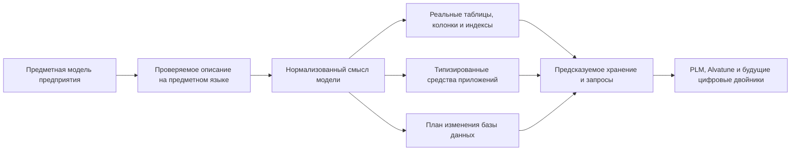

# Система типов и структура данных Interlink

## Новая точка входа: элементы, понятия и процессы

К системе типов добавлено продуктовое объяснение [общей адресации](../object-foundation/04-elements-and-concepts.md). Оно показывает, как ссылаться на определение или часть данных, не делая всё одинаковыми объектами. [Инструкции, применения и выполнение](../object-foundation/05-instructions-and-execution.md) объясняют границу между формой модели и обычной работой технолога. [Предметные понятия](../object-foundation/06-domain-concepts.md) раскрывают связь смысла с классификацией, поиском и установленными правилами.

Это дополнение принятого плана от 7 сентября 2026 года. Оно не означает, что перечисленные новые рабочие места уже реализованы.

## Назначение пакета

Этот комплект объясняет, как Interlink превращает предметную модель предприятия в расширяемую, проверяемую и производительную систему хранения инженерных данных. Он предназначен для продуктовых специалистов IPS, архитекторов систем управления жизненным циклом изделия (PLM) и инженерных систем (CAx), руководителей внедрения и специалистов, которым нужно оценить не синтаксис программы, а возможности будущей платформы.

Главная идея проста:

> В IPS гибкость в значительной степени достигается универсальным объектным ядром и метаданными, которые интерпретируются во время работы. В Interlink модель предприятия уже проверяется как единое описание, а в целевой физической схеме известные типы будут становиться настоящими таблицами PostgreSQL, атрибуты — типизированными столбцами или специализированными таблицами значений, связи — самостоятельными таблицами с ограничениями и индексами.

Такой подход сохраняет богатство PLM-моделирования, но переносит значительную часть проверки из позднего выполнения в момент выпуска модели и в саму базу данных. Это создаёт основу для предсказуемых запросов, управляемых обновлений и более высокой параллельной нагрузки — особенно важной при появлении большого числа фоновых процессов и агентов Alvatune.

## Короткий ответ: что получает предприятие

- богатую систему типов для изделий, документов, требований, техпроцессов, заказов, связей и других предметных сущностей;
- отдельное представление устойчивого объекта, инженерной версии, её опубликованного содержания и незавершённой рабочей правки;
- изменяемые оперативные записи и неизменяемые факты там, где инженерные версии не нужны;
- наследование типов, типизированные связи, составы, кортежи, справочники, ссылки, вычисляемые и измеряемые атрибуты;
- предметный язык описания модели — DSL, то есть специализированный язык, понятный как единая декларация модели;
- формирование физических таблиц, ограничений целостности и индексов из модели, с дальнейшим развитием под новые предметные договоры;
- целевые три управляемых уровня расширения: версия поставляемой модели, разрешённая настройка предприятия и типизированное расширение во время работы;
- будущий управляемый процесс миграции базы данных;
- проверки каталога модели и целевую сквозную проверку расхождения между поставкой, прикладными средствами и базой;
- возможность собирать единую модель из версионированных предметных модулей;
- фундамент для цифровой нити и экземплярных цифровых двойников.

Схема показывает целевой промышленный контур, а не перечень уже готовых приложений. Главный смысл схемы: таблицы, программные контракты и миграции не проектируются независимо друг от друга. Они являются согласованными результатами одной предметной модели.

## В чём основное отличие от IPS

Историческая схема IPS решала чрезвычайно сложную задачу своего времени: дать предприятию возможность создавать новые типы и атрибуты без постоянной переделки прикладного ядра. Цена этой универсальности — значения многих атрибутов хранятся в общих таблицах, тип и ограничения приходится восстанавливать через метаданные, а оптимизированные пер-типовые срезы образуют дополнительный путь к тем же данным.

Interlink развивает сильные стороны IPS, но меняет физический принцип:

| Вопрос | IPS | Interlink |
|---|---|---|
| Где живёт основная модель | В метаданных эксплуатационной системы | В версионируемом DSL и его проверенной поставке |
| Как хранится известный тип | В универсальном ядре, при необходимости — в дополнительном срезе | В собственной типизированной таблице или согласованной группе таблиц |
| Как проверяется тип значения | Главным образом ядром и метаданными | Компилятором, командным слоем и ограничениями БД |
| Как расширяется предприятие | Через конфигуратор, модули и локальные настройки | Через модули, разрешённые настройки и типизированные расширения |
| Как сравниваются среды | Требуется инвентаризация конфигурации | По версии, отпечатку модели, составу модулей и отчёту расхождений |
| Как ускоряются горячие атрибуты | Дополнительные пер-типовые срезы рядом с универсальным хранением | Управляемый перевод расширения в основную колонку вместо параллельного пути |

Interlink не заявляет, что уже доказал численное превосходство над промышленными установками IPS. Выбранная архитектура должна уменьшить конкретные издержки универсального хранения, усилить ссылочную целостность и сделать распространённые запросы более предсказуемыми. Численные границы предстоит подтвердить нагрузочными испытаниями на одинаковых данных и операциях; большой объём справочников, глубокий состав и частые конкурентные изменения проверяются отдельно.

## Что добавилось в новой архитектуре

Раньше объяснение строилось главным образом вокруг изделия, версии и атрибута. Теперь важно сначала выбрать правильную форму данных. Конструкция редуктора нуждается в инженерных версиях, телефон склада — в управляемой изменяемой записи, а акт измерения — в неизменяемом факте с отдельным исправлением. Все три формы используют общий фундамент объектов, связей, полномочий и происхождения, но не притворяются одной инженерной карточкой.

Табличные данные также больше не сводятся к вложенному файлу или составному объекту. Размерный ряд крепежа хранится как индексируемый набор строк; полная таблица испытаний — как сетка с проверкой каждой заявленной точки; выбор клапана по среде, диаметру и давлению — как карта явно заданных соответствий. Отдельно поверх этих данных описываются разрешённые замены и ограничения совместимости. Пустая клетка карты сама по себе не означает ни запрет, ни разрешение.

Наконец, точность распространяется на основания решения. Для согласованного заказа или действия агента недостаточно сохранить обозначение версии: необходимо удержать использованное содержание, существенные справочники, правила и способ их прочтения. Появление новой, ещё не использованной редакции справочника не переписывает прежний выбор и не отменяет прежнее согласование автоматически. Новая операция проверяется по действующим требованиям к своему назначению.

Продолжение этих тем:

- [Объектный фундамент без привязки к отрасли](../object-foundation/README.md) и [примеры за пределами машиностроения](../object-foundation/02-multidomain-scenarios.md);
- [табличные данные](../tabular-data/README.md), [инженерные справочники](../tabular-data/01-reference-tables.md), [многомерные сетки](../tabular-data/02-multidimensional-tables.md) и [координатные карты](../tabular-data/03-coordinate-maps.md);
- [допустимые замены](../substitution-and-compatibility/01-allowed-replacements.md) и [матрицы совместимости](../substitution-and-compatibility/02-compatibility-matrices.md);
- [агенты и прослеживаемость решений](../agents/01-agents-and-traceability.md).

## Состав пакета

### Замысел и возможности

- [Почему система типов является основой продукта](01-type-system-vision.md)
- [Какие предметные конструкции поддерживает модель](02-type-system-capabilities.md)
- [DSL как язык модели предприятия](03-dsl-product-language.md)
- [Как типы материализуются в физическую базу данных](04-physical-database-materialization.md)
- [Расширяемость, настройка предприятия и развитие модели](05-extensibility-and-customization.md)

### Масштаб и переход с IPS

- [Производительность, высокая нагрузка и оркестрация агентов](06-performance-and-agent-load.md)
- [Что меняется относительно архитектуры данных IPS](07-differences-from-ips.md)
- [Стратегия миграции базы IPS](08-ips-database-migration-strategy.md)
- [Выполнение миграции и доказательство эквивалентности](09-migration-execution-and-proof.md)

### Рынок и развитие

- [Сравнение с PLM-, бизнес- и инструментальными платформами](10-comparison-with-other-systems.md)
- [Развитие в сторону цифровых двойников](11-digital-twin-roadmap.md)
- [Сквозные машиностроительные примеры](12-engineering-examples.md)
- [Состояние реализации, риски и критерии приёмки](13-status-risks-and-acceptance.md)

### Как модель работает в руках людей

- [Как изменяется модель предприятия](14-model-lifecycle-and-user-work.md)
- [Как модель превращается в работающую систему](15-model-to-runtime.md)
- [Поиск, выборки и обход связей глазами пользователя](16-search-and-query-user-experience.md)
- [Пакет выпуска модели, установка и обновление](17-model-release-and-installation.md)
- [Настройки предприятия и разрешение конфликтов](18-enterprise-settings.md)
- [Как продуктовые специалисты участвуют в переносе IPS](19-ips-migration-operating-model.md)

## Как читать пакет

Продуктовому специалисту IPS рекомендуется начать со страниц [Почему система типов является основой продукта](01-type-system-vision.md), [Как изменяется модель предприятия](14-model-lifecycle-and-user-work.md), [Как модель превращается в работающую систему](15-model-to-runtime.md) и [Как проходит перенос IPS](19-ips-migration-operating-model.md). Архитектору данных полезны документы о возможностях, физическом хранении, выпуске и настройках. Для обсуждения нагрузки и развития важны страницы об агентах, поиске и цифровых двойниках.

## Важная граница готовности

По состоянию пересмотра документации на 6 сентября 2026 года в проекте есть компилятор модели, сборка модулей и генерация типизированных средств приложений. Есть сравнение моделей, планирование переходов и проверки каталога. Формирование физической схемы PostgreSQL развивается в текущем незавершённом рабочем коде. Это уже больше, чем только описание языка, но ещё не готовая промышленная установка: полный безопасный путь обновления, исполнения запросов и предметных изменений, а также переход на новые правила версий требуют завершения и сквозной приёмки.

Индексируемые табличные наборы, координатные карты, отношения замен и совместимости, нейтральные формы записей и точные контексты агентов закреплены в целевой архитектуре. Наличие страниц об этих механизмах не означает, что они уже доступны в готовом пользовательском приложении. Актуальные границы собраны в [карте зрелости и приёмки](13-status-risks-and-acceptance.md).

Поэтому пакет описывает одновременно реализованный фундамент, принятый целевой контракт и продуктовые преимущества, которые должны быть подтверждены сквозным опытным образцом. В каждом документе статус отделён от целевого обещания.

## Три разных изменения, которые нельзя смешивать

Когда администратор добавляет тип «Гидроцилиндр» или меняет допустимый вид числового значения, он выпускает новую модель предприятия. Система проверяет её совместимость, готовит изменение хранения и только после успешной установки разрешает работу по новому определению.

Когда конструктор меняет ход конкретного гидроцилиндра с 250 до 320 мм, модель предприятия может оставаться прежней. Меняются данные изделия: сначала рабочая правка, затем при разрешённой публикации — его точное содержание.

Когда кладовщик уточняет адрес хранения, а контролёр регистрирует измерение, работают другие договоры записи: безопасное изменение оперативной карточки и добавление неизменяемого факта. Им не требуется фиктивная инженерная версия. Редакции справочника или правил выбора также являются предметными данными; изменение их структуры и смысла определения — уже вопрос развития модели.

Такое разделение объясняет, почему «сохранить карточку», «опубликовать изменение конструкции» и «обновить модель базы» нельзя сделать одним неразличимым действием.

## Основные источники

- [Зачем создаётся Interlink](../knowledge/01-product-thesis.md)
- [Предметный язык модели](03-dsl-product-language.md)
- [Актуальные границы нового фундамента](../knowledge/18-new-foundation.md)
- [Расширяемость и миграция](05-extensibility-and-customization.md)
- [Отраслевые прецеденты](10-comparison-with-other-systems.md)
- [Состояние и дорожная карта](../knowledge/02-current-state-and-roadmap.md)
- [Как проверяются основания и статусы](../knowledge/15-source-register.md)

## Основания и границы источников

Актуальный замысел, договоры и последовательность проверки: [IL-KERNEL], [IL-STORAGE], [IL-FOUNDATION], [IL-NEUTRAL], [IL-AI], [IL-TD], [IL-SC], [IL-DATA-MODEL], [IL-PLAN-V2]. Предметные и исторические основания этой страницы: [IL-VISION], [IL-META], [IL-DSL], [IL-DB], [IL-MIG], [IL-POC], [IL-PRECEDENTS], [IPS-A01], [IPS-A44], [IPS-DB01]. Расшифровка обозначений и пределы свидетельств — в [реестре источников](../knowledge/15-source-register.md).

Описание IPS относится к исследованным материалам и проверяется по конкретной установке. Прежние исследования и решения объясняют происхождение идей, но не заменяют актуальный архитектурный договор и не подтверждают готовность реализации.
