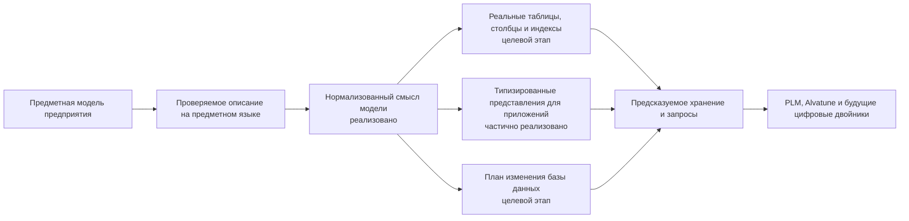

# Система типов и структура данных Interlink

## Назначение пакета

Этот комплект объясняет, как Interlink превращает предметную модель предприятия в расширяемую, проверяемую и производительную систему хранения инженерных данных. Он предназначен для продуктовых специалистов IPS, архитекторов PLM/CAx, руководителей внедрения и специалистов, которым нужно оценить не синтаксис программы, а возможности будущей платформы.

Главная идея проста:

> В IPS гибкость в значительной степени достигается универсальным объектным ядром и метаданными, которые интерпретируются во время работы. Целевая архитектура Interlink меняет этот принцип: модель предприятия заранее проверяется, а известные типы должны становиться настоящими таблицами PostgreSQL, атрибуты — типизированными столбцами или специализированными таблицами значений, связи — самостоятельными таблицами с ограничениями и индексами.

Такой подход сохраняет богатство PLM-моделирования, но переносит значительную часть проверки из позднего выполнения в момент выпуска модели и в саму базу данных. Это создаёт основу для предсказуемых запросов, управляемых обновлений и более высокой параллельной нагрузки — особенно важной при появлении большого числа фоновых процессов и агентов Alvatune.

## Короткий ответ: что получает предприятие

- богатую систему типов для изделий, документов, требований, техпроцессов, заказов, связей и других предметных сущностей;
- отдельное представление устойчивого объекта и его версий;
- наследование типов, типизированные связи, составы, кортежи, справочники, ссылки, вычисляемые и измеряемые атрибуты;
- предметный язык описания модели — DSL, то есть специализированный язык, понятный как единая декларация модели;
- целевой механизм создания из модели физических таблиц, ограничений целостности и индексов;
- целевые три управляемых уровня расширения: версия поставляемой модели, разрешённая настройка предприятия и типизированное расширение во время работы;
- целевой процесс смыслового сравнения версий модели и управляемой миграции базы данных;
- целевую проверку расхождения между моделью, прикладными представлениями и базой;
- возможность собирать единую модель из версионированных предметных модулей;
- фундамент для цифровой нити и экземплярных цифровых двойников.

Следующая схема показывает **целевой промышленный контур**. На сегодня её левая часть — чтение, проверка, нормализация и сборка модулей — реализована; автоматическое создание схемы PostgreSQL, планирование и выполнение миграций относятся к следующим этапам.

Главный смысл схемы: таблицы, программные контракты и миграции не проектируются независимо друг от друга. Они являются согласованными результатами одной предметной модели.

## В чём основное отличие от IPS

Историческая схема IPS решала чрезвычайно сложную задачу своего времени: дать предприятию возможность создавать новые типы и атрибуты без постоянной переделки прикладного ядра. Цена этой универсальности — значения многих атрибутов хранятся в общих таблицах, тип и ограничения приходится восстанавливать через метаданные, а оптимизированные пер-типовые срезы образуют дополнительный путь к тем же данным.

Interlink развивает сильные стороны IPS, но меняет физический принцип:

| Вопрос | IPS | Interlink |
|---|---|---|
| Где живёт основная модель | В метаданных эксплуатационной системы | В версионируемом DSL и его проверенной поставке |
| Как хранится известный тип | В универсальном ядре, при необходимости — в дополнительном срезе | Целевой вариант: в собственной типизированной таблице или согласованной группе таблиц |
| Как проверяется тип значения | Главным образом ядром и метаданными | Компилятором, командным слоем и ограничениями БД |
| Как расширяется предприятие | Через конфигуратор, модули и локальные настройки | Через модули, разрешённые настройки и типизированные расширения |
| Как сравниваются среды | Требуется инвентаризация конфигурации | Целевой вариант: по версии, отпечатку модели, составу модулей и отчёту расхождений |
| Как ускоряются горячие атрибуты | Дополнительные пер-типовые срезы рядом с универсальным хранением | Целевой вариант: управляемый перевод расширения в основной столбец вместо параллельного пути |

Interlink не заявляет, что уже доказал численное превосходство над промышленными установками IPS. Целевая архитектура устраняет конкретные структурные причины лишних соединений, слабой ссылочной целостности и непредсказуемости планов. Результат должен быть подтверждён сравнительными нагрузочными испытаниями на миллионах объектов и до десяти миллионов позиций состава.

## Состав пакета

### Замысел и возможности

- [Почему система типов является основой продукта](01-type-system-vision.md)
- [Какие предметные конструкции поддерживает модель](02-type-system-capabilities.md)
- [DSL как язык модели предприятия](03-dsl-product-language.md)
- [Как типы материализуются в физическую базу данных](04-physical-database-materialization.md)
- [Расширяемость, настройка предприятия и развитие модели](05-extensibility-and-customization.md)

### Масштаб и переход с IPS

- [Производительность, высокая нагрузка и оркестрация агентов](06-performance-and-agent-load.md)
- [Что меняется относительно архитектуры данных IPS](07-differences-from-ips.md)
- [Стратегия миграции базы IPS](08-ips-database-migration-strategy.md)
- [Выполнение миграции и доказательство эквивалентности](09-migration-execution-and-proof.md)

### Рынок и развитие

- [Сравнение с PLM-, бизнес- и инструментальными платформами](10-comparison-with-other-systems.md)
- [Развитие в сторону цифровых двойников](11-digital-twin-roadmap.md)
- [Сквозные машиностроительные примеры](12-engineering-examples.md)
- [Состояние реализации, риски и критерии приёмки](13-status-risks-and-acceptance.md)

### Как модель работает в руках людей

- [Как изменяется модель предприятия](14-model-lifecycle-and-user-work.md)
- [Как модель превращается в работающую систему](15-model-to-runtime.md)
- [Поиск, выборки и обход связей глазами пользователя](16-search-and-query-user-experience.md)
- [Пакет выпуска модели, установка и обновление](17-model-release-and-installation.md)
- [Настройки предприятия и разрешение конфликтов](18-enterprise-settings.md)
- [Как продуктовые специалисты участвуют в переносе IPS](19-ips-migration-operating-model.md)

## Как читать пакет

Продуктовому специалисту IPS рекомендуется начать с документов 01, 14, 15 и 19: они дают замысел, полный путь изменения модели, работу системы и участие в переносе. Архитектору данных полезна последовательность 02–06 и 17–18. Для обсуждения нагрузки и дальнейшего развития важны 06, 11 и 16. Документы 12 и 13 превращают идеи в проверяемые прикладные истории и честную карту готовности.

## Важная граница готовности

На 1 сентября 2026 года в основной версии `3df67f5` реализованы чтение и проверка языка модели, проверенное смысловое описание, нормализация, устойчивый отпечаток, объединение модулей и этапы 1–7 формирования типизированных прикладных представлений. В эти этапы входят представления связей и преобразование уже прочитанных строк результата в типизированные записи. Последнее не создаёт таблицы базы данных: слово «материализация» в названии этого программного компонента означает сборку прикладной записи из результата чтения.

Этап 8 — запуск формирования файлов из командной строки и проверка на эталонном примере — находится в текущей локальной работе и ещё не принят в основную версию. Этап 9 общей приёмки не начат. Физическое создание предметных таблиц PostgreSQL и их индексов относится к фазе 3; промышленный исполнитель миграций, команды записи, исполнитель структурных запросов, рабочие расширения и нагрузочное подтверждение также ещё не реализованы.

Поэтому пакет описывает одновременно реализованный фундамент, принятый целевой контракт и продуктовые преимущества, которые должны быть подтверждены сквозным опытным образцом. В каждом документе статус отделён от целевого обещания.

## Основные источники

- [Замысел Interlink](../../01-vision-and-principles.md)
- [Метамодель](../../03-metamodel.md)
- [Язык DSL](../../04-dsl.md)
- [Требования к PostgreSQL](../../05-database-requirements.md)
- [Миграции](../../06-migrations.md)
- [План опытного подтверждения](../../11-poc-plan.md)
- [Каталог аналогов](../../../Analogs/README.md)
- [Продуктовая база знаний](../knowledge/README.md)

Основные основания: [IL-VISION], [IL-META], [IL-DSL], [IL-DB], [IL-MIG], [IL-POC], [IL-PRECEDENTS], [IPS-A01], [IPS-A44], [IPS-DB01]. Расшифровка — в [реестре источников](../knowledge/15-source-register.md).
