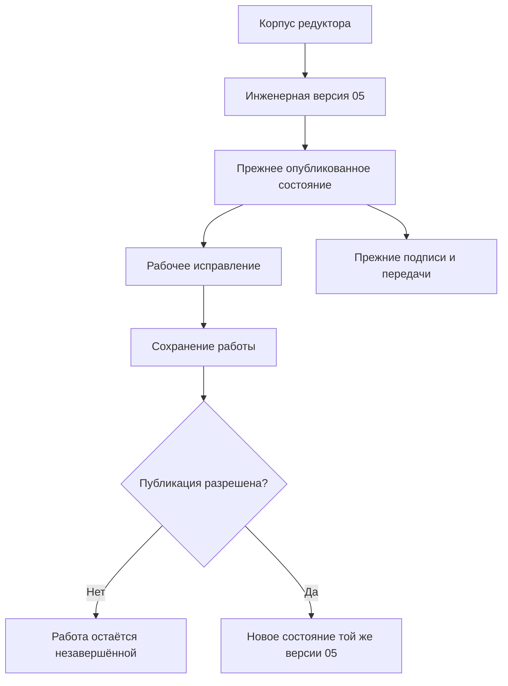
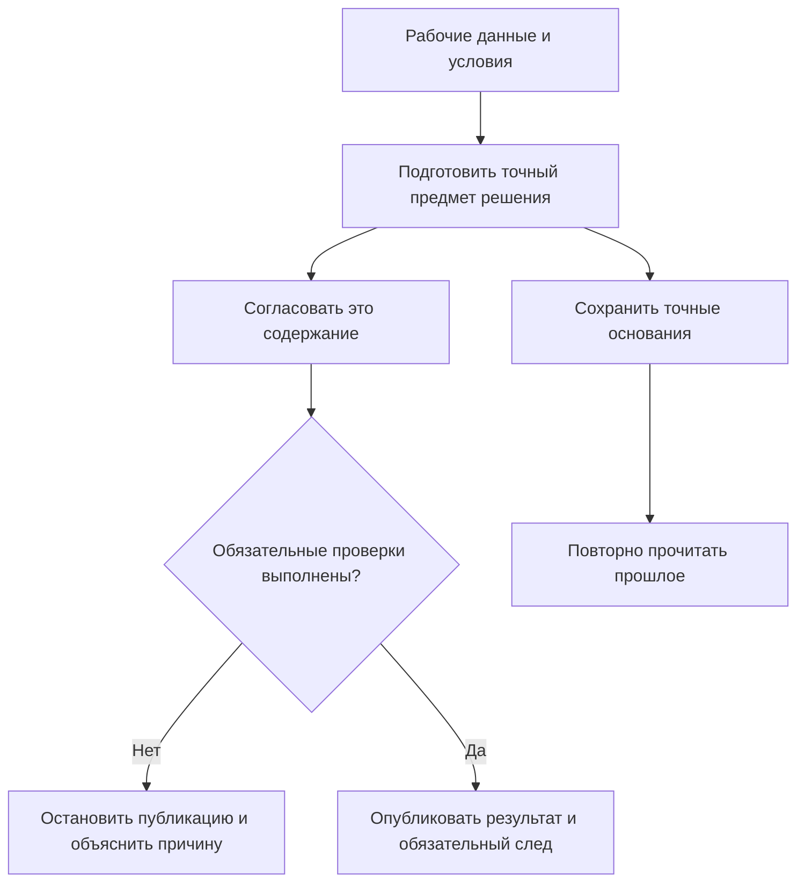

# 03. Основные понятия: от объекта до доказуемого результата

Редакция от 6 сентября 2026 года. Глава описывает целевую модель Interlink на предметном языке. Она не утверждает, что все перечисленные возможности уже исполняются. [Текущее состояние](02-current-state-and-roadmap.md) рассматривается отдельно.

## 1. Почему потребовалось уточнить привычные слова

Для специалиста IPS слова «объект», «версия», «рабочая копия», «контекст» и «итерация» обозначают разные полезные возможности. Раннее описание Interlink пыталось слишком сильно сократить этот набор. В результате сохранение работы смешивалось с выпуском, конкретизация версии — с неизменностью содержания, а совместный просмотр — с обязательным совместным завершением.

Новая концепция устраняет эти сокращения. Понятий стало больше не потому, что пользователь должен выполнять больше действий, а потому, что система должна сохранять смысл уже существующих действий. Простое рабочее место может объединять несколько технических шагов, но не должно лишать пользователя нужного результата.

## 2. Объект, инженерная версия, состояние и рабочие данные

| Понятие | На какой вопрос отвечает | Пример |
|---|---|---|
| Объект | О каком предмете идёт речь? | Корпус редуктора РЦ-250 |
| Инженерная версия | Какой вариант развития этого предмета рассматриваем? | Версия 05 корпуса |
| Точное опубликованное состояние | Какое именно содержание этой версии было официально зафиксировано? | Версия 05 после исправления посадочного отверстия |
| Рабочее состояние | Что сейчас редактируется и ещё не опубликовано? | Незавершённая правка размера отверстия |

У инженерной версии может быть несколько опубликованных состояний. Правила предприятия определяют, когда разрешено обновить содержание той же версии, а когда требуется новая инженерная версия. Система не увеличивает номер версии автоматически при каждом сохранении.

Новая инженерная версия может происходить от исторического прототипа. Например, ремонтный вариант корпуса создаётся от версии 03, хотя для новых станков уже применяется версия 05. Происхождение сохраняет и прототип, и его точное использованное содержание. Оно не выводится из соседства номеров.

Сохранение работы не изменяет официальное содержание. Публикация создаёт новое точное состояние, но не переписывает прежние подписи и передачи. Схема показывает путь исправления одной версии; создание версии 06 — отдельное действие.

## 3. Не всем данным нужны инженерные версии

Общее объектное основание поддерживает три разных способа изменения данных. Для конструкции используется управляемая инженерная версия с рабочим состоянием и публикацией. Для обычной изменяемой записи нужна защита от потери чужой правки. Для неизменяемого факта исправление оформляется новым фактом, связанным с прежним.

Телефон перевозчика не требует инженерной версии Б. Адрес отправки может меняться по разрешённой операции с историей. Результат измерения давления не должен тихо перезаписываться после обнаружения ошибки прибора: сохраняется первоначальное наблюдение и отдельно — его исправление или аннулирование.

Наличие журнала само по себе не делает изменяемую запись точным историческим свидетельством. Когда решение должно ссылаться на её содержание в определённый момент, это содержание отдельно сохраняется в объёме, необходимом для доказательства. Подробнее — [объектное основание](../object-foundation/README.md).

## 4. Позиция состава и её адрес

Позиция — место использования объекта. У неё собственные количество, единица измерения, обозначение, примечание и условия применения. Два одинаковых подшипника на разных валах не являются одной позицией, даже если ссылаются на одну карточку детали.

Позиция принадлежит содержанию родительского состава. При продолжении работы над этим составом система сохраняет тождество прежнего места; действительно новое место получает собственную идентичность. Поэтому сравнение не опирается только на номер позиции, порядок строк или совпадение компонента.

Во вложенной конструкции нужен дополнительный уровень адреса: выбранный корень конкретной структуры и полный путь до места. Один насосный модуль может дважды входить в станцию. Местное предпочтение внутреннего уплотнения относится к позиции модуля. Выбор «только в левом насосе этой станции» имеет более узкую область конкретного использования и должен задаваться отдельно. Эти области нельзя подменять друг другом.

## 5. Три степени выбора цели

**Подбор по объекту** оставляет системе задачу выбрать инженерную версию по явным условиям. **Жёсткая конкретизация инженерной версии** запрещает переход к другой инженерной версии, но содержание внутри закреплённой версии определяется заявленным режимом. **Точная фиксация состояния** закрепляет неизменяемое содержание.

Если в составе указана версия 05 корпуса, публикация допустимого исправления версии 05 может изменить живой просмотр её содержания. Если указано точное состояние, выданное в производство в понедельник, пятничное исправление его не меняет.

Строгий режим «только точные состояния» не удовлетворяется одной лишь фиксацией инженерной версии. При недостаточной точности система сообщает об отсутствии требуемого результата; основная или резервная версия не подставляется незаметно. [Подробное сравнение](../version-selection/02-hard-concretion-pin.md).

## 6. Мягкая конкретизация и временное предпочтение

Мягкая конкретизация хранит предпочитаемую инженерную версию для конкретной позиции. Публикация или закрытие рабочей области сами по себе не удаляют это решение. У него есть история активности: например, переход родителя может временно приостановить применение выбора, а предусмотренный обратный переход — восстановить его.

Необходимо различать четыре действия. Временно игнорировать выбор при чтении — не значит удалить его. Приостановить действие по правилу жизненного цикла — не значит изменить опубликованное содержание. Восстановить можно только соответствующее сохранившееся намерение. Ручное удаление или замена предпочтения не должны отменяться старым событием восстановления.

Временное предпочтение проработки — соседний, но другой механизм. Оно помогает сравнить вариант до принятия постоянного решения и не доказывает полного покрытия мягкой конкретизации IPS. Подробности — [сохраняемая мягкая конкретизация](../version-selection/20-durable-soft-concretion.md).

## 7. Рабочая область, контекст и пакет изменения

| Понятие | Что сохраняет | Чего не требует |
|---|---|---|
| Рабочая область | Долговременную незавершённую работу команды | Завершить всё одним выпуском |
| Контекст подбора | Согласованные назначения версий и, при необходимости, точного или рабочего содержания | Владеть всеми рабочими данными |
| Группа контекстов | Совместно читаемый набор назначений | Совместно опубликовать все пакеты |
| Пакет изменения | Выбранный набор действий для одного атомарного проведения | Забрать всю рабочую область |
| Объединённая публикация | Несколько пакетов, которые должны стать официальными вместе | Заменить обычный совместный просмотр |

В проекте модернизации пресса механика и автоматика работают полгода. Общий контекст позволяет видеть согласованную будущую машину. Независимое исправление ограждения можно выпустить раньше. Объединять выпуск нужно только тогда, когда частичное применение создаёт непригодную конфигурацию.

При конфликте назначений система не выбирает случайного победителя. Даже одна и та же инженерная версия может быть назначена с двумя разными точными состояниями или рабочими копиями. Совпадение номера версии ещё не доказывает согласованность содержания.

## 8. Параллельная работа и итерации

Две рабочие области могут независимо изменять одну инженерную версию. Первая подтверждённая публикация изменяет её официальное содержание. Вторая обнаруживает, что исходное основание уже изменилось, и сохраняет работу для сравнения, переноса правок или создания отдельной версии. Автоматическое перетирание чужого результата запрещено; автоматическое слияние инженерного состава не предполагается.

Предприятие вправе дополнительно требовать эксклюзивное взятие в работу, если это нужно процедуре. Это настройка процесса и доступа, а не общий запрет на параллельность всех предметных моделей.

Итерация или именованная точка возврата надолго сохраняет выбранные рабочие данные и ссылки на включённые точные опубликованные состояния. Она не равна кратковременному внутреннему состоянию операции. Восстановление возвращает данные в работу и не публикует их автоматически. Перед восстановлением сохраняется защищаемая текущая работа, если это требуется договором восстановления.

## 9. Применяемость, готовность и жизненный цикл

Применяемость отвечает, для какого изделия, номера, серии, даты или условий действует решение. Эти значения называются предметными координатами: это не геометрические координаты САПР. Например, «станция северного исполнения, партия сентября, площадка № 2» задаёт условия выбора, а не положение детали в пространстве.

Степень инженерной готовности отвечает, насколько решение подготовлено для назначения. Жизненный цикл отвечает, на каком шаге управляемого процесса находится версия и какие переходы разрешены. Два шага могут иметь одинаковую готовность, но разные права редактирования. Несколько предметных шкал нельзя сравнивать по совпадению номера ступени без явного согласования их смысла.

Основная версия — явно назначенная версия объекта. Последняя версия — результат выбора из заранее определённого множества допустимых версий. Позже зарегистрированный опытный вариант не становится автоматически основной производственной версией.

## 10. Подготовленное решение, согласование и точное свидетельство

До публикации система подготавливает конкретное содержание пакета и результат необходимых проверок. Последующая правка не обновляет уже согласованный предмет автоматически: требуется новая подготовка и, когда предусмотрено, повторное согласование.

Точное согласованное содержание не изменяется лишь потому, что в другом проекте появилась более новая версия. Но действующие полномочия, обязательный отзыв разрешения и специально установленная проверка свежести могут остановить публикацию. Неизменность содержания не отменяет нынешних правил доступа и безопасности.

Точный снимок состава — один вид свидетельства. Междисциплинарный комплект может дополнительно включать документы, маршруты, нормы, таблицы и результаты проверок. Поисковое представление допускает перестроение; историческое доказательство сохраняется по своему договору удержания.

## 11. Типы, атрибуты, связи и контекстные записи

Тип определяет допустимые свойства и связи. Атрибут описывает характеристику, например давление или материал. Связь становится самостоятельным предметным фактом, если у неё есть собственные свойства, история или значение для навигации.

Поле «основной поставщик» может быть простой ссылкой. Отношение «поставщик допущен для материала на площадке» содержит условия, срок и основание допуска — ему нужна самостоятельная модель. Комбинация «деталь на площадке» может иметь единые нормы или настройки без создания новой инженерной версии детали для каждой площадки.

Теги служат поисковым отметкам; они не заменяют состояние допуска. Классификация объединяет классы и типизированные характеристики, но не должна создавать вторую несогласованную систему атрибутов. [Система типов](../data-structure/02-type-system-capabilities.md) раскрывает эти варианты.

## 12. Таблицы, замены и совместимость

Индексируемый справочник хранит строки для поиска. Полная многомерная сетка задаёт известное пространство ячеек. Разреженная карта хранит отдельные сопоставления по предметным координатам. Заполненность сетки, известность значения и его пригодность для расчёта — разные свойства.

Разрешение замены описывает допустимое преобразование. Выбор для заказа связывает его с конкретными местами. Применение создаёт проверенный результат изменения. Факт монтажа регистрирует то, что действительно произошло. Совместимость проверяет требуемое сочетание участников; она не выводится автоматически из наличия допуска замены.

Эти механизмы опираются на общие типы, точные редакции и управляемые операции, но не становятся одним универсальным ответом «можно». [Табличные данные](../tabular-data/README.md), [допустимые замены](../substitution-and-compatibility/01-allowed-replacements.md), [совместимость](../substitution-and-compatibility/02-compatibility-matrices.md).

## 13. Исполнитель, запуск и полномочия

Исполнитель может быть человеком, агентом или службой. Конкретный запуск — отдельное событие: один агент может выполнить тысячи запусков с разными инициаторами и условиями. При делегировании сохраняется связь с человеком либо другим агентом, но эта связь сама по себе не выдаёт новых прав.

Для проверки агентского решения важно удержать не только исходные документы, но и фактически показанные данные: выбранные фрагменты, страницы, сокращения, предупреждения и отрицательные ответы. Сохранение должно произойти до выдачи контекста исполнителю, а не восстанавливаться приблизительно после ответа. Исторический материал при этом читается с учётом нынешних полномочий.

Если подтверждение операции потерялось, её исход неизвестен. Сначала ищут подтверждённый результат той же операции; безусловный повтор может создать второй эффект. [Агенты и прослеживаемость](../agents/01-agents-and-traceability.md).

## 14. Проверка понимания

После чтения специалист должен различать следующие случаи: версия 05 и её понедельничное содержание; мягкий выбор и временную пробу; совместный контекст и общий выпуск; сохранение итерации и публикацию; утверждённую замену и фактическую установку; отсутствие строки и доказанный запрет.

Практический критерий — возможность провести три сценария без подмены понятий: исправить ту же версию корпуса, независимо выпустить часть общей модернизации и восстановить точный состав передачи после последующих изменений. Для неизвестной особенности IPS нужен исходный пример и проверка, а не расширительное толкование знакомого слова.

## Состояние реализации и основания

Язык модели, его проверки и формирование типизированных артефактов частично реализованы; новое исполнение версионной работы, полных контекстов, таблиц, совместимости и агентских гарантий ещё требует согласованной разработки и испытаний. Подробность этой главы — описание принятого смысла, не отчёт о готовом приложении.

Основания: IL-KERNEL, IL-STORAGE, IL-FOUNDATION, IL-NEUTRAL, IL-AI, IL-TD, IL-SC, IL-DATA-MODEL, IL-PLAN-V2 в [реестре источников](15-source-register.md). Связанные материалы: [словарь](14-glossary.md), [путь пользователя](16-operating-model-and-user-work.md), [версионирование и изменения](07-versioning-changes-snapshots.md).
