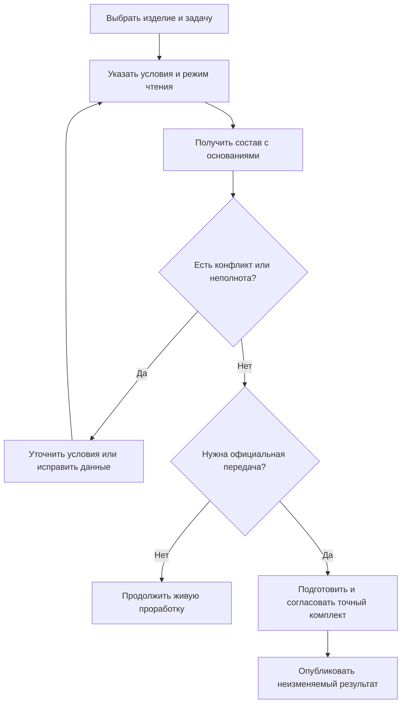
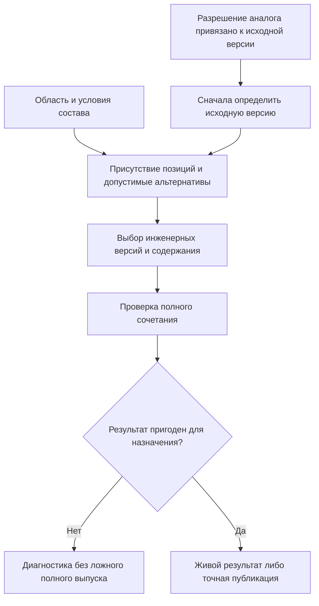

# 05. Как формируется состав: сохранение возможностей IPS и новая организация Interlink

Редакция от 6 сентября 2026 года. Это описание принятого целевого поведения. Исполняемый подбор нового ядра, конфигурирование, замены и точные производственные публикации ещё должны пройти разработку и приёмку.

## 1. Главный ответ

Interlink сохраняет результат, ради которого в IPS существуют подбор версий, конкретизация, применяемость, контексты, варианты и точный заказ. Пользователь должен получить пригодный состав для определённой задачи и понимать, почему выбраны именно эти компоненты и состояния.

Однако не все перечисленные действия являются выбором версии. Сначала надо понять, нужна ли позиция, какой объект или комплект используется вместо исходного и в какой области действует решение. Затем для выбранных объектов определяются инженерные версии и их содержание. После этого проверяется совместимость целого результата. Точная публикация отдельно сохраняет полученное содержание.

Поэтому «один механизм подбора» означает общие понятия, проверяемые операции, объяснение результата и согласованные правила исполнения. Это не обещание одного неизменного списка приоритетов для всех установок IPS и не попытка объявить подбором любые действия над составом.

## 2. Шесть вопросов, которые нельзя смешивать

| Вопрос | Пример для насосной станции | Возможный результат |
|---|---|---|
| Нужна ли позиция? | Требуется ли обогрев для северного исполнения? | Позиция включена либо исключена по условию |
| Что применяется? | Исходный насос или разрешённый комплект из двух насосов? | Выбран объект либо полный структурный вариант |
| Какая инженерная версия нужна? | Версия 03 или 04 выбранного насоса? | Версия определена либо требуется решение конфликта |
| Какое содержание версии читать? | Последнее опубликованное, рабочее или точно закреплённое? | Выбрано конкретное состояние |
| Пригодно ли сочетание? | Хватит ли мощности шкафа для двух насосов и обогрева? | Допуск, запрет или недостаточность знания |
| Что выдано официально? | Какой комплект передан для заказа сентября? | Неизменяемая публикация с точными основаниями |

Исключённая по исполнению позиция не является ошибкой подбора. Нужная позиция без подходящей версии — ошибка или диагностируемая неполнота. Подходящая версия сама по себе не доказывает совместимость всего комплекта. Успешный просмотр не равен официальной передаче производству.

## 3. Что берётся из IPS

### Позиция принадлежит родительскому составу

В IPS связь состава относится к версии родителя и дочернему объекту. Она хранит данные использования: количество, единицу, номер позиции, порядок, примечание и другие признаки. Такая асимметрия позволяет выпустить новую версию компонента, не переписывая каждую сборку, где он используется.

Interlink сохраняет этот смысл, но точнее различает инженерную версию родителя и её опубликованное содержание. Связи конкретного опубликованного состояния не переписываются. Новый вариант состава появляется как новое состояние, а прежнее остаётся основанием старых передач.

### Правило подбора имеет предметный смысл

Изученные материалы IPS описывают правила с обычными условиями и дополнительным выбором минимума либо максимума среди подходящих версий. Значения могут поступать из константы, пользовательского условия или другого признака. Правило может быть общим, личным либо системным.

Исторический резервный результат «не совсем подходящая» важен: он позволяет показать кандидата, даже если все обычные требования не выполнены. В Interlink эта возможность сохраняется как явно разрешённый резерв с предупреждением. Она не должна выглядеть как обычное успешное совпадение и не обязана допускаться к производственной публикации.

### Применяемость и контекст нужны одновременно

Применяемость определяет условия использования версии по головному изделию, серии, номеру, дате и другим предметным ограничениям. Контекст редактирования помогает видеть согласованное будущее содержание нескольких объектов. Они отвечают на разные вопросы и могут конфликтовать: старое исполнение уже разрешено производству, а новая рабочая конструкция ещё только проверяется.

Порядок разрешения этого конфликта зависит от выбранного режима. Нельзя потерять производственное поведение IPS только потому, что разработчику удобнее всегда показывать рабочую копию.

### Конфигуратор, аналоги и групповые замены не исчезают

Опции определяют включение позиций, связанные значения и ограничения. Аналог допускает рассмотрение другого объекта в заявленной области. Групповая замена описывает полный альтернативный комплект: например, двигатель и муфта заменяются мотор-редуктором, плитой и крепежом.

Автоматический технологический подбор остаётся отдельным предметным сценарием: он ищет кандидатов и предлагает решение. Предложение не должно незаметно становиться изменением состава. Для применения нужны те же управляемые операции и проверки, что для ручной работы.

## 4. Почему нельзя обещать один исторический порядок IPS

Источники относятся к разным поколениям и описывают порядок с разной полнотой. Консолидированное описание ставит жёсткую конкретизацию перед применяемостью, затем контекст, мягкий выбор и обычное правило. Историческое задание начинало с применяемости и в некоторых случаях завершало выбор уже на этом шаге. Документ о контекстах показывает сокращённый путь без всех остальных условий.

Это не повод выбрать наиболее удобный текст. Для переноса фиксируются версия IPS, модули, настройки и реальные результаты конфликтных примеров. Из них получается подтверждённый режим поведения. В новой системе режим является явной версионируемой настройкой, а не скрытым следствием открытого окна.

Редакторский режим Interlink может отдавать приоритет выбранным рабочим данным перед применяемостью. Совместимый режим IPS может сохранять обратный порядок. Оба используют общие операции подбора и одинаково объясняют результат. Если нужный режим ещё не реализован, система должна явно отказать, а не исполнить похожий.

## 5. Путь пользователя

Пользователь начинает с деловой задачи, а не с внутреннего алгоритма. Для ремонта старого экземпляра и для нового заказа одной модели могут быть правильны разные составы. Система должна показывать режим, существенные условия и предупреждения рядом с результатом. Официальная передача — отдельная ветвь, где диагностической неполноты уже недостаточно.

## 6. Какие исходные условия сохраняются явно

В запросе значимы корень и вид структуры, режим подбора, область работы, согласованные контексты, предметные координаты, разрешённые варианты, правила и требуемая точность. Для разных задач не обязательно нужны все поля, но ни одно используемое условие не должно существовать только в памяти окна.

Предметные координаты — именованные условия, например головное изделие, заводской номер, дата выпуска, площадка или климатическое исполнение. Это не координаты САПР. У каждого условия определены тип значения, единица при необходимости и область действия. Дата применяемости также не заменяет время публикации или время регистрации факта.

Во вложенном составе некоторые условия могут распространяться вниз или уточняться для отдельной ветви. Такое уточнение должно иметь явную область. Выбор для левого насосного модуля не должен протекать в правый из-за совпадения наименований.

Нынешние права доступа проверяются отдельно от предметного ранжирования. Если подходящая версия закрыта, система не должна автоматически подставлять видимую, но неподходящую старую версию.

## 7. Как выбирается версия и содержание

### Точная ссылка и жёсткая конкретизация проверяются на разных уровнях

Точная ссылка сразу задаёт неизменяемое содержание. Жёсткая конкретизация задаёт инженерную версию: другие версии этого объекта не могут победить её из-за основного или резервного правила. Какое содержание закреплённой версии читать, определяется режимом: опубликованное, явно выбранное рабочее либо точное.

Два несовместимых жёстких требования означают конфликт. Они не разрешаются порядком строк или тем, какая настройка обработана последней.

В режиме «только точные состояния» отсутствие точной ссылки завершает подбор неуспехом. Наличие основной версии, подходящей применяемости или резервного кандидата это требование не ослабляет.

### Контексты дают явные назначения

Сохраняемый контекст может назначать инженерную версию объекта и при необходимости конкретное содержание. Несколько контекстов объединяются для согласованного чтения. Если назначения несовместимы, требуется решение: совпадение одной инженерной версии с двумя разными рабочими состояниями тоже может быть конфликтом.

Контекст существует независимо от пакета выпуска. После завершения работы ссылка на рабочие данные заменяется допустимой опубликованной ссылкой только по явному правилу. Нельзя оставлять ссылку на исчезнувшую рабочую копию или молча переходить к общей основной версии.

### Мягкая конкретизация сохраняет решение позиции

На входном и выходном валах редуктора может стоять один объект подшипника, но с разными предпочитаемыми версиями. Поэтому мягкий выбор хранится для места использования, а не единственным предпочтением объекта на весь пакет.

Профиль подбора определяет, когда мягкое решение участвует в выборе. Игнорирование при текущем просмотре не удаляет его. Приостановка по жизненному циклу и последующее восстановление имеют историю причин. Старое восстановление не может вернуть вручную удалённое или заменённое предпочтение.

Команда «конкретизировать показанное» фиксирует действительно показанную инженерную версию и проверяет, что исходная позиция не была конкурентно изменена. Она не должна записать новую основную версию, появившуюся после просмотра, либо затереть существующую мягкую конкретизацию, временно заслонённую контекстом.

### Применяемость, основное и резервное правила завершают допустимый выбор

Применяемость использует объявленные условия и их границы. Пересечение несовместимых действующих диапазонов не устраняется случайным выбором. Особенности приоритета серии, даты и головного изделия сохраняются в подтверждённом профиле, а не объявляются универсальными для любой отрасли.

Основная версия выбирается по назначению. Последняя — из заявленного множества кандидатов. Готовность ограничивает допустимость по согласованной шкале. Дополнительные корпоративные правила должны иметь управляемую редакцию и проверяемое объяснение.

Резерв выполняется только там, где разрешён. Он не заменяет строгую точность, запрет доступа, неисправный источник или конфликт. Если кандидата нет, нужная позиция остаётся видимой в допустимом диагностическом представлении с объяснением; рекурсия через невыбранную цель не продолжается.

## 8. Состав как целое: порядок с явными зависимостями

Схема показывает зависимости, а не разрешает один жёсткий порядок для всех предметных правил. Например, каталог аналога может содержать разрешение только для определённой исходной версии. Тогда сначала нужно определить эту версию, проверить разрешение, выбрать новый объект и выполнить подбор для него. Окончательная совместимость проверяет уже выбранное содержание, а не только названия участников.

Повторное прохождение нужного участка не должно становиться скрытым резервным подбором. Система сохраняет цепочку: какое исходное решение проверялось, какое разрешение применилось, что выбрано вместо него и почему итог пригоден.

## 9. Замены, совместимость и таблицы как основания

Нативная модель различает библиотечное разрешение, привязку его ролей к позициям, выбор для контекста, применённое изменение и факт установки. Одно разрешение может использоваться в нескольких заказах, не переключая общий «текущий вариант» для всех применений.

Полный вариант N:M рассматривается целиком. Недоступность переходной плиты не позволяет объявить замену «двигатель и муфта на мотор-редуктор, плиту и крепёж» успешно применённой. Если два выбранных преобразования требуют несовместимых действий над одним местом, возникает конфликт. Важны не только изменяемые позиции, но и те, сохранность которых является условием замены.

Совместимость может связывать три и более участника. Отдельно допустимые пары двигателя, преобразователя и охлаждения не доказывают выполнение общего ограничения мощности. Для неполной конфигурации отсутствие найденного противоречия ещё не означает, что существует полное допустимое продолжение.

Таблица характеристик или карта совместимости должна иметь определённую редакцию, область и полноту. Отсутствие записи нельзя читать как запрет либо разрешение без явно полного авторитетного перечня. Ошибка доступа и недоступная страница не являются предметным отсутствием.

## 10. Точная публикация состава

Живой просмотр отвечает на вопрос «что получается сейчас». Повтор с прежними условиями может дать иной ответ после публикации новых данных. Исторический результат читается по сохранённым точным основаниям без нового подбора.

Официальный комплект формируется полностью до листьев в объявленной области выпуска. Ограничение глубины на экране, скрытые строки и недостаток прав не определяют эту область. Для самостоятельной частичной передачи сначала выделяется собственная предметная область или корень, после чего полнота проверяется внутри неё.

Снимок состава сохраняет позиции, пути, количества и выбранные точные состояния. Междисциплинарный комплект может дополнительно закреплять маршруты, нормы, файлы, табличные основания и существенные результаты проверок. Контрольная сумма без сохранённых данных и возможности прочитать их не обеспечивает историческую воспроизводимость.

У живого заказа может быть несколько публикаций. Публикация состава, его доставка во внешнюю систему, приём и изготовление имеют разные состояния. Ответ производства не переписывает прежний состав «как выдано».

## 11. Пример: ремонтный подшипник и жёсткая конкретизация

Для редуктора РЦ-250 применяются версии 02 и 03 подшипника. Версия 03 предназначена новым изделиям; ремонт старого корпуса должен использовать именно версию 02. Инженер жёстко закрепляет её в позиции выходного вала.

Позже в версии 02 уточняют обозначение защитной шайбы и публикуют новое состояние без создания версии 04. Живой ремонтный состав в режиме последнего опубликованного содержания версии 02 может показать это уточнение. Но комплект, выданный ремонтному участку вчера, сохраняет прежнее точное состояние.

Проверка должна показать оба правильных результата. Если система переводит позицию на версию 03, нарушена жёсткая конкретизация. Если она утверждает, что закрепление версии 02 всегда означает вчерашнее содержание, смешаны два уровня точности.

## 12. Пример: мягкий выбор в двух позициях одной детали

В компрессоре один тип уплотнения используется в нагретом и охлаждаемом узлах. Для первой позиции предпочитается версия 04, для второй — проверенная версия 03. Конструктор сохраняет два мягких решения.

В испытательном контексте временно просматривают версию 05. Этот просмотр не уничтожает сохранённые предпочтения. При переходе родителя в предусмотренное состояние жизненного цикла мягкие решения приостанавливаются. При возврате система восстанавливает только те же сохранённые решения, для которых причина приостановки действительно снимается.

Если между переходами инженер явно заменил предпочтение охлаждаемого узла на версию 04, старое событие не возвращает версию 03. Пользователь должен видеть основание результата: временное назначение контекста, активный мягкий выбор либо обычное правило, а также отдельную историю сохранённого намерения.

## 13. Пример: замена одного насоса двумя для конкретного заказа

Поставщик задержал насос станции. В библиотеке существует разрешённый комплект из двух насосов меньшей производительности с переходным коллектором и дополнительной защитой. Для заказа «Северная станция, сентябрь» снабжение предлагает этот вариант.

Система связывает роли комплекта с конкретными местами станции и подбирает инженерные версии участников. Затем проверяет суммарную подачу, электрическую мощность, условия работы и необходимые монтажные элементы по точным таблицам и правилам. Другой заказ продолжает использовать исходный насос.

Если мощность шкафа недостаточна, наличие библиотечного разрешения не завершает задачу успешно. Требуется другой комплект или отдельное согласованное изменение шкафа. После утверждения выпускается точный состав передачи. Производство позднее регистрирует, какие насосы действительно установлены; это не выводится из факта выбора.

## 14. Пример: одна подсборка в двух ветвях и потерянный ответ

Станция содержит левый и правый насосные модули одной конструкции. Для левого экземпляра заказа требуется иное уплотнение. Система использует область конкретного пути от выбранного корня раскрываемой структуры, а не изменяет локальное предпочтение общей подсборки для обоих модулей. Корень структуры не следует путать с координатой «головное изделие», используемой в применяемости.

Агент анализирует вариант по сохранённой выдаче: значения таблицы и состояния файлов удержаны до его решения. Он предлагает изменение, но не получает права публиковать его только потому, что выполнил анализ. После человеческого согласования публикация завершается, однако ответ интерфейсу теряется.

Повторное открытие устанавливает результат той же операции. Не создаётся второй комплект, а старый не объявляется отменённым без доказательства. История связывает выбранный путь, точный предмет согласования, инициатора и подтверждённый результат.

## 15. Что увидит пользователь при проблеме

| Ситуация | Требуемое объяснение и дальнейшее действие |
|---|---|
| Позиция не нужна выбранному исполнению | Показать условие исключения, не называть это отсутствующей версией |
| Версия для нужной позиции не найдена | Сохранить диагностируемое место и причину, предложить уточнить условия или данные |
| Два назначения контекста конфликтуют | Показать оба основания и запретить случайный выбор |
| Точной ссылки нет в строгом режиме | Сообщить о недостаточной точности без резервной подстановки |
| Выбран разрешённый резерв | Сохранить предупреждение в просмотре, отчёте и последующем решении |
| Подходящее содержание недоступно | Применить установленную политику доступа, не подставлять видимую старую версию |
| Замена или совместимость не доказана | Отличить запрет, неполноту знания и ошибку получения данных |
| Обнаружен цикл или неполная область выпуска | Остановить полный выпуск, не представлять обрезанный граф как точный |
| Утрачено подтверждение публикации | Выяснить прежний исход до нового действия |

## 16. Приёмка и открытые вопросы

Обязательны сравнение нескольких профилей IPS, границы серии и даты, два мягких выбора одного объекта, восстановление после жизненного перехода, групповая однозначность, независимый выпуск контекстов, строгая точность, резерв с предупреждением, повторная подсборка и N:M-замена. Для обратного поиска нужно проверить, что удалённая из актуального состава позиция не появляется вновь за счёт исторической родительской версии.

Отдельно проверяются точная публикация после изменения исходных правил, доступ к закрытому компоненту, полное удержание необходимых файлов и таблиц, согласованный результат при параллельной правке, повтор после неизвестного исхода. Приёмка сравнивает не только список деталей, но и причины, количества, пути, историю и разрешённое дальнейшее действие.

Со специалистом IPS нужно подтвердить конкретные приоритеты, области автопополнения контекстов, допустимость резервного результата в производстве, варианты операций над группами замен и корпоративные обработчики, влияющие на состав. Полный набор обсуждается в [вопросах о составе](../open-questions/03-composition-configuration-and-resolution.md); подтверждённые результаты включаются в [матрицу покрытия](13-capability-coverage.md).

## Состояние реализации и связанные документы

Новая семантика принята как договор; работающий компилятор модели и формы данных не доказывают исполнение полного подбора. Малые проверки новых оснований входят в ранний этап; общие средства и полные пользовательские сценарии принимаются позднее по единому плану. Таблицы, замены и агентская прослеживаемость не откладываются целиком до появления готовых приложений.

Подробный маршрут: [пакет подбора версий](../version-selection/README.md), [изменения](../changes/README.md), [заказы](../orders/README.md), [табличные данные](../tabular-data/README.md), [замены и совместимость](../substitution-and-compatibility/README.md).

Основания: IPS-A03, IPS-A04, IPS-A05, IPS-K03, IPS-K04, IPS-A11; IL-KERNEL, IL-FOUNDATION, IL-TD, IL-SC, IL-IPS-COVERAGE, IL-CHANGES, IL-ORDERS, IL-PLAN-V2 в [реестре источников](15-source-register.md).
