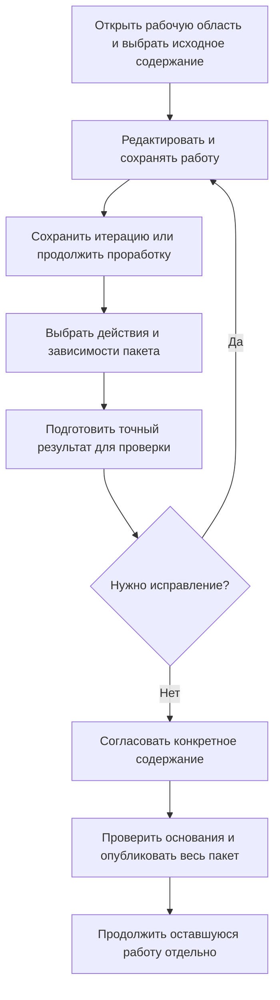
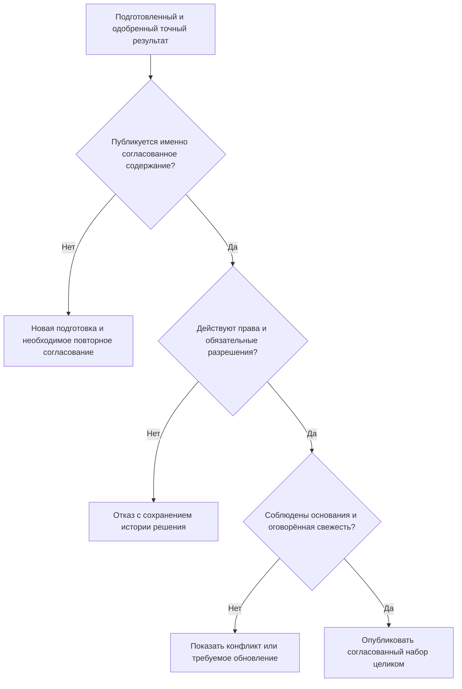

# 07. Версии, рабочая история, изменения и точные свидетельства

Редакция: 6 сентября 2026 года. Документ объясняет **принятый целевой контракт**, а не уже работающую замену IPS. Он связывает отдельные механизмы в понятный путь: проработать изделие, сохранить работу, согласовать результат, опубликовать содержание и впоследствии доказать, что именно было выпущено.

## 1. Почему одного слова «версия» недостаточно

Для конструктора «версия 05 корпуса редуктора» — узнаваемый инженерный вариант. Однако утром эта версия могла содержать один допуск отверстия, а после разрешённого исправления и завершения работы — другой. Если договориться, что номер версии обозначает одновременно инженерный вариант и неизменные байты, теряется одно из двух требований: либо каждое исправление искусственно создаёт новую инженерную версию, либо старая подпись незаметно начинает относиться к новому содержанию.

Поэтому новая модель разделяет четыре понятия.

| Понятие | Пример | Что сохраняется при последующей работе |
|---|---|---|
| Объект | Корпус редуктора РЦ-250 | Тождество детали независимо от её инженерного развития |
| Инженерная версия | Версия 05 корпуса | Её обозначение и место в истории происхождения |
| Точное опубликованное состояние | Содержание версии 05, выпущенное после исправления допуска | Неизменные данные именно этого завершённого результата |
| Рабочее состояние | Незавершённая правка версии 05 | Сохраняемая работа, которая ещё не является официальным содержанием |

Сохранение работы, публикация нового точного состояния и создание новой инженерной версии — **три разных действия**. Разрешение редактировать существующую версию зависит от её жизненного цикла и полномочий. Само наличие нескольких состояний не даёт права исправлять выпущенную документацию без установленного процесса.

Новая инженерная версия может происходить от исторического прототипа, а не только от последней зарегистрированной версии. Например, сервисная модификация литого корпуса и перспективный сварной корпус могут развиваться от общей исходной конструкции. Система должна сохранять настоящий прототип и точное исходное содержание. Это не обещание автоматического слияния двух независимо изменённых составов.

## 2. Работа, совместный просмотр и публикация имеют разные границы

Рабочая область нужна, чтобы команда могла вести длительную проработку. Контекст подбора нужен, чтобы сохранить согласованные назначения версий и способ чтения их содержания. Пакет изменения нужен, чтобы определить, что должно стать официальным вместе. Эти договорённости часто пересекаются, но не совпадают.

Например, механик, технолог и специалист по автоматике совместно смотрят будущий станок. Защитное ограждение готово к выпуску, а система измерения ещё испытывается. Общий просмотр не должен заставлять публиковать незавершённую систему измерения. В пакет ограждения включают только действительно необходимые данные и зависимости; остальная работа остаётся в рабочей области.

| Договорённость | Что она определяет | Чего сама по себе не означает |
|---|---|---|
| Рабочая область | Где находятся рабочие данные, от каких оснований они редактируются и кому доступны | Что вся работа будет опубликована одним действием |
| Долговременный контекст | Какие версии и при необходимости состояния выбраны для совместного чтения | Что все выбранные версии сейчас редактируются |
| Группа контекстов | Как совместить назначения нескольких участников без неоднозначности | Что их пакеты должны завершаться одновременно |
| Пакет изменения | Какой проверяемый набор действий публикуется целиком | Что он владеет всей долговременной работой команды |
| Объединённая публикация | Какие самостоятельные пакеты действительно должны вступить в силу одновременно | Что порядок пакетов автоматически разрешит противоречие между ними |

Два контекста могут выбирать одну инженерную версию, но разное содержание: один — старое точное состояние, другой — рабочую правку. Это тоже конфликт, а не согласованность только по совпавшему номеру версии. При завершении работы переход с рабочего состояния на опубликованное выполняется по явному правилу. Закрытие пакета не должно незаметно переключать состав на общую основную версию.

## 3. Как проходит изменение

Схема показывает, почему рабочая область не заканчивается обязательно вместе с публикацией. Официальным становится выбранный согласованный результат, а не всё, что команда успела набрать в формах.

Обычная правка, журнальное изменение и формальное извещение могут иметь разные формы и маршруты. При этом сохраняются общие требования: действие разрешено, исходные данные определены, обязательные ограничения соблюдены, опубликованный результат совпадает с проверенным, а его исход можно установить после сбоя.

Не каждое изменение требует инженерного пакета. Исправление телефона поставщика может быть обычным управляемым обновлением карточки, а сообщение о проведённом измерении — новым неизменяемым фактом. Нейтральный объектный фундамент не навязывает этим данным жизненный цикл чертежа.

## 4. Параллельная работа без потери чужих правок

Новая концепция не устанавливает глобальный запрет на любую вторую работу с тем же объектом. Независимые рабочие области могут готовить изменения одной инженерной версии от известного точного основания. Предприятие вправе вводить более строгую эксклюзивную выдачу, если этого требует его процесс, но такая политика не подменяет общую модель данных.

При публикации проверяется, осталось ли исходное опубликованное состояние тем, на которое опиралась работа. Если другая команда уже завершила изменение той же версии, поздняя публикация не перезаписывает её результат. Рабочие правки сохраняются, а пользователь выбирает осмысленное продолжение: сравнить различия, перенести правки на новое основание, выполнить ручную интеграцию или создать отдельную инженерную версию.

Отзыв доступа у автора также не равен удалению его работы. Административная отмена, передача ответственности и последующее удаление — самостоятельные управляемые действия. Они должны учитывать ссылки других работ, итерации и удержанные свидетельства.

## 5. Полная конкретизация и единый механизм подбора

Жёсткая конкретизация инженерной версии означает: «использовать версию 05, не переходить на 06». Точная фиксация состояния означает более сильное требование: «использовать именно содержание версии 05, которое было опубликовано при этой выдаче». Во втором случае ни последующее исправление версии 05, ни рабочая копия не меняют выбранный результат.

Мягкая конкретизация — сохраняемое предпочтение инженерной версии для конкретной позиции. Например, в одном месте редуктора намеренно выбирают прежнюю версию подшипника, а в другом — новую. Должны быть различимы само намерение, его действие в текущих условиях, временное игнорирование, приостановка и восстановление. Явно удалённое предпочтение не должно самопроизвольно возвращаться при очередном переходе жизненного цикла.

Временное предпочтение текущей проработки — отдельный механизм. Оно помогает проверить гипотезу, но не воспроизводит всю мягкую конкретизацию IPS и не заменяет её при переносе.

«Один механизм подбора» означает общие входы, различимые уровни выбора и объяснимый результат, а не один вечный список приоритетов. Подтверждённый профиль IPS может ставить применяемость раньше рабочего контекста; собственный режим редактирования — наоборот. Порядок должен быть явно выбран, версионирован и проверен на сценариях. Новое окно или фоновый агент не получают право изобрести другую последовательность.

В каждом результате отдельно объясняются присутствие позиции, выбор объекта или варианта замены, инженерная версия и прочитанное состояние. Назначенная основная версия, последняя допустимая версия и версия с нужной готовностью остаются разными правилами. Отсутствие результата основного правила не включает запасной вариант молча.

## 6. Итерации и восстановление рабочей истории

Итерация нужна не только как удобная кнопка «Отменить». Инженер должен иметь возможность сохранить именованную точку многообъектной проработки, вернуться к ней после закрытия рабочего сеанса и понять, какие параметры, позиции, файлы и выбранные основания тогда использовались.

Перед восстановлением система защищает текущее рабочее содержание отдельной точкой возврата и подготавливает план восстановления. Пользователь видит область: что будет восстановлено, какие ресурсы доступны и какие зависимости требуют проверки. Недоступный файл нельзя заменить сегодняшним файлом с тем же именем и объявить восстановление точным.

Восстановление меняет только предусмотренные рабочие данные. Оно не переписывает опубликованные состояния, не меняет подписи и не создаёт публикацию автоматически. Если восстановленный вариант должен стать официальным, далее выполняется обычная подготовка и публикация. При переносе из IPS архивная итерация незавершённой работы также не должна превращаться в выдуманную официальную версию.

## 7. Что именно согласует человек

Согласующий получает подготовленный точный результат: содержание объектов, выбранные операции, документы, использованные нормы, применяемость и другие значимые основания. Его решение связано с этим содержанием, а не только с номером извещения.

Если конструктор после подготовки меняет количество болтов, прежний подготовленный результат не переписывается. Для новых данных требуется новая подготовка и предусмотренное процессом решение. Аналогично рассматривается явная замена входящей редакции нормы или документа.

Но выход новой посторонней версии детали или новой библиотечной редакции сам по себе не изменяет уже согласованный точный комплект. Иначе согласование никогда нельзя было бы завершить в активно работающей организации. Отдельно остаются текущие права, обязательный отзыв разрешения на применение и явно оговорённые требования свежести. Старое согласование не разрешает действие, которое теперь обязательно запрещено.

На схеме различены неизменность согласованного содержания и действительность разрешения выполнить действие сейчас. Нельзя ни незаметно пересчитать первое, ни игнорировать второе.

Инженерная готовность, шаг жизненного цикла и состояние маршрута согласования тоже не сливаются. Две версии одинаковой инженерной готовности могут иметь разные разрешённые переходы. Задание «проверяет технолог» не становится новым уровнем готовности материала.

## 8. Три разных вида сохранённого результата

Техническая проекция ускоряет чтение ранее сформированного представления. Её можно перестроить как новую проекцию и удалить по правилам обслуживания. Она не становится свидетельством выпуска только потому, что содержит много строк.

Базовая линия фиксирует точный состав для выпуска, обмена, отчёта или аудита. В ней важны не только узлы дерева, но и точные основания: корень, состав, количества, выбранные состояния, правила, параметры и ресурсы, которые входят в объявленную область свидетельства.

Публикация передачи заказа закрепляет конкретный производственный комплект. Живой заказ может продолжать изменяться и иметь несколько передач. Неизменна именно публикация, а не вся карточка заказа и не фактически изготовленная продукция.

Полный официальный состав нельзя получить отсечением неудобных ветвей, глубиной окна или скрытием недоступных позиций. Неопределённая обязательная позиция на любом уровне блокирует публикацию такого полного результата. Доступ к целому свидетельству не должен создавать его незаметно урезанную «официальную» версию.

Точность ссылок сама по себе ещё не обеспечивает долговременную читаемость. Нужны сохранённые файлы, подходящие средства чтения прежней модели и заявленные сроки хранения. Если требуется автономный доказательный комплект, его состав явно расширяют необходимыми материалами и подписями. Нельзя обещать восстановление содержания, оставив только контрольную сумму удалённого файла.

## 9. Публикация, журнал и восстановление после сбоя

Выбранный пакет публикуется целиком либо не меняет официальные данные. Обязательная запись о действии, подтверждение его результата и предусмотренное сообщение для дальнейшей доставки должны быть согласованы с этим предметным эффектом. Обычный технический журнал сервиса не заменяет такое свидетельство.

Это требование действует и когда Interlink завершает самостоятельную операцию, и когда участвует в общей операции принимающего приложения. Во втором случае подготовленные результаты становятся долговечными только после подтверждённого завершения общей операции.

При потере ответа существуют три разных случая: успех подтверждён, отмена подтверждена или исход неизвестен. Последнее не означает отмену. Нужно выяснить результат той же операции по её устойчивому основанию; повтор под новым номером может создать второе извещение или вторую передачу.

Публикация, доставка сообщения и приёмка внешней системой также имеют разные состояния. Повторить недоставленное сообщение о уже опубликованном комплекте — не то же самое, что ещё раз публиковать инженерное изменение.

## 10. Три инженерных примера

### Исправление допуска без искусственной новой версии

В версии 05 корпуса редуктора исправляют допуск отверстия по разрешённому процессу. Конструктор сохраняет несколько промежуточных результатов, но номер версии остаётся прежним. После проверки публикуется новое точное состояние версии 05.

Извещение, жёстко ссылающееся на инженерную версию 05, остаётся связано с ней. Архивный подписанный комплект продолжает читать прежнее точное состояние. В карточке пользователь различает «версия 05» и «содержание на момент выдачи». Если правила жизненного цикла запрещают такую правку, процесс должен потребовать другую допустимую процедуру, а не воспользоваться технической возможностью нескольких состояний.

### Независимый выпуск механики и продолжающаяся технология

Механик закончил ограждение станка, технолог ещё выбирает маршрут изготовления. Их контексты дают общий будущий вид, но пакеты самостоятельны. После проверки механик публикует ограждение; технологическая рабочая область сохраняется.

Если технологический контекст ссылался на рабочее ограждение, переход к опубликованному состоянию выполняется по заявленному правилу с сохранением происхождения. Состав не перескакивает на случайную общую основную версию. Для итогового междисциплинарного выпуска позднее создаётся отдельный точный комплект с необходимыми зависимостями.

### Замена привода в заказе и последующее доказательство

Для насосной станции согласован вариант замены одного привода комплектом «двигатель, преобразователь и переходная плита». Выбирается весь вариант, проверяются подключения, количества и совместимость итогового состава. Наличие разрешения в библиотеке не означает, что этот вариант уже выбран каждым заказом или установлен на оборудовании.

Пакет с новым составом проходит согласование, затем публикуется конкретная передача в производство. Через неделю разрешают новый преобразователь: прежняя передача остаётся прежней. Производство отдельно регистрирует фактические серийные номера. При расследовании видно разрешение на замену, выбранный план, опубликованную передачу и факт установки — четыре связанных, но разных основания.

## 11. Проверяемое покрытие IPS и новые возможности

Перенос должен сохранять рабочие копии, именованные итерации, обычные и связанные контексты, мягкую и жёсткую конкретизацию, применяемость, извещения, журнальные изменения и точные выдачи. Сходство названий не доказывает эквивалентность: нужно воспроизвести пользовательские действия, видимость, исключения и исторический результат на целевой установке IPS.

Новая концепция дополнительно даёт путь к параллельным рабочим областям, раздельной публикации совместно просматриваемых работ, нейтральным карточкам и фактам, точным табличным основаниям, оценке многокомпонентной совместимости и прослеживаемости агентских действий. Эти расширения не служат поводом исключить сложный сценарий IPS.

Критерии приёмки:

1. Несколько сохранений не создают новые инженерные версии; разрешённая публикация сохраняет прежний номер и создаёт новое точное состояние.
2. Жёсткая конкретизация не переключается на другую инженерную версию, а точная фиксация не меняет содержание.
3. Мягкое намерение переживает предусмотренные отключения и восстановления, но явно удалённое не возвращается.
4. Группа контекстов допускает независимую публикацию и обнаруживает конфликт разных состояний одной версии.
5. Конфликт параллельной публикации не теряет ни чужой результат, ни локальную работу.
6. Итерация восстанавливается только в рабочие данные, с защитой нынешней работы.
7. Согласованный точный результат не меняется от посторонних новых данных; текущий обязательный запрет всё же блокирует действие.
8. Неполный состав не становится полным свидетельством ни при согласовании, ни при недостатке прав.
9. Потерянный ответ разрешается проверкой прежней операции без дублирующего эффекта.
10. Исторический комплект доступен с его точными материалами в пределах обещанной политики хранения.

## 12. Состояние реализации и вопросы к внедрению

В проекте существуют язык модели, его проверка, формирование прикладных описаний и работа с каталогом. Хранение и установка развиваются, но полный новый механизм записи, подбора, публикации и исторического чтения ещё не является готовым пользовательским контуром.

Действующий план сначала согласует новые договоры и проверяет их малым исполняемым примером, включая настоящую базу данных там, где свойство относится к хранению. Затем формы включаются в общие компоненты и проверяются сквозными сценариями. Минимальные доказательства таблиц, совместимости и агентского происхождения нужны до закрепления зависимой архитектуры, а не неопределённо после опытного образца.

На внедрении остаётся уточнить политику редактирования выпущенных версий, границы эксклюзивной выдачи, набор именованных итераций, правила актуализации контекстов, обязательные запреты и сроки хранения доказательств. Эти решения должны настраивать проверенную модель, а не заново определять смысл версии.

## Связанные документы и основания

- [Полная картина пользовательской работы](16-operating-model-and-user-work.md).
- [Подробный пакет об изменениях](../changes/README.md).
- [Мягкая конкретизация](../version-selection/20-durable-soft-concretion.md), [контексты](../version-selection/21-selection-contexts.md) и [итерации](../version-selection/22-iterations-and-checkpoints.md).
- [Работа с заказами](../orders/README.md).
- [Граница агентской системы](09-alvatune-and-agents.md).

Основания: [IL-KERNEL], [IL-STORAGE], [IL-AI], [IL-CHANGES], [IL-ORDERS], [IL-PLAN-V2], [IL-IPS-COVERAGE], [IL-VERS-INDEX], [IL-VERS-CONCEPTS], [IL-VERS-IPS], [IL-VERS-SPEC], [IL-HOST], [IL-PLM], [IPS-A04], [IPS-A05], [IPS-A13]. Расшифровка и приоритет редакций — в [реестре источников](15-source-register.md). Исторические ранние описания не переопределяют новую модель.
