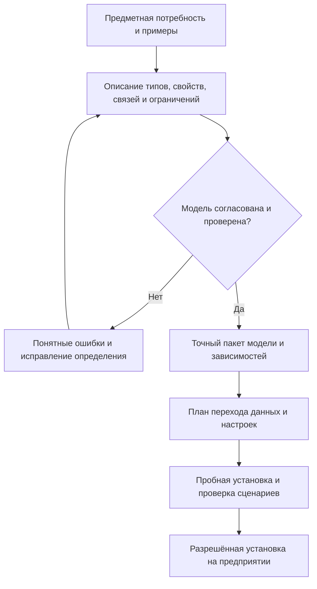
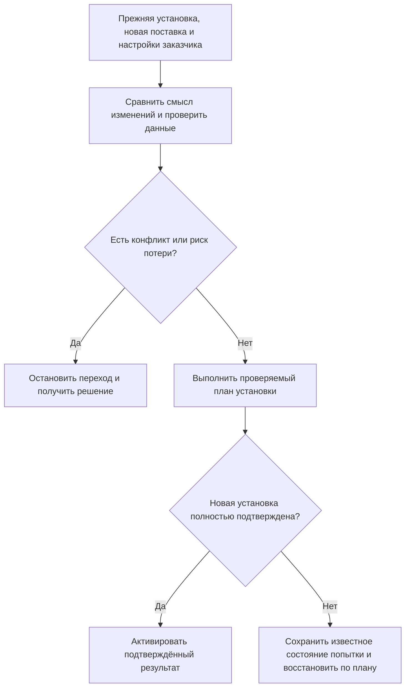

# 08. Предметная модель, её поставка и расширяемость

Редакция: 6 сентября 2026 года. Здесь описаны принятые основания новой архитектуры и путь их реализации. Наличие языка модели и отдельных проверенных компонентов не означает готовый конфигуратор предприятия, промышленную миграцию IPS или доказанную работу под агентской нагрузкой.

## 1. Что получает предприятие

Предметная модель определяет, какие сущности ведёт система, какие у них свойства и отношения, какие значения допустимы и как изменяется содержание. Для машиностроения это могут быть детали, документы, позиции состава, операции, материалы и заказы. Для логистики — места хранения, партии, перемещения и подтверждённые события. Общий фундамент не заставляет вторую область притворяться конструкторским архивом.

Interlink рассматривает такую модель как управляемый поставляемый результат. Предприятие должно понимать, какая редакция установлена, чем она отличается от предыдущей, какие настройки принадлежат заказчику и что потребуется сделать с накопленными данными.

Цель — сохранить полезную гибкость конфигурируемой PLM и одновременно сделать её воспроизводимой. Быстро добавить разрешённый признак, безопасно обновить отраслевой модуль и доказать читаемость старого заказа — разные задачи. У каждой нужен удобный рабочий путь, а не только техническая возможность.

## 2. Язык модели: описание предметного смысла

DSL — специализированный язык описания модели. В продуктовой работе его следует понимать не как требование ко всем пользователям стать программистами, а как точную форму договора между предметным специалистом, разработчиком и системой.

В этом договоре указывают, например: «материал является справочным объектом», «у детали есть масса с единицей измерения», «позиция состава соединяет сборку с компонентом», «переименование свойства не должно уничтожить его прежние значения». Специалист формулирует требования, проверяет примеры и последствия; инженер внедрения оформляет проверяемую модель. Формы её удобного редактирования в будущем относятся к прикладным инструментам.

Авторитетное описание фиксирует базовую модель и разрешённые границы настройки. Среда установки может содержать допустимую дельту заказчика, но не получает права незаметно переопределить закрытые правила ядра. Настройка должна иметь владельца, историю и путь экспорта в воспроизводимую поставку.

Переход от описания к установке не является нажатием одной безусловной кнопки. Ошибка в модели должна обнаруживаться до изменения производственных данных, а преобразование накопленной базы требует самостоятельной проверки.

## 3. Не все данные имеют инженерные версии

Тип выбирает подходящий способ изменения данных. Конструкторский документ требует инженерной версии, точного опубликованного состояния и рабочей проработки. Адрес склада может быть обычной изменяемой записью с защитой от потери чужого обновления. Подтверждение измерения — неизменяемым фактом, который не исправляют на месте, а уточняют новым связанным фактом.

Такое разделение важно для расширения за пределы машиностроения и для агентских систем. Нет предметного смысла создавать новую инженерную версию на каждое подтверждение работоспособности фонового процесса. Но отсутствие инженерной версии не отменяет права, целостность, происхождение и необходимые точные захваты данных.

| Данные | Подходящий смысл изменения | Что нужно для точного прошлого |
|---|---|---|
| Чертёж корпуса | Рабочая правка и управляемая публикация инженерной версии | Точное опубликованное состояние и удержанные файлы |
| Телефон поставщика | Разрешённое обновление карточки | Точный захват использованного значения, если на нём основано значимое решение |
| Протокол измерения | Добавление подтверждённого факта | Сам неизменяемый факт, его единицы, метод и происхождение |
| Состояние агентского задания | Операционное обновление по правилам принимающего продукта | Обязательные переходы и свидетельства исполнения, а не искусственная версия детали |

Набор таких способов изменения задаётся моделью. Пользователь или агент не выбирает обход ограничений просто потому, что операция кажется «всего лишь записью».

## 4. Реальные таблицы: гибкость без обязательного универсального хранилища значений

Типы материализуются в реальные типизированные таблицы базы данных. Часто используемые свойства получают соответствующее хранение, ограничения и индексы. Предметные значения не обязаны каждый раз собираться из единого универсального набора «объект — название атрибута — текст значения».

Для пользователя это означает возможность быстро находить детали по диаметру, материалу и температурному исполнению, контролировать обязательные связи и выполнять массовые проверки средствами базы. Общий тонкий структурный реестр поддерживает идентичность и типизированную адресацию, но не заменяет предметные таблицы огромной общей карточкой для всего.

Решение создаёт предпосылки для более предсказуемой работы при сложных выборках и большом числе обращений. Особенно это важно, если одновременно работают не только люди, но и десятки агентских циклов, каждый из которых анализирует множество объектов. Однако «таблица на тип» сама по себе не доказывает преимущество в разы: результат зависит от индексов, запросов, объёма истории, числа связей, прав, нагрузки записи и оборудования.

У подхода есть цена: больше физических объектов, необходимость управляемых миграций и осторожность при изменении крупной модели. Поэтому обещание высокой нагрузки должно подтверждаться измерениями типовых сценариев, а не архитектурным лозунгом.

## 5. Три скорости изменения модели

### Поставка новой базовой редакции

Так меняют существенный контракт: создают предметный тип, вводят обязательное свойство, меняют структуру отношений или добавляют новый способ хранения. Изменение проходит проверку зависимостей, план перехода и испытание на данных. Оно не должно возникнуть случайно в одной эксплуатационной среде.

### Разрешённая настройка предприятия

Так меняют подписи, допустимые этапы, элементы списков и другие заранее открытые измерения. Важно различать модель поставщика и настройку заказчика. При обновлении система должна сопоставить прежнюю основу, новую основу и локальные изменения, а не просто перезаписать всё последней поставкой.

### Управляемое расширение в работающей системе

В объявленных границах администратор может добавить типизированный признак для локальной потребности. Его название, допустимые значения, единицы и доступ не становятся произвольным набором заметок.

Если признак превращается в постоянно используемую основу поиска, расчёта или интеграции, его можно перевести в основную модель с соответствующим физическим хранением. Такой переход должен сохранить значения и смысл пользовательского запроса. Возможность выполнить его без остановки большого предприятия требует отдельного доказательства и пока не обещается безусловно.

Пример: сначала признак «Допущен к северной эксплуатации» нужен одной площадке для небольшого списка изделий. После распространения процесса он становится общекорпоративным полем, участвующим в подборе и проверках. Перевод меняет способ поставки и хранения, но не должен незаметно поменять смысл прежних отметок.

## 6. Идентичность определения не равна его названию

Переименование «Рабочая температура» в «Допустимая температура эксплуатации» не должно уничтожать значения и создавать якобы новый атрибут. Поэтому определение имеет устойчивую идентичность независимо от отображаемого имени.

Это также помогает отличать настоящую замену смысла от редакционной правки. Если старое поле содержало температуру окружающей среды, а новое должно содержать температуру рабочей жидкости, совпадение единицы измерения недостаточно: это другое предметное понятие, требующее явного решения о переходе.

Модули модели владеют своими определениями и зависимостями. Два отраслевых модуля могут использовать похожие локальные названия без смешения их данных. Принимающий продукт выбирает и точно фиксирует совместимый набор модулей; модуль не становится независимым владельцем произвольных изменений общей базы.

## 7. Что именно входит в поставку

Одного номера модели недостаточно для полного воспроизведения установки. Существенны состав модулей, их зависимости, исходные системные значения, версия средств подготовки и сформированные прикладные материалы. Два набора с одинаковой структурой типов могут отличаться обязательными справочными значениями или средствами чтения.

Поэтому целевой пакет должен позволять ответить на четыре разных вопроса:

1. Какой предметный смысл был описан?
2. Из какого полного набора входов подготовлена поставка?
3. Какие точные материалы были выпущены и проверены?
4. Какая из этих поставок действительно активна в данном хранилище?

Такое разделение предотвращает ситуацию «версия модели совпала, значит установка точно та же», когда фактические правила, начальные данные или средства исполнения различаются.

При подготовке выпуска нужен целостный набор результатов. Сбой посередине не должен незаметно объявить смесь старых и новых материалов полноценной новой поставкой. Проверка воспроизводимости включает повторную подготовку из тех же полных исходных данных, а не только сравнение одного условного номера.

## 8. Обновление данных — самостоятельный процесс

Перед установкой сравниваются старая и новая модели. Добавление необязательного поля обычно отличается по риску от введения обязательности, изменения единицы, удаления свойства или преобразования отношений. Переименование должно распознаваться по устойчивой идентичности, а не интерпретироваться как удаление данных.

План перехода показывает зависимые шаги, проверки существующих значений, преобразования, согласование настроек и условия успешной активации. При испытании сравниваются чистая установка новой модели и переход со старой: предметный результат должен быть согласован, а исторические данные — читаемы в заявленной области.

Попытка установки, подтверждённый успешный результат и текущая активная редакция — разные факты. Если ответ о завершении потерян, нельзя наугад объявить переход отменённым или повторить все преобразования. Сначала устанавливается результат прежней попытки.

«Откат» также требует точного смысла. Возврат прежней программы не всегда восстанавливает данные после необратимого преобразования. Для таких изменений заранее нужны резервирование, проверенный обратный переход либо явный план восстановления. Обещание миграции без остановки относится к отдельной эксплуатационной возможности, а не следует автоматически из наличия описания модели.

## 9. Как не потерять настройки заказчика

При обновлении рассматриваются три состояния: что раньше поставлял разработчик, что он поставляет теперь и что предприятие изменило самостоятельно. Если предприятие не меняло значение, можно применить обновлённую основу. Если меняло — сохранить допустимую настройку или явно показать конфликт.

Нужно отличать настраиваемые определения от обычных предзаполненных предметных объектов. Удалённый заказчиком обычный предзаполненный объект может требовать отметки, запрещающей его автоматическое восстановление следующей поставкой. У элемента списка, на который ссылаются исторические данные, вместо физического исчезновения может требоваться прекращение использования для новых записей.

Эти два случая нельзя свести к правилу «все удалённые элементы восстанавливаются» или «любое удаление навсегда стирает значение». Предметный смысл, владелец и исторические ссылки различаются.

Экспорт настройки в воспроизводимый пакет должен быть обычным рабочим действием администратора. Если это сложно, локальная настройка снова превращается в скрытый второй источник модели.

## 10. Новые возможности: таблицы, совместимость и цифровые двойники

Индексируемые таблицы расширяют модель за пределы отдельных карточек. Справочник стандартных подшипников позволяет выбирать строки по размерам и нагрузкам. Полная многомерная сетка хранит испытания по осям температуры, оборотов и нагрузки. Разреженная карта связывает отдельные сочетания условий с объектом, версией или значением, не создавая искусственно все пересечения.

Важны точная редакция таблицы, единицы измерения и смысл неизвестной ячейки. Полная сетка не означает, что измерены все значения; отсутствие строки не доказывает запрет без явно полной авторитетной области. Точная редакция карты не делает автоматически точными её ссылки на живые объекты: способ выбора целевого содержания задаётся отдельно.

Допустимые замены и матрицы совместимости используют этот же фундамент, но не сводятся к произвольной таблице. Разрешение замены, выбор полного варианта для заказа, применение к составу и фактическая установка — разные предметные факты. Совместимость трёх компонентов нельзя вывести только из положительных попарных отметок.

Для цифрового двойника необходимы связанные проектные данные, экземпляры, партии, установки, наблюдения и история изменений. Объектный фундамент предоставляет путь для их связи, а специализированные расчёты, высокочастотная телеметрия и отраслевые правила могут оставаться отдельными системами. Возможность хранить объект и измерение ещё не означает готовый цифровой двойник.

## 11. Что сохраняется относительно IPS и что меняется

Сохраняется потребность предприятия самостоятельно развивать номенклатуру типов, карточки, классификацию, списки, отношения, правила и отраслевые расширения. Перенос из IPS должен учитывать реальные настройки конкретной установки, а не только стандартную конфигурацию.

Меняется способ управления этой гибкостью. Существенная модель становится воспроизводимой поставкой; локальная настройка имеет объявленную границу; часто используемые данные получают подходящее физическое хранение. При этом административное рабочее место, диагностика и перенос настроек должны быть удобны продуктовому специалисту. Наличие языка описания не заменяет возможности конфигуратора IPS автоматически.

В сравнении с другими PLM полезны разделение продукта и настройки предприятия, управляемая поставка модулей и предметно ориентированное хранение. Нельзя делать вывод о превосходстве всей системы по одному техническому признаку или переносить чужую внутреннюю архитектуру из рекламного описания. Проверенное сравнение и ограничения источников приведены в [сопоставлении с другими системами](../data-structure/10-comparison-with-other-systems.md).

## 12. Три примера развития модели

### Переименование свойства корпуса редуктора

Предприятие уточняет подпись «Масса» на «Масса без крепежа». Сначала специалист выясняет, действительно ли смысл прежних значений совпадал с новой формулировкой. Если да, меняется подпись того же определения, а значения сохраняются. Если в старом поле часть пользователей записывала массу с крепежом, требуется очистка и классификация данных, а не формальное переименование.

На пробной базе проверяются карточки, поиск, отчёты и старые выпуски. Успех означает сохранённый смысл, а не только наличие того же количества строк.

### Расширение справочника уплотнений для двух площадок

На площадке северного исполнения добавляют материал и диапазон температуры. Позднее поставщик выпускает новую общую редакцию справочника. Установка должна сохранить локально согласованные значения там, где они допустимы, показать конфликт при несовместимой трактовке диапазона и не возродить снятый предприятием с применения материал без решения.

Специалист по нормативно-справочной информации видит, кому принадлежит значение, где оно используется и как изменение повлияет на подбор. После распространения процесса на всё предприятие локальные признаки переводят в управляемую общую модель, сохраняя накопленные данные.

### Новая норма и агентская проверка насосной станции

Вводится таблица допустимой мощности по температуре среды и режиму работы. Агент проверяет несколько тысяч исполнений станций. Для каждого значимого вывода нужны точная редакция нормы, выбранные строки или ячейки, единицы, неизвестные значения и фактически переданные агенту материалы.

Если норма обновилась во время проверки, уже сохранённое основание не переписывается. Новое решение может потребовать новой проверки по правилам свежести. Нагрузка оценивается отдельно: время выборки, число одновременных задач, стоимость записи свидетельств и объём истории. Реальные таблицы помогают организовать такой доступ, но не заменяют измерение всего сценария.

## 13. Состояние реализации, риски и приёмка

В проекте реализованы язык и проверки модели, значительная часть средств формирования прикладных описаний и каталог. Есть работа по сравнению моделей, физической схеме и установке; локальные незавершённые изменения не следует называть готовым промышленным механизмом. Полный новый путь записи, исторического чтения и расширенных сценариев остаётся планом.

Действующая последовательность сначала проверяет новые формы небольшими исполняемыми примерами, затем включает их в общие компоненты. Таблицы, нейтральные записи, совместимость и агентские свидетельства должны дать минимальные доказательства совместимости фундамента рано. Полные отраслевые приложения, большие решатели и промышленная нагрузка проверяются позднее в объявленном объёме.

Главные риски — стоимость изменения крупных таблиц, сохранность старых средств чтения, неудобство экспорта настроек, смешение поколений поставки и ложная уверенность в производительности. Для приёмки нужны следующие результаты:

1. Переименование сохраняет данные, а изменение смысла не маскируется переименованием.
2. Несовместимые модули и отсутствующие зависимости не допускаются к установке.
3. Одна полная исходная поставка воспроизводит тот же проверенный результат.
4. Чистая установка и обновление дают согласованную новую модель.
5. Настройки заказчика не теряются, а конфликт не решается молча.
6. Перевод популярного локального поля в основную модель сохраняет значения и пользовательский смысл поиска.
7. Прерванная установка имеет проверяемый исход и понятный путь восстановления.
8. Старые точные комплекты остаются читаемы со своими материалами в заявленной политике хранения.
9. Табличная нагрузка проверяется вместе с правами, версиями, записями и свидетельствами, а не изолированной быстрой выборкой.
10. Нейтральный сценарий работает без выдуманных инженерных версий.

На внедрении нужно отдельно согласовать, что предприятие меняет само, какое окно обновления допустимо, кто владеет отраслевыми модулями, как долго хранятся прежние материалы и какая фактическая нагрузка обязательна для приёмки.

## Связанные документы и основания

- [Полный пакет о системе данных](../data-structure/README.md).
- [Язык модели в продуктовой работе](../data-structure/03-dsl-product-language.md).
- [Физическое хранение](../data-structure/04-physical-database-materialization.md) и [нагрузка](../data-structure/06-performance-and-agent-load.md).
- [Миграция IPS](../data-structure/08-ips-database-migration-strategy.md) и [проверка перехода](../data-structure/09-migration-execution-and-proof.md).
- [Табличные данные](../tabular-data/README.md) и [нейтральный фундамент](../object-foundation/README.md).

Основания: [IL-DSL], [IL-META], [IL-MIG], [IL-CODEGEN], [IL-STORAGE], [IL-NEUTRAL], [IL-TD], [IL-SC], [IL-PLAN-V2], [IPS-A44], [ARAS-A01], [ARAS-A20]. Расшифровка, редакции и границы выводов — в [реестре источников](15-source-register.md). Исторические сравнения не являются доказательством текущей промышленной готовности.
