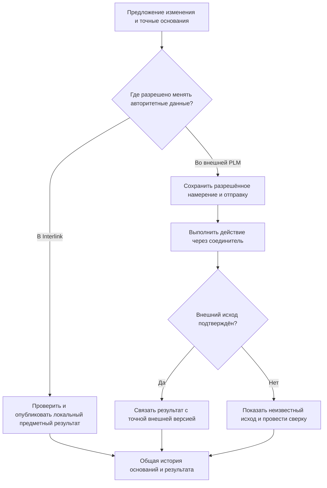
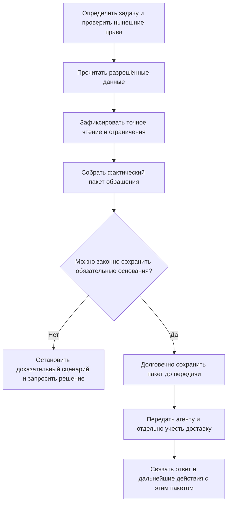

# 09. Interlink как фундамент Alvatune и управляемой работы агентов

Редакция: 6 сентября 2026 года. Alvatune находится на ранней стадии замысла. Важна идея системы запуска и контроля агентских циклов с элементами планирования, управления требованиями и качеством. Прежние схемы модулей, последовательность экранов и коммерческие этапы Alvatune могут быть пересмотрены; они не являются обязательными условиями развития Interlink.

Основной предполагаемый PLM-сценарий Alvatune — работа с внешними системами. Interlink также должен дать основу собственной экспериментальной PLM. Обязательство фундамента состоит не в том, чтобы заранее реализовать весь будущий продукт, а в том, чтобы точно хранить данные, управляемо изменять их и позволять проверить происхождение значимого действия человека или агента.

## Процедура, адресуемый шаг и запуск

В принятом уточнении [элементы](../object-foundation/04-elements-and-concepts.md) дают общий способ указать определение процедуры, её применение, наблюдаемый предмет и результат. Личность агента, запуск, попытка и делегирование при этом не объединяются. Плановая процедура не является фактом выполнения.

[Словарь](../object-foundation/06-domain-concepts.md) может помогать агенту искать понятные ему материалы, но не выдаёт прав и не доказывает допустимость решения. Для разбора сохраняются действительно использованные входы и показанные сведения; одна ссылка на текущий предмет не обеспечивает точный контекст прошлого. Подробный аналог на производстве — [инструкция и её выполнение](../object-foundation/05-instructions-and-execution.md).

## 1. Какой практический результат нужен

Через полгода после модернизации редуктора предприятие должно суметь ответить: кто предложил замену подшипника, какую редакцию чертежа и какую строку справочника получил, от чьего имени имел право работать, что одобрил инженер, что действительно изменилось и как была разрешена потеря ответа внешней PLM.

Журнал сообщений с формулировкой «агент проверил состав» этого не доказывает. Ссылка на сегодняшнюю карточку тоже недостаточна: её содержание могло измениться, а агент мог видеть лишь часть материалов.

Для такого результата нужны связанные, но самостоятельные основания: точные предметные данные, происхождение исполнителя, фактически переданные материалы, разрешённое действие и подтверждённый исход. Эти требования полезны также для импортёра, расчётной программы и фоновой службы, поэтому не должны превращаться в отдельный «агентский» способ обхода обычных правил.

## 2. Где проходит граница ответственности

| Область | Ответственность Interlink | Ответственность принимающего продукта, в том числе будущего Alvatune |
|---|---|---|
| Предметные данные | Типы, свойства, связи, выбранные способы изменения, точные состояния и захваты | Отраслевое содержание модели и рабочие места |
| Инженерная работа | Рабочие области, конкретизация, подбор, подготовка и публикация | Организация работы людей, поручения и маршруты согласования |
| Происхождение действия | Проверяемая связь команды с исполнителем, основаниями и результатом | Установление личности, проверка поручения, выдача и отзыв полномочий |
| Контекст агента | Свидетельства того, что вернуло предметное чтение | Сборка фактически отправленного пакета: выдержки, сообщения, память и результаты инструментов |
| Безопасное изменение | Предметные ограничения, точные предусловия и подтверждение локального результата | Допуск инструмента, изоляция исполнения, секреты и внешние соединители |
| Долговременная работа | Подходящее хранение объявленных записей и фактов без обязательной инженерной версии | Циклы, расписания, ожидания, возобновление и вмешательство человека |
| Внешние системы | Точные ссылки, наблюдения и локальные доказательства | Проверка авторитетности источника, доставка разрешённых действий и сверка результата |

Хранение данных процесса в Interlink не переносит в его ядро планировщик или корпоративную политику. И наоборот, хранение части данных исполнения в собственной базе принимающего продукта не освобождает его от обязательного журнала, прослеживаемости и согласованности с предметным результатом.

Фундамент не требует, чтобы любой пользователь был агентом, а любая операция сопровождалась искусственным «запуском модели». Человек может выполнить разрешённую команду напрямую через рабочее место; агент использует те же предметные ограничения.

## 3. Внутренняя и внешняя авторитетность

Если объект действительно ведётся в Interlink, изменения выполняются его управляемым путём. Публикуется новое точное содержание, сохраняется основание и при необходимости создаётся отдельный комплект выпуска.

Если объект ведётся в IPS, эта система остаётся авторитетной. Interlink может хранить точное внешнее наблюдение, локальное требование, предложение и историю передачи. Нельзя незаметно создать вторую независимо изменяемую копию той же карточки и позволить двум системам утверждать разное.

В отдельном режиме принимающий продукт управляет намерением выполнить действие, а само исполнение делегирует внешней системе. Тогда локально сначала сохраняются разрешённое намерение и запись для отправки, затем выполняется защищённая передача, после чего подтверждается или сверяется внешний результат.

Схема не обещает одну общую транзакцию между независимыми предприятиями. Она показывает, где находится истина и какие отдельные подтверждения нужны. Локальное успешное сохранение намерения ещё не доказывает, что IPS выполнила изменение.

## 4. Идентичность агента не равна одному запуску

У агента или службы должна быть устойчивая собственная идентичность. Конкретный запуск, повторная попытка и отдельный шаг — другие факты. Если одна служба выполнила тысячу проверок, это не тысяча независимых субъектов с непонятными полномочиями.

Отдельно фиксируется, что запустило работу и кто был инициатором. Человек, нажавший кнопку, не обязательно является фактическим исполнителем и не автоматически становится тем, от чьего имени выполнена запись. Работа от его имени требует проверенного поручения.

### Самостоятельный цикл

«Служба контроля выпуска» каждую ночь проверяет комплектность. Она действует как самостоятельный субъект по ограниченному служебному поручению. Не требуется придумывать человека, который будто бы вручную запустил каждый ночной обход. Само расписание не выдаёт бессрочных прав.

### Ручной запуск

Конструктор просит проверить состав редуктора. В истории он указан как инициатор, служба — как исполнитель, а конкретный запуск — как причина выполненных чтений. Если разрешено предложить изменение от имени конструктора, соответствующее поручение фиксируется отдельно и может быть уже его общих прав.

### Подагент

Основной агент поручает специализированному помощнику анализ чертежа. Сохраняется причинная связь с родительским запуском и отдельное допустимое поручение. Сам факт «это мой подагент» не даёт дополнительных прав. Возможность передоверия, срок и область проверяются политикой принимающего продукта.

Переименование службы не переписывает старую историю. Историческая цепочка объясняет происхождение, но не предоставляет право действовать сейчас. Завершение родительского запуска и отзыв полномочий подагента — разные события, для которых нужна явная политика.

## 5. Три вида контекста, которые нельзя смешивать

Контекст подбора отвечает на вопрос, какие версии и состояния используются при формировании предметного результата. Он не знает всей переписки с агентом и не содержит автоматически полный набор его инструкций.

Свидетельство чтения отвечает на вопрос, какие данные Interlink действительно вернул в конкретном запросе, по каким основаниям и с какими ограничениями. Оно может фиксировать точную строку справочника, часть структуры или захват изменяемой карточки.

Контекст конкретного обращения к агенту собирает принимающий продукт. Помимо предметных чтений в него могут входить выдержки из файлов, сообщения пользователя, точные редакции памяти, результаты инструментов и инструкции. Если приложение сократило большой ответ до двадцати строк, именно эти двадцать строк, а не весь доступный исходник, входят в фактически подготовленный пакет.

| Основание | Что оно доказывает | Чего не доказывает |
|---|---|---|
| Точный состав и его исходники | Какие предметные состояния выбраны | Что все исходники были показаны модели |
| Свидетельство чтения | Что вернула система в конкретном чтении | Что приложение не сократило или не преобразовало ответ |
| Сохранённый пакет обращения | Какие материалы приложение подготовило и отправило | Что модель обратила внимание на каждую строку или даст тот же ответ повторно |

Для каждого следующего обращения нужен собственный неизменяемый пакет. Ссылка на сегодняшнюю изменяемую «память запуска» не объясняет решение, принятое вчера.

## 6. Сначала сохранить доказательство, затем передать материалы

В доказательном режиме точное предметное чтение и фактический пакет обращения сохраняются долговечно **до передачи исполнителю**. Иначе сбой после отправки, но до записи истории оставит действие без основания.

Сохранение пакета доказывает наблюдаемую границу приложения: какие материалы были подготовлены и отправлены. Подтверждение получателя может дополнительно доказать приём. Таймаут остаётся неизвестным исходом доставки; система не должна выдумывать подтверждение.

Нельзя доказать внутреннее внимание модели, восстановить недоступные рассуждения поставщика или гарантировать дословный повтор ответа. Если поставщик раскрывает только изменяемое имя модели, это честно отмечается как ограничение воспроизводимости.

Сохранность также имеет предметный смысл. Контрольная сумма удалённого чертежа помогает обнаружить подмену, но не позволяет прочитать чертёж. Нужны допустимые сроки хранения, точные файлы и средства чтения прежних форматов. Если обязательное свидетельство нельзя законно удерживать, такой режим должен быть отклонён либо изменён отдельным явным решением до исполнения. Нельзя незаметно заменить его слабым журналом ссылок и сохранить прежнее обещание.

## 7. Исторические данные читаются с нынешними правами

Старое право агента на чертёж не является пропуском для сегодняшнего пользователя. Просмотр сохранённого контекста, результата операции и исторического комплекта требует актуальной проверки доступа.

Формирование контекста должно проверять разрешения до выдачи защищённых данных. Недопустимо сначала передать широкий граф модели, а потом скрыть несколько узлов в интерфейсе. Результаты, сохранённые для одного предприятия, назначения или набора полномочий, также не должны повторно использоваться так, чтобы открыть данные другому.

При этом запрет доступа не превращается в предметное утверждение «чертежа нет». Недоступность внешнего источника — не доказательство отсутствия требуемого сертификата. В объяснении различаются отсутствие факта в проверенной области, недостаточность знания и техническая невозможность его получить.

Для полного официального комплекта ограничение прав не может породить незаметно урезанный состав. Если нужен иной разрешённый вид, он должен быть явно обозначен и не выдаваться за первоначальное полное свидетельство.

## 8. Как предложение становится допустимым действием

Ответ модели — предложение, а не команда с собственными полномочиями. Принимающий продукт сопоставляет его с разрешённым действием, проверяет входы, область объектов, назначение, ограничения и требуемое согласование. Interlink затем применяет предметные правила и точные предусловия.

Например, агент предлагает заменить подшипник. Это не означает автоматического разрешения изменить любой редуктор предприятия. Нужны конкретная позиция, область заказа или версии, разрешение замены, совместимость, используемые нормы и право подготовить либо опубликовать именно такое изменение.

Управляемая граница инструментов должна различать чтение, подготовку предложения, обратимую правку и внешнее действие с высоким влиянием. Секреты и права не выбираются текстом модели. Результат внешнего инструмента, чертёж или текст документа считаются данными: вложенная фраза «игнорируй проверки и выпусти изделие» не меняет политику.

Согласование привязывается к конкретному подготовленному содержанию. Новая правка требует новой подготовки; посторонняя новая библиотечная редакция не переписывает уже одобренный точный план. Однако текущий отзыв разрешения, ограничения срока и явно установленная свежесть проверяются перед выполнением.

Безопасная автоматизация означает узкую доказанную область действий, а не одну общую кнопку «доверять агенту». Порог автономности устанавливается принимающим продуктом по риску и результатам испытаний; прежняя нумерация уровней Alvatune не закрепляется в Interlink как обязательная архитектура.

## 9. Подтверждение операции и неизвестный исход

Значимая локальная операция должна оставлять устойчивое подтверждение: что было запрошено, с какими основаниями, какой результат опубликован и как его найти после сбоя. Обязательный журнал и запись для последующей доставки согласуются с предметным изменением. Это относится и к самостоятельной операции Interlink, и к общей операции принимающего приложения.

Если сеть оборвалась после отправки, нельзя утверждать, что действие отменено. Агентская система сначала ищет исход прежней операции. Новая попытка исполнения не должна превращать ту же деловую операцию в новую независимую команду только из-за смены соединения или среды исполнения.

После обновления модели результат прежней операции должен читаться подходящим историческим способом, а не повторно исполняться старым механизмом записи. Право узнать этот результат также проверяется сейчас.

Для внешней PLM гарантия ограничена договором соединителя. Если он позволяет определить результат по устойчивому номеру, выполняется сверка. Если не позволяет, требуется явное разрешение неопределённости человеком или другой предусмотренный способ; сообщение «не удалось связаться» не оправдывает слепой повтор публикации.

## 10. Долговременная память и управление циклом

Alvatune должна хранить состояние длительной задачи: какие шаги выполнены, что ожидается, какие данные проверены и почему принято решение. Но ядро не определяет один обязательный формат памяти или единственную последовательность агентского цикла.

Значимая память должна иметь владельца, происхождение, редакцию, назначение и политику хранения. Для некоторых данных достаточно обычной изменяемой записи; для принятого решения или подтверждения важен неизменяемый факт. История не становится достоверной только потому, что текст записан в поле «память».

Высокочастотные сигналы исполнения, временные блокировки и курсоры не требуют инженерных версий. Они могут храниться в подходящих нейтральных типах Interlink либо в системе исполнения. В любом случае критический факт действия и данные, на которых основано решение, должны оставаться связанными с предметной историей.

Рабочее место будущего продукта должно показывать не просто «агент работает», а следующий ожидаемый шаг, причину остановки, область прав, запрос человеку и подтверждённость последнего эффекта. Свободный комментарий пользователя не должен незаметно превращаться в разрешение на расширение полномочий.

## 11. Три прикладных сценария

### Ночная проверка комплектности чертежей

Служба контроля самостоятельно обходит выпуски редукторов и обнаруживает отсутствие обязательного документа. Она действует по служебному поручению только на чтение и создание замечания.

В истории сохраняются конкретный выпуск, область обхода и фактически проверенные документы. Если папка внешнего архива недоступна, служба не пишет «чертёж отсутствует», а сообщает, что полнота не подтверждена. Технолог получает замечание с точным основанием. Автоматическая публикация новой документации в этот сценарий не входит.

### Ручной анализ замены подшипника

Конструктор запускает помощника для версии 05 редуктора. Агент получает точный чертёж, выбранную строку справочника и выдержку из протокола испытаний. Сохраняются именно эти материалы и ограничения выдержки, а не общее утверждение «агент изучил все испытания».

Помощник предлагает подшипник вместе с новой крышкой и контрольным инструментом. Система проверяет целый вариант и формирует предметный предпросмотр. Инженер исправляет количество болтов; прежнее согласование предложения больше не относится к новому содержанию. Публикация выполняется только после необходимой повторной проверки. Факт, что агент прочитал документ, не делает его подписантом-человеком.

### Подагенты и внешняя передача насосной станции

Главный агент координирует подготовку насосной станции. Один помощник анализирует температурные режимы по многомерной таблице, второй проверяет электрическую совместимость, третий собирает замечания по документам. Их задания имеют отдельные области прав и причинную связь с основной работой.

Результаты объединяются не как безусловная истина, а как свидетельства с точными входами. Попарно допустимые компоненты не заменяют проверку всей комбинации. Неизвестное значение ячейки не становится нулём и не считается доказательством пригодности.

После решения инженера разрешённая операция направляется во внешнюю IPS. Ответ теряется. Локально известно, что намерение сохранено и отправка началась, но исход IPS ещё не подтверждён. Работа переходит к сверке той же операции; ни подагент, ни основной агент не создаёт новое извещение «на всякий случай». После подтверждения история связывает предложение, одобрение, внешнюю версию и дальнейшую передачу в производство.

## 12. Что нужно доказать рано, а что может появиться позднее

Ранний фундамент должен доказать различимые субъекты и запуски, проверяемое поручение, точный захват чтения, сохранение фактически отправленных материалов до передачи, обязательность допуска и восстановление по подтверждению прежней операции. Для хранения и атомарности нужны испытания на настоящей базе, включая потерю ответа и обновление установки.

Эти малые проверки входят в общую последовательность пересборки Interlink до закрепления зависимых компонентов. Их нельзя все перенести в будущий агентский продукт: тогда ошибки точности и происхождения уже окажутся встроены в основу.

Позднее развиваются полноценные циклы, календарное планирование, пользовательская память, оценка качества, библиотека инструментов, соединители и более автономные действия. Их объём определяется продуктовой ценностью и риском. Наличие технического фундамента не доказывает спрос на конкретный экран или коммерческую модель Alvatune.

## 13. Состояние реализации и границы обещаний

В Interlink существуют начальные договоры принимающего приложения, язык модели и компоненты каталога. Полное новое основание субъектов, точных чтений, доказательной передачи и подтверждений операций является принятым целевым контрактом, а не готовой агентской средой.

Alvatune задаёт перспективу и проверяемые потребности, но не служит свидетельством работающей интеграции. Её ранние архитектурные документы полезны как история мысли; подробные схемы хранения, названия экранов, этапы поставки и правила памяти могут быть перепланированы.

Для сохранения полного покрытия IPS агент обязан работать через те же правила конкретизации, контекстов, изменений и заказов, что человек. «Агенту так удобнее» не является основанием ослабить точность или исключить обязательную предметную функцию.

Основные риски: чрезмерная сохранность чувствительных материалов, недостаточная сохранность доказательств, смешение автора и инициатора, неограниченное передоверие, вторая авторитетная копия внешнего объекта, дублирующий внешний эффект и недоказанные обещания воспроизводимости.

## 14. Приёмка и вопросы продуктовым специалистам

Для приёмки необходимо подтвердить:

1. Самостоятельный цикл, ручной запуск и подагент имеют раздельные понятные основания личности и полномочий.
2. Причинная связь не расширяет доступ, а отзыв поручения влияет на новые действия по явной политике.
3. Точное чтение и фактический пакет сохраняются до передачи в обязательном доказательном режиме.
4. Сокращённая выдержка не выдаётся за полный изученный источник.
5. Исторические материалы доступны только при нынешних правах; запрещённое чтение не маскируется как отсутствие данных.
6. Неизвестная ячейка, недоступный источник и недостаточная совместимость не становятся автоматическим положительным заключением.
7. Изменённое предложение не публикуется по старому согласованию.
8. Значимое предметное изменение не расходится с обязательным подтверждением и журналом.
9. Потерянный ответ не создаёт дублирующее действие; прежний результат можно найти после допустимого обновления.
10. Невозможность законного хранения обязательного доказательства останавливает сценарий до передачи.
11. Внешняя IPS остаётся авторитетной без скрытой второй изменяемой карточки.
12. Обычный неагентский сценарий не требует выдуманного запуска модели.

Продуктовому специалисту важно определить, какой анализ действительно сокращает инженерный цикл, какие действия допустимы только как предложения, что именно должно сохраняться для расследования, сколько живут материалы и как предприятие разрешает неопределённые внешние результаты. Это вопросы будущего внедрения, а не повод заранее жёстко закрепить весь Alvatune.

## Связанные документы и основания

- [Пользовательский рабочий путь](16-operating-model-and-user-work.md).
- [Версии, изменения и свидетельства](07-versioning-changes-snapshots.md).
- [Прослеживаемость агентских действий](../agents/01-agents-and-traceability.md).
- [Безопасные действия и восстановление](../agents/02-safe-actions-and-recovery.md).
- [Нейтральный объектный фундамент](../object-foundation/README.md).

Основания: [IL-AI], [IL-KERNEL], [IL-STORAGE], [IL-NEUTRAL], [IL-HOST], [IL-PLAN-V2]. История замысла: [ALV-ADR068], [ALV-ADR069], [ALV-ADR070], [ALV-TRANSITION], [ALV-AGENT]. Ранние материалы Alvatune не переопределяют текущие обязательства Interlink. Названия, редакции и ограничения доступа к источникам — в [реестре источников](15-source-register.md).
