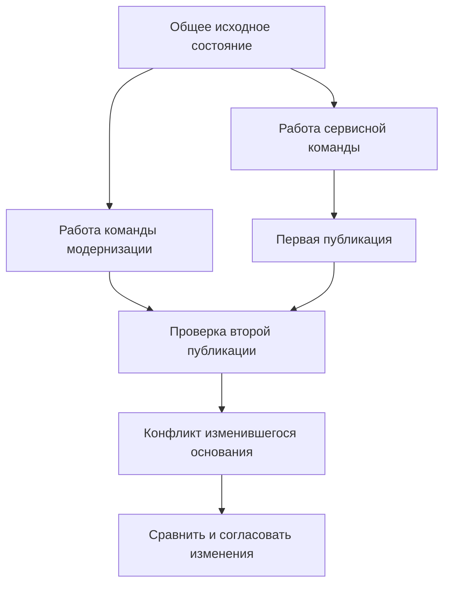
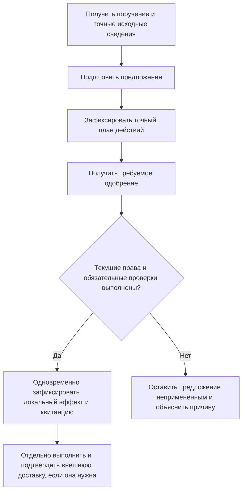

# 10. Пользователи Interlink и сквозные сценарии работы

Редакция: 6 сентября 2026 года. **Это целевая продуктовая и приёмочная модель, а не каталог уже готовых рабочих мест.** Ни наличие описанного типа, ни успешная проверка отдельного строительного блока не доказывают завершённый пользовательский сценарий.

## 1. Зачем нужна карта пользователей

Ценность Interlink проявится не в количестве внутренних механизмов, а в том, сможет ли предприятие провести привычную работу без потери смысла и контроля: исправить конструкцию, согласовать технологию, подобрать исполнение, передать заказ, разобраться с отклонением в изготовленном экземпляре. Поэтому ниже роли описаны через результаты и решения, за которые отвечает человек.

Полное воспроизведение подтверждённых обязательных сценариев IPS остаётся условием целевой системы. Первый опытный пример неизбежно будет уже этого набора, но его границы не дают права исключить мягкую конкретизацию, итерации, производственную ведомость или архивную работу из общего плана. Возможности сверх IPS проверяются отдельно: полезность нового сценария не доказывает перенос старого.

Alvatune предполагается системой запуска и управления агентскими циклами с элементами календарного планирования, управления требованиями и качеством. Основной PLM-сценарий Alvatune — взаимодействие с внешними PLM; Interlink также даст основу экспериментальной собственной PLM. Это замысел для последующего перепланирования. Ранее предложенные экраны, последовательность коммерческих этапов и состав первого пилота Alvatune не являются неизменными ограничениями архитектуры Interlink.

| Часть решения | За какой результат отвечает в целевой модели | Что нельзя из этого заключать |
|---|---|---|
| Общий фундамент Interlink | Управляемые объекты, атрибуты и связи; разные правила изменения данных; точные свидетельства; проверяемые команды, чтение и эволюция модели | Что уже существует готовое рабочее место конструктора, диспетчера или агента |
| Инженерные и другие предметные модули | Значение детали, требования, маршрута, допуска, партии, нормы; соответствующие предметные проверки | Что для каждого предмета обязательны инженерные версии или состав изделия |
| Принимающее приложение, в будущем в том числе Alvatune | Пользовательский процесс, поручения, интерфейс, корпоративная политика, согласование и управление агентскими циклами | Что прежний план интерфейса Alvatune уже принят как окончательный |
| Внешние системы и соединители | CAD-редактирование, внешняя PLM, планирование и исполнение производства в согласованной области полномочий | Что локальная успешная запись одновременно означает внешнюю доставку и принятие результата |

Текущее состояние и границы опытных проверок вынесены в [дорожную карту](02-current-state-and-roadmap.md). Этот документ нужен для выбора представителей предприятия, подготовки примеров и проверки, что разные владельцы результата не потерялись между техническими слоями.

## 2. Карта ролей: кто за что отвечает

Один сотрудник может совмещать несколько ролей. Тем не менее их полезно разделять: автор изменения, ответственный за сроки и подписант принимают разные решения и не обязательно имеют одинаковые права.

| Роль | Практическая задача | Какой результат должен быть видим и проверяем |
|---|---|---|
| Конструктор, специалист CAD/CAx | Изменить геометрию, свойства, документы и конструкторский состав | Согласованные точные состояния и понятное происхождение конструкции |
| Технолог | Превратить конструкцию в производимое определение | Связь технологической структуры с конструкторским источником, маршруты, операции, ресурсы и нормы |
| Координатор изменения или конфигурации | Уточнить запрос, участников, область и препятствия | Понятные работа, ожидания, решения и исход изменения |
| Содержательный исполнитель изменения | Подготовить свою часть результата | Сохранённая работа, проверяемый вклад и явные конфликты |
| Руководитель инженерных изменений | Отвечать за результат, бюджет и исключения | Измеримый результат процесса без потери контроля |
| Инженер систем и требований | Связать потребность с конструкцией, проверками и решениями | Прослеживаемость до точных результатов и явные пробелы в доказательствах |
| Рецензент и подписант | Принять решение по определённому содержанию | Однозначный ответ «что именно утверждено» |
| Специалист по конфигурации | Получить допустимое исполнение для условий применения | Объяснимые присутствие позиций, замены, версии и совместимость |
| Планировщик производства | Подготовить потребность и передачу заказа | Точные входы для планирования, независимые от последующего пересчёта |
| Автор и выпускающий производственную ведомость | Подготовить самостоятельную ПВ | Собственные содержание, согласование, подпись и опубликованный результат |
| Производственный диспетчер | Вести партии, экземпляры и фактическое исполнение | Различие между заказанным, разрешённым отклонением и действительно изготовленным |
| Архивариус и регистратор ОТД | Сохранить подлинники и управлять копиями | Воспроизводимый выпуск, регистрация, рассылка и отзыв копий |
| Администратор и владелец качества НСИ | Вести повторно используемые справочные данные | Управляемые каталоги, табличные редакции, единицы, качество и происхождение |
| Администратор предметной модели | Адаптировать модель предприятия | Обновляемое расширение без потери клиентских правил и истории |
| Руководитель инженерного проекта | Управлять задачами, зависимостями, ресурсами и сроками | Обязательства, связанные с предметными результатами, а не только процентами выполнения |
| Интегратор | Согласовать обмен и принадлежность данных | Один объявленный полномочный источник каждого факта и проверяемая доставка |
| Специалист поддержки и эксплуатации | Диагностировать и восстанавливать работу | Понятный исход операций, сохранность данных и проверяемое восстановление |
| Ответственный за работу агентов | Ограниченно делегировать анализ и действия | Установленные исполнитель, исходный контекст, полномочия, одобрение и результат |

Слово «технолог» обозначает группу ответственности. На предприятии расцеховщик может определять площадку и маршрут, заготовщик — заготовку и припуски, нормировщик — трудовые нормы, специалист по материалам — допускаемые материалы, а конструктор оснастки — средства производства. Общий фундамент связывает их результаты, но не требует объединить людей, права и подписи в одну роль.

## 3. Общие правила, которые пользователь должен понимать до начала работы

### 3.1. Объект, инженерная версия, точное состояние и рабочие данные

«Корпус редуктора РЦ-250» остаётся одним объектом. Его инженерная версия 05 — именованная ступень развития конструкции. В разрешённом процессе работы эта версия может получить несколько последовательно опубликованных состояний: например, состояние до уточнения отверстия и состояние после уточнения.

Точное опубликованное состояние неизменяемо. Если процесс разрешает дальнейшую правку инженерной версии 05, прежнее состояние не переписывается: публикуется новое состояние той же версии. Создание инженерной версии 06 является отдельным действием с отдельным основанием. Само разделение понятий не разрешает исправлять уже выпущенную конструкцию вопреки правилам предприятия.

Рабочее состояние — ещё редактируемые данные. Команда сохранения защищает текущую работу, но не делает её официальной для производства. Пользователь должен видеть, что перед ним: конкретное опубликованное содержание, текущий результат выбранной инженерной версии или рабочая копия.

Это особенно важно для подписей. Формулировка «подписана версия 05» недостаточно точна, если у версии 05 допускаются последующие публикации. Свидетельство подписания должно указывать именно рассмотренное содержание и необходимые файлы.

### 3.2. Рабочая область, условия совместной работы и пакет изменения

Рабочая область — долговременная среда работы команды. В ней могут последовательно или параллельно готовиться несколько изменений. Пакет изменения определяет, какие изменения рассматриваются и публикуются как одно целое. Закрытие пакета не обязано уничтожать рабочую область.

Отдельно ведётся долговременный контекст подбора: какие инженерные версии и при необходимости состояния назначены для совместной проработки. Полные условия конкретного расчёта дополнительно включают режим, права на рабочие данные, применяемость и выбранные правила. Сохранённое назначение версий и полный запрос состава — не одно и то же.

Например, конструктор шкафа управления и технолог сборки используют согласованные назначения двигателя и преобразователя, но заканчивают свои пакеты в разные дни. Совместное чтение не означает обязательную совместную публикацию. Если конструктивное изменение требует выпустить несколько частей одновременно, участники явно согласуют объединённую публикацию.

Два контекста могут конфликтовать, даже если оба называют инженерную версию 05: один использует опубликованное утреннее состояние, другой — рабочий результат после дневной правки. Система не должна скрывать различие только из-за совпавшего обозначения версии.

### 3.3. Четыре разных намерения выбора

| Намерение пользователя | Что сохраняется | Что ещё может измениться |
|---|---|---|
| «Для этой позиции допускается только инженерная версия 05» | Жёсткая конкретизация инженерной версии | Содержание внутри версии 05 — по явно выбранному режиму; переход к версии 06 запрещён |
| «Нужен ровно тот результат, который мы проверили» | Точная фиксация опубликованного состояния | Указанное содержание не пересчитывается и не подменяется рабочими данными |
| «Для этой позиции предпочитаем версию 05, пока действуют установленные условия» | Мягкая конкретизация: сохраняемое предпочтение и история его применения | Предпочтение может применяться, игнорироваться или приостанавливаться по явным правилам; его восстановление не требует угадывать прежний выбор |
| «В этой проработке временно попробуем другой вариант» | Временное рабочее предпочтение | Оно не становится постоянной конкретизацией или опубликованным результатом само собой |

Мягкая конкретизация не исчезает из модели после закрытия пакета. Например, у двух позиций одного подшипника могут сохраняться разные предпочтения инженерных версий. После определённого перехода жизненного цикла предпочтение может перестать действовать, но остаться объяснимым. Если пользователь явно очистил его, последующее восстановление активности не должно воскресить удалённый выбор.

Конкретизация одной позиции не фиксирует весь многоуровневый состав. Для передачи и доказательства нужен отдельный точный комплект состава с объявленной областью, файлами и другими существенными входами. Сохранение только условий живого подбора такого результата не заменяет.

Единый механизм подбора не означает одинаковый список приоритетов для всех режимов. В одном подтверждённом профиле IPS применяемость может проверяться раньше назначений контекста, а в редакторском режиме — позже. Пользователь должен знать выбранный режим и получить объяснение фактического решения, а не сталкиваться с неявным порядком, зависящим от окна.

## 4. Конструктор: от локальной правки до параллельной разработки

### 4.1. Обычный случай — уточнение корпуса редуктора

**Исходные условия.** Конструктор уточняет крепёжное отверстие корпуса редуктора РЦ-250. Инженерная версия 05 находится на шаге процесса, допускающем редактирование в рамках той же версии. Производство использует ранее опубликованное состояние.

Конструктор открывает свою рабочую область, выбирает версию 05 и создаёт рабочее состояние от точно известного исходного содержания. Затем изменяет размер в CAD, сохраняет рабочий файл и связанные свойства. Простое сохранение не меняет опубликованную конструкцию: технолог и производство по обычным правам продолжают получать прежнее состояние.

Для публикации конструктор включает согласованный набор правок в пакет «Уточнение крепления корпуса редуктора», проверяет согласованность геометрии, атрибутов, документов и позиций. Рецензент получает сравнение исходного и будущего содержания, а не ссылку на изменяющуюся карточку. После разрешённой публикации у версии 05 появляется новое точное состояние, прежнее остаётся доступным по своим основаниям.

Если правила предприятия требуют для такой правки новой инженерной версии, пользователь выполняет именно создание новой версии. Система не выбирает этот деловой смысл только по тому, что была нажата кнопка сохранения.

**Что доказывает пример.** Сохраняются привычные IPS возможности работать с пользовательской версией и её рабочей копией. При этом нельзя принять сохранение за выпуск или заменить старое подписанное содержание новым.

### 4.2. Серийное условие — переход насосной станции на новый шкаф

Для насосной станции северного исполнения с заводского номера 240 предполагается шкаф управления версии 09. Более ранние машины должны оставаться на прежнем решении. Конструктор готовит изменение шкафа и уточняет применяемость, а технолог параллельно проверяет монтаж.

Участники используют согласованный контекст проработки, чтобы видеть совместимые входы. В нём может быть доступен рабочий шкаф версии 09, тогда как производственный расчёт получает только разрешённые опубликованные данные. Граница видимости является явной: участие в обсуждении само по себе не выдаёт права на все рабочие файлы.

Специалист по конфигурации проверяет как минимум номер 239, номер 240 и ранее опубликованную передачу заказа. Для первых двух проверяется ожидаемый результат живого подбора, для третьей — сохранность прежнего точного состава без нового подбора. Если профиль IPS ставит применяемость раньше рабочего назначения, система должна воспроизвести именно этот профиль, а не незаметно показать рабочую версию.

**Что видит пользователь.** Режим чтения, условия серии, выбранное содержание и основание выбора. Отсутствие подходящей версии отображается как требующая решения проблема, а не как автоматическое разрешение взять более новую.

### 4.3. Сложный случай — сервис и модернизация работают от одного основания

Сервисная команда исправляет уплотнение гидроцилиндра, а команда модернизации увеличивает рабочее давление. Они могут работать в разных рабочих областях и создавать разные инженерные версии от одного исторического прототипа. Происхождение получается разветвлённым; система не должна изображать его одной цепочкой по времени регистрации.

В другом случае обе команды вправе готовить правки одной инженерной версии. Тогда после публикации сервисной правки исходное основание второй работы изменилось. Вторая команда должна получить конфликт и сравнение, а не молча затереть новое уплотнение.

Схема показывает случай конкурирующей публикации в одну инженерную версию, а не запрет параллельной разработки. После сравнения участники могут перенести необходимые изменения и подготовить новый согласованный результат. Автоматическое слияние инженерных структур не обещается.

Перед рискованной переделкой конструктор создаёт именованную итерацию или точку возврата. Она должна пережить окончание текущей работы. Восстановление сначала сохраняет защищаемое рабочее состояние, затем меняет рабочие данные по согласованному плану; оно не публикует старое содержание автоматически.

Подробнее: [рабочие области и параллельная работа](../changes/10-workspaces-and-parallel-work.md), [сохраняемая мягкая конкретизация](../version-selection/20-durable-soft-concretion.md), [итерации и точки возврата](../version-selection/22-iterations-and-checkpoints.md).

## 5. Технолог: связать конструкцию, производство и документы

Технолог должен преобразовать конструкцию в пригодное для производства определение, не разрушив связь с источником. Конструкторская структура, технологическая структура, маршрут, техпроцесс, комплект технологической документации, производственная ведомость и производственный заказ решают разные задачи. У них могут быть разные владельцы и сроки выпуска.

### 5.1. Перегруппировка для изготовления

В конструкторском составе насосной станции клапаны расположены по функциональным линиям. В производстве их удобнее собирать в подготовленные трубные блоки. Технолог создаёт технологическую структуру и сохраняет происхождение каждого использования: из какой конструкторской позиции и по какому пути оно получено.

Если один и тот же клапан установлен в двух разных блоках, ссылка только на карточку клапана недостаточна. Количество и остаток при распределении должны относиться к соответствующему использованию. Иначе система может дважды списать одну потребность или объявить распределённой позицию, которую технолог ещё не обработал.

В рабочем месте требуется показать источник, уже распределённое количество, оставшееся количество и объяснение исключений. Изменение технологической группировки не меняет конструкторский состав само по себе.

### 5.2. Разные площадки, маршруты и нормы

Корпус редуктора изготавливают на двух площадках: на одной используется обрабатывающий центр, на другой — последовательность токарной и фрезерной обработки. Технолог назначает соответствующие операции, оборудование, оснастку, квалификацию персонала и нормы. Определение станка или инструмента отличается от факта его использования в конкретной операции.

Для нормы резания может потребоваться точная редакция справочной таблицы по материалу, твёрдости и диаметру инструмента. Пользователь должен видеть, откуда получено число, в каких единицах и для каких условий оно действительно. Нельзя подставлять ближайшее значение или значение для другой площадки без разрешённого правила.

При смене маршрута старые технологические объекты не должны исчезать без решения. В существующих процессах IPS они могли сохраняться в контексте производственного заказа. Поэтому перенос обязан выяснить, какие объекты остаются историческими основаниями, какие выводятся из дальнейшей работы и как обозначается замещение.

### 5.3. Три самостоятельных результата

| Результат | Кто готовит и утверждает | Что должно быть зафиксировано |
|---|---|---|
| Комплект технологической документации — КТД | Технолог, проверяющий, подписант и ОТД | Точные исходные составы, правила, шаблоны, файлы и результаты проверок, достаточные для доказательства выпуска |
| Производственная ведомость — ПВ | Автор ведомости, проверяющий и подписант | Собственное содержание ПВ, её согласование, подпись и опубликованное состояние |
| Передача производственного заказа | Специалист по конфигурации и планировщик | Точное содержание конкретной передачи, получатель, результат доставки и принятия |

КТД может быть выпущена до конкретного заказа. ПВ может возникнуть по самостоятельному основанию или по результатам планирования. Передача заказа может состояться после отдельного подтверждения комплектации. Универсальная команда «выпустить всё производство» не должна навязывать общий жизненный цикл этим результатам.

Пример: для ремонта пяти насосных станций технолог выпускает комплект карт по уже проверенному маршруту. Автор ПВ готовит отдельную ведомость нужных материалов. Планировщик передаёт точный состав заказа в ERP. Исправление опечатки в рабочем шаблоне не меняет уже подписанные карты, а новое состояние ПВ не подменяет ранее доставленную передачу заказа.

Для воспроизводимости недостаточно сегодняшнего шаблона и названия инженерной версии. Нужны точные исходные материалы и сохранённая возможность их прочитать. Если обязательный файл утрачен или его хранение не допускается, продукт должен честно показать недоступность доказательства, а не заявить полную воспроизводимость.

Подробнее: [маршруты, нормы и источники обеспечения](../orders/07-routes-norms-and-sourcing.md), [производственные документы](../orders/08-production-sheets-and-reports.md), [справочные таблицы](../tabular-data/01-reference-tables.md).

## 6. Координатор, руководитель изменения и подписант

### 6.1. Провести изменение нескольких дисциплин

У насосной станции обнаружено несоответствие допустимой вибрации. Координатор регистрирует причину и ожидаемый результат, привлекает конструктора, технолога и специалиста по испытаниям. Инженер по требованиям связывает исходное требование с протоколом и точными состояниями затронутых объектов.

Сначала определяется, кто полномочен менять данные. Если конструкция управляется в Interlink, подготовка идёт через его рабочие области и пакеты. Если она ведётся во внешней PLM, локальный случай изменения координирует работу и свидетельства, но не создаёт второй независимый оригинал конструкции.

Общий контекст позволяет участникам проверять согласованные варианты конструкции. Пакеты остаются самостоятельными, пока явно не установлено требование публикации целиком. Например, новая муфта и новый защитный кожух должны вводиться вместе, а уточнение пояснительной записки может идти отдельно.

Перед публикацией участники получают точный план: какие состояния появятся, какие связи изменятся, какие проверки выполнены и чего ещё не хватает. Обязательные проверки могут заблокировать публикацию. Если изменение связано с внешней системой, его доставка и последующее подтверждение ведутся отдельно от локального решения.

### 6.2. Утверждать содержание, а не плавающую ссылку

Рецензент должен видеть исходное и предлагаемое содержание, затронутые файлы, применяемость, результаты проверок, решения по заменам и совместимости, пробелы в свидетельствах и вклад исполнителей. Слова «всё проверено» без состава и происхождения проверок недостаточны.

После подготовки на согласование поступает определённое точное содержание. Если автор его меняет, это уже другое предложение, требующее соответствующего нового решения. Однако появление новой версии постороннего объекта или новой редакции правила вне закреплённых входов не переписывает уже подготовленный комплект автоматически.

При самой публикации отдельно проверяются текущие полномочия, обязательный отзыв разрешений и явно установленное требование актуальности исходных данных. Тем самым различаются два вопроса: «что мы утвердили» и «имеем ли мы право сейчас опубликовать именно это».

Например, подписант согласовал замену уплотнения по конкретному протоколу. На следующий день появилась новая общая методика испытаний. Она не должна незаметно заменить методику внутри согласованного комплекта. Если корпоративная политика требует применять новую методику ко всем ещё не выпущенным изменениям, система должна назвать это основание и направить работу на повторную подготовку.

### 6.3. Потеря связи при публикации

Если ответ потерян, пользователь не должен автоматически получать сообщение «изменение отменено». Сервер мог завершить запись до обрыва. Сначала приложение выясняет исход той же операции и показывает подтверждённый результат либо сохраняет неопределённость до сверки.

Повторное нажатие не должно создавать дубликат изменения. Внешняя передача также может ожидать подтверждения после успешной локальной публикации. Руководитель видит эти состояния отдельно: подготовлено, опубликовано, отправлено, принято получателем либо требует восстановления.

Подробнее: [предварительная проверка и согласование](../changes/04-preview-validation-and-approval.md), [публикация и восстановление](../changes/05-commit-cancel-and-recovery.md), [быстрые, формальные и объединённые изменения](../changes/06-quick-formal-and-bundled-changes.md).

## 7. Специалист по конфигурации: получить одно допустимое исполнение

### 7.1. От состава возможных исполнений к составу конкретного станка

Состав семейства может содержать все предусмотренные опции — его часто называют 150%-ным. Задача специалиста состоит не в механическом удалении строк, а в получении одного допустимого исполнения: какие позиции требуются, какие объекты установлены, какие версии и точные состояния подходят, допустимо ли их совместное использование.

Для обрабатывающего центра СТ-500 специалист указывает климатическое исполнение, питание, комплектацию, серию, площадку и назначение заказа. Система проверяет значения и обязательность параметров, условия включения позиций, правила вариантов и последствия выбора. Отсутствующее значение не считается ответом «нет» и не подменяется значением по умолчанию без объявленного правила.

Затем используются разрешённые альтернативы и общий механизм подбора версий. Порядок зависит от смысла конкретного правила. Если допуск аналога привязан к исходной инженерной версии, сначала может понадобиться определить исходную версию, чтобы найти применимое разрешение; после выбора другого объекта подбирается его содержание. Поэтому разделение понятий не следует превращать в один универсальный линейный список действий.

Точные состояния, полученные после подбора, проходят требуемые проверки совместимости всего сочетания. Пользователь получает причины включения и исключения, применённые ограничения и нерешённые вопросы. Рабочая конфигурация может оставаться неполной, но точная передача не должна выдаваться за завершённую, пока обязательные решения не приняты.

### 7.2. Небольшая замена — подшипник другого исполнения

Для подшипника выходного вала найден каталоговый аналог. Он является кандидатом, но не автоматически разрешённой заменой. Проверяется направление допуска, область, нагрузка, посадка, смазка и применимые инженерные версии. Разрешение заменить исходный подшипник новым не доказывает обратную замену.

Выбор для сервисного заказа не должен менять все серийные редукторы, использующие исходный подшипник. После применения решения сохраняется, где и почему оно принято. Фактическая установка подшипника конкретного производителя будет отдельной записью исполнителя ремонта.

### 7.3. Групповая замена и общее ограничение

В составе привода комплект «двигатель и муфта» допускается заменить комплектом «мотор-редуктор, переходная плита и крепёж». Библиотечное описание задаёт полный допустимый комплект. При применении роли участников связываются с конкретными позициями станка.

Заказ одного предприятия может выбрать исходный комплект, другого — альтернативный. Нативная модель не требует переключать одну общую отметку «актуальный вариант» для всех заказов. При переносе подтверждённого режима IPS его исходные ограничения и представления сохраняются в соответствующем профиле, но не объявляются единственно возможным устройством ядра.

Каждая пара «двигатель — преобразователь», «преобразователь — контроллер» может быть допустима, а тройка — превышать допустимое ограничение режима. Поэтому проверки только попарных матриц недостаточно. Система должна доказать нужное сочетание целиком. Если конфигурация ещё неполна, утверждение «её можно допустимо завершить» также требует основания, а не отсутствия найденных попарных ошибок.

Две выбранные замены могут конфликтовать не только тогда, когда обе меняют одну строку. Одна может требовать сохранить плиту, которую другая удаляет. Проверяется совместный эффект выбранных решений. При нехватке достоверных данных пользователь получает сообщение о неполноте проверки; отсутствие записи в неполном каталоге не превращается в доказанный запрет или разрешение.

Подробнее: [выбор версий](../version-selection/README.md), [допустимые замены](../substitution-and-compatibility/01-allowed-replacements.md), [совместимость сочетаний](../substitution-and-compatibility/02-compatibility-matrices.md).

## 8. Планировщик, автор ПВ и диспетчер: заказ не равен факту изготовления

Планировщик использует проверенное инженерно-технологическое определение для подготовки потребности, сроков и передачи. Диспетчер работает с конкретными партиями, экземплярами и фактом исполнения. Автор производственной ведомости отвечает за самостоятельный документ. Различие сохраняется и тогда, когда на небольшом предприятии все задачи выполняет один человек.

### 8.1. Передача десяти насосных станций

В живом производственном заказе готовится состав десяти станций. В нём некоторое время могут оставаться обсуждаемые варианты. Когда принимается решение о передаче в ERP, создаётся отдельное точное содержание передачи, включая обязательные инженерные и производственные входы.

ERP получает именно этот результат, а не указание «подберите последние версии ещё раз». Планировщик видит, опубликована ли передача, доставлена ли она и принята ли потребителем. Появление новой версии насоса не меняет прежний документ передачи, но может стать причиной отдельного анализа живого заказа.

Если принято перепланирование, формируется новое управляемое состояние заказа и новая передача в требуемом процессе. Старый получательский результат остаётся историческим фактом; порядок замены обязательств согласуется с внешней системой.

### 8.2. Производственная ведомость

Автор ПВ может создать ведомость самостоятельно или по утверждённому прототипу. Он ведёт её карточку и состав, использует разрешённые исходные версии и аналоги, формирует отчёты или заявки и проводит документ по собственному маршруту согласования.

Например, ведомость материалов на ремонт партии редукторов включает расходные материалы, которых нет в том же виде в конструкторской структуре изделия. Её подпись и содержание нельзя заменить ссылкой на снимок заказа. В то же время ведомость должна сохранять прослеживаемое основание количества и назначения материалов.

### 8.3. Частичное изготовление и сервис

Из десяти станций четыре изготовлены до согласованного перехода на другой привод. Диспетчер регистрирует фактически установленные компоненты каждого экземпляра и партии поставки. Новая передача оставшихся станций не переписывает первые четыре экземпляра.

Позднее одна станция проходит ремонт. Сервисная запись связывает снятый компонент, установленный компонент, допуск, исполнителя и время. Место установки определяется в контексте конкретного изделия и пути использования: одинаковая позиция типового узла в левом и правом модуле не считается одним местом.

Объект изделия, партия и физический экземпляр имеют разные идентичности. Партия группирует изделия или материал; номерной экземпляр сохраняет собственный след. Это основание будущего экземплярного цифрового двойника, но не готовая система телеметрии или производственного исполнения.

Подробнее: [работа с заказами](../orders/README.md), [партии, экземпляры и фактически изготовленный состав](../orders/09-units-lots-and-as-built.md), [перепланирование и отклонения](../orders/10-replanning-and-deviations.md).

## 9. НСИ и предметная модель: управлять данными, а не только карточками

### 9.1. Качество справочника

Администратор обнаружил две карточки стали 40Х. Нельзя просто удалить одну, потому что старые техпроцессы и выпуски ссылаются на её стандарт, характеристики и область действия. Сначала сравниваются смысл, единицы, источники, зависимые объекты и внешние сопоставления. Затем принимается решение о сохраняемом объекте и управляемом замещении или объединении.

В обычной работе пользователь должен находить действующие сведения. Исторический выпуск продолжает ссылаться на конкретное основание, использованное при подготовке. Перенаправление современных ссылок и переписывание прошлых фактов — разные действия.

Не каждому справочнику нужен инженерный жизненный цикл. Для записи о текущем месте хранения может быть достаточно контролируемого изменения с проверкой конкуренции. Нормативный инженерный материал может иметь управляемые версии. Результат приёмочного измерения сохраняется неизменяемым фактом с отдельным исправляющим свидетельством. Общая модель поддерживает разные правила, а не присваивает номер инженерной версии каждому событию.

### 9.2. Три табличных сценария

**Каталог типоразмеров.** Таблица винтов содержит только существующие сочетания диаметра и длины, их свойства и связи со стандартами. Пользователь фильтрует по материалу, покрытию и размеру без загрузки всего файла. Отсутствующее сочетание не является нарушением полноты каталога: стандарт может его не предусматривать.

**Полная испытательная сетка.** Для уплотнения заявлены две среды, три температуры и два уровня давления. Требуется двенадцать ячеек. Администратор контролирует наличие каждой координаты и отдельно — наличие достоверного измерения. Двенадцать записей, часть из которых помечена «значение неизвестно», не доказывают пригодность материала для расчёта.

**Разреженная карта выбора.** Для сочетаний «среда, диаметр, класс давления» задано несколько проверенных конструкций клапана. Сохраняются только явные сопоставления. Пустое пересечение означает «назначение не задано», пока специальное правило не устанавливает иной смысл. Если ячейка указывает на объект с живым подбором версии, точная редакция карты сама по себе ещё не фиксирует содержание этого объекта.

В каждом случае пользователю нужны область данных, владелец, единицы, редакция и происхождение. Переименование подписи строки или перестановка осей на экране не должны изменять смысл координаты. Числовые пределы, допустимые единицы и правила округления задаются явно.

### 9.3. Изменение модели предприятия

Для нового типа насосов понадобился параметр «Допустимая концентрация абразива». Администратор выясняет, является ли это изменением поставляемого типа, управляемой корпоративной настройкой или разрешённым динамическим расширением. От этого зависит подготовка, согласование, установка и дальнейшее обновление.

Пользовательский путь включает описание смысла и единиц параметра, область допустимых значений, влияние на существующие записи и формы, пробный перенос и согласование с клиентскими расширениями. Переименование сохраняет тождество определения; конфликт поставщика и предприятия показывается явно.

Часто используемый параметр может потребовать более строгого управления и оптимизированного хранения. В целевой архитектуре данные типов материализуются в реальные типизированные таблицы, поэтому расширение связано с управляемым изменением базы и индексов, а не только с добавлением подписи в форме. Это даёт основу предсказуемых запросов и нагрузки, но фактическое преимущество подтверждается измерениями, а не самим выбором архитектуры.

Администратор должен уметь установить, какой выпуск модели действует, какие преобразования выполнены, как учтены клиентские настройки и можно ли прочитать старые точные материалы. Инженерная версия изделия, редакция справочных чисел и выпуск модели предприятия — три разных результата.

Подробнее: [система типов и развитие модели](../data-structure/README.md), [табличные данные](../tabular-data/README.md), [нейтральный объектный фундамент](../object-foundation/README.md).

## 10. Требования, проект и архив

### 10.1. Инженер по требованиям

Для насосной станции заказчик уточнил допустимый шум. Инженер фиксирует содержание требования, источник, область действия и связь с точным предметом. Он связывает требование с конструкцией, расчётом, испытанием и принятым решением, не подменяя исходный документ текущей карточкой.

Анализ влияния должен отличать найденную зависимость от доказанной полноты поиска. Если недоступна часть внешних испытаний, это не означает, что таких испытаний нет. Участник получает понятный пробел в свидетельствах и задание на уточнение.

После изменения трасса ведёт к конкретному опубликованному результату и проверке выполнения требования. Типы требований и свидетельств задаёт предметный модуль, а качество формулировки и процесс обсуждения остаются ответственностью людей и приложения.

### 10.2. Руководитель инженерного проекта

Руководитель связывает задачи, зависимости, ресурсы и сроки с предметными результатами. Завершённая задача «Проверить привод» должна вести к точной проверенной конфигурации и результату, а не только к отметке исполнителя.

Перенос срока фиксирует новое обязательство и причину отклонения, не переписывая историю выполненных работ. Проект не превращается в единственный контейнер версий и не заменяет пакет изменения. Результат нескольких независимых пакетов может входить в один этап проекта.

В IPS область проектного управления, в том числе IMProject, требует отдельной проверки обязательных пользовательских сценариев. Календарное и ресурсное планирование Alvatune пока является направлением замысла. Его интерфейс и объём не закрепляются этим документом.

### 10.3. Архив и ОТД

При выпуске сборочного чертежа насосной станции архивариус проверяет точное содержание, необходимые подписи, целостность файлов и права. Он регистрирует подлинник, присваивает инвентарное обозначение и ведёт рассылку, выдачу, возврат и замену копий.

Новый выпуск помогает установить, какие цеховые копии устарели. Старый зарегистрированный комплект остаётся связанным со своими подписями и исходными материалами. При расследовании может быть установлен обязательный запрет на уничтожение определённых сведений; конкретные правила определяются предприятием и применимыми требованиями, а не универсальным предположением ядра.

Удаление из обычного архивного представления не должно неявно уничтожать доказательную историю. Поведение IPS, при котором архивная операция затрагивает сам объект, требует отдельного решения переноса: что скрывается, что сохраняется, какие зависимости и сроки обязательны.

Для чтения истории продолжают действовать нынешние права. Сам факт прежнего доступа сотрудника или агента не даёт бессрочного разрешения открывать чувствительные материалы. При недоступности обязательных файлов продукт показывает честную границу свидетельства.

## 11. Интегратор и оператор: довести действие до подтверждённого исхода

### 11.1. Один полномочный источник каждого факта

Предприятие ведёт конструкцию во внешней PLM, запасы — в ERP, а координацию изменений — в будущем приложении на Interlink. Интегратор объявляет эти границы отдельно. Совпадение обозначений объектов не означает совпадения их идентичности, а импорт наблюдения не передаёт полномочия на редактирование оригинала.

Для анализа сохраняются точные наблюдения внешних объектов, происхождение и условия актуальности. При явной передаче полномочий данные можно импортировать в управляемую локальную модель. В остальных случаях приложение не должно создавать скрытый второй оригинал, который начнёт расходиться с исходной PLM.

Локальный комплект свидетельств может включать точные внешние наблюдения. Но он не становится выпуском, утверждённым внешней PLM, только потому, что Interlink его сохранил. Пользователь должен понимать автора и область каждого утверждения.

### 11.2. Отправка, повтор и сверка

До вызова внешней операции долговременно сохраняется разрешённое намерение и сведения для восстановления. После вызова фиксируются попытка, ответ и подтверждённый предметный результат. Если ответ неоднозначен, операция остаётся на сверке.

Например, команда создания ремонтного заказа ушла в ERP, но ответ потерян. Соединитель сначала выясняет, создан ли заказ с тем же основанием операции. Он не отправляет новый независимый заказ только потому, что не получил номер в первом ответе.

Успешная локальная публикация и успешная внешняя доставка не являются одной неделимой операцией. Поэтому интерфейс должен показывать обе границы, а эксплуатация — иметь путь возобновления без повторного инженерного эффекта.

### 11.3. Что требуется оператору

Оператору необходимы понятные сведения о действующей модели и модулях, фактической структуре хранения, правах, незавершённых операциях и доставках. Диагностический комплект связывает ошибку с конкретной операцией и точными входами, но не раскрывает секреты или запрещённые данные.

Резервное копирование должно охватывать не только базу, но и необходимые файлы, определения модели, правила чтения исторических материалов и сведения о незавершённой работе. Репетиция восстановления проверяет, что старые точные результаты действительно читаются, а прежние задания не применяют эффект повторно после возврата системы.

Инженерный результат и его воспроизводимость могут зависеть от справочников, шаблонов, числовых правил и внешних наблюдений. Поэтому одной проверки «база запускается» недостаточно. После восстановления требуется проверка предметных связей, доступности свидетельств и допустимости продолжения старых операций.

Подробнее: [интеграции и планирование](../orders/11-integration-and-mrp.md), [перенос и доказательство данных](../data-structure/09-migration-execution-and-proof.md), [безопасные действия и восстановление](../agents/02-safe-actions-and-recovery.md).

## 12. Ответственный за агентов: делегировать без потери контекста и полномочий

### 12.1. Три разных способа начать работу

Ночной контроль комплектности может выполняться самостоятельной службой по выданному ей поручению. Ручной запуск той же проверки указывает инженера как инициатора; работа именно от его имени требует отдельного подтверждённого делегирования. Если основной агент поручает чтение чертежей подагенту, сохраняются причинная связь и допустимые полномочия подагента.

Это три разных ситуации, а не три подписи одного поля «пользователь». Нужно различать устойчивого исполнителя, точную редакцию его определения, конкретный запуск, причину старта и основание прав. Родство запусков само по себе не расширяет доступ.

Настройка агента, его текущий запуск и запись об ожидании не обязаны иметь инженерные версии. Определение может быть управляемым объектом, оперативный курсор — изменяемой записью, а подтверждение выполненного действия — неизменяемым фактом. Какие данные хост хранит в Interlink, а какие в собственном хранилище, определяется границами приложения.

### 12.2. Что именно агенту показали

Агент проверяет возможность замены подшипника. В источниках существует полный чертёж, но в запрос модели попали только два его фрагмента и таблица нагрузок. Ссылка на полный чертёж доказывает наличие источника, но не то, что агент получил все его листы.

Поэтому сохраняются точные исходные материалы и отдельно — точный контекст конкретного шага: отобранные фрагменты, результаты инструментов, сообщения человека и существенные редакции инструкций. В доказательном режиме этот комплект сначала долговременно сохраняется, затем передаётся модели. Факт отправки и подтверждение доставки учитываются отдельно. Сохранение после ответа или только перед применением предложенного действия недостаточно: сбой между отправкой и сохранением уже оставил бы анализ без основания.

Если обязательную часть контекста запрещено сохранять, нельзя незаметно заменить требуемое доказательство отметкой «данные скрыты» и объявить профиль полностью выполненным. Приложение должно изменить допустимый способ работы либо остановить соответствующую операцию. Причины исключения сохраняются безопасно, но не подменяют недостающее обязательное содержание.

При последующем разборе применяются нынешние права на исторические материалы. Воспроизводимость не означает бессрочный доступ всех участников и не означает гарантированное повторение того же ответа вероятностной модели.

### 12.3. От предложения к действию

Агент готовит предложение, а не выдаёт собственный текст за разрешение. Предложение содержит основания, пробелы и точный план изменения. Обязательное одобрение относится к этому плану. Инструмент, который изменяет предметные данные, проверяет текущие полномочия и обычные предметные ограничения; агент не получает обхода правил мягкой конкретизации, публикации или совместимости.

Квитанция здесь — долговременное подтверждение исхода той же локальной операции. Она позволяет после обрыва выяснить, применено ли действие. Это не доказательство того, что внешний получатель уже принял результат.

Например, агент предложил альтернативный привод и подготовил изменение заказа, но к моменту публикации поручение отозвано. Ранее данное согласие на содержание не отменяет проверку нынешних полномочий. Изменение не публикуется, причина видна руководителю, а предложение и история решения сохраняются по установленным правилам.

Полученный документ или ответ инструмента также не может сам назначить агенту новые права или изменить список разрешённых инструментов. Политика, бюджет, расписание, память и вмешательство человека принадлежат принимающему приложению. Interlink предоставляет общий проверяемый фундамент, а не готовую среду агентских циклов.

Подробнее: [агенты и прослеживаемость](../agents/01-agents-and-traceability.md), [безопасные действия](../agents/02-safe-actions-and-recovery.md), [замысел Alvatune и границы ответственности](09-alvatune-and-agents.md).

## 13. Сценарии за пределами машиностроения

Следующие примеры показывают проверяемые направления расширения, а не готовые отраслевые продукты и не обещание нормативного соответствия.

**Одежда.** Технолог коллекции выбирает сочетание модели, размера, цвета и материала. Допустимые сочетания образуют разреженную карту; отсутствие сочетания не следует автоматически считать запретом продажи. Размерные измерения и испытания могут храниться в отдельных индексируемых наборах. Замена ткани требует проверки усадки, окраски, назначения и допуска целого изделия, а не только совпадения товарной группы. Закупка ткани и фактически использованная партия остаются отдельными фактами.

**Пищевое производство.** Технолог связывает точную редакцию рецептуры с допустимыми ингредиентами, количественным основанием и требованиями к назначению. Замена ингредиента может менять доли нескольких компонентов сразу. Номинальная рецептура, разрешение замены, партия сырья, фактически внесённое количество и лабораторный результат не объединяются в одну версию продукта. Отраслевые правила пригодности и безопасности требуется определить и проверить отдельно.

**Строительство и инфраструктура.** Проектировщик связывает типовое оборудование с конкретным местом установки в здании. Одна и та же насосная установка в двух корпусах имеет два разных применения и, после монтажа, два физических экземпляра. Исполнительная документация фиксирует фактическую установку, а не меняет задним числом проектный оригинал. Для объектов с повышенной ответственностью дополнительно устанавливаются правила свидетельств, хранения и согласования.

**Логистика.** Оператор меняет текущее местоположение контейнера и регистрирует неизменяемые факты передачи. Адрес склада не требует инженерной версии, но два конкурирующих резервирования одного остатка должны проверяться как общий конфликт. Получатель, держатель груза, владелец и пользователь с правом изменить запись — разные роли.

Эти примеры нужны, чтобы инженерные понятия оставались сильным подключаемым профилем, а не становились препятствием для любого другого процесса. Полное покрытие IPS при этом не сокращается. Подробнее: [межотраслевые сценарии](../object-foundation/02-multidomain-scenarios.md), [цифровые двойники и расширение домена](../object-foundation/03-digital-twins-and-domain-extension.md).

## 14. Как организовать сквозную приёмку

### 14.1. Три взаимодополняющих уровня

Первый уровень — малые доказательства архитектурного основания: разделение версии и состояния, сохранение без публикации, постоянная конкретизация, конфликт контекстов, точное чтение, табличная полнота, совместимость и подтверждение исхода действия. Проверки новых табличных, нейтральных и агентских оснований входят в ранний план, до закрепления зависимых общих компонентов.

Второй уровень — пользовательские сквозные сценарии. Для инженерного примера это может быть уточнение требования, изменение конструкции, проверка технологической применимости, согласование точного содержания и подготовка точной передачи заказа. Для федеративного примера — координация изменения во внешней PLM с подтверждёнными наблюдениями и исходом доставки. Выбор конкретного пилота уточняется отдельно.

Третий уровень — доказательство всего известного обязательного корпуса IPS, затем нагрузка, эксплуатация и выбранные расширенные отраслевые сценарии. Успех первого примера не означает готовность архива, производства, миграции или всех конкретизаций. Владелец результата каждого незакрытого сценария остаётся названным.

### 14.2. Что проверять на демонстрации

| Проверяемый результат | Положительный случай | Обязательная отрицательная проверка |
|---|---|---|
| Работа конструктора | Сохранить и отдельно опубликовать новое состояние той же инженерной версии | Сохранение не становится выпуском; конкурирующая правка не теряется |
| Конкретизация | Сохранить разные мягкие предпочтения двух позиций; временно приостановить и восстановить | Явно очищенное предпочтение не возвращается; жёсткая версия не подменяется другой |
| Совместная работа | Читать согласованные назначения из разных пакетов | Общий контекст не вынуждает публиковать всё вместе; разные состояния одной версии не скрываются |
| Согласование | Применить разрешение к рассмотренному точному содержанию | Изменённый план требует нового решения; отозванные права не обходятся |
| Конфигурация | Получить полный допустимый комплект для заказа | Неполная групповая замена или несовместимое сочетание не выдаются за готовый результат |
| Табличные данные | Найти строку, проверить полную сетку, получить явное сопоставление карты | Пустая ячейка не становится разрешением; полнота координат не доказывает известность значений |
| Заказ и производство | Передать точный состав и проследить фактические экземпляры | Перепланирование не меняет прежнюю передачу и изготовленные экземпляры |
| Агентское действие | Связать исполнителя, показанный контекст, одобрение и эффект | Неопределённый ответ не вызывает слепой повтор; исторический доступ проверяет нынешние права |
| Восстановление | Восстановить историю, файлы и исход незавершённой операции | Отсутствующий обязательный материал не скрывается обещанием воспроизводимости |

Для оценки пользы измеряются время от потребности до подтверждённого результата, количество ручных повторных вводов и переключений, доля пропущенных зависимостей, полнота объяснений, время формирования и исторического чтения состава, частота конфликтов и стоимость восстановления. Для агентов отдельно оцениваются неподтверждённые утверждения, доля исправляемых предложений и экономия человеческого времени.

Показатели предприятий с действующей PLM и предприятий, впервые внедряющих такую систему, учитываются раздельно. Наличие заинтересованного владельца процесса, регулярность задачи и готовность предприятия участвовать в проверке важны для выбора пилота, но не служат основанием ослабить уже принятую архитектурную гарантию.

## 15. Вопросы для разговора с представителями предприятия

Чтобы не размножать параллельные списки, подробные вопросы ведутся в [пакете открытых вопросов](../open-questions/README.md). Для встречи по ролям достаточно выбрать несколько опорных тем:

1. **Как выглядит один реальный завершённый случай?** Проследим недавнюю правку изделия от инициатора до производства: какие документы и решения созданы, кто их утверждал и какое содержание осталось историческим.
2. **Где пользователи сознательно сохраняют различия?** Например, две позиции одной детали требуют разных версий, связанные контексты заканчиваются независимо, а ПВ подписывается отдельно от заказа. Нужны примеры, а не только названия функций.
3. **Что считается ошибкой, даже если состав внешне выглядит правдоподобно?** Пропущенный допуск, неверный путь использования, пересчитанная старая передача, потерянная рабочая итерация или недоступный обязательный файл позволяют выбрать правильные отрицательные проверки.
4. **Какие системы и люди полномочны принимать решение?** Для каждой области следует назвать источник, право изменения, обязательного подписанта и способ подтверждения внешнего результата.
5. **Какую работу можно безопасно поручить агенту?** Нужно определить доступный контекст, допустимые инструменты, требуемое одобрение, ограничения хранения и измеримый результат, а не просто возможность вызвать модель.
6. **Какие специализации нельзя потерять за общей ролью?** Для технологии, НСИ, архива, проекта и производства выясняются самостоятельные права, сроки и свидетельства.

## 16. Состояние реализации и границы обещаний

На дату редакции существуют проверенные строительные блоки описания и компиляции модели, формирования прикладных представлений и работы с метаданными; часть работ по физическому хранению и миграциям находится в развитии. Принятые новые договоры ещё должны быть перенесены в общие компоненты и доказаны исполнением.

Разделение инженерной версии и состояний, полная мягкая конкретизация, самостоятельные рабочие области и контексты, нейтральные правила ведения данных, табличные формы, совместимость и агентская прослеживаемость — **принятые целевые основания**, а не сообщение о готовых пользовательских функциях.

Ранние малые проверки этих оснований входят в общий план. Полноценные редакторы, архив, технологическая подготовка, производственные приложения, отраслевые модули, внешние соединители и среда Alvatune требуют собственных этапов реализации и приёмки. Нельзя переносить весь фундамент в неопределённое «потом», но нельзя и выдавать архитектурную форму за готовое приложение.

Смысл карты ролей — удержать эти обязанности вместе. Современный общий фундамент оправдан только тогда, когда он помогает людям выполнять обязательную работу IPS и даёт проверяемый путь к новым сценариям.

## 17. Связанные материалы и основания

- [Новая общая концепция](18-new-foundation.md), [основные понятия](03-core-concepts.md), [пользовательская работа в системе](16-operating-model-and-user-work.md).
- [Исходные возможности IPS](04-ips-functional-baseline.md), [матрица покрытия](13-capability-coverage.md), [текущее состояние и дорожная карта](02-current-state-and-roadmap.md).
- [Изменения](../changes/README.md), [подбор версий](../version-selection/README.md), [заказы](../orders/README.md), [табличные данные](../tabular-data/README.md).

Основания в [реестре источников](15-source-register.md): [IL-KERNEL], [IL-STORAGE], [IL-FOUNDATION], [IL-NEUTRAL], [IL-AI], [IL-TD], [IL-SC], [IL-DATA-MODEL], [IL-CHANGES], [IL-ORDERS], [IL-PLAN-V2], [IL-IPS-COVERAGE]. Сохранённые предметные основания IPS: [IPS-A03], [IPS-A06], [IPS-A09], [IPS-A11], [IPS-A13], [IPS-A23], [IPS-M03]. Они используются как исследовательский корпус; поведение конкретной установки и её обязательных расширений подтверждается отдельными примерами переноса.
