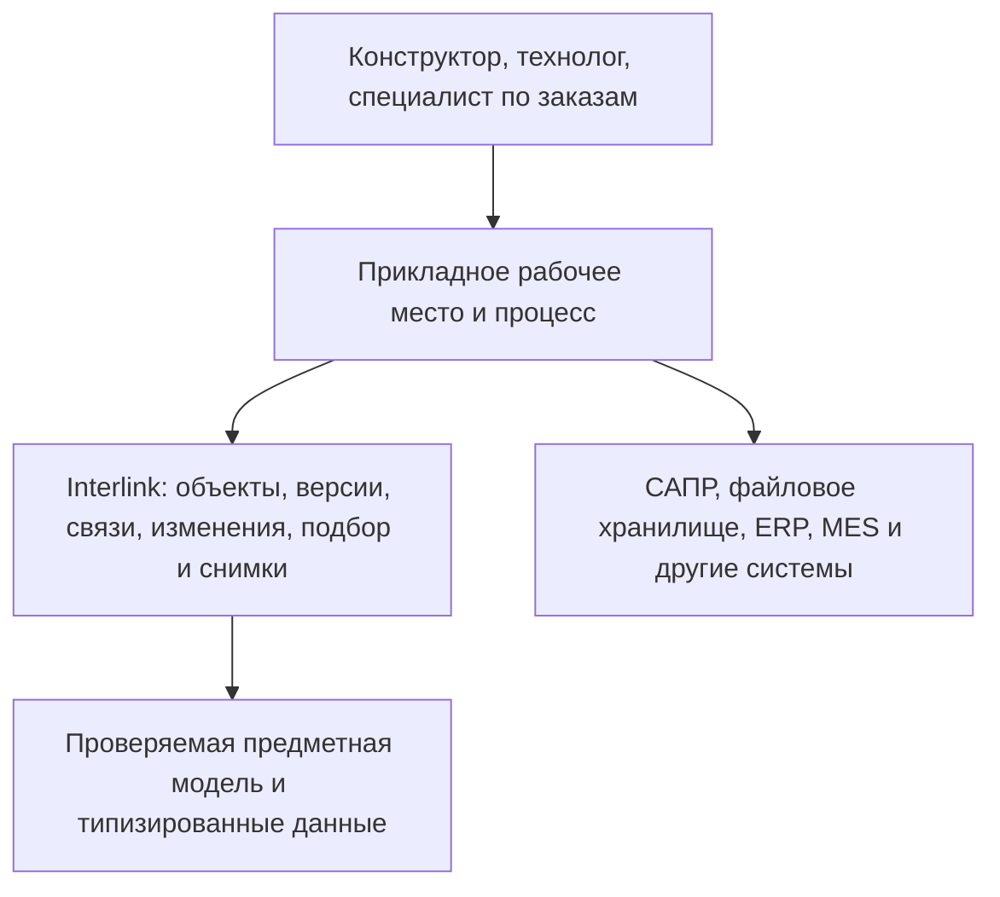
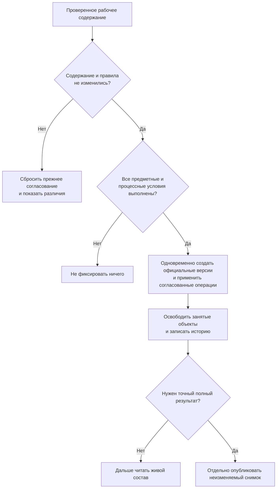

# Как пользователь будет работать в системе на основе Interlink

## Зачем нужен отдельный сквозной документ

Предыдущие главы объясняют понятия Interlink по отдельности: предметную модель, объект и версию, пакет изменения, подбор состава, снимок и границу с Alvatune. Этого достаточно для проверки отдельных решений, но недостаточно, чтобы представить обычный рабочий день конструктора, технолога или специалиста по заказам.

Эта глава связывает механизмы в один путь. Она отвечает не только на вопрос «что существует в модели», но и на вопросы:

- что делает человек в прикладной системе;
- какие исходные условия получает Interlink;
- что остаётся рабочим и невидимым для остальных;
- как формируется объяснимый состав;
- как согласование привязывается к точному содержанию;
- когда возникает официальная версия или неизменяемый снимок;
- что происходит при конфликте, отмене или последующем изменении.

Описанные рабочие места являются **целевой продуктовой моделью**, а не заявлением о готовом интерфейсе. Interlink создаёт предметное ядро и проверяемые операции. Экран, маршрут согласования, задания и уведомления предоставляет принимающий продукт, прежде всего будущая Alvatune. Поэтому корректнее говорить не о работе «в интерфейсе Interlink», а о системе, построенной на его предметном основании.

## Три уровня, которые пользователь воспринимает как одну систему



Пользователь не должен открывать «технический Interlink» и вручную собирать вызовы ядра. Он работает в знакомых предметных действиях: «взять изделие в изменение», «добавить позицию», «показать состав для серии 145», «проверить влияние», «отправить на согласование», «передать заказ в производство».

Принимающий продукт переводит это действие в точную операцию Interlink и добавляет то, что относится к организации работы: проверяет полномочия, назначает участников, ведёт задания, показывает экран и отправляет уведомления. Interlink отвечает за то, чтобы предметное изменение не обошло правила данных, а результат подбора или фиксации можно было воспроизвести и объяснить.

## Два режима внедрения

### Собственная предметная база на Interlink

Interlink является источником истины для объектов, версий, связей, составов и пакетов изменения. Принимающее приложение показывает рабочие места, но любое предметное действие выполняет через команды и проверки Interlink.

В этом режиме проведение пакета создаёт новые официальные версии непосредственно в Interlink. Снимки выпуска и заказа также публикуются из его точного графа.

### Работа поверх действующей IPS

На раннем этапе IPS или другая PLM может оставаться авторитетной системой. Принимающее приложение показывает пользователю точную внешнюю карточку, версию, свежесть данных, анализ влияния, задания и состояние передачи. Оно не создаёт незаявленную изменяемую копию объекта Interlink.

Утверждённое действие передаётся соединителю IPS. Если связь оборвалась, система показывает «исход неизвестен, требуется сверка», а не повторяет изменение вслепую. После подтверждения в IPS обновляется внешнее наблюдение и фиксируется происхождение.

Так предприятие может раньше получить координацию изменений и агентскую помощь, не объявляя преждевременно полную замену IPS. В каждом рабочем месте явно показывается источник истины.


## Роли и основные рабочие поверхности

Для первого принимающего продукта роли являются проверяемой моделью, а не окончательным штатным расписанием. Долгосрочно система должна поддерживать конструктора, технолога, специалиста по заказам и комплектации, планировщика, диспетчера производства, архив, администратора НСИ и другие роли IPS.

| Рабочая поверхность | С чего начинает пользователь | Какое решение принимает | Что получает |
|---|---|---|---|
| Входящие и моя работа | Задание, запрос агента, замечание или внешнее событие | Принять, уточнить, передать или отклонить | Понятную следующую работу и срок |
| Случай изменения | Цель, требования, затронутые объекты и участники | Как организовать изменение и что вынести на согласование | Связанный процесс и предметный пакет |
| Требования, связи и навигатор объектов | Поиск, карточка, дерево и история | Что именно относится к задаче и какую версию рассматривать | Точные объекты, версии, связи и влияние |
| Контроль процесса | Пакеты, задания, внешние передачи и отклонения | Где требуется вмешательство | Сводное состояние без смешения разных видов статуса |

Агент, которому не хватает данных, не додумывает их и не останавливается без следа. Он создаёт типизированный запрос человеку, который появляется во «Входящих и моей работе» с точным объектом, вопросом и контекстом.

## Как пользователь находит исходный объект

Обычный путь начинается не с ввода внутреннего идентификатора, а с поиска:

1. Пользователь выбирает предметную область и цель.
2. Задаёт условия понятными свойствами и единицами.
3. Получает список с явно выбранной версией и причиной выбора.
4. Для внешнего объекта видит источник истины и свежесть наблюдения.
5. Переходит в карточку, дерево, историю или связанный пакет изменения.

Interlink задаёт типизированные условия, контекст версий и обход связей. Полнотекстовый поиск, ранжирование, сохранённые представления и сам интерфейс принадлежат принимающему приложению.

## Шесть механизмов единого рабочего пути

| Механизм | На какой вопрос отвечает | Что получает пользователь |
|---|---|---|
| Предметная модель | Какие виды объектов, связей, значений и ограничений допустимы? | Понятные карточки, поля, связи и проверки для конкретной отрасли и предприятия |
| Явные условия чтения | Какое состояние пользователь хочет увидеть сейчас? | Один и тот же объяснимый результат во всех экранах и службах |
| Пакет изменения | Какие будущие правки рассматриваются как единое целое? | Изолированная рабочая область без преждевременного изменения официальных данных |
| Формирование состава | Какие позиции, объекты и версии подходят при данных условиях? | Дерево с точными версиями, основаниями выбора и диагностикой |
| Проведение изменения | Как превратить согласованный рабочий результат в официальные версии? | Полная фиксация либо полный отказ без частично выпущенного изделия |
| Неизменяемый снимок | Как сохранить точный многоуровневый результат для выпуска, заказа или обмена? | Исторически читаемое свидетельство, которое не пересчитывается по новым правилам |

Эти механизмы не являются шестью независимыми подсистемами. Предметная модель определяет допустимые данные; пакет изменения использует те же правила; подбор читает рабочее или официальное состояние в зависимости от условий; проведение фиксирует ровно проверенное содержание; снимок сохраняет точный результат подбора.

## Что происходит, когда пользователь просто открывает изделие

### 1. Прикладная система определяет цель просмотра

Открытие карточки «Редуктор РЦ-250» ещё не определяет, какую версию нужно показать. Для обычного поиска может требоваться назначенная основная версия, для архива — точная историческая версия, для нового заказа — выпущенная версия с учётом серии, а для участника изменения — будущая рабочая версия.

Поэтому рабочее место передаёт Interlink явные условия просмотра:

- что является корневым объектом или точной корневой версией;
- какой пакет изменения видит пользователь, если он участвует в работе;
- для какого головного изделия, серии, номера или даты формируется результат;
- какое правило выбора разрешено;
- требуется ли живой результат или ранее опубликованный снимок.

### 2. Interlink применяет один порядок выбора

Система сначала проверяет, не читается ли готовый снимок. Для живого состава она учитывает точную фиксацию позиции, рабочую область пакета изменения, применяемость и только затем правило выбора. Резервный вариант не включается молча: он должен быть разрешён условиями просмотра.

### 3. Рабочее место получает не только данные, но и объяснение

Для каждой позиции возвращается выбранный объект и версия, основание выбора, предупреждения и пройденные уровни. Если позиция обязательна, но версия не найдена, результат не маскируется пустой строкой. Пользователь видит, где именно остановилось формирование и какие условия не выполнены.

### 4. Права не переписывают инженерную истину

Прикладная система проверяет право на запрос и отображение. Однако опубликованный точный снимок не формируется по «обрезанному правами» дереву: иначе два пользователя получили бы два разных официальных состава. Доступ к такому артефакту предоставляется целиком либо отклоняется.

## Что происходит, когда пользователь начинает изменение

```mermaid
sequenceDiagram
    participant П as Пользователь
    participant А as Принимающее приложение
    participant И as Interlink
    participant В as IPS, CAD, ERP или MES

    П->>А: Начать предметное изменение
    А->>А: Проверить роль, источник истины и процесс
    А->>И: Открыть пакет и подготовить рабочие данные
    И-->>А: Будущее состояние, проверки и отпечаток
    А-->>П: Показать сравнение и получить решение
    А->>И: Передать разрешение для точного содержания
    И->>И: Повторно проверить и подготовить весь результат
    alt Interlink завершает собственную операцию
        И-->>А: Подтверждённый итог собственной операции
    else Interlink включён в общую операцию приложения
        И-->>А: Подготовленные версии и, если запрошен, снимок; пока не опубликованы
        А->>А: Зафиксировать либо откатить общую операцию
    end
    А->>А: Определить подтверждённый исход
    alt Подтверждена фиксация
        А-->>П: Показать официальный предметный результат
        А->>В: Выполнить предусмотренную внешнюю передачу
        В-->>А: Подтверждение, отказ или отсутствие ответа
    else Подтверждён откат или отказ
        А-->>П: Показать, что ни версии, ни снимок не опубликованы
    else Исход неизвестен
        А-->>П: Запретить повтор вслепую и начать сверку
    end
    А-->>П: Раздельно показать предметный, процессный и внешний статус
```

На схеме намеренно нет одного общего состояния «на согласовании». Состояние пакета Interlink, состояние заданий и маршрута принимающего приложения и состояние внешней операции существуют раздельно. Процесс может вернуть работу на доработку, не превращая уже выпущенную версию обратно в рабочую.

### 1. Создаётся пакет изменения

Пакет получает понятный номер, вид и основание: например, «Извещение: модернизация подшипникового узла». В нём фиксируется происхождение действия — человек, агент или системная операция, а также связь с процессом принимающего продукта.

Пользователь видит карточку изменения: цель, ответственного, участников, затронутые объекты, состояние проверок и будущую степень инженерной готовности. Внутреннее содержимое пакета ещё не меняет официальные версии.

### 2. Объект берётся в работу

Для существующего изделия рабочая версия создаётся тогда, когда меняется его собственное версионируемое содержание. Она продолжает последнее зафиксированное состояние, а прежняя версия остаётся неизменной. Если создаётся совершенно новый объект, до первого проведения он существует как предварительный объект только внутри этого пакета.

Некоторые постоянные изменения не требуют искусственного нового поколения: признак самого объекта, связь или метка, применяемость, назначение основной версии либо управляемое действие над выпущенным состоянием могут храниться в пакете как отложенные операции. Они входят в общий предпросмотр и общую фиксацию и резервируют затронутый объект, но рабочая версия появляется только для действительно версионируемого содержания.

Первая предметная правка резервирует объект за пакетом изменения. Другой пакет не может одновременно менять тот же объект. Это сознательное ограничение: автоматическое слияние двух независимо изменённых составов машиностроительного изделия обычно не имеет однозначного безопасного смысла.

### 3. Все правки входят в одну рабочую область

В пакет попадают не только поля рабочей версии. Он объединяет:

- создание и изменение объектов;
- добавление, удаление и изменение позиций состава;
- изменение количества, номера позиции и точной фиксации версии;
- изменение связей, списков и классификационных признаков;
- плановую применяемость;
- временные предпочтения версии для проработки;
- будущую степень готовности;
- управляемые действия над уже зафиксированными версиями, например вывод из применения.

Пользователь работает с предметными формами, а не с универсальным журналом произвольных команд. Для каждого типа модель заранее определяет допустимые поля, связи и проверки.

Временное предпочтение служит только для проработки. До проведения его нужно удалить либо создать точные фиксации тех конкретных позиций, где выбор должен стать постоянным, а затем всё равно удалить предпочтение. Если постоянный смысл выражается применяемостью или штатным правилом, их готовят и проверяют как отдельные решения; временное предпочтение не превращается в них автоматически.

### 4. Участник видит будущее, остальные — официальное состояние

Открывая редуктор с контекстом своего пакета, конструктор видит рабочую версию корпуса, добавленную позицию датчика и будущую версию спецификации. Технолог, который не включён в этот контекст, продолжает видеть официальный состав, выбранный его явными условиями просмотра; это не обязательно самое новое поколение.

При этом смежник может видеть, что объект занят изменением и кем, не получая доступа к закрытому рабочему содержанию. Так предупреждение о предстоящем влиянии отделяется от права видеть незавершённые данные.

### 5. Промежуточное сохранение не создаёт официальную версию

Пользователь может сохранять работу и создавать именованные точки возврата. Возврат к такой точке восстанавливает весь рабочий набор: карточки, состав, временные предпочтения и плановую применяемость. Он не переписывает уже выпущенные данные и не становится новой инженерной версией.

## Как пакет проверяется и согласуется

### Предпросмотр отвечает на вопрос «что получится»

Перед согласованием Interlink строит единый будущий вид данных и показывает:

- новые и изменённые версии;
- добавленные, удалённые и переподключённые позиции;
- изменение многоуровневого состава;
- обратную применяемость затронутых объектов;
- плановые диапазоны применяемости;
- позиции без подходящей версии;
- нарушения обязательности, уникальности, допустимых связей и циклов;
- временные предпочтения, которые нельзя оставить при фиксации.

Это не отчёт, собранный отдельно от реальной фиксации. Предпросмотр и проведение используют один рабочий набор и одну предметную модель.

### Проверка создаёт отпечаток точного содержания

После успешных проверок вычисляется устойчивый отпечаток всего согласуемого результата: всех подготовленных операций без исключения, точной версии модели, применимых настроек и фактически использованных правил. На последующем этапе в эту границу добавятся отпечатки файлов точных версий. Прикладной процесс согласует именно этот отпечаток; внешние расчёты, отчёты, подписи и решения он удерживает в собственной доказательной оболочке.

Если конструктор после согласования изменит количество болтов, добавит документ или сменит применяемость, отпечаток станет другим. Прежнее согласование больше не подходит; рабочее место должно показать, что требуется повторная проверка или повторное решение согласующих.

### Interlink и Alvatune разделяют ответственность

Interlink доказывает: «отпечаток и использованные правила совпадают с проверенным предметным содержанием». Принимающий продукт доказывает: «этот пользователь имел право согласовать, маршрут завершён, подпись действительна, разрешение не использовано повторно и его срок не истёк».

Так инженерная целостность не зависит от конкретной схемы маршрута, а процесс не пытается напрямую изменять таблицы предметных данных.

## Как результат становится официальным



Фиксация происходит целиком. Если пакет одновременно меняет корпус, подшипник, спецификацию и связь с чертежом, система не может выпустить только первые два элемента. При подтверждённом отказе сохраняется прежнее официальное состояние, а пакет остаётся доступным для исправления либо отмены. Если Interlink участвует в общей операции принимающего продукта, подготовленные версии и снимок становятся долговечными только после её подтверждённой фиксации; подтверждённый откат не публикует ничего, а неизвестный исход требует сверки до любой новой попытки.

Новые официальные версии получают последовательное место в истории и установленную степень готовности. Рабочие версии перестают быть изменяемыми. Освобождаются блокировки, обновляется видимость, а в истории остаются автор, основание, пакет и фактически проведённые операции.

Появление новой зафиксированной версии не означает, что обычный пользователь немедленно увидит именно её. Обычное представление может по-прежнему открывать ранее назначенную основную версию. Предприятие выбирает политику продвижения: назначать новую версию основной при каждом проведении, назначать её при первом выпуске объекта либо требовать отдельного ручного решения ответственного. Если основная версия не назначена, рабочее место должно показать это явно и применить другой разрешённый способ выбора, а не считать основной самую новую версию.

Неизменяемый снимок создаётся отдельным осознанным действием, когда нужен точный полный состав для выпуска, заказа, отчёта или обмена. Это позволяет не путать две разные вещи: проведение предметного изменения и публикацию конкретной многоуровневой конфигурации.

## Целевая структура рабочих мест

### Карточка объекта

Показывает тождество объекта, выбранную версию, степень готовности, историю версий, занятость изменением и доступные предметные действия. Пользователь должен видеть, почему открылась именно эта версия и в каком режиме он находится.

### Дерево состава

Показывает присутствие позиции, выбранный объект, выбранную версию и основание выбора как разные признаки. Для проблемной позиции отображается не общий красный значок, а причина: конфликт применяемости, отсутствие назначенной основной версии, запрещённый резервный выбор, недоступная рабочая версия или незакрытое временное предпочтение.

### Рабочее место изменения

Объединяет цель, участников, затронутые объекты, рабочие версии, изменения состава, точки возврата, предпросмотр, проверки, согласование и итог фиксации. Пользователь не должен переключать скрытое глобальное состояние приложения, чтобы увидеть свой будущий состав: контекст пакета видим в заголовке и передаётся в каждый запрос.

### Сравнение и влияние

Показывает состояние «до» и «после», затронутые верхние изделия, документы, заказы и правила применяемости. Такое представление помогает согласующему оценить содержание, не открывая каждую карточку вручную.

### Просмотр опубликованного снимка

Показывает точный корень, состав, дату и автора публикации, использованные правила и исходные условия. Пользователь видит, что это историческое свидетельство, а не живой пересчёт. Для юридически автономного комплекта принимающий продукт дополнительно удерживает файлы, подписи и другие доказательные материалы.

## Прикладной пример 1. Изменение подшипникового узла редуктора

Конструктор получает задачу заменить подшипник выходного вала редуктора РЦ-250 из-за прекращения поставок. Он создаёт пакет «Модернизация подшипникового узла», берёт в работу редуктор и чертёж крышки, создаёт рабочие версии и добавляет новый подшипник с изменённой посадкой.

В своём рабочем контексте конструктор видит новый подшипник и будущую версию крышки. Производственный технолог вне пакета продолжает видеть выпущенный вариант. Предпросмотр показывает, что замена затронула два исполнения редуктора и потребовала изменить инструмент контроля.

После согласования количества крепежа меняются с шести до восьми. Система обнаруживает изменение точного содержания и требует повторного решения. После нового согласования все версии фиксируются одновременно. Для выпуска создаётся базовый снимок полного состава. Старые редукторы продолжают читаться по прежним версиям и применяемости.

## Прикладной пример 2. Срочное исправление управляющей программы станка

Для обрабатывающего центра СТ-500 обнаружена ошибка в управляющей программе. Карточка программы уже занята долгим пакетом модернизации электрооборудования. Второй пакет не может начать параллельную независимую правку той же программы.

Ответственный руководитель видит занятость, оценивает незавершённый предпросмотр и принимает одно из решений: включить срочное исправление в существующий пакет, дождаться его завершения либо с обязательным основанием вытеснить весь пакет. Частично снять блокировку только с программы нельзя, потому что рабочий набор может потерять смысловую целостность.

Если применяется вытеснение, незавершённые правки отменяются целиком, в истории остаётся причина и ответственный, а владелец получает уведомление от принимающего продукта. Новый срочный пакет начинает работу от последней официальной версии.

## Прикладной пример 3. Передача насосной станции в производство

Специалист по заказам формирует насосную станцию для северного исполнения, площадки № 2 и заданного диапазона заводских номеров. Живой заказ использует выпущенные инженерные данные и настройки комплектации. Если во время проработки нужен временный выбор версии, он оформляется в связанном пакете изменения и до проведения должен быть удалён либо превращён в постоянное решение.

Система сначала определяет, какие позиции входят в выбранную комплектацию. Затем она должна определить используемый объект или согласованный структурный вариант и только после этого подобрать версию по точным фиксациям, рабочему пакету, применяемости и разрешённому правилу. Точный взаимный приоритет глобальных аналогов и групповых замен пока остаётся открытым продуктовым решением, поэтому он не скрывается за случайным порядком. На втором уровне обнаруживается обязательный электродвигатель без подходящей выпущенной версии. Живой просмотр показывает проблему, но публикация производственного снимка полностью блокируется.

После выпуска двигателя и повторного расчёта заказ согласуется. Публикация создаёт неизменяемый снимок заказа. Через месяц выходит новая версия муфты, поэтому живой расчёт аналогичного нового заказа выбирает её. Уже переданный снимок прежнего заказа остаётся неизменным и производство не выполняет подбор заново.

## Что происходит при типичных ошибках

| Ситуация | Реакция системы | Что делает пользователь |
|---|---|---|
| Объект занят другим пакетом | Новая правка не начинается; показаны владелец и основание занятости в пределах прав | Согласует включение, ожидает либо запускает разрешённое вытеснение |
| Нет подходящей версии обязательной позиции | Живой результат содержит явную диагностику; неполный официальный снимок не публикуется ни при каком согласовании | Исправляет структуру или обязательность позиции, применяемость, правило либо точную фиксацию, затем заново выполняет полный подбор до результата без пропусков |
| После согласования изменилось содержание | Прежнее разрешение перестаёт соответствовать новому отпечатку | Смотрит различия и повторяет требуемую часть согласования |
| Найден цикл или нарушено ограничение модели | Ничего не фиксируется | Исправляет рабочий набор и повторяет проверку |
| Пользователь отменяет пакет | Незавершённые объекты и операции удаляются, официальные данные не меняются | При необходимости открывает новую работу от актуального состояния |
| Внешняя передача не завершилась | Предметный результат может быть подтверждён, а сообщение ещё не доставлено; эти состояния не смешиваются | Если фиксация подтверждена, повторяет только доставку того же сообщения со ссылкой на тот же результат; если исход фиксации неизвестен, сначала выполняет сверку и не повторяет проведение вслепую |
| Агенту не хватает подтверждённых данных | В «Моей работе» появляется запрос с точным объектом и вопросом | Уточняет данные, отклоняет предположение или назначает владельца |
| Ответ внешней системы потерян | Показано «исход неизвестен»; предметный результат и доставка не смешиваются | Выполняет сверку по устойчивому номеру, не повторяет вслепую |

## Сколько живут управляющие решения

| Решение | Где возникает | Когда перестаёт действовать |
|---|---|---|
| Точная фиксация версии | Конкретная позиция в конкретной родительской версии | Живёт бессрочно вместе с этой родительской версией. При создании следующей родительской версии может быть явно унаследована и там действует, пока её не изменят или не удалят новым официальным изменением |
| Временное предпочтение | Открытый пакет изменения | Всегда удаляется до проведения. Если выбор должен стать постоянным, сначала создаются точные фиксации позиций либо отдельно готовятся применяемость или правило, после чего исходное предпочтение всё равно удаляется |
| Применяемость | Зафиксированная версия и её диапазоны | Исторически сохраняется; меняется следующей официальной операцией |
| Правило подбора | Версия модели или настройки продукта | После выпуска и назначения следующей редакции |
| Параметры заказа | Официальная версия живого заказа | После проведения следующей версии заказа |
| Снимок | Отдельная публикация полного графа | Не изменяется; следующий результат получает новый снимок |

Эти механизмы не являются взаимозаменяемыми фильтрами окна. У них разные владельцы, срок жизни и способ изменения.

## Что меняется относительно IPS

Сохраняются знакомые пользовательские результаты: рабочая копия, контекст редактирования, извещение, групповое изменение, конкретизация, применяемость, актуализация и точный заказ. Меняется внутренняя композиция:

- рабочая копия становится рабочей версией внутри явного пакета;
- контекст редактирования перестаёт быть скрытым состоянием окна;
- итерация становится промежуточной точкой возврата, а не обязательной официальной версией;
- мягкая конкретизация становится временным предпочтением, которое нельзя молча провести;
- жёсткая конкретизация становится точной фиксацией конкретной позиции;
- актуализация становится одной атомарной фиксацией полного пакета;
- согласование относится к точному отпечатку содержания;
- точный заказ хранится как отдельный неизменяемый снимок каждой передачи;
- маршрут между людьми отделяется от степени инженерной готовности данных.

## Состояние реализации по слоям

| Слой | Состояние |
|---|---|
| Язык модели, проверка, нормализация и значительная часть автоматически формируемых прикладных представлений | Реализованный фундамент; локальная работа и принятая основная версия различаются |
| Реальные предметные таблицы, команды записи и запросы PostgreSQL | Следующие этапы опытного подтверждения; не готовая пользовательская функция |
| Полный подбор версий и техническая проекция | Контракты и поэтапная реализация после базового чтения |
| Полный пакет, рабочее наложение, применяемость и бизнес-снимки | Принятый целевой контракт после соответствующих этапов опытного подтверждения |
| Поиск, карточки, дерево, задания, согласование и контроль процесса | Целевая пользовательская модель принимающего продукта |
| Рабочая интеграция Alvatune с Interlink | Не реализована; существующие проекты преимущественно являются каркасами |
| Работа поверх авторитетной IPS | Целевая федеративная модель; требует соединителя, наблюдений и сверки |

На текущем этапе реализуется фундамент, из которого будут собраны эти рабочие пути: язык предметной модели, его проверка и формирование согласованных прикладных представлений. Проверяемые операции записи, чтение составов, общий подбор и техническая проекция входят в последующие этапы опытного подтверждения.

Полный пакет изменения, его рабочее наложение, точки возврата, комплекты изменений, применяемость и бизнес-снимки являются принятым целевым контрактом после соответствующих этапов опытного подтверждения. Пользовательские рабочие места, процессы, задания, согласование, подписи и уведомления относятся к Alvatune или другому принимающему продукту и пока не реализованы как готовый контур.

Поэтому этот документ одновременно является объяснением целевого поведения и основой будущих сквозных приёмочных сценариев. Он не подтверждает готовность промышленной замены IPS.

## Критерии продуктовой приёмки

1. Один и тот же явный контекст даёт согласованный результат в карточке, дереве, отчёте и интеграции в пределах одного состояния данных.
2. Участник пакета видит рабочий результат, а внешний пользователь — официальное состояние, выбранное его явными условиями, а не обязательно самое новое поколение.
3. Нельзя изменить один объект в двух открытых пакетах без явного завершения или вытеснения первого.
4. Предпросмотр и проведение используют один и тот же полный набор правок.
5. Любое изменение после согласования обнаруживается и требует предусмотренного повторного решения.
6. Многообъектный пакет фиксируется полностью либо не изменяет официальные данные.
7. Отмена не удаляет уже опубликованную историю.
8. Для каждой позиции состава видны объект, версия, основание выбора и диагностика.
9. Публикация точного снимка блокируется при любой обязательной позиции без версии на любом уровне.
10. Старый снимок читается без повторного подбора по новым правилам.
11. Граница Interlink, принимающего продукта и внешних систем понятна для каждой операции.
12. Интерфейс явно различает реализованную возможность, целевой контракт и открытый вопрос.

## Связанные документы

- [Понятийная модель](03-core-concepts.md)
- [Формирование состава](05-composition-resolution.md)
- [Версии, изменения и снимки](07-versioning-changes-snapshots.md)
- [Поставка модели и расширяемость](08-model-delivery-and-extensibility.md)
- [Граница с Alvatune и агентами](09-alvatune-and-agents.md)
- [Текущее состояние и дорожная карта](02-current-state-and-roadmap.md)
- [Подробный пакет о подборе версий](../version-selection/README.md)
- [Подробный пакет о заказах](../orders/README.md)
- [Подробный пакет об изменениях](../changes/README.md)
- [Система типов и работа с моделью](../data-structure/README.md)

Основания: [IL-VERS-SPEC], [IL-QUERY], [IL-HOST], [IL-META], [IL-DSL], [IL-PLM], [IPS-A04], [IPS-A05], [IPS-A13], [ALV-ADR068], [ALV-ADR070]. Расшифровка — в [реестре источников](15-source-register.md).
