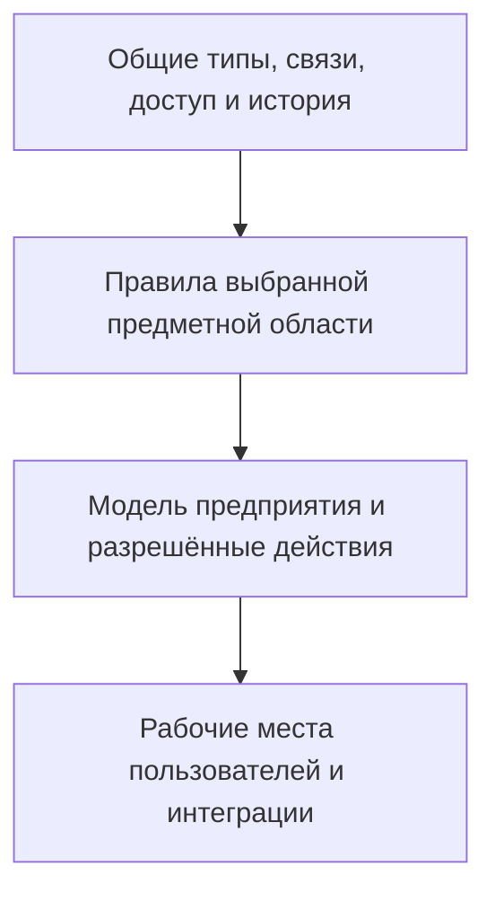
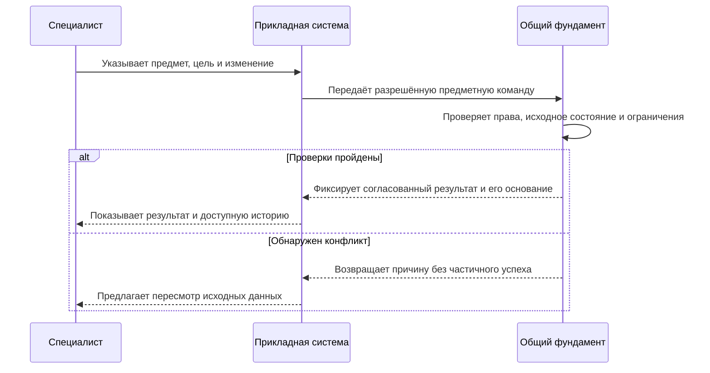

# Объекты, связи и свойства: фундамент, который не ограничен PLM

[Путеводитель](README.md) · [Сценарии разных отраслей](02-multidomain-scenarios.md) · [Цифровые двойники](03-digital-twins-and-domain-extension.md)

Interlink проектируется так, чтобы инженерная система была важным, но не единственным его применением. Общая основа должна уметь описывать предметы, их свойства, отношения, допустимые изменения и историю. Состав изделия, инженерные версии и подбор версий добавляют к этой основе специальный смысл. Они нужны конструктору, но не должны появляться в карточке перевозки только потому, что приложение использует ту же платформу.

Это **принятая целевая архитектура**, а не сообщение о готовом универсальном приложении. В проекте уже развивается описание типов и их отображение в настоящие таблицы базы данных. Полный путь от нейтральной модели до безопасных команд, исторического чтения и предметного интерфейса ещё предстоит подтвердить сквозными испытаниями. При этом обязательные сценарии IPS, включая мягкую конкретизацию, остаются требованиями инженерного применения.

## Что означает «объект — связь — атрибут»

Объект — предмет с самостоятельным тождеством: насос, чертёж, склад, отправление, партия сырья или инструкция. Имя и обозначение могут изменяться, а предмет остаётся тем же. Два насоса с одинаковой моделью и разными заводскими номерами, напротив, остаются двумя экземплярами.

Атрибут — объявленное свойство определённого владельца. Номинальная подача принадлежит проектному определению насоса. Дата поступления на склад относится к конкретному поступлению. Количество «четыре штуки» принадлежит позиции конкретного комплекта, а не подшипнику во всех его применениях. Уже это различие помогает избежать карточек, где один общий параметр невольно меняет несколько независимых процессов.

Связь тоже имеет смысл и правила. «Принадлежит предприятию», «находится на складе», «установлен на функциональное место» и «входит в проектный состав» — не четыре названия одного отношения. У них разные участники, сроки действия, полномочия и последствия изменения. Для связи могут понадобиться собственные свойства: количество, роль, последовательность, период установки, основание решения.

Владение вещью, ответственность за её хранение и право редактировать данные тоже не тождественны. Передача контейнера перевозчику не должна автоматически давать ему право менять модель контейнера. Связи могут участвовать в правилах доступа, но право появляется только по объявленной политике.

Одно и то же место может дважды встречаться в маршруте; это два участия, даже если адрес одинаков. Перестановка остановки должна менять порядок, а не её тождество. Кольцо трубопровода, в свою очередь, может быть допустимой сетью, хотя цикл вложения «сборка входит сама в себя» недопустим. Общая модель сохраняет эти различия и не навязывает всем отношениям правила одного дерева состава.

Физически эта гибкость не требует собирать все значения предприятия в одну безразмерную таблицу. Объявленные типы материализуются в типизированные таблицы и столбцы базы данных, а связи — в проверяемые ссылки и записи участия. Благодаря этому система может проверять допустимость данных и строить адресные запросы. Подробности пользовательских последствий — в [модели данных](../data-structure/README.md) и [производительности](../data-structure/06-performance-and-agent-load.md).

## Как общая основа превращается в предметную систему

Схема показывает разделение ответственности, а не последовательную установку четырёх готовых продуктов. Общая основа обеспечивает проверяемость. Предметный модуль объясняет, что считать составом, резервом или результатом испытания. Приложение организует работу человека. Если инженерная семантика подключена, её обязательные проверки нельзя отключить произвольным выбором в окне или обходным импортом.

Например, складское приложение может работать с местами хранения, грузовыми местами и наблюдениями без инженерной шкалы готовности. Когда отправление действительно связано с выпущенной спецификацией насоса, оно получает точную ссылку на этот инженерный комплект. Общая основа позволяет связать процессы, не заставляя назвать отправление «версией детали».

## Три способа жить и изменяться

Не вся история должна выглядеть как ряд инженерных версий. В целевой модели предусмотрены три разных договора изменения.

| Форма данных | Когда подходит | Что должно остаться после изменения |
|---|---|---|
| Изменяемая оперативная запись | Контактный адрес, состояние задания, плановая дата отправки | Новое текущее значение, защита от потери чужой правки, необходимая история; для точного основания — отдельно сохранённое наблюдавшееся содержание |
| Неизменяемый факт | Измерение, сообщение о приёмке, зарегистрированная установка | Исходное утверждение и, при исправлении, новая связанная запись с причиной |
| Управляемая инженерная версия | Чертёж, конструкция, утверждаемая инструкция | Пользовательская версия, отдельная рабочая копия и точные опубликованные состояния |

Оперативная запись не становится бесконтрольной: её нельзя произвольно менять без прав и проверок. Неизменяемый факт не означает, что ошибка запрещена навсегда: исправление возможно, но не стирает исходное утверждение. Управляемая версия не означает, что каждое сохранение рабочего содержания уже является публикацией. Эти договоры выбираются по смыслу данных, а не по удобству формы на экране.

### Пример 1. Адрес поставки и выпущенная инструкция

Специалист по снабжению исправляет номер ворот склада, куда должны привезти насосную станцию. Для этого не нужна новая инженерная версия станции. Меняется оперативная карточка места доставки. Если диспетчер уже выпустил отгрузочный комплект, тот продолжает показывать адрес, с которым был подготовлен; исправленный адрес попадёт в новый комплект или отдельное извещение.

Рядом находится инструкция расконсервации. Здесь изменение порядка проверки уплотнений должно проходить работу над управляемой версией и установленное согласование. Одинаковая кнопка «Редактировать» не должна скрывать различие последствий: адрес уточняет текущую организационную информацию, инструкция меняет контролируемое содержание.

### Пример 2. Измерение вала и исправление протокола

Контролёр зарегистрировал диаметр вала 49,98 мм. Позднее выяснилось, что в запись перенесли результат другого измерения. Исправление сохраняется как новое утверждение со ссылкой на ошибочную запись, причину и действительное основание. Пользователь видит актуально принятый результат, а при разборе отклонения может восстановить прежнее знание.

Нельзя просто заменить число и оставить прежний подписанный протокол как будто он всегда содержал исправленный результат. Нельзя и создать новую инженерную версию самого вала лишь для регистрации измерения: проектное требование, физический экземпляр и наблюдение о нём — разные предметы.

### Пример 3. Подшипник в трёх независимых ролях

В конструкторском составе редуктора требуется два подшипника. В ремонтном комплекте предусмотрено четыре запасных. На складе зарезервировано семь подшипников для нескольких заказов. Это не три конкурирующих значения одного поля «Количество подшипников».

Первые два количества принадлежат разным позициям комплектации. Резерв — отдельная договорённость по запасу и потребности. Его отмена освобождает оставшийся резерв, но не меняет конструкторский состав и не возвращает уже выданные детали. Так общая объектная модель сохраняет связи между процессами, не смешивая их факты.

## Участие и контекст: свойство не всегда принадлежит карточке

Цена гидроцилиндра может зависеть от поставщика, производственной площадки, объёма заказа и срока поставки. Эти условия образуют самостоятельное предложение. Смена цены не должна выпускать новую конструкторскую версию гидроцилиндра и одновременно переписывать историческую стоимость уже принятого заказа.

Такой контекст — конкретные предметные условия, а не скрытая настройка рабочего окна. Предложение имеет собственное содержание и историю. Решение «выбрать это предложение для данного заказа» хранится отдельно. Несколько альтернативных предложений могут существовать одновременно, даже если для одной потребности в итоге допускается один выбранный поставщик.

Похожий принцип действует для материала покрытия на конкретной поверхности, роли сотрудника в определённой проверке или цены ткани для зимней коллекции. В каждом случае сначала определяется владелец значения и область его действия. Для многомерных справочников и сопоставлений предусмотрены [табличные формы](../tabular-data/README.md), но сама клетка таблицы не заменяет решение о закупке или разрешение применения.

## Число означает больше, чем числовое значение

У количества есть единица, предметная роль и иногда основание расчёта. Четыре штуки, четыре килограмма и четыре процента от массы основы — разные данные. Пересчёт литров масла в килограммы требует плотности и условий, а не вечного коэффициента между двумя единицами.

В целевом расчёте должны быть известны исходные значения, единицы, правила преобразования и округления. Историческая калькуляция удерживает именно использованные основания. Если поставщик обновил плотность материала, старый расчёт не переписывается: новый расчёт получает новые основания и отдельный результат.

Неизвестное значение также имеет смысл. «Не измерено», «не применимо», измеренный ноль и «ниже предела обнаружения метода» нельзя объединять в пустую клетку. Предварительная оценка может честно оставаться неполной; выпуск, для которого значение обязательно, должен быть остановлен с понятным объяснением.

## Как пользователь проходит изменение

Пользователь действует через предметное рабочее место: резервирует детали, исправляет измерение или публикует инструкцию. Общий фундамент проверяет тот договор, который объявлен для этого действия. Успех означает согласованный результат в объявленной локальной границе, а не обещание одновременного успеха произвольной внешней системы. Доставка поставщику или запись во внешнюю PLM имеют собственные подтверждения.

## Что это даёт специалисту IPS

Инженерные сценарии не растворяются в универсальности. Составы, конкретизация, применяемость и официальные комплекты сохраняют специальные правила. Меняется граница: рядом с ними можно хранить оперативные данные, факты, предложения и свидетельства без искусственных инженерных версий.

Это позволяет расширять решение постепенно. Предприятию не требуется заранее принять все отраслевые модули. Но нельзя считать, что новая область уже поддержана только потому, что в модели можно создать тип с нужным названием. Для каждого применения нужны предметные команды, отрицательные сценарии, полномочия и проверка результата.

## Точное содержание — не то же самое, что текущая карточка

В общем фундаменте нужны три способа получить историческое основание. Для инженерного предмета это ссылка на конкретное опубликованное состояние. Для неизменяемого факта — ссылка на саму запись с её исходным смыслом. Для изменяемой карточки — отдельно сохранённое содержание, которое действительно наблюдалось в объявленной области.

Последний способ особенно важен. Дата последней правки или номер редакции позволяют обнаружить изменение, но сами по себе не восстанавливают прежний адрес, цену или текст. Для точного основания нужно сохранить наблюдавшиеся значения. Захват нескольких связанных значений должен быть согласованным: нельзя взять старую цену из одного чтения, новую валюту из другого и представить их как единое предложение поставщика.

Точность одной записи не распространяется автоматически на всё, с чем она связана. Протокол измерения может быть неизменяемым, а карточка калибровки прибора — изменяемой. Если применённая калибровка существенна для вывода, в комплект входит её тогдашнее содержание. При этом не требуется копировать весь информационный мир: граница определяется конкретной целью свидетельства и должна быть известна проверяющему.

Условия подбора версии отвечают на другой вопрос. Они помогают получить подходящее содержание живого состава, но не заменяют точную запись того, что уже было показано человеку или использовано в расчёте. Сохранённый комплект прошлого читается по своим основаниям без повторного выбора сегодняшних основных версий.

## Как прежние данные остаются понятными после развития модели

Сохранить число и файл недостаточно, если позже изменился смысл единицы, справочного кода или способ чтения. Например, значение расхода 0,08 без указания единицы может означать разные физические величины. Старый протокол должен удержать не только цифру, но и её тогдашнюю интерпретацию.

Поэтому развитие модели предусматривает сохранение необходимых определений и пригодного способа чтения старого содержания. Это не обещание вечно запускать старую программу без проверки. Допустим новый способ чтения, если доказано, что он сохраняет прежний смысл. Если такой переход не доказан, прежняя форма должна оставаться доступной в пределах обязательств сохранности.

Правила изменения самого типа тоже нельзя переключать как настройку окна. Если измерения объявлены неизменяемыми фактами, обновление модели не должно случайно открыть их для обычного исправления или массового импорта. Переход к другой форме хранения и изменения требует отдельной проверки существующих данных, действующих приложений и исторического чтения.

Для пользователя это означает два результата. Старый выпущенный комплект остаётся понятным после обновления системы. А новый тип или свойство вводятся управляемо, с объяснением последствий, а не через незаметную смену смысла прежних сведений.

## Видимость, официальность и ошибки

Для оперативного адреса утверждённая предметная команда может сразу изменить текущую карточку: другие уполномоченные пользователи увидят новое значение после завершения операции. Если карточка затронута одновременно, второй автор получает конфликт, а не молча стирает чужую правку.

Рабочее инженерное содержание имеет иной путь. Оно сохраняется в рабочей области и доступно по её правилам; обычные потребители опубликованного содержания продолжают читать прежнее точное состояние. Отдельная публикация создаёт новое точное состояние выбранной инженерной версии. Создание новой инженерной версии, сохранение и публикация остаются разными действиями. Восстановление рабочей точки не публикует её автоматически.

У факта нет стадии «незаметно исправить после регистрации». Для ошибочного измерения создают связанное исправление. Но регистрация исходного сообщения не всегда означает принятие его как истины: сообщение подрядчика о выполненной работе и решение принять результат могут быть разными записями. Процесс определяет полномочия и достаточность свидетельств.

Общий результат локальной команды фиксируется вместе с обязательной историей, подтверждением операции и требуемым заданием внешней доставки. Если операция ещё является частью более крупного незавершённого действия приложения, промежуточный результат не объявляется окончательным успехом. После потери ответа проверяют прежнюю операцию, а не создают новую «на всякий случай». Задание доставки ещё не доказывает приёмку: внешняя отправка или согласование в другой системе имеют свои подтверждения.

В истории пользователь должен видеть вид записи, основание изменения, автора, применённые правила и доступное предыдущее содержание. Просмотр истории проверяет текущие права проверяющего. Наличие старого допуска или точного файла само по себе не разрешает сегодняшнее чтение, длительное удержание или передачу стороннему исполнителю.

## Что общий фундамент сознательно не обещает

Гибкость не означает хранение всех свойств в одном универсальном списке без типов. Объявленная предметная модель материализуется в реальные типизированные структуры базы данных. Это позволяет проверять значения, ссылки и условия, а также выбирать подходящие индексы. Полезность такого решения не следует путать с уже измеренным превосходством над IPS: производительность зависит от запроса, объёма связей, доступа, сохранности и конкретной установки.

Общая модель также не является готовой складской системой, движком любых процессов или медицинской информационной системой. Правила резервирования, сервисной приёмки, расчёта рецептуры и допуска конкретного изделия реализуют предметные модули. Они используют общие гарантии, но должны отдельно доказать собственное поведение.

## Что нужно доказать и обсудить

На раннем этапе опытного подтверждения, обозначенном в техническом плане как S1, выполняются небольшие межотраслевые проверки до закрепления зависимой модели. Они должны показать, что нейтральная логистика работает без фиктивных объектов PLM; факт не переписывается через импорт; исторический комплект переживает изменение оперативных источников; конкурирующие резервы не расходуют один запас дважды. Одновременно проверяется, что инженерные сценарии IPS не потеряли свои правила.

С продуктовыми специалистами важно определить, какие сведения требуют пользовательских версий, где достаточно истории оперативных правок, а какие записи являются неизменяемыми утверждениями. Это предметное решение: платформа не может надёжно вывести его из названия карточки.

Продолжение: [межотраслевые сценарии](02-multidomain-scenarios.md), [цифровые двойники](03-digital-twins-and-domain-extension.md), [агенты и прослеживаемость](../agents/01-agents-and-traceability.md), [текущее состояние и план](../knowledge/02-current-state-and-roadmap.md).

## Основания

Продуктовое объяснение сверено с пересмотренной архитектурой Interlink на 6 сентября 2026 года. Основные источники: IL-NEUTRAL — нейтральный объектный фундамент; IL-KERNEL — семантическое ядро; IL-FOUNDATION — расширяемая инженерная основа; IL-DATA-MODEL — проекция предметов и процессов в данные; IL-PLAN-V2 — последовательность проверок и развития. Расшифровка и границы доступности — в [реестре источников](../knowledge/15-source-register.md).
