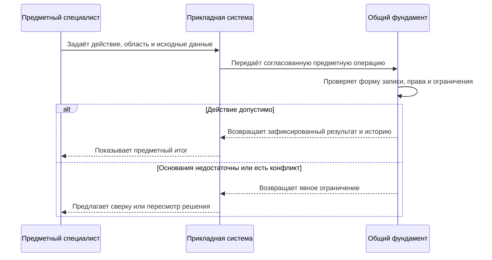
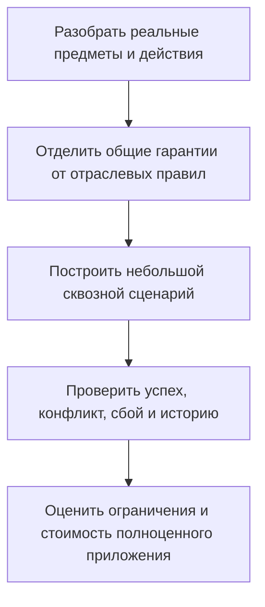

# Один фундамент — разные предметные области

[Путеводитель](README.md) · [Общие механизмы](01-object-relationship-attribute.md) · [Цифровые двойники](03-digital-twins-and-domain-extension.md)

Инженерная система хорошо проверяет версии, составы и изменения, но не исчерпывает задачи связанных данных. В одежде особенно важны сезон, размер и условия поставщика. В пищевом производстве — основание рецептуры, партии и результаты измерений. В логистике — обещание, резерв, движение и приёмка. Для долговечного сооружения — место установки, заменяемый экземпляр и знание о событиях за десятилетия.

Эти направления используются при проектировании Interlink как проверка архитектуры на слишком узкие предположения. Речь **не о готовых отраслевых приложениях** и не об обещании нормативной пригодности для медицины, пищевого производства или атомной промышленности. Сначала нужно доказать, что общая модель позволяет выразить различия и сохранить общие гарантии. Полнота обязательных сценариев IPS при этом не сокращается.

## Что остаётся общим, а что должно различаться

Общими остаются типизированные объекты и связи, правила изменения, доступ, точные основания, история, согласованные команды и управляемый обмен. Специальными остаются смысл версии, роли количеств, предметное разрешение применения, порядок утверждения, расчёт и ограничения конкретной отрасли.

| Область | Что важно не смешать | Что использует общий фундамент |
|---|---|---|
| Машиностроение | Проект, выпущенный комплект и фактически собранный экземпляр | Управляемые версии, связи состава, точные комплекты и факты |
| Логистика | План, прогноз, резерв, выдачу и приёмку | Оперативные записи, отношения участия и неизменяемые наблюдения |
| Одежда | Дизайн, размерный вариант, сезон и предложение поставщика | Контекстные данные, таблицы, отдельные решения выбора |
| Пищевые продукты | Рецептуру, инструкцию завода и фактическую партию | Количества с основанием, преобразования партий, свидетельства |
| Строительство | Проектную модель, функциональное место и установленное оборудование | Типизированные сети, точные комплекты разных дисциплин и историю |
| Медицинские изделия | Испытание, оценку риска и разрешение конкретного применения | Прослеживаемость точного предмета, процедуры, решения и его области |

В этой таблице нет предположения, что одинаковая надпись «одобрено» даёт одинаковое право во всех отраслях. Смысл решения должен быть явным: «проверено для изготовления образца», «разрешено к монтажу» и «принято после испытания» — разные утверждения.

## Машиностроение: общая основа не ослабляет инженерные правила

Конструктор меняет уплотнение насосной станции для холодного климата. Проектная версия, условия применяемости, выбранный заменяющий материал и точное опубликованное содержание сохраняют свои инженерные правила. Если требуется проверка совместимости с рабочей средой и температурой, она оценивает именно выбранный комплект, а не только два совпадающих обозначения.

Затем производственный заказ фиксирует комплект для конкретной партии. Цех может сообщить, что по согласованному отклонению фактически установлен другой экземпляр насоса. Это новое свидетельство изготовления, а не незаметное исправление проектного замысла. Из одного фундамента получаются связанные ответы «что предписано» и «что сделали», но не один подменяющий оба ответа список.

Во втором примере инженер исправляет инструкцию ремонта редуктора, а снабжение меняет адрес доставки запасных деталей. У инструкции есть контролируемая версия; у адреса может быть оперативная форма записи. Исторический ремонтный комплект сохраняет прежнюю инструкцию и наблюдавшийся адрес. Пользователь не обязан выпускать инженерные версии для каждого организационного уточнения.

### Третий инженерный пример: испытание гидроцилиндра и рабочая доработка

Испытатель проверяет гидроцилиндр определённой комплектации на стенде. Результат связывается с конкретным физическим экземпляром, точной программой испытания, используемой калибровкой и зафиксированным проектным основанием. Измеренное давление и заключение испытателя не превращаются в свойства всех гидроцилиндров этой модели.

Конструктор затем изменяет уплотнение в рабочем состоянии. Старый протокол продолжает доказывать только прежнее испытание. Для переноса вывода на новое решение нужна оценка применимости свидетельства, а не автоматическое наследование положительного результата. Испытатель видит, что основание конструкции изменилось; конструктор — какие проверки следует повторить или обосновать отдельно.

Так один пример проверяет сразу несколько границ: проект и экземпляр, рабочее содержание и опубликованное состояние, наблюдение и инженерное заключение, точное прошлое и допуск будущего применения. Если нужная калибровка не сохранена, система показывает недостаточность основания, а не заполняет пробел её сегодняшней редакцией.

## Логистика: обещать, зарезервировать и получить — три разных результата

Диспетчер готовит отправку десяти подшипников на ремонтную площадку. В плане указана поставка к 14:00. Перевозчик позднее прогнозирует 16:00, фактическое прибытие регистрируется в 16:20. Система должна сохранить все три утверждения и их источники. Иначе история покажет, будто предприятие с самого начала обещало 16:20.

Перед отправкой создаётся резерв. Если на складе доступны десять деталей, два одновременных запроса по семь не могут оба успешно закрепить весь требуемый объём. Правила согласованной команды должны защищать общий запас, а не только каждую отдельную строку резерва. При недостатке второй пользователь получает понятный отказ или отдельное предложение частичного обеспечения по разрешённой политике.

Выдача шести деталей из резерва семи оставляет одну зарезервированную деталь. Отмена остатка освобождает одну, но не возвращает уже выданные шесть. Приёмка пяти деталей получателем также не уменьшает задним числом заказ до пяти: возникает факт приёмки и разбор расхождения. Если фактическим остатком управляет внешняя складская система, её подтверждение сохраняет самостоятельное значение; локальная запись Interlink не объявляется автоматически внешним резервом.

## Одежда: дизайн не меняется от новой сезонной цены

Для куртки «Север» существуют один дизайн, две расцветки и несколько размеров. В осенней коллекции разрешены синий размер M, синий L и оранжевый L. Оранжевый M может ещё не быть предусмотрен. Табличное представление позволяет показать это сочетание как незаданное, но не создаёт товарный вариант от самого факта наличия строки и столбца на экране.

Здесь важно различать общую разреженную карту и специальный перечень разрешённых сочетаний. В обычной карте пустая клетка означает отсутствие назначения. Вывод «эта комбинация не разрешена данной редакцией ассортимента» требует явно закрытого перечня, известных границ и полного авторитетного чтения. Ограниченная правами или первой страницей выборка не доказывает запрет.

Таблица мерок хранит ширину изделия в конкретной точке для конкретного размера. Измеренное значение, вычисление по правилу градации, ручное уточнение и отсутствие измерения имеют разные основания. Обновление общего правила не должно переписать уже выпущенный технический комплект поставщику.

Наконец, цена 42 евро для осенней партии одного поставщика — не поле дизайна вообще. Новое предложение в 45 евро получает собственную историю. Закупщик выбирает предложение для определённой потребности; старый расчёт и уже переданный комплект сохраняют использованные условия. Подтверждение удачной примерки образца не становится автоматическим разрешением серийного выпуска всех размеров.

## Пищевые продукты: рецептура — не просто состав в штуках

Для проверочного примера рецептуры заданы 100 кг муки, 60 кг воды и 2 кг соли. Если проценты выражены относительно массы муки, они составляют 100%, 60% и 2%. Сумма 162% здесь не ошибка. При представлении долей от полной массы смеси используется другое основание расчёта. Платформа не должна навязать универсальное требование «сумма любых процентов всегда равна ста».

Технолог выбирает точную рецептуру, заводскую инструкцию и масштаб партии. Расчёт сохраняет единицы, основание и правила округления. Производство регистрирует фактические входные партии, выход продукта, возвраты и потери. Разделение одной партии на две или смешение двух партий в одну образует связи фактического преобразования; это не происхождение инженерных версий рецептуры.

Если поставщик не передал данные о составе ингредиента, результат остаётся неизвестным. «Не исследовано», «не обнаружено данным методом» и «отсутствует» не взаимозаменяемы. Отдельное предметное решение оценивает пригодность точного набора сведений для конкретного заявления на упаковке и рынка. Пример показывает требования к хранению оснований, но не устанавливает технологическую норму или юридическое разрешение.

## Строительство: несколько дисциплин и долгоживущее место

На координационное совещание поступают определённые выпуски архитектуры, конструкций и вентиляции. Замечание «воздуховод пересекает балку» относится к конкретным элементам этих выпусков и их пространственной привязке. Завтрашняя модель не должна незаметно заменить исходное основание замечания, даже если названия элементов остались прежними.

Обновление только третьего этажа рассматривается в объявленной области. Отсутствие первого и второго этажей в такой передаче не означает их удаление. Проектировщик видит предлагаемую разницу, исходную редакцию и локальные конфликты до принятия обновления. Комплект для координации также не превращается автоматически в комплект, разрешённый для монтажа.

После строительства функциональное место «насос охлаждения второго контура» может пережить несколько установленных насосов. У места, помещения, проектного определения и серийного экземпляра разные идентичности. Запрос по месту показывает последовательность установок; запрос по экземпляру — его перемещения и ремонты. [Цифровой двойник](03-digital-twins-and-domain-extension.md) связывает эти истории, а не заменяет всё одной карточкой с меняющимся заводским номером.

## Медицинские изделия и ответственные долговечные активы

Для изменения прошивки условного медицинского устройства важно связать точные устройство, программу, инструкцию, назначение и процедуру оценки. Успешный программный тест подтверждает свой результат, но не сам по себе пригодность для всех групп пользователей и способов применения. Решение должно сохранять, что именно оценивалось и каких границ вывод не покрывает.

Похожая строгость нужна при модернизации ответственной промышленной установки. Многомесячная программа работ связывает проект, задания, результаты выполнения и свидетельства приёмки. Она не является одной бесконечно открытой операцией изменения. Исторические основания сохраняются, а каждый следующий шаг проверяет текущие разрешения и обязательные ограничения.

Для медицинской, атомной и других регулируемых областей потребуются специальные процедуры, квалификация установки, правила подписи и самостоятельная правовая и предметная проверка. Наличие неизменяемой записи или прослеживаемой ссылки не является сертификацией. Interlink не должен обещать её как автоматическое следствие архитектуры.

## Общий путь внедрения нового сценария

Продуктовый специалист сначала описывает, что именно предприятие хочет различать. Для рецептуры это могут быть замысел, заводская инструкция, фактическое производство и разрешённое заявление на упаковке. Для перевозки — заказанная услуга, обещание, резерв, прогноз и принятая доставка. Если эти понятия смешать при проектировании карточки, последующее добавление полей не исправит ошибку истории.

Затем выбирается форма изменения каждого предмета. Плановая дата может быть оперативной записью, сообщение перевозчика — неизменяемым утверждением, инструкция — управляемым содержанием. Определяются владелец значения, область полномочий и необходимые исторические основания. Это совместная работа предметного специалиста и разработчиков, а не решение платформы по одному названию типа.

После этого описываются действия пользователя, отрицательные случаи и официальный результат. Например, разрешено ли частично обеспечить отправку, кто принимает сообщение о недостаче и что делать с поздним исправлением перевозчика. Для внешнего источника отдельно определяется, чем подтверждается его результат и что означает повтор одного сообщения.

Смысл последовательности одинаков для разных отраслей, но содержимое проверки различается. Проверка рецептурных процентов не заменяет проверку свободного запаса; успешное сохранение наблюдения не заменяет решение о пригодности медицинского изделия. Общий фундамент обеспечивает договор выполнения, предметный модуль — смысл действия.

## Критерии принятия межотраслевого расширения

Для небольшой проверочной модели должны быть понятны и успешный путь, и цена ошибки. Сохранить карточку товара недостаточно, если нельзя объяснить, какой сезонной ценой пользовались вчера. Отобразить схему сети недостаточно, если обход теряет повторяющиеся участки. Показать таблицу размеров недостаточно, если пустая клетка создаёт несуществующий товар.

Поэтому приёмка проверяет:

- данные без инженерного смысла не требуют фиктивной версии или шкалы готовности;
- изменение одного контекста не переписывает независимое предложение другого заказа или сезона;
- измеренный ноль, неизвестное значение и отсутствие назначения различаются;
- изменения и исправления сохраняют точные основания прошлых решений;
- неоднозначный или частичный обмен не удаляет сведения вне своей области;
- общие ограничения выдерживают конкурирующие действия и повтор после сбоя;
- действие, разрешённое для одного назначения, не получает автоматически допуск для другого;
- подключение нового модуля не ослабляет инженерные сценарии IPS.

## Что выяснить вместе с пользователями

Наиболее полезны не длинные перечни желаемых экранов, а конкретные пограничные случаи. Что делать, если партия смешана из двух поступлений, но сертификат есть только на одно? Может ли один экземпляр одновременно выполнять несколько функций? Когда изменение цены требует пересчёта уже согласованного предложения? Как обозначается частично подтверждённый результат?

Ответы определяют предметные политики, которые общий фундамент обязан выразить. Неизвестные правила сохраняются как вопросы; отсутствие ответа не превращается в универсальное поведение по умолчанию. При выборе первой отрасли следует оценить достаточность интеграций, качества данных и владельцев решений, а не только возможность сформировать красивую демонстрацию.

## Как проверяется возможность нового применения

Сначала берётся небольшой, но содержательный случай: резерв с конкуренцией, сезонное предложение с точной историей или рецептура с разными основаниями процентов. Проверяется не только возможность сохранить поля, но и поведение при ошибке, восстановлении и чтении прошлого. После этого можно планировать отраслевой продукт. Обратный путь — объявить отрасль поддержанной по демонстрационной карточке — не считается доказательством.

В ближайшем плане такие небольшие проверки выполняются на раннем опытном этапе S1, то есть до закрепления зависимых частей модели. Промышленные приложения логистики, одежды, пищевого производства, геометрические инструменты и расчётные решатели развиваются отдельно. При этом обязательные инженерные сценарии IPS принимаются своим полным корпусом: их нельзя отложить вместе с расширенными отраслевыми возможностями.

Продолжение: [объектный фундамент](README.md), [табличные формы](../tabular-data/README.md), [цифровые двойники](03-digital-twins-and-domain-extension.md), [безопасные действия агентов](../agents/02-safe-actions-and-recovery.md), [план развития](../knowledge/02-current-state-and-roadmap.md).

## Основания

Продуктовое объяснение сверено с пересмотренной архитектурой Interlink на 6 сентября 2026 года. Основные источники: IL-NEUTRAL — нейтральный объектный фундамент; IL-KERNEL — семантическое ядро; IL-FOUNDATION — расширяемая инженерная основа; IL-DATA-MODEL — проекция предметов и процессов в данные; IL-PLAN-V2 — последовательность проверок и развития. Расшифровка и границы доступности — в [реестре источников](../knowledge/15-source-register.md).
