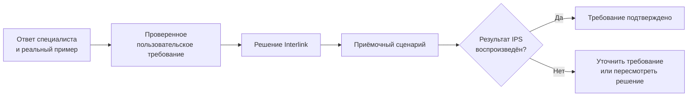

# Вопросы продуктовому специалисту IPS

## Назначение пакета

Этот пакет помогает провести содержательные беседы с продуктовым специалистом IPS и пользователями, с которыми он работает. Цель — не собрать исчерпывающую энциклопедию IPS и не повторить руководства, а выявить поведение, без которого Interlink не сможет считаться полноценной заменой в выбранной области.

Вопрос включён в пакет, если ответ способен изменить хотя бы одно из следующего:

- обязательный пользовательский результат;
- границу ответственности Interlink и внешней системы;
- предметную модель или порядок действий;
- состав и правила переноса данных;
- критерий приёмки либо нагрузочного испытания;
- приоритет дальнейшего развития.

Вопросы о названиях таблиц, программных интерфейсах и внутреннем устройстве не задаются без предметной причины. Продуктовый специалист может не знать технической реализации, зато обычно знает реальные сценарии, ожидания пользователей, исключения и цену ошибки.

Главный смысл схемы: устный ответ сам по себе не закрывает вопрос. Он должен привести к понятному требованию, реальному примеру и способу проверки.

## Как проводить беседу

### Начинать с недавнего реального случая

Лучший вопрос начинается не со слов «поддерживает ли IPS…», а с просьбы разобрать последнюю похожую ситуацию. Например: «Покажите последний заказ, который пришлось пересчитать после изменения состава. Что изменилось, кто принял решение и что осталось неизменным?» Такой разбор выявляет фактическое поведение лучше, чем общий ответ «да, это поддерживается».

### Разделять стандарт IPS и настройку предприятия

Для каждого ответа нужно уточнять, откуда берётся поведение:

- стандартная возможность IPS;
- модуль поставщика;
- настройка конфигуратора базы;
- доработка предприятия;
- внешний расчёт или ручная договорённость пользователей.

Ответ одной установки нельзя автоматически считать обязательным для всех предприятий. Но его нельзя и отбрасывать: он может показывать важную общую потребность, которую стандартный IPS закрывает только локальной настройкой.

### Просить показать исключение и ошибку

После обычного сценария полезно спросить: «Когда это правило не работает?», «Что система делает при конфликте?», «Что пользователь считает опасной ошибкой?» Именно исключения часто определяют архитектуру Interlink и набор испытаний.

### Фиксировать доказательство

Подходящим подтверждением могут быть:

- реальный объект, состав, заказ или завершённое изменение;
- снимок экрана с пояснением контекста;
- выгрузка настройки или правила;
- утверждённый регламент предприятия;
- обезличенный пакет обмена;
- журнал завершённого процесса;
- воспроизводимый пример на тестовой копии IPS.

Конфиденциальные данные не нужно копировать в документацию. Достаточно зафиксировать вид свидетельства, владельца и вывод.

## Как записывать ответ

Для каждого закрываемого вопроса рекомендуется сохранить:

| Поле | Что записать |
|---|---|
| Ответ | Краткая однозначная формулировка без предположений |
| Область действия | Версия IPS, предприятие, подразделение, модуль и роль пользователя |
| Реальный пример | Изделие или процесс, на котором проявляется правило |
| Исключения | Когда действует иначе и кто принимает решение |
| Подтверждение | Какой объект, документ, настройка или эксперимент подтверждает ответ |
| Обязательность | Нужно воспроизвести, можно заменить другим способом либо разрешено вывести из первой поставки |
| Приёмка | Как сравнить результат IPS и Interlink |
| Владелец решения | Кто вправе подтвердить требование со стороны продукта или предприятия |

## Приоритет вопросов

Внутри каждого тематического документа вопросы расположены от наиболее фундаментальных к уточняющим. При планировании конкретного внедрения им можно присвоить один из трёх понятных приоритетов:

- **нужен до проектирования** — без ответа опасно закреплять предметную модель или обещать эквивалентность;
- **нужен до переноса или приёмки** — решение можно проектировать, но нельзя принимать на реальных данных;
- **нужен для дальнейшего развития** — вопрос не блокирует первый сценарий, но влияет на дорожную карту.

## Как не раздувать список

1. Не добавлять новый вопрос, если ответ не изменит решение, перенос, приёмку или приоритет.
2. Уточнение к существующему механизму записывать внутри его вопроса, а не создавать отдельный файл.
3. Не спрашивать обо всех возможностях IPS одинаково подробно: сначала определить реально используемые модули и процессы.
4. Один и тот же вопрос не повторять для каждой роли. Различия ролей перечислять как варианты ответа.
5. Закрытый вопрос не размножать. Ответ переносить в продуктовую базу знаний и заменять им соответствующее допущение.
6. Если функция сознательно выводится из Interlink во внешнюю систему, всё равно зафиксировать пользовательский результат и сквозной способ проверки.

## Состав пакета

1. [Установка IPS, пользователи и обязательная граница](01-installation-users-and-scope.md)
2. [Объекты, версии, жизненный цикл и изменения](02-objects-versions-and-changes.md)
3. [Состав, конфигурация и подбор версий](03-composition-configuration-and-resolution.md)
4. [Документы, САПР, поиск и инженерные службы](04-documents-cad-search-and-specialized-services.md)
5. [Технология, заказы, производство и экземпляры](05-technology-orders-production-and-units.md)
6. [Роли, права, процессы и обмен с другими системами](06-roles-access-workflows-and-integration.md)
7. [Настройка, перенос данных и эксплуатация](07-customization-migration-and-operations.md)
8. [Агенты, цифровые двойники, испытания и развитие](08-agents-digital-twins-testing-and-future.md)

## Рекомендуемый порядок встреч

Для первой серии бесед не нужно проходить весь пакет за один раз.

1. На первой встрече определить установку, пользователей, обязательные сценарии и границу первой поставки по документу 01.
2. На следующих встречах разбирать только реально используемые области из документов 02–07, каждый раз на одном сквозном примере.
3. После фиксации обязательного поведения обсудить испытания и развитие по документу 08.

## Связанные материалы

- [Функциональная база IPS](../knowledge/04-ips-functional-baseline.md)
- [Матрица функционального покрытия](../knowledge/13-capability-coverage.md)
- [Открытые вопросы и риски архитектуры](../knowledge/12-open-questions-and-risks.md)
- [Реестр источников](../knowledge/15-source-register.md)

Основания: [IPS-DOSSIER], [IPS-UNCERTAINTY], [IPS-M01], [IPS-M04], [IL-VISION], [IL-POC]. Расшифровка — в [реестре источников](../knowledge/15-source-register.md).
