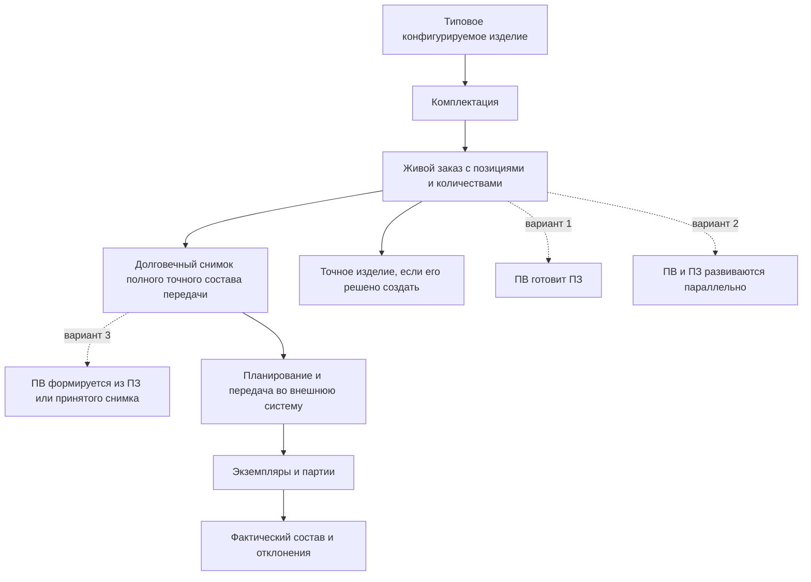
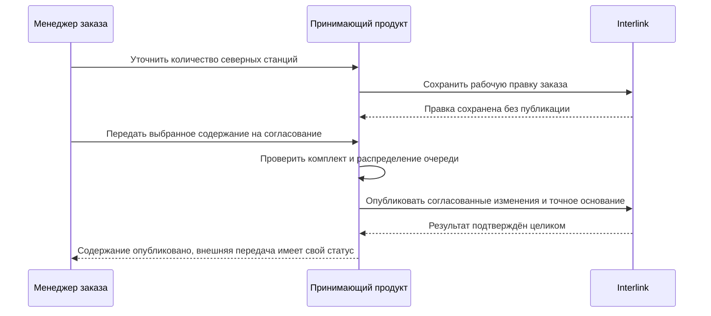

# Общая модель и границы заказного контура

## Какую задачу решает заказ

Заказ связывает желание заказчика или производственный план с инженерными данными предприятия. Он должен ответить не только «что требуется», но и «в каком исполнении, в каком количестве и по какой документации это можно передать дальше».

В машиностроении одной строки с обозначением изделия недостаточно. Насосная станция может иметь северное или тропическое исполнение, станок — разные магазины инструмента и системы охлаждения, редуктор — несколько действующих версий узлов. К заказу могут добавляться отдельные запасные части, монтажные комплекты и документация.

IPS объединяет эти потребности в производственном заказе и связанных механизмах. Interlink сохраняет результат, но разделяет данные, которые раньше легко воспринимались как один объект.

## Карта предметных состояний

Каждый блок отвечает на собственный вопрос:

- типовое изделие описывает все разрешённые возможности;
- комплектация сохраняет повторно используемые значения части опций;
- живой заказ описывает текущую потребность;
- долговечный снимок заказа фиксирует полный точный состав официальной передачи;
- точное изделие создаёт самостоятельное повторно используемое изделие;
- производственная ведомость проходит собственный выпуск;
- экземпляр или партия представляет физическое исполнение.

## Как устроен заказ в IPS

В IPS заказ содержит позиции, которые нужны заказчику или производственному плану: конкретные комплектации изделий, отдельные изделия и комплекты запасных частей. Количество относится к позиции. Поверх конструкторского состава могут учитываться технология, материалы, трудоёмкость и данные для передачи в учётную систему.

Документация IPS также описывает более широкий производственный заказ: при его формировании учитываются правила подбора версий, контексты, головное изделие, серия, дата, опции, допустимые замены, аналоги и маршруты. Трассировка сообщает о недостающих значениях и неоднозначных решениях.

Конкретные установки IPS и процессы предприятий могут отличаться. В частности, связь производственной ведомости (ПВ), производственного заказа (ПЗ) и снимка нужно подтвердить при обследовании. Поддерживаются три возможных варианта: ПВ готовит ПЗ; ПВ и ПЗ развиваются параллельно; ПВ формируется из подготовленного ПЗ или принятого снимка. Ни один из вариантов не объявляется универсальным заранее.

В исследованной установке IPS цены, сроки, склады и полноценный портфель заказов не относились к стандартной инженерной модели заказа; дополнительные атрибуты могли настраиваться отдельно. Это наблюдение одной практики, а не универсальное ограничение всех установок. Историческое основание отмечено в реестре источников; конкретный профиль предприятия проверяется при обследовании.

## Решение Interlink

Interlink не вводит универсальный встроенный тип «Заказ» для всех предприятий. Заказ объявляется в корпоративной модели как обычный версионируемый объект. Это позволяет разным предприятиям иметь свои реквизиты и виды заказов, не превращая сроки, цены или отраслевые состояния в обязательные понятия ядра.

Ядро даёт заказу общие строительные блоки:

- устойчивую идентичность и версии;
- позиции состава с количествами и другими предметными данными;
- работу над изменением;
- подбор версий и применяемость;
- условия включения позиций;
- точную адресацию места использования;
- долговечный снимок полного точного состава каждой передачи.

Принимающая система и предметные модули добавляют карточку заказа, процесс согласования, роли, сроки, цены, статусы, расчёт мощностей, связь с клиентом и интеграции.

### Что именно сохраняется и публикуется

Инженерная версия заказа — принятая предприятием ступень его развития, например «Заказ насосов, версия Б». У неё есть рабочее содержание и последовательность опубликованных неизменяемых состояний. Исправляя количество или комментарий, пользователь сначала сохраняет рабочую правку. Публикация создаёт новое состояние выбранной версии; новую инженерную версию создают только тогда, когда этого требует предметное правило предприятия. Поэтому не всякое нажатие «Сохранить» рождает новую официальную версию.

Рабочая область отвечает за незавершённую работу. [Контекст подбора](../version-selection/21-selection-contexts.md) отвечает за сохранённые выборы версий и условия их использования. Пакет изменения отвечает за совместную публикацию согласованного набора правок. Контекст заказа может жить дольше одного пакета, а пробный расчёт не обязан создавать пакет только ради просмотра.

### Рабочий ПЗ и готовая область передачи

Подготовленный ПЗ может ещё содержать несколько вариантов замен и маршрутов. Так технолог способен сохранить результат формирования, передать снабжению выбор поставщика и продолжить работу позже. Это не ошибка хранения и не обещание готовности производства. Для официальной выдачи выбирают конкретную область — очередь, комплект или диапазон изделий — и снимают неопределённость именно в ней.

Плановые партии и экземпляры могут создаваться отдельным действием формирования ПЗ по правилам IPS-профиля. Их существование означает подготовку учёта, а не физическое изготовление. Ни количество строки, ни публикация снимка сами по себе не являются подтверждённой установкой компонентов.

## Пример 1. Заказ на редукторы и запасные части

Заказчик запрашивает десять редукторов `РЦ-250` стандартного исполнения и два комплекта запасных частей. Заказ содержит две позиции:

- «Редуктор РЦ-250, стандартное горизонтальное исполнение» — 10 штук;
- «Комплект ЗИП для РЦ-250 на два года эксплуатации» — 2 комплекта.

Комплект ЗИП является самостоятельной поставочной позицией. Его нельзя считать невидимой частью каждого редуктора: количество, упаковка и состав определяются отдельно.

Пока заказ уточняется, новые утверждённые версии стандартных деталей могут попадать в живой состав. Перед внешней доставкой производству публикуется долговечный снимок заказа, в котором зафиксированы версии всех деталей и состав обоих комплектов ЗИП.

## Пример 2. Индивидуальный обрабатывающий центр

Заказ на станок `ОЦ-800` включает полное ограждение, магазин на 60 инструментов, внутреннее охлаждение и измерительный щуп. Эти значения не создают четыре новых версии типового станка. Они являются условиями конкретной позиции заказа.

Если предприятие ожидает повторные продажи такой конфигурации, оно может сохранить комплектацию «ОЦ-800 для обработки корпусов». Если исполнение должно стать самостоятельным обозначением с собственной историей и документацией, отдельно создаётся точное изделие. Сам заказ не обязан автоматически порождать его.

## Пример 3. Партия насосных станций для двух площадок

Один договор включает три насосные станции для северной площадки и две — для южной. В заказе это две позиции одного типового изделия с разными наборами условий. Северная позиция включает обогрев шкафа и морозостойкие уплотнения, южная — усиленную вентиляцию и другой материал наружных кабелей.

Объединить позиции только по обозначению нельзя: их точные составы различаются. В данном процессе индивидуальные номера назначаются позднее, поэтому на стадии заказа достаточно двух позиций с количествами 3 и 2 и двух однозначных конфигураций.

В данном примере предприятие решает назначить индивидуальные номера позднее. Другое предприятие вправе заранее создать пять плановых экземпляров. Различие состоит не в запрете раннего создания, а в том, что таким экземплярам нельзя приписать уже выполненные испытания или изготовление.

## Таблицы, замены и совместимость — общие средства, не скрытые поля заказа

Заказ использует [справочные таблицы](../tabular-data/01-reference-tables.md) для сортамента и норм, [координатные карты](../tabular-data/03-coordinate-maps.md) для поиска изделия по нескольким признакам и [правила совместимости](../substitution-and-compatibility/02-compatibility-matrices.md) для проверки комплекта. Хранение обеспечивает точную редакцию, поиск и историю; технологический модуль определяет смысл норм и допустимость использования. Импорт из внешнего справочника сохраняет происхождение и не меняет карточки заказа без отдельного решения.

Аналогично, разрешённый комплект замены хранится в [библиотеке альтернатив](../substitution-and-compatibility/01-allowed-replacements.md), а заказ хранит собственный выбор и его область. Предприятие может предложить несколько пересекающихся комплектов. Конфликт возникает не от самого существования предложений, а если выбранные действия снимают одну деталь дважды либо уничтожают узел, который обязан сохраниться для другого комплекта.

## Что находится вне ядра Interlink

Следующие функции могут быть частью готового продукта над Interlink, но не являются универсальной семантикой ядра:

- коммерческое предложение, цена, скидка и налоги;
- договор, график поставки и отгрузка;
- складские остатки и резервирование;
- планирование мощностей и календарей;
- расчёт себестоимости;
- состояние исполнения цехом;
- платёжные и логистические документы;
- интерфейс мастера создания заказа;
- подписи и задачи согласования.

Разделение не означает отказ от этих функций. Оно означает, что их владелец — прикладная система, ERP/MES или отдельный предметный модуль.

## Что изменяется относительно IPS

| IPS | Interlink |
|---|---|
| Заказ и его производственные представления могли выглядеть как единый большой контур | заказ, снимок передачи, ПВ и фактическое изделие явно различаются |
| Поведение могло зависеть от настроек модуля и пользовательского окна | существенные условия относятся к конкретному расчёту или передаче |
| Производственные сведения могли копироваться внутрь заказа | точный результат фиксируется отдельным свидетельством, а производные документы имеют собственных владельцев |
| Границы с учётной системой зависели от внедрения | ядро явно не присваивает себе цены, склады, мощности и исполнение |

## Вопросы для конкретной установки IPS

- Какие виды заказов реально используются и чем они различаются?
- Есть ли в заказе цены, сроки, состояния и клиентские реквизиты либо они приходят извне?
- Является ли заказ одновременно сбытовым и производственным?
- Какие отдельные поставочные комплекты входят в заказ?
- Какие данные копируются в заказ, а какие вычисляются при открытии?
- Что считается официальной передачей и сколько таких передач бывает?

## Критерии приёмки

1. Пользователь различает живой заказ, точный снимок, ПВ и физический экземпляр.
2. Несколько исполнений одного изделия представлены отдельными позициями с собственными условиями и количествами.
3. Добавление ЗИП не требует превращать его в скрытую ветвь головного изделия.
4. Продуктовые поля предприятия добавляются без изменения универсального ядра.
5. Ранее переданный результат не меняется после развития исходного изделия.

## Кто создаёт официальный результат

Пользователь видит один рабочий путь, но приложение не объединяет разные события одним признаком «готово». Сохранённая рабочая правка может содержать открытые вопросы. Публикация выбранной области требует их закрытия и не означает приёма ERP/MES. Если обязательная часть общей операции не проходит проверку, локальный официальный результат не появляется частично.

## Состояние реализации

Граница «заказ — модель предприятия, процесс — принимающая система» и снимок каждой передачи приняты как решения Interlink. Готового заказного модуля, конфигуратора, бизнес-снимка и производственного процесса в текущем срезе нет.

## Связанные документы

- [Позиции и количества заказа](02-order-lines-and-quantities.md)
- [Жизненный цикл живого заказа](04-live-order-lifecycle.md)
- [Точный состав и публикации](05-exact-publication.md)

## Основания и проверка источников

Основания: [IPS-A13], [IPS-M03], [IL-ORDERS], [IL-KERNEL], [IL-NEUTRAL], [IL-DATA-MODEL]. Расшифровка и статус материалов — в [реестре источников](../knowledge/15-source-register.md).

Описание IPS относится к подтверждённым материалам и явно указанным профилям установки. Целевое поведение Interlink сверено с принятыми договорами на 6 сентября 2026 года; наличие этого описания не означает приёмки реализации.
