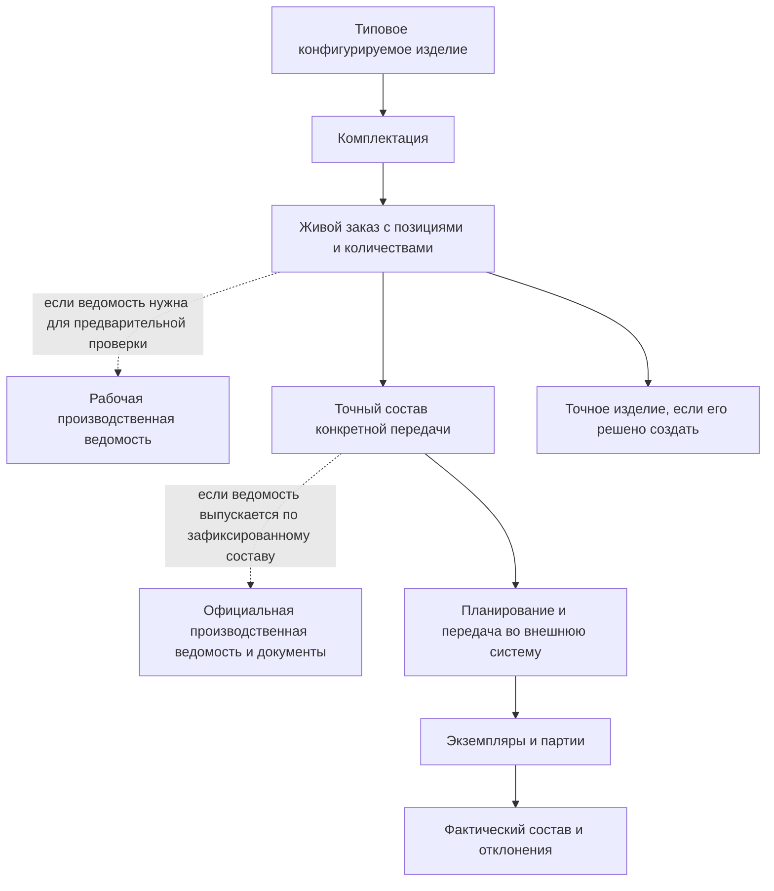

# Общая модель и границы заказного контура

## Какую задачу решает заказ

Заказ связывает желание заказчика или производственный план с инженерными данными предприятия. Он должен ответить не только «что требуется», но и «в каком исполнении, в каком количестве и по какой документации это можно передать дальше».

В машиностроении одной строки с обозначением изделия недостаточно. Насосная станция может иметь северное или тропическое исполнение, станок — разные магазины инструмента и системы охлаждения, редуктор — несколько действующих версий узлов. К заказу могут добавляться отдельные запасные части, монтажные комплекты и документация.

IPS объединяет эти потребности в производственном заказе и связанных механизмах. Interlink сохраняет результат, но разделяет данные, которые раньше легко воспринимались как один объект.

## Карта предметных состояний

Пунктирные ветви не требуют двух ведомостей. Они показывают допустимые варианты процесса: на одном предприятии производственная ведомость помогает проверить потребность до публикации снимка; на другом выпускается по уже зафиксированному составу; возможны рабочая и официальная редакции. Конкретный порядок нужно подтвердить для установки IPS и закрепить в принимающем продукте.

Каждый блок отвечает на собственный вопрос:

- типовое изделие описывает все разрешённые возможности;
- комплектация сохраняет повторно используемые значения части опций;
- живой заказ описывает текущую потребность;
- точный снимок доказывает, что именно было передано;
- точное изделие создаёт самостоятельное повторно используемое изделие;
- производственная ведомость проходит собственный выпуск;
- экземпляр или партия представляет физическое исполнение.

## Как устроен заказ в IPS

В исследованной практике IPS заказ содержит позиции, которые хочет заказчик: конкретные комплектации изделий, отдельные изделия и комплекты запасных частей. Количество относится к позиции. Поверх конструкторского состава учитываются технология, материалы, трудоёмкость и данные для передачи в 1С.

Документация IPS также описывает более широкий производственный заказ: при его формировании учитываются правила подбора версий, контексты, головное изделие, серия, дата, опции, допустимые замены, аналоги и маршруты. Трассировка сообщает о недостающих значениях и неоднозначных решениях.

Конкретная установка может отличаться. В изученном внедрении цен, сроков, состояния заказа, складов и полноценного портфеля заказов не было. Эти данные относились к производственной или учётной системе, хотя дополнительные атрибуты в IPS могли быть настроены.

## Решение Interlink

Interlink не вводит универсальный встроенный тип «Заказ» для всех предприятий. Заказ объявляется в корпоративной модели как обычный версионируемый объект. Это позволяет разным предприятиям иметь свои реквизиты и виды заказов, не превращая сроки, цены или отраслевые состояния в обязательные понятия ядра.

Ядро даёт заказу общие строительные блоки:

- устойчивую идентичность и версии;
- позиции состава с количествами и другими предметными данными;
- работу над изменением;
- подбор версий и применяемость;
- условия включения позиций;
- точную адресацию места использования;
- неизменяемый снимок каждой передачи.

Принимающая система и предметные модули добавляют карточку заказа, процесс согласования, роли, сроки, цены, статусы, расчёт мощностей, связь с клиентом и интеграции.

## Пример 1. Заказ на редукторы и запасные части

Заказчик запрашивает десять редукторов `РЦ-250` стандартного исполнения и два комплекта запасных частей. Заказ содержит две позиции:

- «Редуктор РЦ-250, стандартное горизонтальное исполнение» — 10 штук;
- «Комплект ЗИП для РЦ-250 на два года эксплуатации» — 2 комплекта.

Комплект ЗИП является самостоятельной поставочной позицией. Его нельзя считать невидимой частью каждого редуктора: количество, упаковка и состав определяются отдельно.

Пока заказ уточняется, новые утверждённые версии стандартных деталей могут попадать в живой состав. В момент передачи производству создаётся точный снимок, в котором зафиксированы версии всех деталей и состав обоих комплектов ЗИП.

## Пример 2. Индивидуальный обрабатывающий центр

Заказ на станок `ОЦ-800` включает полное ограждение, магазин на 60 инструментов, внутреннее охлаждение и измерительный щуп. Эти значения не создают четыре новых версии типового станка. Они являются условиями конкретной позиции заказа.

Если предприятие ожидает повторные продажи такой конфигурации, оно может сохранить комплектацию «ОЦ-800 для обработки корпусов». Если исполнение должно стать самостоятельным обозначением с собственной историей и документацией, отдельно создаётся точное изделие. Сам заказ не обязан автоматически порождать его.

## Пример 3. Партия насосных станций для двух площадок

Один договор включает три насосные станции для северной площадки и две — для южной. В заказе это две позиции одного типового изделия с разными наборами условий. Северная позиция включает обогрев шкафа и морозостойкие уплотнения, южная — усиленную вентиляцию и другой материал наружных кабелей.

Объединить позиции только по обозначению нельзя: их точные составы различаются. В то же время создавать пять физических экземпляров на стадии заказа преждевременно. Достаточно двух позиций с количествами 3 и 2 и двух однозначных конфигураций.

## Что находится вне ядра Interlink

Следующие функции могут быть частью готового продукта над Interlink, но не являются универсальной семантикой ядра:

- коммерческое предложение, цена, скидка и налоги;
- договор, график поставки и отгрузка;
- складские остатки и резервирование;
- планирование мощностей и календарей;
- расчёт себестоимости;
- состояние исполнения цехом;
- платёжные и логистические документы;
- интерфейс мастера создания заказа;
- подписи и задачи согласования.

Разделение не означает отказ от этих функций. Оно означает, что их владелец — прикладная система, ERP/MES или отдельный предметный модуль.

## Что изменяется относительно IPS

| IPS | Interlink |
|---|---|
| Заказ и его производственные представления могли выглядеть как единый большой контур | заказ, снимок передачи, ПВ и фактическое изделие явно различаются |
| Поведение могло зависеть от настроек модуля и пользовательского окна | существенные условия относятся к конкретному расчёту или передаче |
| Производственные сведения могли копироваться внутрь заказа | точный результат фиксируется отдельным свидетельством, а производные документы имеют собственных владельцев |
| Границы с учётной системой зависели от внедрения | ядро явно не присваивает себе цены, склады, мощности и исполнение |

## Вопросы для конкретной установки IPS

- Какие виды заказов реально используются и чем они различаются?
- Есть ли в заказе цены, сроки, состояния и клиентские реквизиты либо они приходят извне?
- Является ли заказ одновременно сбытовым и производственным?
- Какие отдельные поставочные комплекты входят в заказ?
- Какие данные копируются в заказ, а какие вычисляются при открытии?
- Что считается официальной передачей и сколько таких передач бывает?

## Критерии приёмки

1. Пользователь различает живой заказ, точный снимок, ПВ и физический экземпляр.
2. Несколько исполнений одного изделия представлены отдельными позициями с собственными условиями и количествами.
3. Добавление ЗИП не требует превращать его в скрытую ветвь головного изделия.
4. Продуктовые поля предприятия добавляются без изменения универсального ядра.
5. Ранее переданный результат не меняется после развития исходного изделия.

## Состояние реализации

Граница «заказ — модель предприятия, процесс — принимающая система» и снимок каждой передачи приняты ADR-052. Готового заказного модуля, конфигуратора, бизнес-снимка и производственного процесса в текущем срезе Interlink нет.

## Связанные документы

- [Позиции и количества заказа](02-order-lines-and-quantities.md)
- [Жизненный цикл живого заказа](04-live-order-lifecycle.md)
- [Точный состав и публикации](05-exact-publication.md)

Основания: [IPS-A13], [IPS-M03], [IL-ADR ADR-052], [IL-PLM §5], [IL-HOST §8]. Расшифровка — в [реестре источников](../knowledge/15-source-register.md).
