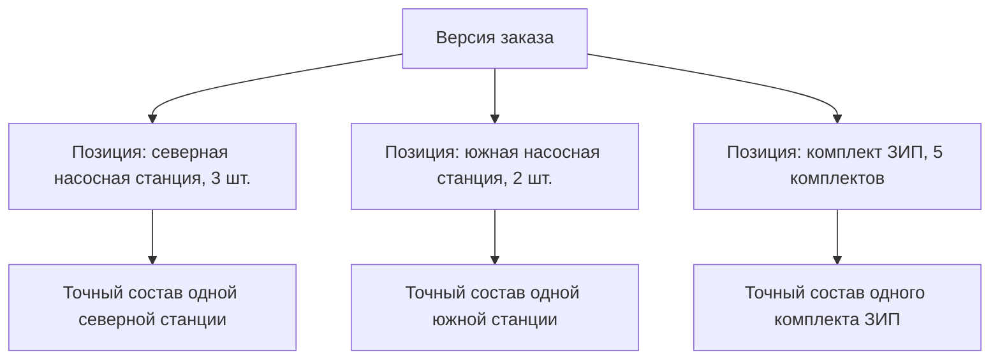

# Позиции заказа, количества и несколько изделий

## Почему заказ является составом

Один заказ может включать несколько разных изделий, несколько исполнений одного изделия, отдельную оснастку, монтажные комплекты и ЗИП. Поэтому заказ естественно представляется как версионируемый состав: версия заказа является родителем, а каждая потребность — отдельной позицией.

Внутреннее понятие Interlink `Occurrence` означает именно позицию состава — конкретное место, где изделие включено в данную версию заказа. Для продуктового специалиста важны номер позиции, изделие, количество, единица и условия комплектации, а не технический идентификатор строки.

## Что хранится на позиции заказа

Минимально позиция должна содержать:

- понятный номер или порядок строки;
- требуемое изделие либо поставочный комплект;
- количество и единицу измерения;
- выбранную комплектацию или значения опций;
- при необходимости точную фиксацию версии;
- сведения, специфичные для заказа, например примечание или назначение;
- устойчивую связь с тем же местом между версиями заказа.

Цена, срок и коммерческое состояние могут быть добавлены корпоративной моделью, но не являются обязательными полями Interlink.

Количество позиции не требует дублировать одинаковое дерево три или пять раз. Точный состав описывает одну единицу поставочного результата, а количество сообщает, сколько таких результатов требуется.

## Несколько верхнеуровневых изделий

В IPS мастер заказа позволяет добавить несколько объектов. Interlink сохраняет эту возможность без искусственного создания конструкторской сборки «Заказ». Корнем является реальный предметный объект заказа, а его позиции ведут к изделиям.

Такой подход позволяет одновременно заказать станок, комплект сменной оснастки и два запасных шпинделя. Они не обязаны образовывать одно инженерное изделие, но образуют одну договорную или производственную потребность.

## Пример 1. Экскаваторы разных исполнений

Заказ включает:

- экскаватор карьерный, тропическое исполнение — 3 штуки;
- тот же экскаватор, северное исполнение — 2 штуки;
- ковш усиленный — 3 штуки;
- комплект ЗИП — 5 комплектов.

Два исполнения экскаватора нельзя объединить в одну строку количеством 5: их составы различаются. Три тропических машины можно оставить одной позицией количеством 3, пока не требуется назначать серийные номера и фиксировать индивидуальные отклонения.

Ковш и ЗИП являются самостоятельными позициями. Они могут иметь собственные составы, правила подбора версий и упаковку.

## Пример 2. Станок и отдельно поставляемая оснастка

Заказчик приобретает один обрабатывающий центр, два поворотных стола и десять комплектов зажимных кулачков. Поворотные столы устанавливаются позже и поставляются отдельно.

Если включить их обычными дочерними деталями станка, производственная ведомость может ошибочно посчитать их установленными в станок. Поэтому заказ хранит отдельные позиции поставки, а связь «поставляется отдельно» имеет собственный предметный смысл.

В точной передаче должны сохраняться версии станка, столов и кулачков, но топология поставки остаётся отличной от конструкторского состава станка.

## Пример 3. Количество по ветви редуктора

Заказ содержит 10 редукторов. В каждом редукторе установлено 2 одинаковых подшипника, а в каждом подшипниковом узле используется 4 болта.

Расчёт должен различать:

- количество болтов в одной позиции узла — 4;
- количество болтов по одной ветви редуктора — 8;
- количество болтов на заказ — 80.

Недостаточно показать только суммарные 80 штук. Для проверки и передачи технологии нужен путь, по которому получилось количество: заказ → редуктор → два узла → четыре болта.

## Пример 4. Одинаковая подсборка в двух местах

В насосной станции один типовой шкаф применяется для основного и резервного насоса. Условия эксплуатации ветвей различаются, поэтому внутри первого шкафа может быть выбран один нагреватель, а внутри второго — другой.

Ссылка только на обозначение шкафа не различает места. Interlink использует полный путь позиций от заказа до конкретного шкафа. Это позволяет сохранить разные решения и правильно посчитать количество каждого нагревателя.

## Когда позиция должна стать самостоятельным объектом

По умолчанию позиция заказа остаётся частью версии заказа. Отдельный версионируемый объект строки нужен только при доказанной самостоятельной жизни, например если строка:

- имеет номер, существующий независимо от заказа;
- переносится между заказами как единая сущность;
- проходит отдельное согласование и имеет собственные права;
- должна сохранять историю после удаления из всех версий заказа.

Частичное исполнение или отмена сами по себе не требуют превращать строку в отдельный объект: их можно регистрировать относительно точной позиции опубликованной передачи.

## Изменение позиции

Количество, изделие и комплектация изменяются только в новой рабочей версии заказа. Если предыдущая версия уже была передана, её снимок остаётся неизменным.

Например, увеличение количества редукторов с 10 до 12 создаёт новую версию заказа. Следующая передача содержит 12, но первая продолжает доказывать, что на тот момент было передано 10.

## Открытые вопросы

- Какие единицы измерения разрешены на позициях конкретного предприятия?
- Может ли одна позиция содержать диапазон количества или только точное значение?
- Как оформляется поставка комплектами, когда внутренние количества зависят от исполнения?
- Какие строки имеют самостоятельный жизненный цикл?
- Как отражаются частичная отмена, разделение поставки и перенос между сроками?
- Требуется ли отдельный номер позиции сохранять между версиями заказа?

## Критерии приёмки

1. Один заказ содержит несколько разных изделий и несколько исполнений одного изделия.
2. Количество одной конфигурации не создаёт лишние копии дерева и преждевременные экземпляры.
3. Кумулятивное количество объясняется по пути до позиции.
4. Одинаковая подсборка в разных ветвях получает независимые решения.
5. Удаление строки из новой версии не удаляет её из старой передачи.
6. Отдельно поставляемый комплект не смешивается с установленным составом изделия.

## Состояние реализации

Позиция заказа как обычное вхождение принята ADR-052. Устойчивая нить и путь позиции зафиксированы контрактами, но заказная модель, расчёт количеств и пользовательские операции относятся к последующим предметным этапам.

## Связанные документы

- [Комплектации и точное изделие](03-configuration-and-exact-product.md)
- [Точный состав передачи](05-exact-publication.md)
- [Экземпляры и партии](09-units-lots-and-as-built.md)

Основания: [IPS-A05], [IPS-A13], [IL-ADR ADR-050, ADR-052], [IL-PLM §5]. Расшифровка — в [реестре источников](../knowledge/15-source-register.md).
