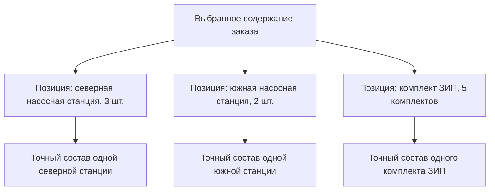
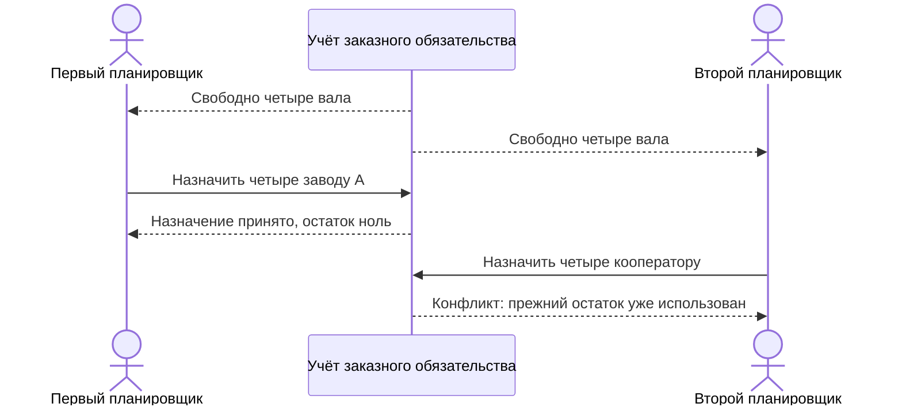

# Позиции заказа, количества и несколько изделий

> Описана целевая модель по состоянию на 6 сентября 2026 года. Это план заказного модуля, а не перечень уже доступных функций.

## Почему заказ является составом

Один заказ может включать несколько разных изделий, несколько исполнений одного изделия, отдельную оснастку, монтажные комплекты и ЗИП. Поэтому инженерный заказ естественно представляется как версионируемый состав: его рабочие данные или опубликованное состояние содержат отдельные позиции потребности. Это не требование вести любую коммерческую заявку как конструкторский документ: коммерческая история может оставаться в ERP.

Позиция состава — конкретное место, где изделие включено в заказ. Для продуктового специалиста важны номер позиции, изделие, количество, единица и условия комплектации, а не технический идентификатор строки. Позиция сохраняет свою связь с прежними состояниями заказа даже при переносе строки на другое место экрана.

## Что хранится на позиции заказа

Минимально позиция должна содержать:

- понятный номер или порядок строки;
- требуемое изделие либо поставочный комплект;
- количество и единицу измерения;
- выбранную комплектацию или значения опций;
- при необходимости жёсткое закрепление инженерной версии либо точную ссылку на её опубликованное состояние;
- сведения, специфичные для заказа, например примечание или назначение;
- устойчивую связь с тем же местом между версиями заказа.

Цена, срок и коммерческое состояние могут быть добавлены корпоративной моделью, но не являются обязательными полями Interlink.

Перечень описывает содержание подготовленной позиции, а не запрет незавершённой работы. Если совместимый сценарий подготовки ПЗ разрешает ещё не заданное количество, оно сохраняется с предупреждением и отличается от нуля. Перед строгой выдачей выбранной области количество и единица должны стать определёнными; система не заполняет их догадкой.

Два вида закрепления различаются. Запись «редуктор, инженерная версия 05» оставляет возможность читать последующее опубликованное состояние этой же версии по заданному правилу. Запись «редуктор, версия 05, состояние, утверждённое 12 августа» фиксирует именно содержание. Для официальной передачи недостаточно удержать только номер инженерной версии.

Количество позиции не требует дублировать одинаковое дерево три или пять раз. Точный состав описывает одну единицу поставочного результата, а количество сообщает, сколько таких результатов требуется.

## Несколько верхнеуровневых изделий

В IPS мастер заказа позволяет добавить несколько объектов. Interlink сохраняет эту возможность без искусственного создания конструкторской сборки «Заказ». Корнем является реальный предметный объект заказа, а его позиции ведут к изделиям.

Такой подход позволяет одновременно заказать станок, комплект сменной оснастки и два запасных шпинделя. Они не обязаны образовывать одно инженерное изделие, но образуют одну договорную или производственную потребность.

## Пример 1. Экскаваторы разных исполнений

Заказ включает:

- экскаватор карьерный, тропическое исполнение — 3 штуки;
- тот же экскаватор, северное исполнение — 2 штуки;
- ковш усиленный — 3 штуки;
- комплект ЗИП — 5 комплектов.

Два исполнения экскаватора нельзя объединить в одну строку количеством 5: их составы различаются. Три тропических машины можно оставить одной позицией количеством 3, пока не требуется назначать серийные номера и фиксировать индивидуальные отклонения.

Ковш и ЗИП являются самостоятельными позициями. Они могут иметь собственные составы, правила подбора версий и упаковку.

## Пример 2. Станок и отдельно поставляемая оснастка

Заказчик приобретает один обрабатывающий центр, два поворотных стола и десять комплектов зажимных кулачков. Поворотные столы устанавливаются позже и поставляются отдельно.

Если включить их обычными дочерними деталями станка, производственная ведомость может ошибочно посчитать их установленными в станок. Поэтому заказ хранит отдельные позиции поставки, а связь «поставляется отдельно» имеет собственный предметный смысл.

В точной передаче должны сохраняться версии станка, столов и кулачков, но топология поставки остаётся отличной от конструкторского состава станка.

## Пример 3. Количество по ветви редуктора

Заказ содержит 10 редукторов. В каждом редукторе два одинаковых подшипниковых узла, а в каждом узле используется 4 болта.

Расчёт должен различать:

- количество болтов в одной позиции узла — 4;
- количество болтов по одной ветви редуктора — 8;
- количество болтов на заказ — 80.

Недостаточно показать только суммарные 80 штук. Для проверки и передачи технологии нужен путь, по которому получилось количество: заказ → редуктор → два узла → четыре болта.

## Пример 4. Одинаковая подсборка в двух местах

В насосной станции один типовой шкаф применяется для основного и резервного насоса. Условия эксплуатации ветвей различаются, поэтому внутри первого шкафа может быть выбран один нагреватель, а внутри второго — другой.

Ссылка только на обозначение шкафа не различает места. Interlink использует полный путь позиций от выбранного корня до конкретного шкафа. Для точной передачи к нему добавляются сам зафиксированный комплект и его корень: «Передача первой очереди → станция № 2 → резервный насос → шкаф → нагреватель». Это позволяет сохранить разные решения и правильно посчитать количество каждого нагревателя. Совпадающий путь в другой передаче не считается тем же историческим местом.

## Когда позиция должна стать самостоятельным объектом

По умолчанию позиция заказа остаётся частью версии заказа. Отдельный версионируемый объект строки нужен только при доказанной самостоятельной жизни, например если строка:

- имеет номер, существующий независимо от заказа;
- переносится между заказами как единая сущность;
- проходит отдельное согласование и имеет собственные права;
- должна сохранять историю после удаления из всех версий заказа.

Частичное исполнение или отмена сами по себе не требуют превращать строку в отдельный объект: их можно регистрировать относительно точной позиции опубликованной передачи.

## Изменение позиции

Количество, изделие и комплектация меняются в рабочей области. Обычное сохранение не публикует заказ: остальные продолжают видеть прежнее опубликованное состояние, если им явно не открыт совместный рабочий просмотр. После проверки отдельное проведение публикует новое неизменяемое состояние. Новая инженерная версия заказа создаётся только тогда, когда этого требует предметное решение предприятия, а не после каждой правки количества.

Например, увеличение количества редукторов с 10 до 12 сначала сохраняется как рабочее предложение. После проведения следующая передача может содержать полный план на 12 или отдельную добавку на 2 — этот смысл задаётся явно. Первая передача продолжает доказывать, что на тот момент было передано 10.

## Почему новое состояние не освобождает количество заново

Учёт потребности продолжается между состояниями заказа. Если из десяти насосов шесть уже приняты заводом, а ответ по двум ещё не получен, при уменьшении заказа до восьми свободного количества нет. Неизвестный исход двух насосов не означает, что их можно поручить другому заводу. Сначала нужно установить результат прежней передачи.

Два планировщика могут одновременно видеть остаток четыре. При применении назначения система проверяет общий итог: первый назначает четыре кооператору, а второй получает конфликт и обновлённый остаток, а не второе разрешение ещё на четыре. При разделении строки между очередями сохраняется явная связь старого и нового учёта; переименование строки не обнуляет обязательство.

Перед тем как перейти к табличному экрану, полезно увидеть разницу между показанным остатком и подтверждённым назначением:

Оба пользователя могли честно увидеть одни и те же сведения. Ошибка предотвращается в момент применения назначения: новый документ или открытое окно не создают второй независимый остаток. При повторе уже принятого действия система возвращает прежний результат, а не ещё одно назначение.

## Табличное представление заказных вариантов

Для партии шкафов удобно показывать количества по осям «мощность привода × напряжение × климатическое исполнение». Это представление заказных строк, а не обещание, что предприятие выпускает каждое сочетание. [Координатная карта](../tabular-data/03-coordinate-maps.md) может сопоставить заполненной комбинации допустимое изделие, а [правила совместимости](../substitution-and-compatibility/02-compatibility-matrices.md) отдельно проверят её применимость. Пустая клетка не превращается в нулевой заказ или автоматический запрет: пользователь должен различать «не заказано», «сопоставление не задано» и «сочетание запрещено».

## Открытые вопросы

- Какие единицы измерения разрешены на позициях конкретного предприятия?
- Может ли одна позиция содержать диапазон количества или только точное значение?
- Как оформляется поставка комплектами, когда внутренние количества зависят от исполнения?
- Какие строки имеют самостоятельный жизненный цикл?
- Как отражаются частичная отмена, разделение поставки и перенос между сроками?
- Требуется ли отдельный номер позиции сохранять между версиями заказа?

## Критерии приёмки

1. Один заказ содержит несколько разных изделий и несколько исполнений одного изделия.
2. Количество одной конфигурации не создаёт лишние копии дерева или экземпляры автоматически; плановые экземпляры могут создаваться отдельным действием по профилю предприятия.
3. Кумулятивное количество объясняется по пути до позиции.
4. Одинаковая подсборка в разных ветвях получает независимые решения.
5. Удаление строки из нового состояния не удаляет её из старой передачи.
6. Отдельно поставляемый комплект не смешивается с установленным составом изделия.
7. Новое состояние заказа сохраняет прежние обязательства; одновременное распределение и неизвестный приём не создают лишнего свободного количества.
8. Табличная перестановка строк и осей не меняет смысла позиции, а ошибка сопоставления не заменяется первым подходящим изделием.

## Состояние реализации

Позиция заказа как обычное вхождение принята в целевой модели Interlink. Устойчивая нить и путь позиции зафиксированы контрактами, но заказная модель, расчёт количеств и пользовательские операции относятся к последующим предметным этапам.

## Связанные документы

- [Комплектации и точное изделие](03-configuration-and-exact-product.md)
- [Точный состав передачи](05-exact-publication.md)
- [Экземпляры и партии](09-units-lots-and-as-built.md)
- [Независимые контексты выбора](../version-selection/21-selection-contexts.md)
- [Многомерные таблицы](../tabular-data/02-multidimensional-tables.md)

## Основания и актуальность

Материалы IPS: [IPS-A05], [IPS-A13]. Действующая целевая модель: [IL-ORDERS], [IL-KERNEL], [IL-SC], [IL-TD], [IL-DATA-MODEL], [IL-PLAN-V2]. История первоначального решения о позициях: [IL-ADR ADR-050, ADR-052], [IL-PLM §5]; ранние формулировки читаются с учётом пересмотра версии и состояния. Расшифровка и границы достоверности — в [реестре источников](../knowledge/15-source-register.md). Продуктовая редакция сверена с нормативной документацией Interlink на 6 сентября 2026 года; наличие принятых контрактов не означает готовность всего пользовательского процесса.
