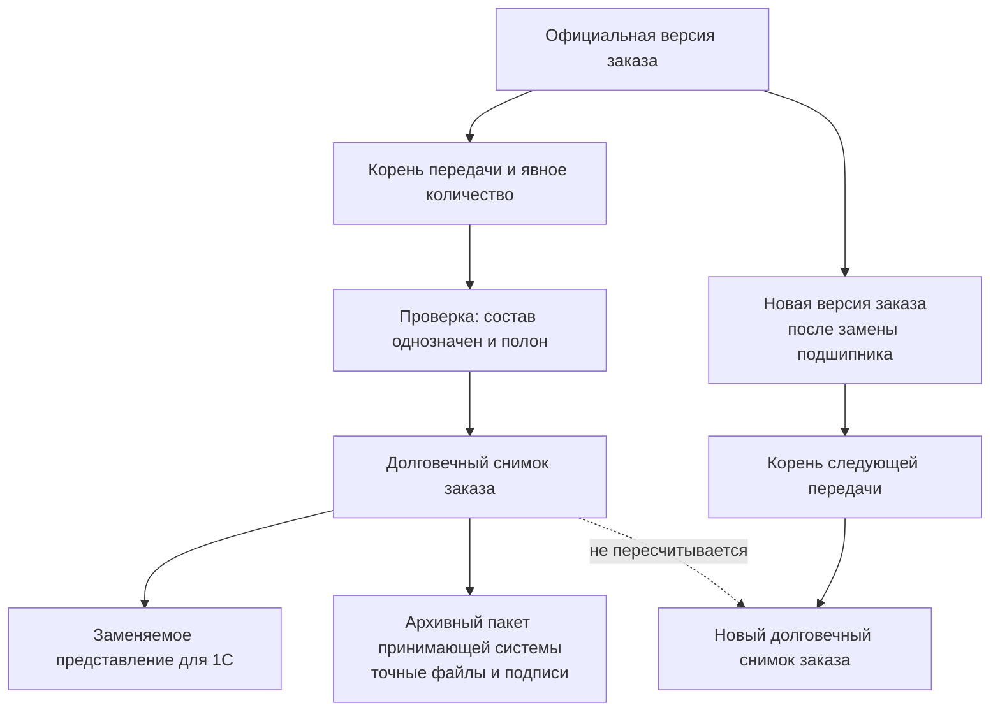

# Точный состав и публикации заказа

## Зачем нужен отдельный снимок передачи

Живой заказ отвечает на вопрос: «Что предприятие сейчас собирается изготовить или поставить?» Точный снимок отвечает на другой вопрос: «Какой полный точный состав официально опубликован для этой конкретной передачи?» Факт успешной доставки и приёма внешней системой фиксируется отдельно после публикации.

Эти ответы нельзя хранить только в одном изменяемом представлении. После выпуска новых версий изделия, правил комплектации или маршрутов сегодняшний результат может отличаться от вчерашнего. Производству, учётной системе и аудитору нужен воспроизводимый прежний результат.

Поэтому для каждой самостоятельной официальной передачи точного состава — производству, учётной системе, архиву или другому получателю — принимающая система сначала определяет её корневой объект и область, а Interlink создаёт **неизменяемый снимок полного точного состава этой передачи**. Внутреннее обозначение `Snapshot` при первом упоминании означает именно такой снимок, а не изображение экрана. Переиспользовать существующий снимок можно только при повторном формировании представления или доставке **той же уже опубликованной логической передачи**. Новый получатель, новое деловое основание или новая самостоятельная передача получают собственный снимок заказа, даже если исходная версия заказа и точный граф совпадают.

Схема разделяет три разных результата. Долговечный снимок заказа фиксирует точный предметный граф. Представление для 1С можно заново построить по нему и заменить, если изменился формат. Автономный архивный пакет создаёт принимающая система: он ссылается на долговечный снимок и включает точные файлы, подписи и другие обязательные свидетельства. Отдельного четвёртого вида «архивный снимок» для этого не требуется.

## Что входит в снимок

Снимок должен быть достаточен, чтобы без повторного подбора понять переданный результат:

- версия заказа и назначение передачи;
- условия расчёта: дата применимости, серия, предприятие и иные значимые признаки;
- все позиции и количества в объявленной области конкретной передачи;
- полный состав до требуемых конечных позиций;
- точные версии изделий и документов;
- принятые варианты, аналоги, замены и маршруты;
- объяснения решений и диагностические сведения;
- время создания, автор и получатель;
- связь с производственной ведомостью, отчётом или сообщением внешней системе.

Снимок не обязан копировать файлы в собственное хранилище, но обязан однозначно указывать на те версии и представления, которые были переданы. Такая точная ссылка сама по себе не гарантирует, что тело файла будет доступно через двадцать лет. Если нужен автономный юридически значимый комплект, принимающая система собирает точные файлы и подписи, проверяет полноту и права, а затем помещает комплект в надлежащее долговременное хранилище.

## Требования к точности

### Полнота до конечных позиций

Недостаточно закрепить только верхнее изделие. Если ниже останется ссылка «выбрать актуальную версию», прежний результат перестанет быть воспроизводимым. В снимке каждое существенное вхождение должно вести к точной версии.

### Отсутствие неоднозначности

Если для подшипника остаются два равноправных допустимых варианта, передача не является точной. Пользователь, правило предприятия или отдельная разрешённая операция должны выбрать один вариант до публикации.

### Целостность всей передачи

Если хотя бы в одной обязательной ветви нет допустимого результата, снимок не создаётся. Нельзя опубликовать «почти весь» заказ, а ошибочную ветвь незаметно пропустить.

Частичная поставка определяется не уменьшенным числом, переданным операции публикации, а предметной областью. Для строки ПЗ на десять насосных станций принимающая система должна либо создать отдельный корень первой передачи и распределить на него пять единиц, либо выпустить новую версию ПЗ, в которой первая очередь и оставшийся объём явно разделены. Снимок раскрывает уже определённый корень; он никогда сам не делит десять на пять и пять.

### Неизменяемость

После создания снимок не редактируется. Если изменилось официальное содержание заказа, исправление оформляется новой версией заказа и новым снимком. Если прежнее содержание без изменений передаётся второй очереди или другому получателю, новая передача и её снимок могут ссылаться на ту же версию заказа. Связь между результатами показывает, что именно было повторно передано, а что изменилось.

### Полнота независимо от прав просмотра

Права определяют, кто может создать и кто может читать снимок, но не должны вырезать из его содержания недоступные создателю ветви. Если пользователь не имеет права сформировать полный результат, операция должна быть запрещена или выполнена специальной доверенной службой. Частичный снимок создаёт опасную иллюзию полноты.

## Чем снимок не является

| Понятие | Отличие от снимка передачи |
|---|---|
| Версия заказа | Хранит заказные позиции и решения, но не обязательно весь раскрытый состав до конечных деталей |
| Производственная ведомость | Имеет собственный номер, карточку, версии, проверку и подпись |
| Отчёт для 1С | Является представлением данных по форме получателя; может быть повторно построен из снимка |
| Архивный файл | Только один материальный носитель, не полная предметная фиксация |
| Точное изделие | Самостоятельная номенклатура с дальнейшей историей, а не свидетельство одной передачи |
| Фактический состав | Показывает, что реально изготовлено, включая разрешённые отклонения |

## Какие виды снимков и представлений различаются

| Вид | Поведение | Роль в истории |
|---|---|---|
| Базовый снимок состава (`baseline`) | Долговечен и неизменяем; фиксирует утверждённую точную конфигурацию общего назначения | Основание выпуска, сравнения и исторического воспроизведения состава |
| Снимок заказа | Долговечен и неизменяем; фиксирует точный состав объявленной передачи | Основание производства, разбора и повторного формирования представлений |
| Техническая проекция (`projection`) | Может быть перестроена, заменена или удалена; ускоряет чтение, но не является деловым свидетельством | Вспомогательное представление Interlink для поиска и просмотра |
| Производное представление принимающей системы | Может быть заново построено по долговечному снимку, заменено или удалено по правилам хранения | Форма просмотра или обмена; не является ещё одним снимком Interlink |

Автономный архивный или юридически значимый комплект не является ещё одним видом снимка Interlink. Это артефакт принимающей системы, который связывает базовый снимок или снимок заказа с точными файлами, подписями, решениями о доступе и правилами хранения.

## Почему у заказа может быть несколько снимков

Одна версия заказа может передаваться разным получателям в разное время и становиться основанием нескольких снимков заказа. Например, одна неизменившаяся версия может обслужить две производственные очереди, если для каждой заранее создан собственный корень передачи и явно распределено количество.

Формы получателей при этом могут отличаться. Производство использует точный состав и документы, 1С — производное представление норм материалов и трудоёмкости, архив — автономный утверждённый комплект принимающей системы. Эти формы ссылаются на доказуемое основание, но не превращаются автоматически в дополнительные равноправные виды снимка.

Кроме того, новая версия заказа может стать основанием новых передач. Старые снимки сохраняются для разбора ранее начатого производства, рекламаций и повторного выпуска документов.

## Пример 1. Передача насосной станции в производство

Заказ включает три северные и две южные станции. Перед публикацией обнаружено, что для южной станции допустимы два материала уплотнения. Пока технолог не выбрал материал, снимок не создаётся.

После выбора система фиксирует обе комплектации, точные версии всех узлов, документов и маршрутов. Через месяц выпускается новая версия электродвигателя. Она может попасть в новый заказ, но не меняет майский снимок.

## Пример 2. Отдельная передача данных в 1С

Для партии из десяти редукторов сначала создан долговечный снимок заказа. На следующий день по тому же основанию сформировано производное представление для 1С с материалами и трудоёмкостью.

Передача в 1С получает собственную запись: какой снимок был источником, какая форма отчёта применялась и когда сообщение принято системой. Если формат отчёта позднее изменится, исторический производственный состав останется прежним.

## Пример 3. Замена подшипника после запуска пяти изделий

Официальная версия 01 ПЗ содержит одну строку на десять редукторов. До первого запуска принимающая система создаёт корень передачи первой очереди, распределяет на него пять единиц и публикует долговечный снимок. Поэтому в истории однозначно видно, какие пять единиц уже переданы, а какие остаются нераспределёнными.

После прекращения поставок подшипника специалист создаёт версию 02 ПЗ. В ней оставшиеся пять редукторов явно выделены как область замены, а первые пять продолжают ссылаться на прежнюю передачу. Затем создаются корень второй передачи и новый снимок. Нельзя было просто передать в операцию публикации число «пять»: без корня передачи, распределения количества или новой версии ПЗ результат не объяснил бы судьбу второй половины заказа.

## Пример 4. Автономный архивный комплект станка

При окончательной сдаче обрабатывающего центра принимающая система собирает автономный архивный комплект. Его основанием служит долговечный снимок заказа, а в комплект входят точные утверждённые чертежи, эксплуатационные документы, электронные подписи и связь с подписанной производственной ведомостью.

Сам снимок не копирует всё это содержание автоматически. Принимающая система проверяет доступность каждого обязательного файла, права, подписи и срок хранения. Если позднее изменится формат обзорного отчёта, его производное представление можно заменить, но снимок заказа и подписанный архивный комплект не переписываются.

## Пользовательский результат

Карточка снимка должна простым языком отвечать:

- какой заказ и какая его версия переданы;
- кому и зачем;
- какой состав и какие количества вошли;
- какие условия и решения использованы;
- есть ли предшествующая передача;
- чем новая передача отличается от неё;
- какие документы и отчёты были получены.

## Открытые вопросы

- Какие события предприятия считаются существенной передачей?
- Требуется ли отдельная электронная подпись снимка или достаточно подписи связанного документа?
- Как долго хранятся файлы и представления, на которые он ссылается?
- Всегда ли повторная передача содержит полный результат или иногда только разницу?
- Какой предметный объект предприятия будет корнем частичной поставки и как в нём контролируется распределение количества?
- Может ли один снимок быть основанием нескольких производственных ведомостей?

## Критерии приёмки

1. Снимок содержит точные версии по всему обязательному дереву.
2. Неоднозначность или отсутствующий результат блокирует всю публикацию.
3. Права доступа не превращают снимок в неполный состав.
4. Изменение исходных данных не меняет созданный снимок.
5. У одной версии заказа может быть несколько явно различимых передач.
6. Исторический отчёт можно связать с точным исходным снимком.
7. Пользователь видит различия между двумя передачами без анализа внутренних идентификаторов.
8. Нельзя опубликовать пять единиц из строки количеством десять без отдельного корня передачи, явного распределения или новой версии ПЗ с разделённой областью.
9. Заменяемое представление не выдаётся за долговечный снимок заказа.
10. Автономный архивный комплект с файлами и подписями создаётся принимающей системой и ссылается на точный снимок.

## Состояние реализации

Неизменяемый снимок с видом `order` («заказ») закреплён архитектурным решением. Базовая модель снимков существует в контрактах Interlink, но полноценная запись, раскрытие многоуровневого состава, бизнес-публикация заказа и долговременное хранение представлений относятся к следующим этапам.

## Связанные документы

- [Жизненный цикл живого заказа](04-live-order-lifecycle.md)
- [Производственные ведомости и отчёты](08-production-sheets-and-reports.md)
- [Интеграция с ERP/MES](11-integration-and-mrp.md)

Основания: [IPS-A13], [IPS-M03], [IL-PLM §5], [IL-HOST §8], [IL-ADR ADR-052]. Расшифровка — в [реестре источников](../knowledge/15-source-register.md).
