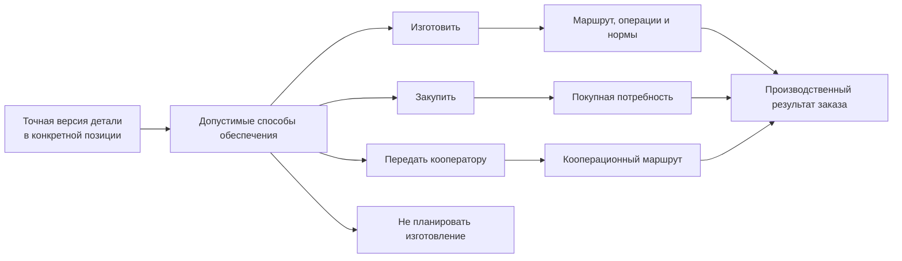
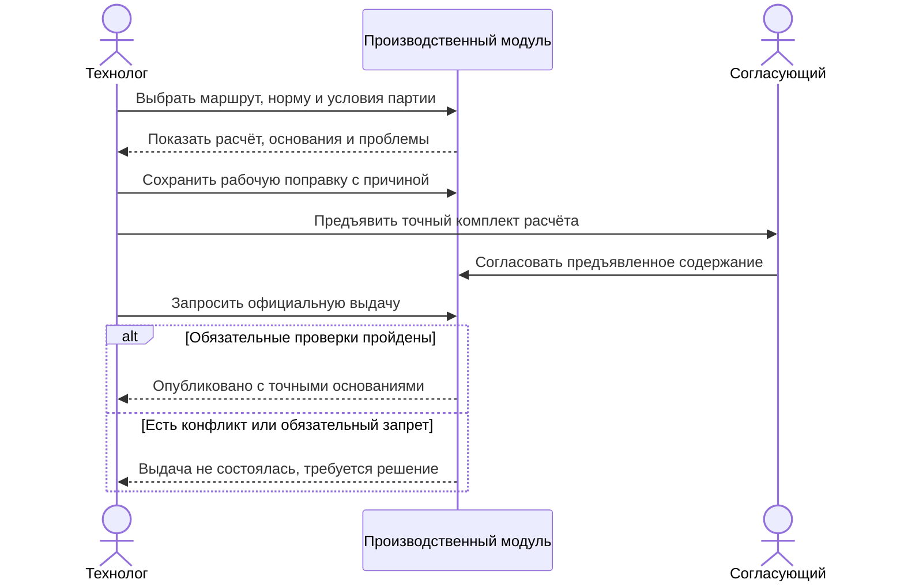

# Маршруты, нормы и решения о способе обеспечения

> Целевой процесс по состоянию на 6 сентября 2026 года. Сохранение технологии, её производственный допуск, назначение ресурсов и фактическое выполнение различаются.

## Почему одного конструкторского состава недостаточно

Конструкторский состав объясняет, из чего состоит изделие. Для производства нужны дополнительные ответы:

- где и в какой последовательности изготавливать деталь;
- какие материалы и в каком количестве потребуются;
- сколько труда и машинного времени планировать;
- что изготовить своими силами, что купить, а что передать кооператору;
- можно ли разделить количество между несколькими способами обеспечения.

Эти ответы зависят не только от обозначения детали. На них влияют версия, материал, предприятие, серия, количество, место применения и конкретный заказ. Поэтому Interlink рассматривает маршрут и нормы как производственное наложение на уже определённый точный инженерный состав.

## Маршрут относится к применению, а не только к детали

Одна версия вала может изготавливаться на двух площадках по разным маршрутам. Одна и та же втулка в опытном образце обрабатывается на универсальном станке, а в серии — на автоматической линии. Покупной узел в одном заказе поставляется готовым, а в другом проходит входной контроль и доработку.

Следовательно, маршрут должен выбираться для конкретной позиции производственного состава с учётом условий. Простая постоянная ссылка «деталь → маршрут» не покрывает заказное производство.

В рабочем ПЗ могут одновременно оставаться несколько допустимых маршрутов. Это полезный и подтверждённый для IPS этап подготовки, а не ошибка сама по себе. Перед официальной выдачей выбранной области нужно определить, какой маршрут относится к каждой доле количества, и закрепить его конкретное опубликованное содержание. Жёсткая привязка к инженерной версии маршрута ещё не замораживает появление следующих состояний этой версии.

## Что сохраняется при смене маршрута в IPS-сценарии

При выборе другого маршрута технологические версии нового маршрута добавляются в контекст ПЗ. Прежние версии не удаляются из него автоматически; при необходимости назначения тех же объектов заменяются новыми версиями. Это важная особенность сценария IPS: смена маршрута не означает очистку контекста до списка только нового маршрута.

Например, прежний маршрут использовал технологический процесс «Обработка вала», приспособление для шлифования и карту контроля. Новый маршрут использует другую версию процесса и новую карту измерения. Система показывает, какое назначение процесса будет заменено и что добавится. Старое приспособление может остаться в контексте, но от этого не становится операцией или расходом нового маршрута. Сам маршрут и предусмотренные изменения контекста применяются согласованно; при конфликте не должна сохраниться только одна половина решения.

Контекст здесь — самостоятельный набор назначений для подбора, а не другое название пакета изменения. Подробности — [контексты выбора](../version-selection/21-selection-contexts.md).

## Как представляются нормы

Норма — это объяснимый расчёт, а не только итоговое число. Для неё важно сохранить:

- к какой детали, операции и позиции она относится;
- исходную величину: массу заготовки, длину реза, время установки;
- правило расчёта;
- поправку на количество, партию, отход или наладку;
- единицу измерения;
- итог на одну единицу, на ветвь и на весь заказ;
- версию нормативных данных.

Например, время наладки не следует умножать на каждую деталь, а расход листа может рассчитываться с учётом раскроя партии. Поэтому продуктовый отчёт должен показывать происхождение итогов, а не только сумму.

Норма «30 минут работы станка» не равна календарной длительности 30 минут для всей партии. Два параллельных станка по 30 минут дают 60 станко-минут; полчаса календарного срока получится только при действительно предусмотренном параллельном выполнении. Требование «шлифовальный станок нужного класса» тоже не бронирует конкретный станок на вторник. Ресурсная пригодность, конкретное назначение и календарное резервирование — разные решения.

## Таблицы норм и справочные данные

Interlink планирует работать с индексируемыми табличными данными, а не только с файлами ведомостей. Для технолога это означает поиск и выбор конкретных справочных строк с проверяемыми единицами и происхождением. Файл Excel может остаться источником импорта или формой отчёта, но не обязан быть единственным способом доступа.

Различаются три прикладные формы:

- **Справочный перечень строк.** Сортамент труб содержит только реально предусмотренные диаметры и толщины. Отсутствие сочетания не делает таблицу неполной прямоугольной сеткой.
- **Полная многомерная таблица.** Для испытания материала заранее объявлены две толщины, три температуры и два режима нагрузки: ожидаются все двенадцать точек. Незаполненная точка выявляется отдельно от измеренного нуля; структурная полнота ещё не доказывает пригодность всех измерений.
- **Карта сопоставлений.** Сочетанию «материал × среда × температура» могут соответствовать одно или несколько покрытий. Пустая клетка означает прежде всего отсутствие заданного сопоставления. Вывод «покрытие запрещено» требует отдельного явно заданного правила и достаточных данных.

Это изложено в [справочных таблицах](../tabular-data/01-reference-tables.md), [многомерных таблицах](../tabular-data/02-multidimensional-tables.md) и [координатных картах](../tabular-data/03-coordinate-maps.md). Порядок строк, перевод единиц и перестановка осей на экране не должны менять смысл найденной нормы.

### Как расчёт становится воспроизводимым

Технолог выбирает строку справочника, задаёт количество и условия, затем получает расчёт с пояснением: исходная норма, коэффициенты, единицы, округление, результат. Для производственной выдачи сохраняются точные редакции реально использованных таблиц, формул и исходных сведений. Если клетка карты лишь ссылается на материал, одной сохранённой карты недостаточно: требуется также то содержание материала, по которому выполнен расчёт.

Ручная поправка хранит отдельное основание. Например, к нормативному расходу краски технолог добавляет согласованную поправку на сложную поверхность корпуса. Он видит исходный результат и исправление, а не только затёртое новое число. При смене маршрута или редакции нормы система проверяет, можно ли перенести поправку. Чтение обновлённого справочника не запускает массовую синхронизацию карточек и не публикует нормы автоматически.

## От рабочей нормы до официальной выдачи

На примере корпуса насоса видно, почему выбор справочной строки ещё не означает выпуск нормы в производство. Технолог сначала получает проверяемый расчёт, может сохранить рабочую поправку и только затем предъявляет определённое содержание для согласования и выдачи.

Сохранённая рабочая поправка не меняет прежние опубликованные нормы. Согласование также не обходит последнюю проверку: если площадка утратила разрешение на операцию или выбранное сочетание материалов запрещено, выдача останавливается. При успехе остаются точные основания расчёта; сама выдача не бронирует станок и не подтверждает изготовление корпуса.

## Решения об обеспечении

Для целевой модели важны четыре предметных решения:

- **изготовить** на своей площадке;
- **закупить** готовое изделие или материал;
- **передать кооператору** отдельную операцию либо изготовление целиком;
- **не планировать изготовление** в данном контуре, например для справочного или уже имеющегося элемента.

Материалы IPS подтверждают значимость производственных маршрутов и контролируемых замен. Однако единая универсальная модель перечисленных способов обеспечения и разделения количества не подтверждена для всех установок IPS. Поэтому эти пункты являются целевыми требованиями Interlink и темой обязательной проверки с продуктовым специалистом.

## Разделение количества

Заказ может требовать сто кронштейнов, но способ обеспечения бывает смешанным: шестьдесят изготавливаются внутри предприятия, сорок закупаются из-за нехватки мощности. При этом нельзя создавать впечатление, что существуют две разные конструкторские детали.

Разделение относится к производственному обеспечению количества. Оно должно сохранять:

- исходную позицию и полное требуемое количество;
- долю каждого способа;
- основание решения;
- связь с маршрутами, закупками и фактическими партиями;
- проверку того, что сумма долей соответствует потребности.

Эта проверка учитывает уже принятые и ещё не сверенные передачи, в том числе из прежних состояний заказа. Новая редакция плана не предоставляет то же количество повторно. Предварительно показанный в окне остаток не считается резервом: одновременное назначение другим планировщиком должно быть обнаружено при применении решения.

## Пример 1. Вал редуктора на двух площадках

Для партии из двадцати редукторов требуется двадцать выходных валов. Завод А имеет маршрут с токарной и шлифовальной обработкой, завод Б — маршрут на обрабатывающем центре с последующей термообработкой у кооператора.

Конструкторская версия вала одинакова, но производственные условия различаются. Планировщик выбирает восемь валов на заводе А и двенадцать на заводе Б. Система проверяет допустимость обоих маршрутов для материала и версии чертежа, затем отдельно рассчитывает нормы и документы.

## Пример 2. Кронштейны: изготовить и закупить

Заказ на сборочную линию требует сто одинаковых кронштейнов. Из-за загрузки цеха предприятие изготавливает шестьдесят, а сорок закупает у утверждённого поставщика.

Interlink сохраняет единую потребность в ста штуках, но два решения обеспечения. Для собственной части формируются операции и нормы металла; для покупной — точная спецификация закупаемого исполнения. Контроль показывает, что 60 + 40 закрывают потребность полностью.

## Пример 3. Корпус насоса из отливки

Корпус изготавливается из покупной отливки. Норма материала зависит от массы отливки и допустимого процента брака партии, а трудоёмкость — от выбранного станка и количества установок.

После изменения припуска выпускается новая версия заготовки. Живой заказ показывает изменение нормы и времени обработки. Ранее переданный производственный снимок сохраняет прежнюю норму, поскольку именно по ней была запущена первая партия.

Точнее, сама норма может удерживаться в связанном производственном комплекте, а не копироваться в дерево снимка. Важно, что повторный отчёт первой партии использует именно прежнюю норму, единицы и правило расчёта. Отсутствующую норму нельзя заменить нулём, чтобы получить внешне полный отчёт.

## Пример 4. Покрытие у кооператора

Рамы станка изготавливаются внутри предприятия, но защитное покрытие выполняет внешняя организация. Производственный маршрут содержит собственные операции до и после кооперации, требования к передаваемой документации и контроль возврата.

Если для северного исполнения нужна другая система покрытия, маршрут выбирается по конкретной позиции заказа, а не только по обозначению рамы.

Проверка учитывает сочетание материала рамы, подготовки поверхности, покрытия и среды. Разрешение каждой пары по отдельности может быть недостаточно: нужная технология должна быть подтверждена для всего выбранного сочетания. При отказе система объясняет ограничение и не подбирает скрыто старую версию маршрута. Подробнее — [матрицы совместимости](../substitution-and-compatibility/02-compatibility-matrices.md).

## Что должен видеть пользователь

Для каждой значимой позиции интерфейс должен показывать:

- выбранный способ обеспечения;
- маршрут и условия его применимости;
- альтернативы и причину выбора;
- нормы на единицу и на весь требуемый объём;
- места разделения количества;
- предупреждения о незакрытой потребности;
- отличия от предыдущей передачи.

## Границы ответственности

Interlink хранит связи, версии, применимость и происхождение производственных решений. Само календарное распределение мощностей, остатки склада, заказы поставщикам и диспетчеризация обычно принадлежат ERP/MES. Они могут вернуть фактические сведения, но не должны переписывать исходный точный снимок.

## Открытые вопросы

- Как IPS конкретного предприятия различает изготовление, закупку и кооперацию?
- Допускается ли разделение одной позиции между маршрутами и поставщиками?
- Где хранится решение о площадке изготовления?
- Какие нормы являются конструкторскими, технологическими и расчётными?
- Как учитываются наладка, отходы, групповая обработка и процент брака?
- Кто вправе изменить способ обеспечения после выпуска производственной ведомости?

## Критерии приёмки

1. Маршрут выбирается с учётом версии, позиции и контекста предприятия.
2. Один инженерный состав может получить разные допустимые производственные маршруты.
3. Норма объясняется от исходных данных до итога заказа.
4. Количество можно разделить без создания ложных конструкторских изделий.
5. Незакрытая или избыточно распределённая потребность обнаруживается до передачи.
6. Изменение нормы не переписывает предыдущий снимок.
7. Функции ERP/MES не выдаются за функции ядра Interlink.
8. Смена маршрута в совместимом IPS-сценарии объяснимо добавляет и заменяет назначения контекста, не очищая прежние автоматически.
9. Расчёт воспроизводится по точным редакциям таблиц и формул; ручная поправка не стирает исходную норму.
10. Проверка пригодности маршрута и ресурсов не считается резервированием оборудования или фактом выполнения.

## Состояние реализации

Маршруты и нормы подтверждены как часть целевого заказно-производственного контура, но не реализованы в текущем опытном образце. Общая модель способов обеспечения, разделения количества и расчётных норм требует продуктового согласования и отдельного предметного модуля.

## Связанные документы

- [Формирование производственного заказа](06-production-order-resolution.md)
- [Производственные ведомости и отчёты](08-production-sheets-and-reports.md)
- [MRP и внешние системы](11-integration-and-mrp.md)

## Основания

Текущий целевой договор и планы Interlink: [IL-ORDERS], [IL-KERNEL], [IL-TD], [IL-SC], [IL-PLAN-V2]. Требования и практика IPS: [IPS-A13], [IPS-A23], [IPS-M03]. Историческое [IL-ADR ADR-052] объясняет происхождение решений; при уточнении поведения приоритет имеют нынешние договоры Interlink.

Расшифровка и границы достоверности — в [реестре источников](../knowledge/15-source-register.md).
