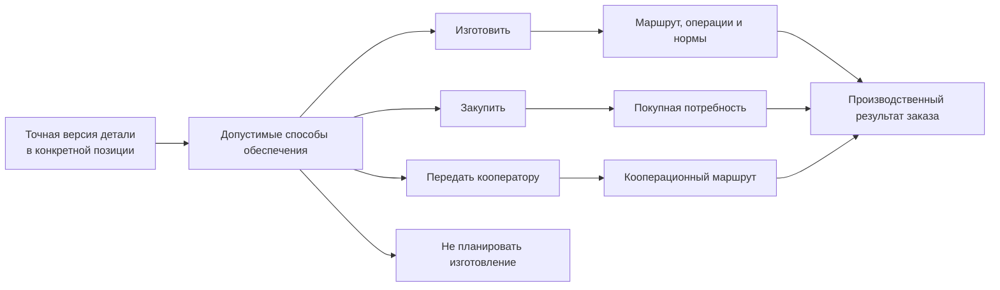

# Маршруты, нормы и решения о способе обеспечения

## Почему одного конструкторского состава недостаточно

Конструкторский состав объясняет, из чего состоит изделие. Для производства нужны дополнительные ответы:

- где и в какой последовательности изготавливать деталь;
- какие материалы и в каком количестве потребуются;
- сколько труда и машинного времени планировать;
- что изготовить своими силами, что купить, а что передать кооператору;
- можно ли разделить количество между несколькими способами обеспечения.

Эти ответы зависят не только от обозначения детали. На них влияют версия, материал, предприятие, серия, количество, место применения и конкретный заказ. Поэтому Interlink рассматривает маршрут и нормы как производственное наложение на уже определённый точный инженерный состав.

## Маршрут относится к применению, а не только к детали

Одна версия вала может изготавливаться на двух площадках по разным маршрутам. Одна и та же втулка в опытном образце обрабатывается на универсальном станке, а в серии — на автоматической линии. Покупной узел в одном заказе поставляется готовым, а в другом проходит входной контроль и доработку.

Следовательно, маршрут должен выбираться для конкретной позиции производственного состава с учётом условий. Простая постоянная ссылка «деталь → маршрут» не покрывает заказное производство.

## Как представляются нормы

Норма — это объяснимый расчёт, а не только итоговое число. Для неё важно сохранить:

- к какой детали, операции и позиции она относится;
- исходную величину: массу заготовки, длину реза, время установки;
- правило расчёта;
- поправку на количество, партию, отход или наладку;
- единицу измерения;
- итог на одну единицу, на ветвь и на весь заказ;
- версию нормативных данных.

Например, время наладки не следует умножать на каждую деталь, а расход листа может рассчитываться с учётом раскроя партии. Поэтому продуктовый отчёт должен показывать происхождение итогов, а не только сумму.

## Решения об обеспечении

Для целевой модели важны четыре предметных решения:

- **изготовить** на своей площадке;
- **закупить** готовое изделие или материал;
- **передать кооператору** отдельную операцию либо изготовление целиком;
- **не планировать изготовление** в данном контуре, например для справочного или уже имеющегося элемента.

Материалы IPS подтверждают значимость производственных маршрутов и контролируемых замен. Однако единая универсальная модель перечисленных способов обеспечения и разделения количества не подтверждена для всех установок IPS. Поэтому эти пункты являются целевыми требованиями Interlink и темой обязательной проверки с продуктовым специалистом.

## Разделение количества

Заказ может требовать сто кронштейнов, но способ обеспечения бывает смешанным: шестьдесят изготавливаются внутри предприятия, сорок закупаются из-за нехватки мощности. При этом нельзя создавать впечатление, что существуют две разные конструкторские детали.

Разделение относится к производственному обеспечению количества. Оно должно сохранять:

- исходную позицию и полное требуемое количество;
- долю каждого способа;
- основание решения;
- связь с маршрутами, закупками и фактическими партиями;
- проверку того, что сумма долей соответствует потребности.

## Пример 1. Вал редуктора на двух площадках

Для партии из двадцати редукторов требуется двадцать выходных валов. Завод А имеет маршрут с токарной и шлифовальной обработкой, завод Б — маршрут на обрабатывающем центре с последующей термообработкой у кооператора.

Конструкторская версия вала одинакова, но производственные условия различаются. Планировщик выбирает восемь валов на заводе А и двенадцать на заводе Б. Система проверяет допустимость обоих маршрутов для материала и версии чертежа, затем отдельно рассчитывает нормы и документы.

## Пример 2. Кронштейны: изготовить и закупить

Заказ на сборочную линию требует сто одинаковых кронштейнов. Из-за загрузки цеха предприятие изготавливает шестьдесят, а сорок закупает у утверждённого поставщика.

Interlink сохраняет единую потребность в ста штуках, но два решения обеспечения. Для собственной части формируются операции и нормы металла; для покупной — точная спецификация закупаемого исполнения. Контроль показывает, что 60 + 40 закрывают потребность полностью.

## Пример 3. Корпус насоса из отливки

Корпус изготавливается из покупной отливки. Норма материала зависит от массы отливки и допустимого процента брака партии, а трудоёмкость — от выбранного станка и количества установок.

После изменения припуска выпускается новая версия заготовки. Живой заказ показывает изменение нормы и времени обработки. Ранее переданный производственный снимок сохраняет прежнюю норму, поскольку именно по ней была запущена первая партия.

## Пример 4. Покрытие у кооператора

Рамы станка изготавливаются внутри предприятия, но защитное покрытие выполняет внешняя организация. Производственный маршрут содержит собственные операции до и после кооперации, требования к передаваемой документации и контроль возврата.

Если для северного исполнения нужна другая система покрытия, маршрут выбирается по конкретной позиции заказа, а не только по обозначению рамы.

## Что должен видеть пользователь

Для каждой значимой позиции интерфейс должен показывать:

- выбранный способ обеспечения;
- маршрут и условия его применимости;
- альтернативы и причину выбора;
- нормы на единицу и на весь требуемый объём;
- места разделения количества;
- предупреждения о незакрытой потребности;
- отличия от предыдущей передачи.

## Границы ответственности

Interlink хранит связи, версии, применимость и происхождение производственных решений. Само календарное распределение мощностей, остатки склада, заказы поставщикам и диспетчеризация обычно принадлежат ERP/MES. Они могут вернуть фактические сведения, но не должны переписывать исходный точный снимок.

## Открытые вопросы

- Как IPS конкретного предприятия различает изготовление, закупку и кооперацию?
- Допускается ли разделение одной позиции между маршрутами и поставщиками?
- Где хранится решение о площадке изготовления?
- Какие нормы являются конструкторскими, технологическими и расчётными?
- Как учитываются наладка, отходы, групповая обработка и процент брака?
- Кто вправе изменить способ обеспечения после выпуска производственной ведомости?

## Критерии приёмки

1. Маршрут выбирается с учётом версии, позиции и контекста предприятия.
2. Один инженерный состав может получить разные допустимые производственные маршруты.
3. Норма объясняется от исходных данных до итога заказа.
4. Количество можно разделить без создания ложных конструкторских изделий.
5. Незакрытая или избыточно распределённая потребность обнаруживается до передачи.
6. Изменение нормы не переписывает предыдущий снимок.
7. Функции ERP/MES не выдаются за функции ядра Interlink.

## Состояние реализации

Маршруты и нормы подтверждены как часть целевого заказно-производственного контура, но не реализованы в текущем опытном образце. Общая модель способов обеспечения, разделения количества и расчётных норм требует продуктового согласования и отдельного предметного модуля.

## Связанные документы

- [Формирование производственного заказа](06-production-order-resolution.md)
- [Производственные ведомости и отчёты](08-production-sheets-and-reports.md)
- [MRP и внешние системы](11-integration-and-mrp.md)

Основания: [IPS-A13], [IPS-A23], [IPS-M03], [IL-ADR ADR-052]. Расшифровка — в [реестре источников](../knowledge/15-source-register.md).
